# PraisonAI Documentation Agent Instructions

This file contains the exact instructions, principles, and patterns for AI agents to create documentation pages for PraisonAI. Follow these instructions precisely to produce consistent, high-quality documentation.

---

## 1. Documentation Creation Process

### 1.1 Pre-Creation Checklist

Before creating any documentation page:

1. **Read the SDK source code** - Always read the actual implementation file first
2. **Identify all configuration options** - Extract every parameter, type, and default value
3. **Find the dataclass/config class** - Look in `praisonaiagents/config/feature_configs.py`
4. **Check for related existing docs** - Avoid duplication, ensure consistency
5. **Verify imports** - Confirm exact import paths from the SDK

### 1.2 SDK-First Approach

```
CRITICAL: Documentation MUST reflect SDK ground truth.

1. Read the SDK file completely
2. Extract ALL parameters with their:
   - Name
   - Type
   - Default value
   - Description (from docstring or code comments)
3. Never guess or assume - if unsure, read more code
4. Never document features that don't exist in SDK
```

### 1.3 File Locations

| Content Type | SDK Location | Docs Location |
|--------------|--------------|---------------|
| Feature configs | `praisonaiagents/config/feature_configs.py` | `docs/concepts/*.mdx` |
| Agent class | `praisonaiagents/agent/agent.py` | `docs/concepts/agents.mdx` |
| MCP integration | `praisonaiagents/mcp/mcp.py` | `docs/concepts/mcp.mdx` |
| Skills | `praisonaiagents/skills/` | `docs/concepts/skills.mdx` |
| Memory | `praisonaiagents/memory/` | `docs/concepts/memory.mdx` |
| Knowledge | `praisonaiagents/knowledge/` | `docs/concepts/knowledge.mdx` |

---

## 2. Page Structure Template

Every concept page MUST follow this exact structure:

```mdx
---
title: "Feature Name"
sidebarTitle: "Feature Name"
description: "One-line description of what this feature does"
icon: "icon-name"
---

{/* One sentence explaining the feature - what it does, not how */}

{/* Hero Mermaid diagram showing the concept visually */}

## Quick Start

<Steps>
<Step title="Simple Usage">
{/* Minimal code example - enable with True */}
</Step>

<Step title="With Configuration">
{/* Code example with config class */}
</Step>
</Steps>

---

## How It Works

{/* Sequence diagram or flow diagram */}

{/* Brief explanation table */}

---

## Configuration Options

{/* Full config class example */}

{/* Complete options table with ALL SDK parameters */}

---

## Common Patterns

{/* 2-3 practical usage patterns */}

---

## Best Practices

<AccordionGroup>
{/* 3-4 best practices as accordions */}
</AccordionGroup>

---

## Related

<CardGroup cols={2}>
{/* 2 related concept pages */}
</CardGroup>
```

---

## 3. Mermaid Diagram Standards

### 3.1 Color Scheme

Use this EXACT color scheme for consistency:

```
Primary Colors:
- #8B0000 (Dark Red)    - Agents, inputs, outputs, tasks
- #189AB4 (Teal/Cyan)   - Tools, processes, middleware
- #10B981 (Green)       - Success, results, completion
- #F59E0B (Amber)       - Warnings, planners, intermediate steps
- #6366F1 (Indigo)      - Configuration, settings, options

Text:
- #fff (White)          - Always use white text for contrast
- #7C90A0              - Stroke color for borders
```

### 3.2 Diagram Types by Use Case

| Use Case | Diagram Type | Example |
|----------|--------------|---------|
| Feature overview | `graph LR` | Show flow left-to-right |
| Process flow | `graph TB` | Show steps top-to-bottom |
| Interactions | `sequenceDiagram` | Show agent-user-system interactions |
| Options/modes | `graph TB` with subgraphs | Show different configurations |

### 3.3 Hero Diagram Template

Every page starts with a hero diagram:

```mermaid
graph LR
    subgraph "Feature Name"
        A[📋 Input] --> B[🧠 Process]
        B --> C[✅ Output]
    end
    
    classDef input fill:#6366F1,stroke:#7C90A0,color:#fff
    classDef process fill:#F59E0B,stroke:#7C90A0,color:#fff
    classDef output fill:#10B981,stroke:#7C90A0,color:#fff
    
    class A input
    class B process
    class C output
```



### 3.4 Sequence Diagram Template

For showing interactions:


---

## 4. Mintlify Components Usage

### 4.1 Required Components

Every page MUST use:

| Component | Purpose | When to Use |
|-----------|---------|-------------|
| `<Steps>` | Quick start | Always in Quick Start section |
| `<AccordionGroup>` | Best practices | Always in Best Practices section |
| `<CardGroup>` | Related pages | Always in Related section |

### 4.2 Component Syntax

**Steps (for Quick Start):**
```mdx
<Steps>

<Step title="Step Title">
Description and code here.
```python
code_example()
```
</Step>

<Step title="Next Step">
More content.
</Step>

</Steps>
```

**AccordionGroup (for Best Practices):**
```mdx
<AccordionGroup>
  <Accordion title="Best practice title">
    Explanation of the best practice.
  </Accordion>
  
  <Accordion title="Another best practice">
    Another explanation.
  </Accordion>
</AccordionGroup>
```

**CardGroup (for Related):**
```mdx
<CardGroup cols={2}>
  <Card title="Related Feature" icon="icon-name" href="/concepts/feature">
    Brief description
  </Card>
  <Card title="Another Feature" icon="icon-name" href="/concepts/another">
    Brief description
  </Card>
</CardGroup>
```

**Tabs (for multiple examples):**
```mdx
<Tabs>
<Tab title="Simple">
```python
simple_example()
```
</Tab>
<Tab title="Advanced">
```python
advanced_example()
```
</Tab>
</Tabs>
```

### 4.3 Callouts

Use sparingly:

```mdx
<Note>Important information the user should know.</Note>
<Warning>Critical warning about potential issues.</Warning>
<Tip>Helpful suggestion for better usage.</Tip>
<Info>Additional context or background.</Info>
```

---

## 5. Code Example Standards

### 5.1 Code Quality Rules

```
EVERY code example MUST:
1. Run without modification (copy-paste success)
2. Include ALL necessary imports
3. Use realistic but simple data
4. Be the SHORTEST way to accomplish the task
5. Show the feature being documented, not unrelated features
```

### 5.2 Import Patterns

Always use these exact imports:

```python
# Single agent
from praisonaiagents import Agent

# With config
from praisonaiagents import Agent, PlanningConfig

# Multi-agent
from praisonaiagents import Agent, Task, PraisonAIAgents

# MCP
from praisonaiagents import Agent
from praisonaiagents.mcp import MCP
```

### 5.3 Example Structure

**Quick Start Example (Simple):**
```python
from praisonaiagents import Agent

agent = Agent(
    name="Agent Name",
    instructions="Clear instructions",
    feature=True  # Enable with True
)

agent.start("User request")
```

**Quick Start Example (With Config):**
```python
from praisonaiagents import Agent, FeatureConfig

agent = Agent(
    name="Agent Name",
    instructions="Clear instructions",
    feature=FeatureConfig(
        option1="value",
        option2=True,
    )
)
```

### 5.4 Configuration Table Format

Always document ALL options from the SDK:

```markdown
| Option | Type | Default | Description |
|--------|------|---------|-------------|
| `option_name` | `type` | `default` | What it does |
```

---

## 6. Writing Style

### 6.1 Principles

| Principle | Do | Don't |
|-----------|-----|-------|
| **Concise** | "Planning breaks tasks into steps" | "Planning is a feature that allows agents to break down complex tasks into smaller, more manageable steps" |
| **Active voice** | "Enable planning with `planning=True`" | "Planning can be enabled by setting the planning parameter to True" |
| **Direct** | "Use `gpt-4o` for planning" | "It is recommended that you consider using gpt-4o for planning" |
| **Specific** | "Set `timeout=60` for slow servers" | "Increase the timeout if needed" |

### 6.2 Section Introductions

Each section starts with ONE sentence, no more:

```
✅ Good: "Planning enables agents to think before acting."
❌ Bad: "Planning is a powerful feature that enables agents to think before acting. It allows them to break down complex tasks into smaller steps. This is useful for many scenarios."
```

### 6.3 Forbidden Phrases

Never use:
- "In this section, we will..."
- "As you can see..."
- "It's important to note that..."
- "Please note that..."
- "Let's take a look at..."
- "The following example shows..."

Instead, just show the content directly.

---

## 7. Configuration Documentation Pattern

### 7.1 Three-Tier Pattern

Every feature supports three usage patterns. Document all three:

```python
# Tier 1: Boolean (simplest)
agent = Agent(feature=True)

# Tier 2: Dict (intermediate)
agent = Agent(feature={"option": "value"})

# Tier 3: Config class (full control)
agent = Agent(feature=FeatureConfig(option="value"))
```

### 7.2 SDK Config Extraction

When reading SDK `feature_configs.py`, extract:

```python
@dataclass
class FeatureConfig:
    option1: str = "default"      # Extract: option1, str, "default"
    option2: bool = False         # Extract: option2, bool, False
    option3: Optional[int] = None # Extract: option3, int, None
```

Convert to documentation table:

| Option | Type | Default | Description |
|--------|------|---------|-------------|
| `option1` | `str` | `"default"` | Description from docstring |
| `option2` | `bool` | `False` | Description from docstring |
| `option3` | `int` | `None` | Description from docstring |

---

## 8. Mintlify Frontmatter

### 8.1 Required Fields

```yaml
---
title: "Feature Name"           # Display title
sidebarTitle: "Feature Name"    # Sidebar title (usually same)
description: "One-line desc"    # Meta description
icon: "icon-name"               # Lucide icon name
---
```

### 8.2 Icon Selection

| Feature Type | Icon |
|--------------|------|
| Planning | `list-check` |
| Reflection | `rotate` |
| Skills | `puzzle-piece` |
| Hooks | `webhook` |
| Autonomy | `robot` |
| Output | `display` |
| Execution | `play` |
| Caching | `database` |
| Templates | `file-code` |
| Web | `globe` |
| MCP | `plug` |
| Memory | `brain` |
| Knowledge | `book` |
| Tools | `wrench` |
| Agents | `user` |

---

## 9. Quality Checklist

Before submitting any documentation page, verify:

### 9.1 Structure
- [ ] Frontmatter complete (title, sidebarTitle, description, icon)
- [ ] Hero diagram present
- [ ] Quick Start with Steps component
- [ ] Configuration Options table complete
- [ ] Best Practices with AccordionGroup
- [ ] Related section with CardGroup

### 9.2 SDK Accuracy
- [ ] All config options documented
- [ ] Types match SDK exactly
- [ ] Defaults match SDK exactly
- [ ] Import paths are correct
- [ ] No undocumented features

### 9.3 Code Quality
- [ ] All examples run without modification
- [ ] All imports included
- [ ] Examples are minimal (shortest way)
- [ ] No placeholder values like "your-key-here"

### 9.4 Diagrams
- [ ] Color scheme matches standard
- [ ] White text on colored backgrounds
- [ ] classDef declarations present
- [ ] Diagram explains the concept visually

### 9.5 Writing
- [ ] One-sentence section intros
- [ ] No forbidden phrases
- [ ] Active voice
- [ ] Concise explanations

---

## 10. Example: Complete Page

Here's a complete example following all standards:

```mdx
---
title: "Caching"
sidebarTitle: "Caching"
description: "Cache LLM responses to reduce costs and latency"
icon: "database"
---

Caching stores LLM responses to avoid redundant API calls, reducing costs and improving response times.

```mermaid
graph LR
    subgraph "Caching Flow"
        Request[📝 Request] --> Check{🔍 Cache?}
        Check -->|Hit| Return[⚡ Return]
        Check -->|Miss| LLM[🤖 LLM]
        LLM --> Store[💾 Store]
        Store --> Return
    end
    
    classDef request fill:#6366F1,stroke:#7C90A0,color:#fff
    classDef cache fill:#F59E0B,stroke:#7C90A0,color:#fff
    classDef result fill:#10B981,stroke:#7C90A0,color:#fff
    
    class Request request
    class Check,Store cache
    class LLM,Return result
```



## Quick Start

<Steps>

<Step title="Enable Caching">
```python
from praisonaiagents import Agent

agent = Agent(
    name="Cached Agent",
    instructions="You answer questions",
    caching=True
)

agent.start("What is Python?")
```
</Step>

<Step title="With Configuration">
```python
from praisonaiagents import Agent, CachingConfig

agent = Agent(
    name="Cached Agent",
    instructions="You answer questions",
    caching=CachingConfig(
        enabled=True,
        prompt_caching=True,
    )
)
```
</Step>

</Steps>

---

## Configuration Options

```python
from praisonaiagents import CachingConfig

config = CachingConfig(
    enabled=True,         # Enable caching
    prompt_caching=True,  # Cache prompt prefixes
)
```

| Option | Type | Default | Description |
|--------|------|---------|-------------|
| `enabled` | `bool` | `True` | Enable response caching |
| `prompt_caching` | `bool` | `False` | Cache prompt prefixes |

---

## Best Practices

<AccordionGroup>
  <Accordion title="Use for repeated queries">
    Enable caching when users ask similar questions frequently.
  </Accordion>
  
  <Accordion title="Disable for dynamic content">
    Disable caching when responses must reflect real-time data.
  </Accordion>
</AccordionGroup>

---

## Related

<CardGroup cols={2}>
  <Card title="Execution" icon="play" href="/concepts/execution">
    Control execution limits
  </Card>
  <Card title="Output" icon="display" href="/concepts/output">
    Configure response display
  </Card>
</CardGroup>
```

---

## 11. Navigation (mint.json)

After creating a page, add it to `mint.json`:

```json
{
  "group": "Core Concepts",
  "pages": [
    "docs/concepts/agents",
    "docs/concepts/your-new-page",  // Add here
    "docs/concepts/other-pages"
  ]
}
```

---

## 12. Common Mistakes to Avoid

| Mistake | Correct Approach |
|---------|------------------|
| Documenting features not in SDK | Only document what exists in code |
| Long introductions | One sentence max per section |
| Missing imports in examples | Always include all imports |
| Wrong default values | Read SDK source directly |
| Inconsistent colors in diagrams | Use exact hex codes from standard |
| Placeholder API keys | Use environment variables |
| Multiple ways to do same thing | Show the recommended way first |
| Explaining obvious code | Let code speak for itself |

---

## 13. SDK Reading Patterns

### 13.1 Finding Config Classes

```bash
# All feature configs are in:
praisonaiagents/config/feature_configs.py

# Look for @dataclass definitions:
@dataclass
class FeatureConfig:
    ...
```

### 13.2 Finding Agent Parameters

```python
# In agent.py, look at __init__ signature:
def __init__(
    self,
    planning: Optional[Union[bool, Any]] = False,  # Document this
    ...
)
```

### 13.3 Finding Default Values

```python
# In feature_configs.py:
@dataclass
class PlanningConfig:
    llm: Optional[str] = None           # Default: None
    reasoning: bool = False             # Default: False
    auto_approve: bool = False          # Default: False
```

---

## 14. Final Notes

1. **SDK is the source of truth** - Never document what doesn't exist
2. **Less is more** - Shorter docs are better docs
3. **Show, don't tell** - Diagrams and code over paragraphs
4. **Copy-paste success** - Every example must work
5. **Consistency** - Follow these patterns exactly

This file should be used by any AI agent to create documentation that matches the existing PraisonAI documentation style exactly.
