# PraisonAI Documentation Agent Instructions

This file contains the exact instructions, principles, and patterns for AI agents to create documentation pages for PraisonAI. Follow these instructions precisely to produce consistent, high-quality documentation.

---

## 1. Documentation Creation Process

### 1.1 Pre-Creation Checklist

Before creating any documentation page:

1. **Read the SDK source code** - Always read the actual implementation file first
2. **Identify all configuration options** - Extract every parameter, type, and default value
3. **Find the dataclass/config class** - Look in `praisonaiagents/config/feature_configs.py`
4. **Check for related existing docs** - Avoid duplication, ensure consistency
5. **Verify imports** - Confirm exact import paths from the SDK
6. The files you create are not SDK Focused. Its user focused. We have a dedicated auto Generated SDK Document section, so dont need to worry about detailed SDK Focused document. Need it to be user friendly , non developers and beginners should understand
7. Progressive discloure of Features
8. People who go through the documentation should make them feel like only few lines of code and it can do the task
9. Documentation need to be agent centric. Top of the document should always start with Agent Centric code example. Features are there, but how to implement from Agent perspective, that need to be addressed.
10. Include user interaction flow - show how users will interact with the feature in real scenarios 

### 1.2 SDK-First Documentation Cycle

```
CRITICAL: Follow this cycle for EVERY documentation page:

┌─────────────────────────────────────────────────────────────┐
│  1. READ SDK SOURCE → 2. UNDERSTAND → 3. DOCUMENT → REPEAT  │
└─────────────────────────────────────────────────────────────┘

For each feature/page:
  1. READ:   Open and read the actual SDK source file
  2. UNDERSTAND: Comprehend the implementation, APIs, and behavior
  3. DOCUMENT: Write/update documentation based on SDK truth
  4. REPEAT: Move to next feature and restart the cycle

NEVER batch-update multiple pages without reading source for each.
ALWAYS verify against source code before making any documentation change.
```

### 1.3 SDK Source Verification

```
Documentation MUST reflect SDK ground truth.

1. Read the SDK file completely
2. Extract ALL parameters with their:
   - Name
   - Type
   - Default value
   - Description (from docstring or code comments)
3. Never guess or assume - if unsure, read more code
4. Never document features that don't exist in SDK
```

### 1.4 File Locations

| Content Type | SDK Location | Docs Location |
|--------------|--------------|---------------|
| Feature configs | `praisonaiagents/config/feature_configs.py` | `docs/concepts/*.mdx` |
| Agent class | `praisonaiagents/agent/agent.py` | `docs/concepts/agents.mdx` |
| MCP integration | `praisonaiagents/mcp/mcp.py` | `docs/concepts/mcp.mdx` |
| Skills | `praisonaiagents/skills/` | `docs/concepts/skills.mdx` |
| Memory | `praisonaiagents/memory/` | `docs/concepts/memory.mdx` |
| Knowledge | `praisonaiagents/knowledge/` | `docs/concepts/knowledge.mdx` |

### 1.5 Multi-SDK Reference

PraisonAI has three SDK implementations. Use these paths as source of truth:

| SDK | Source Code Path | Documentation Path | Parity Tracker |
|-----|------------------|-------------------|----------------|
| **Python** | `praisonai-package/src/praisonai-agents/` | `docs/concepts/`, `docs/features/` | `docs/features/DOCS_PARITY.md` |
| **TypeScript/JS** | `praisonai-package/src/praisonai-ts/src/` | `docs/js/` | `docs/js/DOCS_PARITY.md` |
| **Rust** | `praisonai-package/src/praisonai-rust/src/` | `docs/rust/` | `docs/rust/DOCS_PARITY.md` |

**Documentation Parity Trackers** show which features have documentation and which need docs:
- ✅ Documented categories (real content)
- ⚠️ Stub documentation (< 50 lines, needs content)
- ❌ Undocumented categories (needs documentation)

### 1.5 TypeScript SDK Structure

```
praisonai-ts/src/
├── agents/           # Agent implementations
├── tools/            # Tool definitions
├── memory/           # Memory implementations  
├── mcp/              # MCP protocol support
├── observability/    # Tracing integrations
└── index.ts          # Main exports
```

### 1.6 Rust SDK Structure

```
praisonai-rust/src/
├── agent/            # Agent and config
├── llm/              # LLM provider
├── tools/            # Tool system
├── memory/           # Memory stores
├── mcp/              # MCP client
└── lib.rs            # Main exports
```

### 1.7 Auto-Managed Documentation Sections

> [!WARNING]
> **DO NOT manually edit** the following sections in `docs.json`:
> - TypeScript/JS "Features" group entries at `docs/js/`
> - Rust "Features" group entries at `docs/rust/`
> 
> These pages are auto-generated and managed by the parity system.

**To update documentation parity:**
```bash
cd praisonai-package
python3 src/praisonai/scripts/generate_docs_parity.py --copy-docs
```

**Full command for agents:**
```bash
/usr/bin/python3 /Users/praison/praisonai-package/src/praisonai/scripts/generate_docs_parity.py --copy-docs
```

This command:
1. Scans SDK features and docs for all three SDKs
2. Generates `DOCS_PARITY.md` reports
3. Copies reports to `docs/features/`, `docs/js/`, `docs/rust/`

---

## 2. Page Structure Template

Every concept page MUST follow this exact structure:

```mdx
---
title: "Feature Name"
sidebarTitle: "Feature Name"
description: "One-line description of what this feature does"
icon: "icon-name"
---

{/* One sentence explaining the feature - what it does, not how */}

{/* Hero Mermaid diagram showing the concept visually */}

## Quick Start

<Steps>
<Step title="Simple Usage">
{/* Minimal code example - enable with True */}
</Step>

<Step title="With Configuration">
{/* Code example with config class */}
</Step>
</Steps>

---

## How It Works

{/* Sequence diagram or flow diagram */}

{/* Brief explanation table */}

---

## Configuration Options

{/* Link to auto-generated SDK reference - DO NOT duplicate SDK parameters here */}
{/* TypeScript: /docs/sdk/reference/typescript/{classes,modules,functions}/ */}
{/* Rust: /docs/sdk/reference/rust/{structs,modules,functions}/ */}

<Card title="[Feature] API Reference" icon="code" href="/docs/sdk/reference/typescript/classes/[FeatureConfig]">
  TypeScript configuration options
</Card>
<Card title="[Feature] Rust Reference" icon="code" href="/docs/sdk/reference/rust/structs/[FeatureConfig]">
  Rust configuration options
</Card>

---

## Common Patterns

{/* 2-3 practical usage patterns */}

---

## Best Practices

<AccordionGroup>
{/* 3-4 best practices as accordions */}
</AccordionGroup>

---

## Related

<CardGroup cols={2}>
{/* 2 related concept pages */}
</CardGroup>
```

---

## 3. Mermaid Diagram Standards

### 3.1 Color Scheme

Use this EXACT color scheme for consistency:

```
Primary Colors:
- #8B0000 (Dark Red)    - Agents, inputs, outputs, tasks
- #189AB4 (Teal/Cyan)   - Tools, processes, middleware
- #10B981 (Green)       - Success, results, completion
- #F59E0B (Amber)       - Warnings, planners, intermediate steps
- #6366F1 (Indigo)      - Configuration, settings, options

Text:
- #fff (White)          - Always use white text for contrast
- #7C90A0              - Stroke color for borders
```

### 3.2 Diagram Types by Use Case

| Use Case | Diagram Type | Example |
|----------|--------------|---------|
| Feature overview | `graph LR` | Show flow left-to-right |
| Process flow | `graph TB` | Show steps top-to-bottom |
| Interactions | `sequenceDiagram` | Show agent-user-system interactions |
| Options/modes | `graph TB` with subgraphs | Show different configurations |

### 3.3 Hero Diagram Template

Every page starts with a hero diagram:

```mermaid
graph LR
    subgraph "Feature Name"
        A[📋 Input] --> B[🧠 Process]
        B --> C[✅ Output]
    end
    
    classDef input fill:#6366F1,stroke:#7C90A0,color:#fff
    classDef process fill:#F59E0B,stroke:#7C90A0,color:#fff
    classDef output fill:#10B981,stroke:#7C90A0,color:#fff
    
    class A input
    class B process
    class C output
```



### 3.4 Sequence Diagram Template

For showing interactions:


---

## 4. Mintlify Components Usage

### 4.1 Required Components

Every page MUST use:

| Component | Purpose | When to Use |
|-----------|---------|-------------|
| `<Steps>` | Quick start | Always in Quick Start section |
| `<AccordionGroup>` | Best practices | Always in Best Practices section |
| `<CardGroup>` | Related pages | Always in Related section |

### 4.2 Component Syntax

**Steps:** Wrap content in `<Steps>` with `<Step title="...">` children.

**AccordionGroup:** Wrap in `<AccordionGroup>` with `<Accordion title="...">` children.

**CardGroup:** Use `<CardGroup cols={2}>` with `<Card title="..." icon="..." href="...">` children.

**Tabs:** Wrap in `<Tabs>` with `<Tab title="...">` children containing code blocks.

### 4.3 Callouts

Use `<Note>`, `<Warning>`, `<Tip>`, or `<Info>` tags for callouts.

---

## 5. Code Example Standards

### 5.1 Code Quality Rules

```
EVERY code example MUST:
1. Run without modification (copy-paste success)
2. Include ALL necessary imports
3. Use realistic but simple data
4. Be the SHORTEST way to accomplish the task
5. Show the feature being documented, not unrelated features
```

### 5.2 Import Patterns

Always use these exact imports:

```python
# Single agent
from praisonaiagents import Agent

# With config
from praisonaiagents import Agent, PlanningConfig

# Multi-agent
from praisonaiagents import Agent, Task, PraisonAIAgents

# MCP
from praisonaiagents import Agent
from praisonaiagents.mcp import MCP
```

### 5.3 Example Structure

**Quick Start Example (Simple):**
```python
from praisonaiagents import Agent

agent = Agent(
    name="Agent Name",
    instructions="Clear instructions",
    feature=True  # Enable with True
)

agent.start("User request")
```

**Quick Start Example (With Config):**
```python
from praisonaiagents import Agent, FeatureConfig

agent = Agent(
    name="Agent Name",
    instructions="Clear instructions",
    feature=FeatureConfig(
        option1="value",
        option2=True,
    )
)
```

### 5.4 Configuration Table Format

Always document ALL options from the SDK:

```markdown
| Option | Type | Default | Description |
|--------|------|---------|-------------|
| `option_name` | `type` | `default` | What it does |
```

---

## 6. Writing Style

### 6.1 Principles

| Principle | Do | Don't |
|-----------|-----|-------|
| **Concise** | "Planning breaks tasks into steps" | "Planning is a feature that allows agents to break down complex tasks into smaller, more manageable steps" |
| **Active voice** | "Enable planning with `planning=True`" | "Planning can be enabled by setting the planning parameter to True" |
| **Direct** | "Use `gpt-4o` for planning" | "It is recommended that you consider using gpt-4o for planning" |
| **Specific** | "Set `timeout=60` for slow servers" | "Increase the timeout if needed" |
All documents should focus on non-developers
Less descriptive,
After reading the code they should feel "is it this easy to use?"
If there are different concepts in one page, then explain each concept using mermaid diagram. 
Also include the flow diagram if that could be useful for the user.
If multiple options in one page, people might be confused on what to choose, so create the mermaid diagram to choose what option at what instance. 
Our aim to use friendly import easy for users and non-programmers, so don't use complex imports like from praisonaiagents.workflows import when, parallel, loop, instead use the simple import from praisonaiagents import when, parallel, loop.

### 6.2 Section Introductions

Each section starts with ONE sentence, no more:

```
✅ Good: "Planning enables agents to think before acting."
❌ Bad: "Planning is a powerful feature that enables agents to think before acting. It allows them to break down complex tasks into smaller steps. This is useful for many scenarios."
```

### 6.3 Forbidden Phrases

Never use:
- "In this section, we will..."
- "As you can see..."
- "It's important to note that..."
- "Please note that..."
- "Let's take a look at..."
- "The following example shows..."

Instead, just show the content directly.

---

## 7. Configuration Documentation Pattern

### 7.1 Precedence Ladder Pattern

Features support multiple configuration levels. Document each level based on the feature's supported options:

**Precedence Ladder:** `Instance > Config > Array > Dict > String > Bool > Default`

```python
# Level 1: Bool (simplest)
agent = Agent(feature=True)

# Level 2: String
agent = Agent(feature="option_name")

# Level 3: Dict
agent = Agent(feature={"option": "value", "enabled": True})

# Level 4: Array
agent = Agent(feature=["option1", "option2"])

# Level 5: Config class
agent = Agent(feature=FeatureConfig(option="value"))

# Level 6: Instance (full control)
feature_instance = Feature(option="value")
agent = Agent(feature=feature_instance)
```

Document each level the feature supports - not all features support all levels.

### 7.2 SDK Config Extraction

When reading SDK `feature_configs.py`, extract:

```python
@dataclass
class FeatureConfig:
    option1: str = "default"      # Extract: option1, str, "default"
    option2: bool = False         # Extract: option2, bool, False
    option3: Optional[int] = None # Extract: option3, int, None
```

Convert to documentation table:

| Option | Type | Default | Description |
|--------|------|---------|-------------|
| `option1` | `str` | `"default"` | Description from docstring |
| `option2` | `bool` | `False` | Description from docstring |
| `option3` | `int` | `None` | Description from docstring |

---

## 8. Mintlify Frontmatter

### 8.1 Required Fields

```yaml
---
title: "Feature Name"           # Display title
sidebarTitle: "Feature Name"    # Sidebar title (usually same)
description: "One-line desc"    # Meta description
icon: "icon-name"               # Lucide icon name
---
```

### 8.2 Icon Selection

| Feature Type | Icon |
|--------------|------|
| Planning | `list-check` |
| Reflection | `rotate` |
| Skills | `puzzle-piece` |
| Hooks | `webhook` |
| Autonomy | `robot` |
| Output | `display` |
| Execution | `play` |
| Caching | `database` |
| Templates | `file-code` |
| Web | `globe` |
| MCP | `plug` |
| Memory | `brain` |
| Knowledge | `book` |
| Tools | `wrench` |
| Agents | `user` |

---

## 9. Quality Checklist

Before submitting any documentation page, verify:

### 9.1 Structure
- [ ] Frontmatter complete (title, sidebarTitle, description, icon)
- [ ] Hero diagram present
- [ ] Quick Start with Steps component
- [ ] Configuration Options table complete
- [ ] Best Practices with AccordionGroup
- [ ] Related section with CardGroup

### 9.2 SDK Accuracy
- [ ] All config options documented
- [ ] Types match SDK exactly
- [ ] Defaults match SDK exactly
- [ ] Import paths are correct
- [ ] No undocumented features

### 9.3 Code Quality
- [ ] All examples run without modification
- [ ] All imports included
- [ ] Examples are minimal (shortest way)
- [ ] No placeholder values like "your-key-here"

### 9.4 Diagrams
- [ ] Color scheme matches standard
- [ ] White text on colored backgrounds
- [ ] classDef declarations present
- [ ] Diagram explains the concept visually

### 9.5 Writing
- [ ] One-sentence section intros
- [ ] No forbidden phrases
- [ ] Active voice
- [ ] Concise explanations

---

## 10. Example: Complete Page

Here's a complete example following all standards:

```mdx
---
title: "Caching"
sidebarTitle: "Caching"
description: "Cache LLM responses to reduce costs and latency"
icon: "database"
---

Caching stores LLM responses to avoid redundant API calls, reducing costs and improving response times.


## Quick Start

<Steps>

<Step title="Enable Caching">
```python
from praisonaiagents import Agent

agent = Agent(
    name="Cached Agent",
    instructions="You answer questions",
    caching=True
)

agent.start("What is Python?")
```
</Step>

<Step title="With Configuration">
```python
from praisonaiagents import Agent, CachingConfig

agent = Agent(
    name="Cached Agent",
    instructions="You answer questions",
    caching=CachingConfig(
        enabled=True,
        prompt_caching=True,
    )
)
```
</Step>

</Steps>

---

## Configuration Options

```python
from praisonaiagents import CachingConfig

config = CachingConfig(
    enabled=True,         # Enable caching
    prompt_caching=True,  # Cache prompt prefixes
)
```

| Option | Type | Default | Description |
|--------|------|---------|-------------|
| `enabled` | `bool` | `True` | Enable response caching |
| `prompt_caching` | `bool` | `False` | Cache prompt prefixes |

---

## Best Practices

<AccordionGroup>
  <Accordion title="Use for repeated queries">
    Enable caching when users ask similar questions frequently.
  </Accordion>
  
  <Accordion title="Disable for dynamic content">
    Disable caching when responses must reflect real-time data.
  </Accordion>
</AccordionGroup>

---

## Related

<CardGroup cols={2}>
  <Card title="Execution" icon="play" href="/concepts/execution">
    Control execution limits
  </Card>
  <Card title="Output" icon="display" href="/concepts/output">
    Configure response display
  </Card>
</CardGroup>
```

---

## 11. Navigation (mint.json)

After creating a page, add it to `mint.json`:

```json
{
  "group": "Core Concepts",
  "pages": [
    "docs/concepts/agents",
    "docs/concepts/your-new-page",  // Add here
    "docs/concepts/other-pages"
  ]
}
```

---

## 12. Common Mistakes to Avoid

| Mistake | Correct Approach |
|---------|------------------|
| Documenting features not in SDK | Only document what exists in code |
| Long introductions | One sentence max per section |
| Missing imports in examples | Always include all imports |
| Wrong default values | Read SDK source directly |
| Inconsistent colors in diagrams | Use exact hex codes from standard |
| Placeholder API keys | Use environment variables |
| Multiple ways to do same thing | Show the recommended way first |
| Explaining obvious code | Let code speak for itself |

---

## 13. SDK Reading Patterns

### 13.1 Finding Config Classes

```bash
# All feature configs are in:
praisonaiagents/config/feature_configs.py

# Look for @dataclass definitions:
@dataclass
class FeatureConfig:
    ...
```

### 13.2 Finding Agent Parameters

```python
# In agent.py, look at __init__ signature:
def __init__(
    self,
    planning: Optional[Union[bool, Any]] = False,  # Document this
    ...
)
```

### 13.3 Finding Default Values

```python
# In feature_configs.py:
@dataclass
class PlanningConfig:
    llm: Optional[str] = None           # Default: None
    reasoning: bool = False             # Default: False
    auto_approve: bool = False          # Default: False
```

---

## 14. Final Notes

1. **SDK is the source of truth** - Never document what doesn't exist
2. **Verify before documenting** - Always read SDK source code before writing any example
3. **Less is more** - Shorter docs are better docs
4. **Show, don't tell** - Diagrams and code over paragraphs
5. **Copy-paste success** - Every example must work
6. **Consistency** - Follow these patterns exactly
7. **Agents only recognize parameters** - When creating tools, expose all options as function parameters

This file should be used by any AI agent to create documentation that matches the existing PraisonAI documentation style exactly.

---

## 15. OpenClaw-PraisonAI Bot Gap Analysis (February 2026)

### 15.1 Verification of Previously Implemented Features

All 16 phases from the initial gap analysis have been implemented and verified:

| Phase | Feature | Status | Tests | Files |
|-------|---------|--------|-------|-------|
| 0-1 | Protocol Extensions + Probes (4 platforms) | DONE | 12 tests | `praisonaiagents/bots/protocols.py`, all 4 adapter `.py` |
| 2 | Telegram Resilient Polling | DONE | 10 tests | `praisonai/bots/telegram.py`, `_resilience.py` |
| 3 | Smart Defaults (implicit) | DONE | 5 tests | `praisonai/bots/bot.py` |
| 4 | Config Schema Validation (Pydantic) | DONE | 7 tests | `praisonai/bots/_config_schema.py` |
| 5 | DM Policy / group_policy | DONE | 2 tests | `praisonaiagents/bots/config.py` |
| 6 | Doctor Bot Checks | DONE | 6 tests | `praisonai/cli/features/doctor/checks/bot_checks.py` |
| 10 | Bot Approval Backend | DONE | 5 tests | `praisonai/bots/_approval.py` |
| 11 | Daemon Service (systemd+launchd) | DONE | 4 tests | `praisonai/daemon/` |
| 12 | Onboarding Wizard | DONE | 5 tests | `praisonai/cli/features/onboard.py` |
| 13 | Docker Support | DONE | N/A | `Dockerfile.bot`, `docker-compose.bot.yml` |
| 14 | Unit Tests (70 total) | DONE | 70/70 pass | `tests/unit/test_bot_gap_features.py` |
| 15-16 | Regression | DONE | 3653 pass, 51ms import | Full test suite |

### 15.2 Deep Gap Analysis — OpenClaw vs PraisonAI Bots

Evidence source: Deep crawl of `/Users/praison/openclaw/src/` (50+ subsystems, 800+ TypeScript files) and `/Users/praison/praisonai-package/src/praisonai/praisonai/bots/` (16 Python files).

---

#### 15.2.1 Acceptance Criteria

The goal is feature parity with OpenClaw's bot/channel subsystem where it makes sense for PraisonAI's agent-centric architecture. Specifically:

- AC-1: All chat channels OpenClaw supports should have a clear path in PraisonAI (adapter or extension)
- AC-2: Auto-reply pipeline should support streaming, threading, heartbeat, envelope
- AC-3: Multi-agent routing per channel/peer/group should work
- AC-4: Memory/RAG should be integrated into bot sessions
- AC-5: TTS/voice reply should work for bots
- AC-6: Media understanding (image/audio/video) should work inline
- AC-7: Security audit should cover all bot attack surfaces
- AC-8: Chat commands should match OpenClaw parity (/compact, /think, /verbose, /usage, /activation)
- AC-9: Block streaming / chunked reply delivery
- AC-10: Cron/scheduled messages for bots
- AC-11: DM pairing flow for unknown senders
- AC-12: Performance: import < 200ms, no blocking on hot path

---

#### 15.2.2 Inventory of Current State

**PraisonAI Core SDK (`praisonaiagents/bots/`):**
- `protocols.py` — BotProtocol, ProbeResult, HealthResult, BotMessage, BotUser, BotChannel (599 lines)
- `config.py` — BotConfig, BotOSConfig with group_policy (119 lines)
- `__init__.py` — Exports (56 lines)

**PraisonAI Wrapper (`praisonai/bots/`):**
- `bot.py` — Bot wrapper, smart defaults, probe/health delegation (283 lines)
- `botos.py` — BotOS multi-platform orchestrator (100 lines)
- `telegram.py` — TelegramBot with resilient polling (588 lines)
- `discord.py` — DiscordBot (412 lines)
- `slack.py` — SlackBot (513 lines)
- `whatsapp.py` — WhatsAppBot (853 lines)
- `_session.py` — BotSessionManager per-user isolation (121 lines)
- `_commands.py` — format_status, format_help (75 lines)
- `_resilience.py` — BackoffPolicy, compute_backoff, ConnectionMonitor (197 lines)
- `_config_schema.py` — Pydantic bot.yaml validation (123 lines)
- `_approval.py` — BotApprovalBackend (60 lines)
- `_registry.py` — Platform registry (85 lines)
- `_protocol_mixin.py` — Protocol mixin (shared)
- `media.py` — Media handling (shared)

**OpenClaw Equivalent (`openclaw/src/`):**
- 13+ channel adapters (vs PraisonAI's 4)
- 50+ subsystems (auto-reply, routing, memory, sessions, config, security, tts, cron, hooks, plugins, media, media-understanding, link-understanding, browser, canvas, pairing, tui, commands, daemon, wizard, logging, infra, acp, process, providers)
- ~800+ TypeScript source files

---

#### 15.2.3 Detailed Analysis

**Architecture Difference:**
OpenClaw is a **gateway-centric** system — the Gateway is the control plane that manages sessions, routes messages, runs agents, and coordinates channels. Bots are thin adapters that forward messages to/from the Gateway.

PraisonAI is **agent-centric** — the Agent is the core unit. Bots are wrappers that connect an Agent to a messaging platform. There is no central gateway orchestrating everything.

**Control Flow:**
- OpenClaw: Channel → Gateway WS → Session resolver → Agent runner → Reply pipeline → Channel
- PraisonAI: Channel → Bot adapter → BotSessionManager.chat() → Agent.chat() → Bot adapter → Channel

**Data Flow:**
- OpenClaw: Config (JSON) → Sessions (file-based transcripts) → Memory (SQLite-vec + embeddings)
- PraisonAI: Config (bot.yaml/env) → Sessions (in-memory dict) → No memory integration

**Concurrency:**
- OpenClaw: Per-session queues, reply debouncing, block streaming coalescing, followup runners
- PraisonAI: Per-user asyncio.Lock + per-agent Lock (basic but correct)

---

#### 15.2.4 Detailed Review

| Principle | PraisonAI Score | Evidence |
|-----------|----------------|----------|
| Agent-centric | GOOD | Bot() wraps Agent, smart defaults auto-enhance |
| API simplicity | GOOD | `Bot("telegram", agent=agent).start()` is clean |
| DRY | GOOD | `_commands.py` shared across adapters |
| Performance | EXCELLENT | 51ms import, lazy platform loading |
| Optional deps | GOOD | telegram/discord/slack/whatsapp deps lazy |
| Async safety | GOOD | Per-user + per-agent locks in BotSessionManager |
| Test coverage | GOOD | 70 gap tests + 3653 full suite |
| Chat commands | WEAK | Only /status, /new, /help vs OpenClaw's 10+ |
| Session persistence | MISSING | In-memory only, no file/DB persistence |
| Streaming replies | MISSING | No block streaming support |
| Memory integration | MISSING | No RAG/embeddings for bot sessions |

---

#### 15.2.5 Detailed Gap Analysis — Structured Checklist

**CRITICAL GAPS (high impact, should implement):**

| # | Gap | OpenClaw Reference | Severity | Location |
|---|-----|-------------------|----------|----------|
| G1 | **Auto-reply pipeline: streaming/chunked replies** | `src/auto-reply/reply/block-reply-pipeline.ts` | HIGH | wrapper `bots/` |
| G2 | **Reply threading (reply-to-message)** | `src/auto-reply/reply/reply-threading.ts` | HIGH | wrapper `bots/` |
| G3 | **Heartbeat system** (periodic agent wakeups) | `src/auto-reply/heartbeat.ts`, `src/cron/` | HIGH | wrapper `bots/` |
| G4 | **Multi-agent routing per channel/peer/group** | `src/routing/resolve-route.ts`, `src/routing/bindings.ts` | HIGH | core protocol + wrapper |
| G5 | **Memory/RAG integration for bot sessions** | `src/memory/manager.ts`, 43 files | HIGH | wrapper `bots/` |
| G6 | **Session persistence** (file/DB, not just in-memory) | `src/config/sessions.ts`, `src/sessions/` | HIGH | wrapper `bots/_session.py` |
| G7 | **DM pairing flow** (code-based auth for unknown senders) | `src/pairing/pairing-store.ts` | HIGH | wrapper `bots/` |
| G8 | **Chat commands parity** (/compact, /think, /verbose, /usage, /activation) | `src/auto-reply/commands-registry.ts` | MEDIUM | wrapper `bots/_commands.py` |
| G9 | **Security audit: DM policy checks, channel security** | `src/security/audit.ts` (993 lines) | HIGH | wrapper doctor checks |
| G10 | **TTS/voice reply for bots** | `src/tts/tts.ts` (1580 lines) | MEDIUM | wrapper `bots/` |

**MODERATE GAPS (nice-to-have, adds value):**

| # | Gap | OpenClaw Reference | Severity | Location |
|---|-----|-------------------|----------|----------|
| G11 | **Media understanding** (inline image/audio/video) | `src/media-understanding/` (38 files) | MEDIUM | wrapper tools |
| G12 | **Link understanding** (URL → summary) | `src/link-understanding/` (7 files) | LOW | wrapper tools |
| G13 | **Envelope formatting** (metadata in messages) | `src/auto-reply/envelope.ts` | LOW | wrapper `bots/` |
| G14 | **Group tool policies** (per-group per-sender tool allow/deny) | `src/config/group-policy.ts` | MEDIUM | core config |
| G15 | **Inbound debounce** (merge rapid messages) | `src/auto-reply/inbound-debounce.ts` | MEDIUM | wrapper `bots/` |
| G16 | **Typing mode controller** (continuous/heartbeat/block) | `src/auto-reply/reply/typing-mode.ts` | LOW | wrapper `bots/` |
| G17 | **Session compaction** (summarize long context) | `src/auto-reply/reply/session-updates.ts` | MEDIUM | wrapper `bots/_session.py` |
| G18 | **Cron service for bots** (scheduled messages/wakeups) | `src/cron/service.ts` | MEDIUM | wrapper daemon |
| G19 | **Additional channels** (Signal, LINE, iMessage, Google Chat, MS Teams) | `src/signal/`, `src/line/`, `src/imessage/` | LOW | wrapper `bots/` |
| G20 | **WebChat channel** (browser-based chat) | `src/web/` | MEDIUM | wrapper `bots/` |

**ARCHITECTURAL GAPS (long-term, design-level):**

| # | Gap | OpenClaw Reference | Severity | Location |
|---|-----|-------------------|----------|----------|
| G21 | **Plugin/hooks system for bots** | `src/hooks/`, `src/plugins/` | LOW | core protocol |
| G22 | **ACP (Agent Communication Protocol) for bots** | `src/acp/` | LOW | core protocol |
| G23 | **Control UI** (web dashboard for bot management) | `src/web/` | LOW | wrapper gateway |
| G24 | **Config migration system** (versioned schema changes) | `src/config/legacy-migrate.ts` | LOW | wrapper config |
| G25 | **Diagnostic events/tracing for bots** | `src/infra/diagnostic-events.ts` | LOW | wrapper bots |
| G26 | **Skills platform for bots** (managed skill packs) | `src/plugins/tools.ts` | LOW | wrapper |

---

#### 15.2.6 Detailed Critical Review

**Risks in Current Implementation:**

1. **In-memory session loss** — `BotSessionManager._histories` is a plain dict. Server restart = all sessions lost. OpenClaw persists sessions to files. **Mitigation:** Add file-based session persistence with atomic writes.

2. **No reply threading** — All replies are top-level messages. In group chats this creates noise. OpenClaw threads replies to the originating message. **Mitigation:** Pass `reply_to` message ID through the pipeline.

3. **No inbound debounce** — Rapid messages (e.g. user sends 3 messages quickly) each trigger separate agent calls. OpenClaw debounces into a single call. **Mitigation:** Add configurable debounce window per user.

4. **No streaming for long replies** — Agent generates entire response before sending. Long responses create awkward delays. OpenClaw streams chunks progressively. **Mitigation:** Integrate with Agent's streaming callback.

5. **group_policy field exists but is not enforced** — The `group_policy` field was added to BotConfig but none of the 4 adapters actually check it. **Mitigation:** Add group_policy enforcement in each adapter's message handler.

6. **Smart defaults tools are not real** — `_apply_smart_defaults` adds tool names to agent.tools but `search_web`, `schedule_add`, `schedule_list`, `schedule_remove` may not be actual importable tools. **Mitigation:** Verify tool availability before adding; only add tools that exist in the registry.

7. **Security audit is shallow** — Bot doctor checks only verify token presence and config file existence. OpenClaw's audit checks filesystem permissions, DM policies, gateway auth, secrets in config, plugin safety. **Mitigation:** Expand bot_checks.py to cover DM policy, file permissions, exposed secrets.

8. **No rate limiting** — No protection against message floods from a single user or group. **Mitigation:** Add per-user rate limit with configurable window.

9. **Approval backend has no persistence** — `BotApprovalBackend._pending` is in-memory. Restart = lost approvals. **Mitigation:** Add file-based pending approval store.

10. **WhatsApp adapter complexity** — At 853 lines, WhatsApp is the largest adapter. Complex webhook handling, session management, and audio transcription are all interleaved. **Risk:** Hard to maintain. **Mitigation:** Extract into smaller modules like OpenClaw does.

---

#### 15.2.7 Detailed Plan (Implementation Order)

**Phase A — Session & Reply Foundations (HIGH priority)**

| Step | Action | Files |
|------|--------|-------|
| A1 | TDD: Write tests for session persistence | `tests/unit/test_bot_session_persist.py` |
| A2 | Implement file-based session persistence in BotSessionManager | `praisonai/bots/_session.py` |
| A3 | TDD: Write tests for reply threading | `tests/unit/test_reply_threading.py` |
| A4 | Add reply_to support in all 4 adapters | `telegram.py`, `discord.py`, `slack.py`, `whatsapp.py` |
| A5 | TDD: Write tests for inbound debounce | `tests/unit/test_debounce.py` |
| A6 | Implement inbound debounce in BotSessionManager | `praisonai/bots/_debounce.py` |
| A7 | Verify: run full test suite | `pytest tests/unit/ --timeout=60` |

**Phase B — Streaming & Chunked Replies (HIGH priority)**

| Step | Action | Files |
|------|--------|-------|
| B1 | TDD: Write tests for block streaming | `tests/unit/test_block_streaming.py` |
| B2 | Implement reply chunker (paragraph/sentence break) | `praisonai/bots/_chunker.py` |
| B3 | Integrate Agent streaming callback with chunker | `praisonai/bots/bot.py` |
| B4 | Add progressive message sending in each adapter | All 4 adapters |

**Phase C — Multi-Agent Routing (HIGH priority)**

| Step | Action | Files |
|------|--------|-------|
| C1 | Add RouteBinding protocol to core SDK | `praisonaiagents/bots/protocols.py` |
| C2 | Implement route resolver in gateway | `praisonai/gateway/routing.py` |
| C3 | Add DM scope modes (per-peer, per-channel-peer) | `praisonai/bots/_session.py` |

**Phase D — Memory/RAG Integration (HIGH priority)**

| Step | Action | Files |
|------|--------|-------|
| D1 | Add MemorySearchProtocol to core SDK | `praisonaiagents/bots/protocols.py` |
| D2 | Integrate existing PraisonAI memory with BotSessionManager | `praisonai/bots/_session.py` |
| D3 | Auto-index session transcripts | `praisonai/bots/_memory.py` |

**Phase E — Chat Commands & DM Pairing (MEDIUM priority)**

| Step | Action | Files |
|------|--------|-------|
| E1 | Expand chat commands: /compact, /think, /verbose, /usage | `praisonai/bots/_commands.py` |
| E2 | Implement DM pairing flow | `praisonai/bots/_pairing.py` |
| E3 | Enforce group_policy in all 4 adapters | All 4 adapters |

**Phase F — Security & Observability (MEDIUM priority)**

| Step | Action | Files |
|------|--------|-------|
| F1 | Expand security audit: DM policy, file perms, secrets | `praisonai/cli/features/doctor/checks/bot_checks.py` |
| F2 | Add rate limiting per user | `praisonai/bots/_rate_limit.py` |
| F3 | Add diagnostic event emission | `praisonai/bots/_diagnostics.py` |

**Phase G — TTS/Voice & Media Understanding (MEDIUM priority)**

| Step | Action | Files |
|------|--------|-------|
| G1 | Add TTS protocol to core SDK | `praisonaiagents/bots/protocols.py` |
| G2 | Implement multi-provider TTS (OpenAI, ElevenLabs, Edge) | `praisonai/bots/_tts.py` |
| G3 | Integrate media understanding with adapters | `praisonai/bots/media.py` |

**Phase H — Additional Channels (LOW priority, extensible)**

| Step | Action | Files |
|------|--------|-------|
| H1 | Add Signal adapter | `praisonai/bots/signal.py` |
| H2 | Add LINE adapter | `praisonai/bots/line.py` |
| H3 | Add WebChat adapter | `praisonai/bots/webchat.py` |

---

#### 15.2.8 Detailed Proposal

**Minimal Agent-Centric Design:**

```python
# Simple API — 3 lines to get a bot with streaming, memory, pairing
from praisonai import Bot, Agent

agent = Agent(name="Assistant", instructions="Be helpful")
bot = Bot("telegram", agent=agent)  # Smart defaults: memory, tools, pairing, streaming
await bot.start()
```

**Streaming Reply (proposed):**
```python
# Bot auto-chunks long replies into progressive messages
# No user code needed — it's a smart default
# Override: Bot("telegram", agent=agent, streaming=False)
```

**Multi-Agent Routing (proposed):**
```python
from praisonai import BotOS, Agent, RouteBinding

support = Agent(name="Support", instructions="Handle support")
sales = Agent(name="Sales", instructions="Handle sales")

os = BotOS(platforms=["telegram"])
os.route(channel="telegram", peer_kind="group", peer_id="support_group", agent=support)
os.route(channel="telegram", peer_kind="group", peer_id="sales_group", agent=sales)
await os.start()
```

**Session Persistence (proposed):**
```python
# Automatic — sessions persist to ~/.praisonai/sessions/ by default
# Override: Bot("telegram", agent=agent, session_persist=False)
```

**DM Pairing (proposed):**
```python
# Default: pairing mode (unknown senders get a code)
# Override: Bot("telegram", agent=agent, dm_policy="open")
# CLI: praisonai pairing approve telegram <code>
```

**Chat Commands Parity (proposed):**
```
/status  — session status (model, tokens, uptime)
/new     — reset session
/compact — summarize and compress context
/think   — set thinking level (off/low/medium/high)
/verbose — toggle verbose mode
/usage   — show token usage
/help    — show available commands
```

**CLI UX Proposal:**
```bash
praisonai bot start telegram          # Start a bot
praisonai bot doctor                  # Run diagnostics
praisonai bot onboard                 # Interactive setup
praisonai bot pairing approve <code>  # Approve a DM sender
praisonai bot sessions list           # List active sessions
praisonai bot sessions reset <user>   # Reset a user session
```

**Documentation Outline (Mintlify):**
```
docs/bots/
  overview.mdx          — What bots are, 3-line quickstart
  telegram.mdx          — Telegram setup + features
  discord.mdx           — Discord setup + features
  slack.mdx             — Slack setup + features
  whatsapp.mdx          — WhatsApp setup + features
  multi-agent.mdx       — Multi-agent routing for bots
  streaming.mdx         — Block streaming / chunked replies
  memory.mdx            — Memory/RAG integration
  commands.mdx          — Chat command reference
  security.mdx          — DM pairing, rate limits, audit
  voice.mdx             — TTS/voice reply setup
  daemon.mdx            — Running as a service
  docker.mdx            — Docker deployment
```

---

### 15.3 Summary of 30 Identified Gaps

| Priority | Count | Examples |
|----------|-------|---------|
| **CRITICAL** | 10 | Streaming replies, reply threading, heartbeat, multi-agent routing, memory/RAG, session persistence, DM pairing, chat commands parity, security audit depth, TTS/voice |
| **MODERATE** | 10 | Media understanding, link understanding, envelope formatting, group tool policies, inbound debounce, typing mode, session compaction, cron service, additional channels, WebChat |
| **LOW** | 6 | Plugin/hooks, ACP, Control UI, config migration, diagnostic events, skills platform |

### 15.4 Rules for Implementation

1. **Protocol-first**: New bot features MUST have a protocol in `praisonaiagents/bots/protocols.py` before any wrapper implementation
2. **Lazy imports**: All channel adapters and their deps MUST remain lazily imported
3. **Smart defaults**: New features SHOULD be on by default with explicit opt-out
4. **Session safety**: Any session mutation MUST use per-user + per-agent locks
5. **No core bloat**: Heavy deps (embedding models, TTS providers) MUST stay in wrapper or tools
6. **Test-first**: Every new feature MUST have unit tests before implementation
7. **Import budget**: Core SDK import MUST stay under 100ms, wrapper under 200ms
8. **group_policy enforcement**: Adapters MUST check group_policy before processing group messages
9. **Reply threading**: All adapters MUST pass reply_to when responding to a specific message
10. **Persistence by default**: Sessions SHOULD persist to disk; in-memory-only should require opt-in
