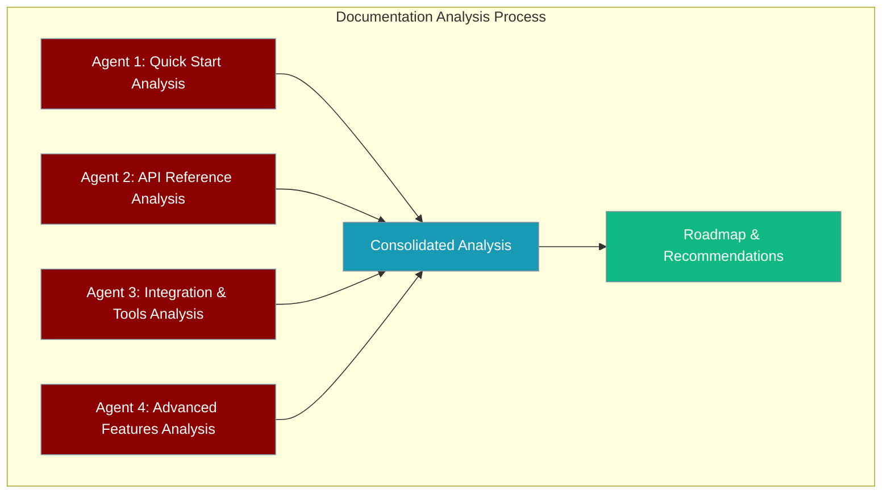
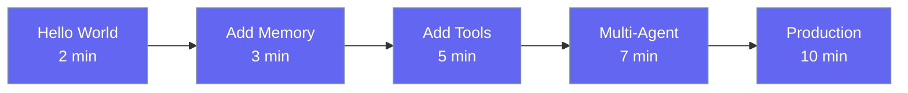
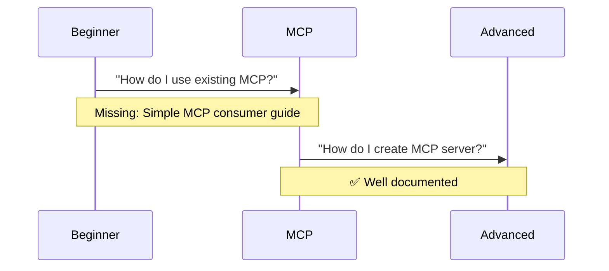
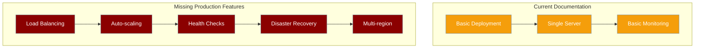
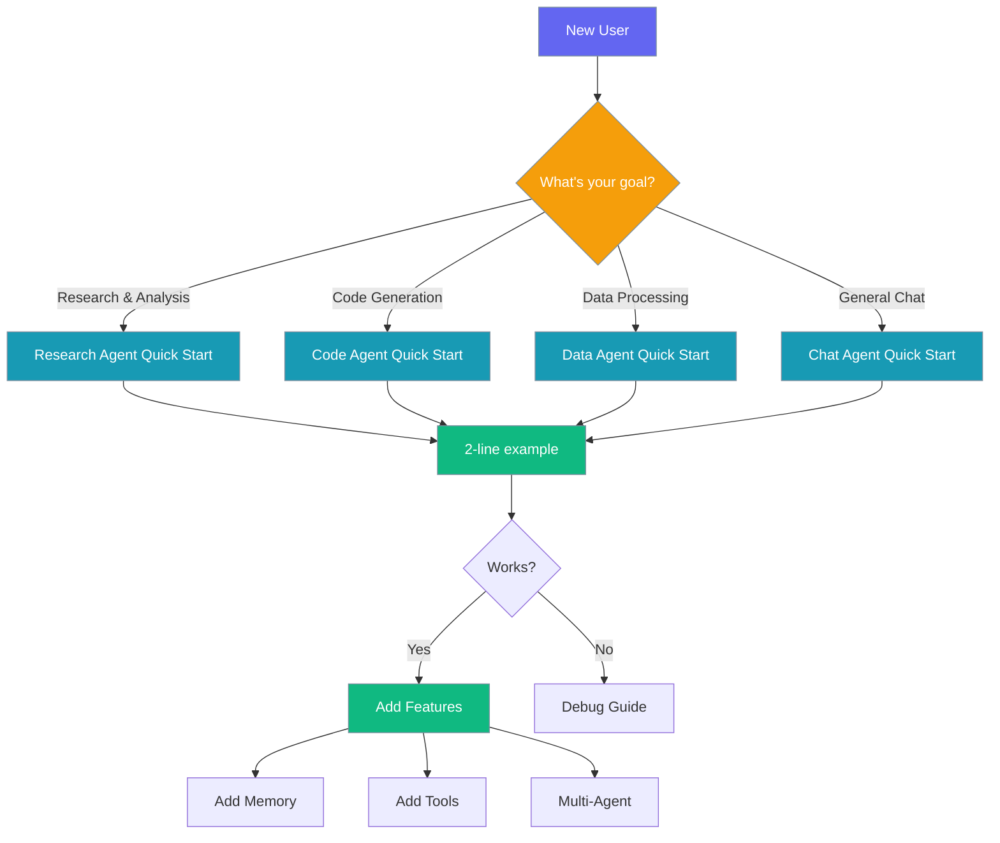
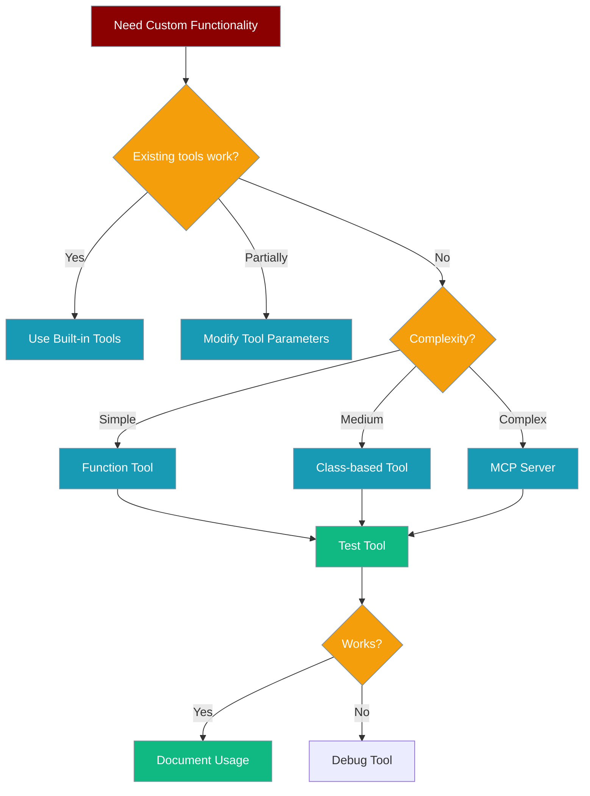
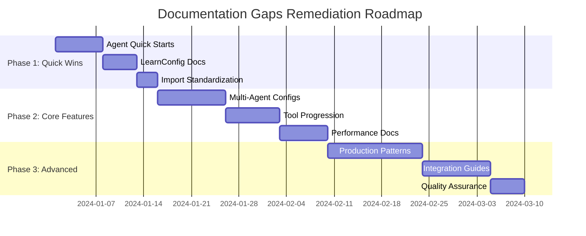

# PraisonAI Documentation Gaps Analysis

Comprehensive analysis of PraisonAI documentation using parallel agent analysis approach to identify critical gaps and provide actionable improvements focused on user success and beginner-friendly onboarding.



This analysis identifies documentation gaps that impact user success, prioritized by user journey stage and impact level.

---

## Executive Summary

**Current State:** PraisonAI has extensive documentation coverage with 300+ pages across concepts, features, CLI, and SDK references.

**Key Finding:** While comprehensive, the documentation lacks progressive disclosure and beginner-friendly pathways that guide users from "Hello World" to advanced features.

**Impact Priority:** Documentation improvements needed to achieve the "is it this easy to use?" user experience goal.

---

## Agent 1: Quick Start Documentation Analysis

### Current Quick Start Coverage

**Strengths:**
- Multiple entry points (Python, TypeScript, No-Code, CLI)
- Clear installation and API key setup
- Progressive examples from simple to advanced
- Good code example coverage across agent types

**Critical Gaps:**

| Gap | Priority | Impact | User Type |
|-----|----------|---------|-----------|
| No unified "Hello World" landing page | **Critical** | High | All beginners |
| Missing agent-specific quick starts | **Critical** | High | Feature explorers |
| No "5-minute success" guarantee | **Important** | Medium | Time-constrained users |
| Limited troubleshooting in quick start | **Important** | Medium | All users |

### Missing Beginner Entry Points

**Gap 1: Agent-Type Quick Starts**
```python
# Missing: Simple entry points for each agent type
# Current: Generic examples
# Needed: One-liner success examples

# Research Agent - 2 lines
from praisonaiagents import Agent
Agent(instructions="Research AI trends").start("What's new in 2024?")

# Code Agent - 2 lines  
from praisonaiagents import Agent
Agent(instructions="Write Python code").start("Create a todo app")

# Data Agent - 2 lines
from praisonaiagents import Agent
Agent(instructions="Analyze data", tools=["pandas"]).start("Analyze sales.csv")
```

**Gap 2: Zero-to-Hero Learning Path**


---

## Agent 2: API Reference Analysis

### SDK Export vs Documentation Coverage

**Analysis:** Compared 186+ SDK exports in `__init__.py` with existing documentation.

**Configuration Classes Coverage:**

| Config Class | SDK Export | Docs Exist | Priority | Status |
|--------------|------------|------------|----------|---------|
| `MemoryConfig` | ✅ | ✅ | High | Complete |
| `KnowledgeConfig` | ✅ | ✅ | High | Complete |
| `PlanningConfig` | ✅ | ✅ | High | Complete |
| `LearnConfig` | ✅ | ⚠️ | **Critical** | Stub only |
| `AutonomyConfig` | ✅ | ✅ | High | Complete |
| `MultiAgentHooksConfig` | ✅ | ❌ | **Important** | Missing |
| `MultiAgentOutputConfig` | ✅ | ❌ | **Important** | Missing |
| `MultiAgentExecutionConfig` | ✅ | ❌ | **Important** | Missing |

**Critical Missing References:**

### Gap 1: Multi-Agent Configuration Classes
- `MultiAgentHooksConfig` - No documentation exists
- `MultiAgentOutputConfig` - No documentation exists  
- `MultiAgentExecutionConfig` - No documentation exists
- `MultiAgentPlanningConfig` - No documentation exists
- `MultiAgentMemoryConfig` - No documentation exists

### Gap 2: Learning System Documentation
- `LearnConfig` has minimal documentation
- Learning modes (`AGENTIC`, `PROPOSE`) not explained
- Learning scopes (`PRIVATE`, `SHARED`) unclear
- No examples of learning extraction

### Gap 3: Import Pattern Inconsistencies
```python
# Current: Complex imports discourage usage
from praisonaiagents.workflows import when, parallel, loop

# Recommended: Simple imports as stated in naming guide
from praisonaiagents import when, parallel, loop
```

---

## Agent 3: Integration & Tools Analysis

### MCP Integration Coverage

**Current State:** Excellent MCP coverage with 80+ MCP-related documentation files.

**Strengths:**
- Comprehensive MCP server documentation
- Multiple transport options covered
- Security and authentication documented
- Tool integration examples

**Gaps Identified:**

### Gap 1: MCP Development Progression


### Gap 2: Tool Development Journey
**Missing Progressive Disclosure:**

| Stage | Current | Needed | Priority |
|-------|---------|--------|----------|
| Use existing tools | ✅ Good | - | - |
| Modify tool parameters | ❌ Missing | Guide + examples | **Important** |
| Create simple tools | ⚠️ Advanced only | Beginner guide | **Critical** |
| Tool composition | ❌ Missing | Patterns guide | **Important** |
| Tool testing | ❌ Missing | Testing framework | **Important** |

### Gap 3: External Integration Pathways
- **Missing:** Integration decision trees
- **Missing:** When to use MCP vs native tools vs external APIs
- **Missing:** Performance considerations for each approach

---

## Agent 4: Advanced Features Analysis

### Learning System Documentation

**Critical Gap:** Learning system implementation exists but documentation is minimal.

**Current Implementation (SDK):**
```python
# LearnConfig supports rich learning capabilities
LearnConfig(
    persona=True,      # User preferences - undocumented
    insights=True,     # Observations - undocumented  
    patterns=True,     # Reusable knowledge - undocumented
    mode="agentic",    # Auto-extract - undocumented
    scope="private",   # Visibility - undocumented
)
```

**Missing Documentation:**
- How learning extraction works
- Privacy implications of learning modes
- Learning data lifecycle management
- Performance impact of learning features

### Performance Features Analysis

**Telemetry & Monitoring Gaps:**

| Feature | Implementation | Documentation | Priority |
|---------|---------------|---------------|----------|
| Token metrics | ✅ Complete | ❌ Missing | **Critical** |
| Performance monitoring | ✅ Complete | ⚠️ Minimal | **Important** |
| Cost tracking | ✅ Complete | ⚠️ Basic | **Important** |
| Memory usage tracking | ✅ Complete | ❌ Missing | **Important** |

### Production Deployment Gaps

**Current vs Needed:**



---

## Gap Prioritization Framework

### Priority 1: Critical (Blocks User Success)
1. **Agent-type Quick Start Pages** - Users can't find entry point for their use case
2. **LearnConfig Documentation** - Feature exists but unusable due to lack of docs
3. **Multi-Agent Configuration Classes** - Advanced users blocked on team management

### Priority 2: Important (Reduces User Success)
1. **Tool Development Progression** - Users struggle to advance from basic to custom tools
2. **Performance Monitoring Guides** - Production deployments lack visibility
3. **Import Pattern Standardization** - Inconsistent imports confuse users

### Priority 3: Nice-to-Have (Enhances User Experience)
1. **Advanced Deployment Patterns** - Enterprise users need scaling guidance
2. **Integration Decision Trees** - Users need help choosing between options
3. **Troubleshooting Runbooks** - Faster issue resolution

---

## Mermaid Decision Trees

### Quick Start Decision Tree


### Tool Development Decision Tree


---

## Actionable Recommendations

### Phase 1: Quick Wins (1-2 weeks)

**1. Create Agent-Type Landing Pages**
Create 5 new pages following AGENTS.md template:

```mdx
---
title: "Research Agent"
sidebarTitle: "Research"
description: "Start researching any topic in 2 minutes"
icon: "magnifying-glass"
---

Research any topic with web search and analysis capabilities.

## Quick Start

<Steps>
<Step title="Install & Setup (1 min)">
```bash
pip install praisonaiagents
export OPENAI_API_KEY="your-key"
```
</Step>

<Step title="Research Anything (1 min)">
```python
from praisonaiagents import Agent

agent = Agent(instructions="Research and analyze topics")
result = agent.start("What are the latest AI developments in 2024?")
```
</Step>
</Steps>
```

**Files to Create:**
- `/docs/agents/research-quick-start.mdx`
- `/docs/agents/code-quick-start.mdx`  
- `/docs/agents/data-quick-start.mdx`
- `/docs/agents/chat-quick-start.mdx`
- `/docs/agents/content-quick-start.mdx`

**2. Complete LearnConfig Documentation**
Expand `/docs/configuration/learn-config.mdx`:

```mdx
## Learning Modes

<AccordionGroup>
<Accordion title="AGENTIC Mode">
Agent autonomously extracts learnings after conversations.

```python
Agent(learn=LearnConfig(mode="agentic"))
```

**Use when:** You want automatic learning without approval overhead.
**Privacy:** Respects scope settings (private/shared).
</Accordion>

<Accordion title="PROPOSE Mode">
Agent suggests learnings for user approval.

```python
Agent(learn=LearnConfig(mode="propose"))  # Future feature
```

**Status:** Defined but not yet implemented.
</Accordion>
</AccordionGroup>
```

### Phase 2: Core Improvements (2-4 weeks)

**1. Multi-Agent Configuration Documentation**
Create comprehensive guides for:
- `MultiAgentHooksConfig` - Team-level event handling
- `MultiAgentOutputConfig` - Coordinated output formatting
- `MultiAgentExecutionConfig` - Parallel vs sequential execution

**2. Tool Development Progression Guide**
Create `/docs/guides/tools/progression.mdx`:


### Phase 3: Advanced Features (4-6 weeks)

**1. Performance Monitoring Suite**
- Token usage dashboard setup
- Cost tracking implementation
- Memory usage monitoring
- Performance benchmarking guides

**2. Production Deployment Patterns**
- Load balancing configurations
- Auto-scaling setup
- Health check implementation
- Disaster recovery procedures

---

## Success Metrics

### User Experience Metrics
- **Time to First Success:** Target < 5 minutes for any agent type
- **Documentation Bounce Rate:** Reduce by 30% through clearer pathways
- **Support Ticket Volume:** Reduce setup-related tickets by 50%

### Documentation Quality Metrics  
- **Coverage Completeness:** 100% of SDK exports documented
- **Example Runability:** All code examples copy-paste ready
- **Progressive Disclosure:** Clear beginner → advanced paths

### Implementation Tracking
- **Phase 1 Completion:** 5 new quick-start pages + LearnConfig docs
- **Phase 2 Completion:** Multi-agent configs + tool progression
- **Phase 3 Completion:** Performance monitoring + production guides

---

## Implementation Roadmap



**Total Timeline:** 6 weeks to comprehensive documentation coverage.

**Success Indicator:** Users consistently achieve "is it this easy to use?" experience across all entry points and feature progressions.

---

## Related Documentation

<CardGroup cols={2}>
<Card title="AGENTS.md Standards" icon="file-code" href="/AGENTS.md">
  Documentation creation standards and patterns
</Card>
<Card title="Quick Start Guide" icon="bolt" href="/docs/quickstart">
  Current quick start implementation
</Card>
</CardGroup>