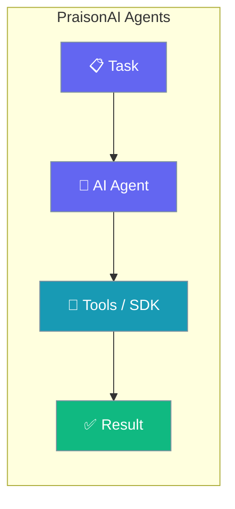
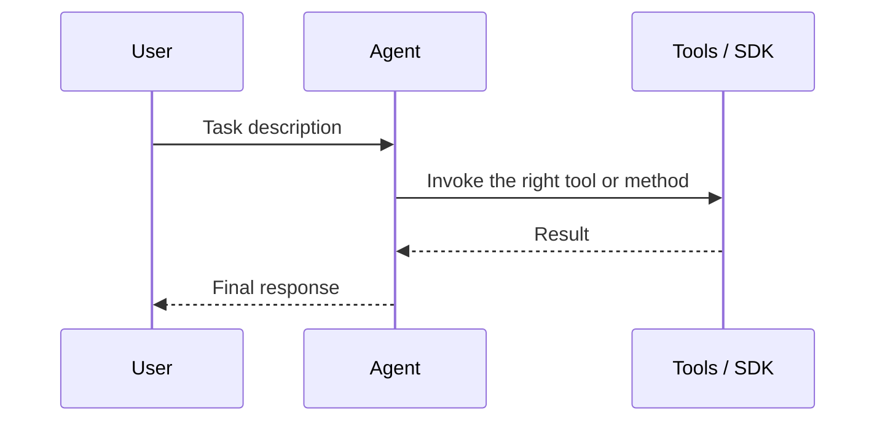

Every specialised agent starts from the same friendly `Agent` primitive — one instruction, one call — then adds tools or dedicated methods for its domain.

```python
from praisonaiagents import Agent

agent = Agent(instructions="Your task-specific instructions")

agent.start("Your task description")
```



PraisonAI provides a diverse set of specialized agents for various tasks. Each agent is designed with specific capabilities and tools to handle different types of tasks effectively.

## Quick Start

<Steps>
<Step title="Simple Usage">

Create a plain agent and start it.

```python
from praisonaiagents import Agent

agent = Agent(instructions="Your task-specific instructions")

agent.start("Your task description")
```

</Step>

<Step title="With a Specialised Agent">

Swap in a dedicated agent class when a task needs it.

```python
from praisonaiagents import CodeAgent

agent = CodeAgent(name="Coder")

code = agent.generate("Write a function to reverse a string")
print(agent.execute(code)["stdout"])
```

</Step>
</Steps>

## How It Works



## Data & Analysis

<CardGroup cols={2}>
  <Card title="Data Analyst" icon="chart-line" href="/docs/agents/data-analyst">
    Analyze data from various sources, create visualizations, and generate insights.
  </Card>
  <Card title="Finance" icon="money-bill-trend-up" href="/docs/agents/finance">
    Track stocks, analyze financial data, and provide investment recommendations.
  </Card>
  <Card title="Research" icon="magnifying-glass-chart" href="/docs/agents/research">
    Conduct comprehensive research and analysis across various topics.
  </Card>
  <Card title="Wikipedia" icon="book" href="/docs/agents/wikipedia">
    Search and extract information from Wikipedia articles.
  </Card>
</CardGroup>

## Media & Content

<CardGroup cols={2}>
  <Card title="Image Analysis" icon="image" href="/docs/agents/image">
    Analyze and understand visual content from images.
  </Card>
  <Card title="Image to Text" icon="text" href="/docs/agents/image-to-text">
    Convert images to textual descriptions and extract text content.
  </Card>
  <Card title="Video" icon="video" href="/docs/agents/video">
    Analyze video content and extract meaningful information.
  </Card>
  <Card title="Markdown" icon="markdown" href="/docs/agents/markdown">
    Generate and format content in Markdown syntax.
  </Card>
</CardGroup>

## Search & Recommendations

<CardGroup cols={2}>
  <Card title="Web Search" icon="globe" href="/docs/agents/websearch">
    Perform intelligent web searches and gather information.
  </Card>
  <Card title="Recommendation" icon="thumbs-up" href="/docs/agents/recommendation">
    Generate personalized recommendations based on preferences.
  </Card>
  <Card title="Shopping" icon="shop" href="/docs/agents/shopping">
    Compare prices and find the best deals across stores.
  </Card>
  <Card title="Planning" icon="calendar" href="/docs/agents/planning">
    Create travel plans and detailed itineraries.
  </Card>
</CardGroup>

## Development

<CardGroup cols={2}>
  <Card title="Programming" icon="code" href="/docs/agents/programming">
    Write, analyze, and debug code across multiple languages.
  </Card>
  <Card title="Single Agent" icon="circle-1" href="/docs/agents/single">
    Simple, focused agent for basic tasks without external tools.
  </Card>
</CardGroup>

## Getting Started

Each agent can be easily initialized and customized for your specific needs. Here's a basic example:

```python
from praisonaiagents import Agent

agent = Agent(instructions="Your task-specific instructions")

response = agent.start("Your task description")
```

For more detailed information about each agent, click on the respective cards above.

## Best Practices

<AccordionGroup>
<Accordion title="Start with a plain Agent">
A plain `Agent` with a clear instruction handles most tasks. Reach for a specialised class only when you need its dedicated methods or built-in tooling.
</Accordion>

<Accordion title="Pick the specialised agent that matches the job">
Use `CodeAgent` for sandboxed code, `VisionAgent` for image understanding, `RealtimeAgent` for voice, and so on. Each ships the right defaults for its domain.
</Accordion>

<Accordion title="Add tools instead of a new class when you can">
Many "agents" here are just a plain Agent plus a tool (search, finance, wiki). Attaching a tool is often simpler than adopting a whole specialised class.
</Accordion>

<Accordion title="Enable memory for multi-turn work">
Set `memory=True` when a task spans several interactions so the agent keeps context across turns instead of starting fresh each time.
</Accordion>
</AccordionGroup>

## Related

<CardGroup cols={2}>
  <Card icon="circle-1" href="/docs/agents/single">
    The minimal single-purpose agent to start from.
  </Card>
  <Card icon="code" href="/docs/agents/code">
    The CodeAgent with sandboxed generation and execution.
  </Card>
</CardGroup>