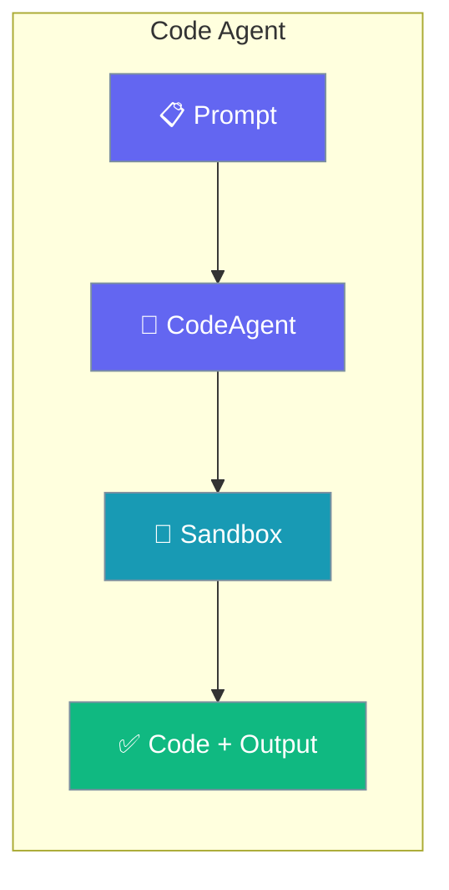
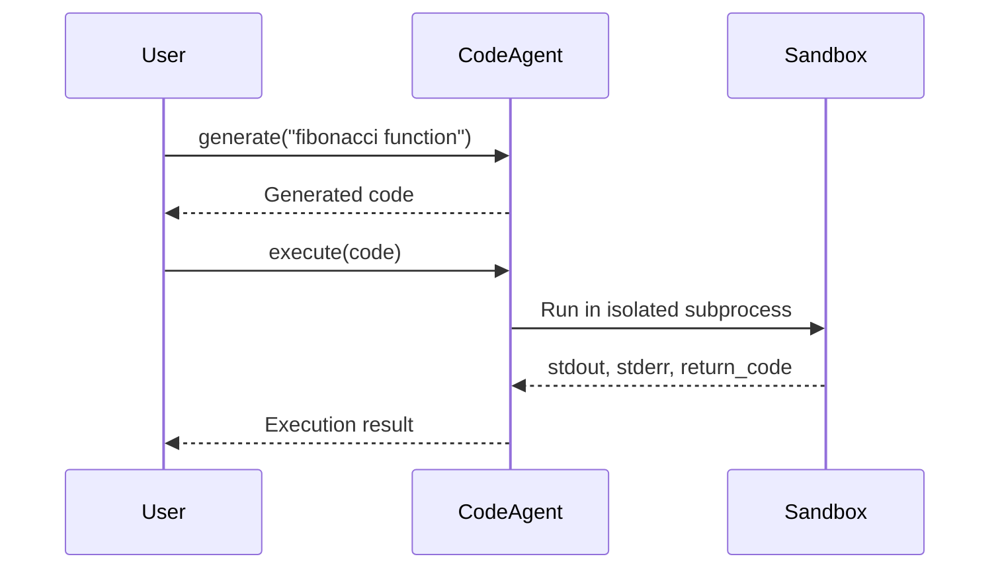

Generate, run, review, and fix code with the `CodeAgent` — a specialised agent with sandboxed execution built in.

```python
from praisonaiagents import CodeAgent

agent = CodeAgent(name="Coder")

code = agent.generate("Write a function to calculate fibonacci numbers")
result = agent.execute("print('Hello, World!')")
print(result["stdout"])
```



The `CodeAgent` provides comprehensive code assistance including generation, execution in sandboxed environments, code review, explanation, refactoring, and bug fixing.

## Quick Start

<Steps>
<Step title="Simple Usage">

Generate and run code with two calls.

```python
from praisonaiagents import CodeAgent

agent = CodeAgent(name="Coder")

code = agent.generate("Write a function to calculate fibonacci numbers")
result = agent.execute("print('Hello, World!')")
print(result["stdout"])
```

</Step>

<Step title="With Configuration">

Lock down the sandbox for production use.

```python
from praisonaiagents import CodeAgent, CodeConfig

config = CodeConfig(
    sandbox=True,
    timeout=30,
    allowed_languages=["python"],
)

agent = CodeAgent(
    name="SafeCoder",
    llm="gpt-4o-mini",
    code=config,
    instructions="Write clean, well-documented Python code",
)

code = agent.generate("Create a class for managing a todo list")
print(agent.review(code))
```

</Step>
</Steps>

## How It Works



## Installation

```bash
pip install praisonaiagents[llm]
```

## Basic Usage

### Code Generation

```python
from praisonaiagents import CodeAgent

agent = CodeAgent(name="Generator")

# Generate Python code
code = agent.generate(
    "Write a function that sorts a list using quicksort",
    language="python"
)
print(code)
```

### Code Execution

```python
from praisonaiagents import CodeAgent

agent = CodeAgent(name="Executor")

# Execute code in sandbox
result = agent.execute("""
def greet(name):
    return f"Hello, {name}!"

print(greet("World"))
""")

print(result["stdout"])  # Hello, World!
print(result["return_code"])  # 0
```

### Code Review

```python
from praisonaiagents import CodeAgent

agent = CodeAgent(name="Reviewer")

code = """
def calc(x,y):
    return x+y
"""

review = agent.review(code)
print(review)
```

## Configuration

### CodeConfig Options

| Parameter | Type | Default | Description |
|-----------|------|---------|-------------|
| `sandbox` | bool | True | Enable sandboxed execution |
| `timeout` | int | 30 | Execution timeout in seconds |
| `allowed_languages` | list | ["python"] | Allowed programming languages |
| `max_output_length` | int | 10000 | Maximum output length |
| `working_directory` | str | None | Working directory for execution |
| `environment` | dict | {} | Environment variables |

```python
from praisonaiagents import CodeAgent, CodeConfig

config = CodeConfig(
    sandbox=True,
    timeout=60,
    allowed_languages=["python", "javascript"],
    max_output_length=50000
)

agent = CodeAgent(
    name="SafeCoder",
    code=config
)
```

## Methods

### generate()

Generate code from natural language description.

```python
code = agent.generate(
    prompt="Create a REST API endpoint for user registration",
    language="python"
)
```

### execute()

Execute code in a sandboxed environment.

```python
result = agent.execute(code, language="python")

# Result structure
{
    "stdout": "...",      # Standard output
    "stderr": "...",      # Standard error
    "return_code": 0,     # Exit code
    "execution_time": 0.5 # Time in seconds
}
```

### review()

Review code for issues and improvements.

```python
review = agent.review(code, language="python")
```

### explain()

Explain what code does in plain language.

```python
explanation = agent.explain(code, language="python")
```

### refactor()

Refactor code to improve quality.

```python
improved = agent.refactor(
    code,
    instructions="Add type hints and docstrings",
    language="python"
)
```

### fix()

Fix bugs in code.

```python
fixed = agent.fix(
    buggy_code,
    error="IndexError: list index out of range",
    language="python"
)
```

## Async Usage

```python
import asyncio
from praisonaiagents import CodeAgent

async def main():
    agent = CodeAgent(name="AsyncCoder")
    
    # Generate async
    code = await agent.agenerate("Write an async HTTP client")
    
    # Execute async
    result = await agent.aexecute(code)
    print(result["stdout"])

asyncio.run(main())
```

## Example: Code Assistant

```python
from praisonaiagents import CodeAgent, CodeConfig

config = CodeConfig(
    sandbox=True,
    timeout=30,
    allowed_languages=["python"]
)

agent = CodeAgent(
    name="Assistant",
    llm="gpt-4o-mini",
    code=config,
    instructions="Write clean, well-documented Python code"
)

# Generate
code = agent.generate("Create a class for managing a todo list")

# Review
review = agent.review(code)
print("Review:", review)

# Refactor based on review
improved = agent.refactor(code, instructions="Apply review suggestions")

# Execute to verify
result = agent.execute(improved + "\n\ntodo = TodoList()\ntodo.add('Test')\nprint(todo.items)")
print("Output:", result["stdout"])
```

## Example: Bug Fixer

```python
from praisonaiagents import CodeAgent

agent = CodeAgent(name="Debugger")

buggy_code = """
def divide(a, b):
    return a / b

result = divide(10, 0)
print(result)
"""

# First, try to execute
result = agent.execute(buggy_code)
if result["return_code"] != 0:
    print(f"Error: {result['stderr']}")
    
    # Fix the bug
    fixed = agent.fix(buggy_code, error=result["stderr"])
    print("Fixed code:")
    print(fixed)
    
    # Verify fix
    verify = agent.execute(fixed)
    print(f"Fixed output: {verify['stdout']}")
```

## Security

<Warning>
Code execution is sandboxed by default. Never disable sandbox mode in production environments with untrusted input.
</Warning>

### Sandbox Features

- **Process isolation**: Code runs in separate subprocess
- **Timeout enforcement**: Prevents infinite loops
- **Output limiting**: Prevents memory exhaustion
- **Language restrictions**: Only allowed languages can execute

```python
# Secure configuration
config = CodeConfig(
    sandbox=True,  # Always enabled in production
    timeout=10,    # Short timeout
    max_output_length=1000,
    allowed_languages=["python"]  # Restrict languages
)
```

## Best Practices

<AccordionGroup>
<Accordion title="Always keep the sandbox enabled">
Leave `sandbox=True` for any untrusted or model-generated code. Disabling isolation in production lets arbitrary code touch your host — a serious security risk.
</Accordion>

<Accordion title="Set a timeout that fits the task">
A short `timeout` stops runaway loops from hanging your process. Tune it to the longest legitimate run your code needs, not longer.
</Accordion>

<Accordion title="Review before you execute">
Call `review()` on generated code before `execute()`. Catching an obvious bug in review is cheaper than debugging a failed run.
</Accordion>

<Accordion title="Always check return codes and stderr">
`execute()` returns `return_code` and `stderr`. Branch on them — a non-zero code means the run failed, and `fix()` can repair it using the error text.
</Accordion>
</AccordionGroup>

## Related

<CardGroup cols={2}>
  <Card icon="code" href="/docs/agents/programming">
    A tool-based programming recipe using a plain Agent.
  </Card>
  <Card icon="eye" href="/docs/agents/vision">
    Analyze images and understand visual content.
  </Card>
</CardGroup>
