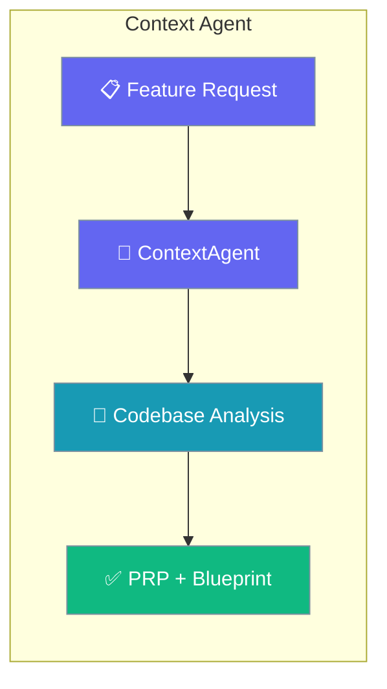
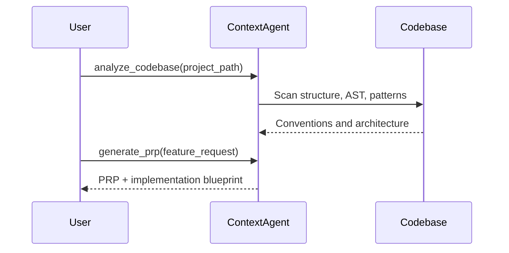

Analyse a codebase and generate a Product Requirements Prompt (PRP) for first-try implementation success with the `ContextAgent`.

```python
from praisonaiagents import create_context_agent

agent = create_context_agent(llm="gpt-4o-mini", name="Context Engineering Specialist")

analysis = agent.analyze_codebase("/path/to/project")
prp = agent.generate_prp(feature_request="Add user authentication with JWT", context_analysis=analysis)
```



The `ContextAgent` is a specialized agent for **Context Engineering** - comprehensive codebase analysis and Product Requirements Prompt (PRP) generation.

<Note>
**Not to be confused with Context Window Management** (`context=ContextConfig()`). 
This agent analyzes codebases and generates implementation guidance, while `ContextConfig` manages token budgets and compaction.
</Note>

## Quick Start

<Steps>
<Step title="Simple Usage">

Create the agent and analyse a project.

```python
from praisonaiagents import create_context_agent

agent = create_context_agent(
    llm="gpt-4o-mini",
    name="Context Engineering Specialist",
)

analysis = agent.analyze_codebase("/path/to/project")
```

</Step>

<Step title="With PRP Generation">

Turn a feature request into an implementation prompt.

```python
from praisonaiagents import create_context_agent

agent = create_context_agent(llm="gpt-4o-mini")

analysis = agent.analyze_codebase("/path/to/project")
prp = agent.generate_prp(
    feature_request="Add user authentication with JWT",
    context_analysis=analysis,
)
blueprint = agent.create_implementation_blueprint("JWT auth", analysis)
```

</Step>
</Steps>

## How It Works



## Key Features

| Feature | Description |
|---------|-------------|
| **Codebase Analysis** | Analyze project structure, patterns, conventions |
| **AST Analysis** | Extract classes, functions, imports from Python |
| **Pattern Extraction** | Identify code patterns and architecture |
| **PRP Generation** | Create comprehensive implementation guidance |
| **Validation Framework** | Define success criteria and quality gates |
| **Implementation Blueprint** | Step-by-step implementation plan |
| **GitHub Integration** | Analyze GitHub repositories directly |

## API Reference

### Core Methods

```python
# Protocol-compatible methods (recommended)
analysis = agent.analyze_codebase("/path/to/project")
prp = agent.generate_prp("Feature description", analysis)
blueprint = agent.create_implementation_blueprint("Feature", analysis)

# Original methods (still available)
analysis = agent.analyze_codebase_with_gitingest("/path/to/project")
prp = agent.generate_comprehensive_prp("Feature description", analysis)
blueprint = agent.build_implementation_blueprint("Feature description", analysis)
```

### Async Methods

```python
# Async versions for non-blocking execution
analysis = await agent.aanalyze_codebase("/path/to/project")
prp = await agent.agenerate_prp("Feature description", analysis)
blueprint = await agent.acreate_implementation_blueprint("Feature", analysis)
```

### Configurable Output

Control output using the `output=` parameter (inherited from Agent):

```python
# Silent mode - suppress all progress output
agent = create_context_agent(llm="gpt-4o-mini", output="silent")

# Verbose mode - show rich output with progress
agent = create_context_agent(llm="gpt-4o-mini", output="verbose")

# Actions mode - show actions/steps only
agent = create_context_agent(llm="gpt-4o-mini", output="actions")

# Default is silent (no output)
agent = create_context_agent(llm="gpt-4o-mini")
```

### Protocol Compliance

ContextAgent implements `ContextEngineerProtocol`:

```python
from praisonaiagents.agent import ContextEngineerProtocol

# Check protocol compliance
assert isinstance(agent, ContextEngineerProtocol)
```


### GitHub Analysis

```python
# Analyze GitHub repository
result = agent.start("https://github.com/user/repo Goal: Add authentication")
```

## Multi-Agent Workflow

```python
from praisonaiagents import Agent, Task, AgentTeam, create_context_agent

# Create context engineer
context_engineer = create_context_agent(llm="gpt-4o-mini")

# Analyze codebase
analysis = context_engineer.analyze_codebase("/path/to/project")

# Create implementation agent with context
developer = Agent(
    name="Developer",
    instructions=f"""
    Implement features following these patterns:
    {analysis}
    """
)

# Create workflow
agents = AgentTeam(agents=[developer], tasks=[...])
```

## Output Directory

Context Engineering outputs are saved to `.praison/prp/`:

```
.praison/prp/
├── agent_responses/      # Individual agent responses
├── markdown_outputs/     # Formatted markdown reports
├── debug_logs/           # Debug logs (if enabled)
└── final_results/        # Final PRP and blueprints
```

## Context Engineering vs Context Window Management

| ContextAgent (Context Engineering) | context=ContextConfig (Context Window) |
|-----------------------------------|---------------------------------------|
| Codebase analysis | Token budgeting |
| PRP generation | Auto-compaction |
| Pattern extraction | Session tracking |
| Implementation blueprints | Multi-memory aggregation |
| Validation frameworks | Overflow detection |

---

## Best Practices

<AccordionGroup>
<Accordion title="Analyse once, reuse the analysis">
`analyze_codebase` is the expensive step. Cache its result and pass it into `generate_prp` and `create_implementation_blueprint` rather than re-scanning for each call.
</Accordion>

<Accordion title="Scope file patterns to what matters">
Pass `file_patterns=["*.py"]` (or your language) so the agent focuses on relevant source instead of walking test fixtures and generated files.
</Accordion>

<Accordion title="Feed the PRP to an implementation agent">
The generated PRP is designed to prime another agent. Hand it to a `Developer` agent's instructions for higher first-try success.
</Accordion>

<Accordion title="Don't confuse it with ContextConfig">
This agent engineers implementation context. For token budgeting and compaction inside a run, use `context=ContextConfig()` instead — they solve different problems.
</Accordion>
</AccordionGroup>

## Related

<CardGroup cols={2}>
  <Card icon="code" href="/docs/agents/code">
    Implement the PRP with the sandboxed CodeAgent.
  </Card>
  <Card icon="layer-group" href="/docs/features/context-management">
    Token budgeting and context-window compaction.
  </Card>
</CardGroup>
