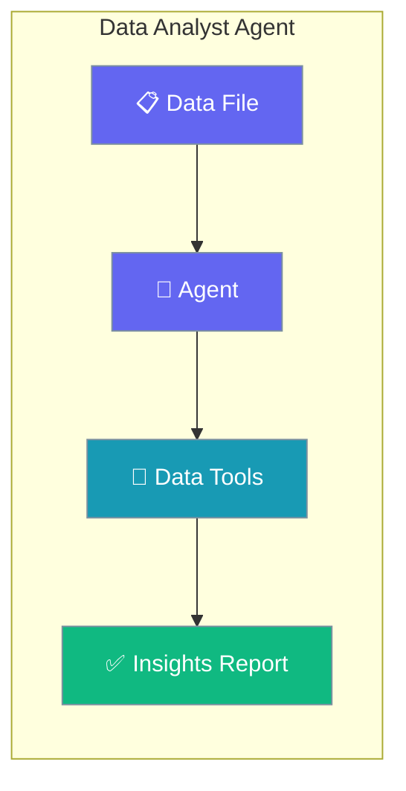
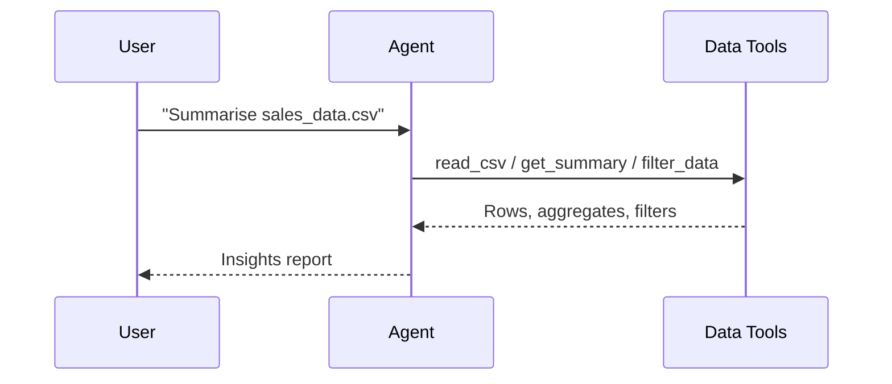

Read a CSV file, summarise it, and surface trends with a single Agent — no pandas boilerplate to write.

```python
from praisonaiagents import Agent
from praisonai_tools import read_csv, get_summary, filter_data

agent = Agent(
    name="DataAnalyst",
    instructions="Analyse data files and return clear, actionable insights.",
    tools=[read_csv, get_summary, filter_data],
)

agent.start("Read sales_data.csv and summarise the top trends.")
```



Data analysis agent with CSV/Excel tools for reading, analyzing, and exporting data.

## Quick Start

<Steps>
<Step title="Simple Usage">

Attach the data tools and ask for a summary.

```python
from praisonaiagents import Agent
from praisonai_tools import read_csv, get_summary, filter_data

agent = Agent(
    name="DataAnalyst",
    instructions="You are a data analyst. Analyze data and provide insights.",
    tools=[read_csv, get_summary, filter_data],
)

agent.start("Read sales_data.csv and provide a summary")
```

</Step>

<Step title="With Configuration">

Add memory so the agent compares datasets across turns.

```python
from praisonaiagents import Agent
from praisonai_tools import read_csv, get_summary, filter_data

agent = Agent(
    name="DataAnalyst",
    instructions="Analyse datasets and track findings across sessions.",
    tools=[read_csv, get_summary, filter_data],
    memory=True,
)

agent.start("Compare this quarter's sales_data.csv against last quarter.")
```

</Step>
</Steps>

## How It Works



---

## Simple

**Agents: 1** — Single agent with data tools handles file operations and analysis.

### Workflow

1. Read data from CSV/Excel
2. Analyze with filtering, grouping
3. Generate statistical summaries

### Setup

```bash
pip install praisonaiagents praisonai pandas openpyxl
export OPENAI_API_KEY="your-key"
```

### Run — Python

```python
from praisonaiagents import Agent
from praisonai_tools import read_csv, get_summary, filter_data

agent = Agent(
    name="DataAnalyst",
    instructions="You are a data analyst. Analyze data and provide insights.",
    tools=[read_csv, get_summary, filter_data]
)

result = agent.start("Read sales_data.csv and provide a summary")
print(result)
```

### Run — CLI

```bash
praisonai "Analyze data.csv and summarize key metrics" --tools pandas
```

### Run — agents.yaml

```yaml
framework: praisonai
topic: Data Analysis
roles:
  data_analyst:
    role: Data Analyst
    goal: Analyze data and generate insights
    backstory: You are an expert data analyst
    tools:
      - read_csv
      - get_summary
      - filter_data
    tasks:
      analyze_data:
        description: Read sales_data.csv and provide a summary
        expected_output: A data analysis report
```

```bash
praisonai agents.yaml
```

### Serve API

```python
from praisonaiagents import Agent
from praisonai_tools import read_csv, get_summary, filter_data

agent = Agent(
    name="DataAnalyst",
    instructions="You are a data analyst.",
    tools=[read_csv, get_summary, filter_data]
)

agent.launch(port=8080)
```

```bash
curl -X POST http://localhost:8080/chat \
  -H "Content-Type: application/json" \
  -d '{"message": "Summarize the uploaded data"}'
```

---

## Advanced Workflow (All Features)

**Agents: 1** — Single agent with memory, persistence, structured output, and session resumability.

### Workflow

1. Initialize session for analysis tracking
2. Configure SQLite persistence for analysis history
3. Read and analyze data with structured output
4. Store insights in memory for comparison
5. Resume session for iterative analysis

### Setup

```bash
pip install praisonaiagents praisonai pandas openpyxl pydantic
export OPENAI_API_KEY="your-key"
```

### Run — Python

```python
from praisonaiagents import Agent, Task, AgentTeam, Session
from praisonai_tools import read_csv, get_summary, filter_data
from pydantic import BaseModel

# Structured output schema
class DataInsights(BaseModel):
    dataset: str
    row_count: int
    key_metrics: list[str]
    trends: list[str]
    recommendations: list[str]

# Create session for analysis tracking
session = Session(session_id="analysis-001", user_id="user-1")

# Agent with memory and tools
agent = Agent(
    name="DataAnalyst",
    instructions="Analyze data and return structured insights.",
    tools=[read_csv, get_summary, filter_data],
    memory=True
)

# Task with structured output
task = Task(
    description="Read sales_data.csv and provide structured insights",
    expected_output="Structured data analysis",
    agent=agent,
    output_pydantic=DataInsights
)

# Run with SQLite persistence
agents = AgentTeam(
    agents=[agent],
    tasks=[task],
    memory=True
)

result = agents.start()
print(result)

# Resume later
session2 = Session(session_id="analysis-001", user_id="user-1")
history = session2.search_memory("sales")
```

### Run — CLI

```bash
praisonai "Analyze data.csv" --tools pandas --memory --verbose
```

### Run — agents.yaml

```yaml
framework: praisonai
topic: Data Analysis
memory: true
memory_config:
  provider: sqlite
  db_path: analysis.db
roles:
  data_analyst:
    role: Data Analyst
    goal: Analyze data with structured output
    backstory: You are an expert data analyst
    tools:
      - read_csv
      - get_summary
      - filter_data
    memory: true
    tasks:
      analyze_data:
        description: Read sales_data.csv and provide structured insights
        expected_output: Structured data analysis
        output_json:
          dataset: string
          row_count: number
          key_metrics: array
          trends: array
          recommendations: array
```

```bash
praisonai agents.yaml --verbose
```

### Serve API

```python
from praisonaiagents import Agent
from praisonai_tools import read_csv, get_summary, filter_data

agent = Agent(
    name="DataAnalyst",
    instructions="Analyze data and return structured insights.",
    tools=[read_csv, get_summary, filter_data],
    memory=True
)

agent.launch(port=8080)
```

```bash
curl -X POST http://localhost:8080/chat \
  -H "Content-Type: application/json" \
  -d '{"message": "Analyze data", "session_id": "analysis-001"}'
```

---

## Monitor / Verify

```bash
praisonai "test analysis" --tools pandas --verbose
```

## Cleanup

```bash
rm -f analysis.db
```

## Features Demonstrated

| Feature | Implementation |
|---------|----------------|
| Workflow | Multi-tool data analysis |
| DB Persistence | SQLite via `memory_config` |
| Observability | `--verbose` flag |
| Tools | pandas (read, summary, filter) |
| Resumability | `Session` with `session_id` |
| Structured Output | Pydantic `DataInsights` model |

## Best Practices

<AccordionGroup>
<Accordion title="Load data once, then filter">
Call `read_csv` a single time and reuse `filter_data` for follow-up questions. Re-reading large files on every turn wastes tokens and slows the agent down.
</Accordion>

<Accordion title="Ask for structured output on repeatable reports">
When the same analysis runs regularly, pair the agent with a Pydantic schema via `output_pydantic` so downstream code gets typed fields instead of prose.
</Accordion>

<Accordion title="Enable memory for iterative analysis">
Set `memory=True` to let the agent compare a new dataset against earlier findings without re-loading prior files.
</Accordion>

<Accordion title="Hand off to Finance for market data">
Use the Data Analyst for files you own; switch to the Finance Agent when the question needs live stock prices or fundamentals.
</Accordion>
</AccordionGroup>

## Related

<CardGroup cols={2}>
  <Card icon="money-bill-trend-up" href="/docs/agents/finance">
    Analyze stocks with live price and fundamentals tools.
  </Card>
  <Card icon="magnifying-glass-chart" href="/docs/agents/research">
    Research topics across the web and synthesise findings.
  </Card>
</CardGroup>
