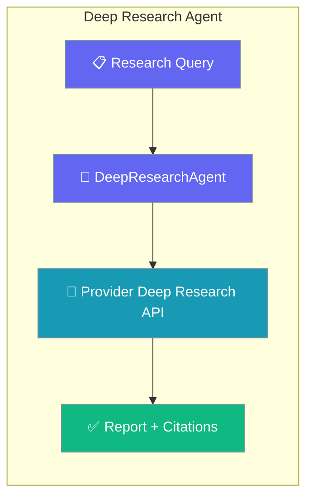
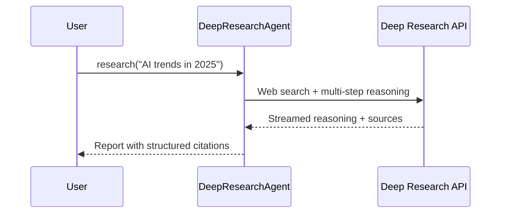

Run provider-native deep research — multi-step web search, reasoning, and cited reports — with the `DeepResearchAgent`.

```python
from praisonaiagents import DeepResearchAgent

agent = DeepResearchAgent(model="o4-mini-deep-research")

result = agent.research("What are the latest AI trends in 2025?")
print(result.report)
print(f"Citations: {len(result.citations)}")
```



The Deep Research Agent automates comprehensive research using OpenAI or Gemini Deep Research APIs with real-time streaming, web search, and structured citations.

**Agents: 1** — Specialized agent using provider deep research APIs.

## Quick Start

<Steps>
<Step title="Simple Usage">

Pick a deep-research model and run a query.

```python
from praisonaiagents import DeepResearchAgent

agent = DeepResearchAgent(model="o4-mini-deep-research")

result = agent.research("What are the latest AI trends in 2025?")
print(result.report)
```

</Step>

<Step title="With Custom Instructions">

Steer the researcher and inspect citations.

```python
from praisonaiagents import DeepResearchAgent

agent = DeepResearchAgent(
    model="o4-mini-deep-research",
    instructions="Focus on data-rich insights with reliable sources.",
)

result = agent.research("Economic impact of AI on healthcare")
for citation in result.citations:
    print(citation.title, citation.url)
```

</Step>
</Steps>

## How It Works



## Workflow

1. Receive research query
2. Execute web searches via provider API
3. Perform multi-step reasoning
4. Generate comprehensive report with citations

## Setup

```bash
pip install praisonaiagents praisonai
export OPENAI_API_KEY="your-key"  # or GEMINI_API_KEY
```

## Run — Python

```python
from praisonaiagents import DeepResearchAgent

agent = DeepResearchAgent(
    model="o4-mini-deep-research",
    
)

result = agent.research("What are the latest AI trends in 2025?")
print(result.report)
print(f"Citations: {len(result.citations)}")
```

## Run — CLI

```bash
# Deep research mode
praisonai research "What are the latest AI trends?"

# With save option
praisonai research --save "Research quantum computing advances"
```

## Run — agents.yaml

```yaml
framework: praisonai
topic: Deep Research
roles:
  researcher:
    role: Deep Research Specialist
    goal: Conduct comprehensive research with citations
    backstory: You are an expert researcher
    llm: o4-mini-deep-research
    tasks:
      research:
        description: Research the latest AI trends in 2025
        expected_output: Comprehensive report with citations
```

```bash
praisonai agents.yaml
```

## Serve API

```python
from praisonaiagents import DeepResearchAgent

agent = DeepResearchAgent(
    model="o4-mini-deep-research",
    
)

# Note: DeepResearchAgent uses .research() method
# For API serving, wrap in standard agent
```

## OpenAI Deep Research

```python
from praisonaiagents import DeepResearchAgent

agent = DeepResearchAgent(
    model="o4-mini-deep-research",  # or "o3-deep-research"
    
)

result = agent.research("What are the latest AI trends?")
print(result.report)
print(f"Citations: {len(result.citations)}")
```

## Gemini Deep Research

```python
from praisonaiagents import DeepResearchAgent

agent = DeepResearchAgent(
    model="deep-research-pro",
    
)

result = agent.research("Research quantum computing advances")
print(result.report)
```

## Features

<CardGroup cols={2}>
  <Card title="Multi-Provider" icon="layer-group">
    Supports OpenAI, Gemini, and LiteLLM providers.
  </Card>
  <Card title="Real-time Streaming" icon="signal-stream">
    See reasoning summaries and web searches as they happen.
  </Card>
  <Card title="Structured Citations" icon="quote-left">
    Get citations with titles and URLs.
  </Card>
  <Card title="Auto Detection" icon="wand-magic-sparkles">
    Provider automatically detected from model name.
  </Card>
</CardGroup>

## Streaming Output

Streaming is enabled by default. You will see:
- 💭 Reasoning summaries
- 🔎 Web search queries
- Final report text

```python
# Streaming is ON by default
result = agent.research("Research topic")

# Disable streaming
result = agent.research("Research topic", stream=False)
```

## Response Structure

```python
result.report           # Full research report
result.citations        # List of citations with URLs
result.web_searches     # Web searches performed
result.reasoning_steps  # Reasoning steps captured
result.interaction_id   # Session ID (for Gemini follow-ups)
```

## Available Models

| Provider | Models |
|----------|--------|
| OpenAI | `o3-deep-research`, `o4-mini-deep-research` |
| Gemini | `deep-research-pro` |

## Configuration Options

```python
agent = DeepResearchAgent(
    name="Researcher",
    model="o4-mini-deep-research",
    instructions="Focus on data-rich insights",
    
    poll_interval=5,      # Gemini polling interval (seconds)
    max_wait_time=3600    # Max research time (seconds)
)
```

## With Custom Instructions

```python
from praisonaiagents import DeepResearchAgent

agent = DeepResearchAgent(
    model="o4-mini-deep-research",
    instructions="""
    You are a professional researcher. Focus on:
    - Data-rich insights with specific figures
    - Reliable sources and citations
    - Clear, structured responses
    """,
    
)

result = agent.research("Economic impact of AI on healthcare")
```

## Accessing Citations

```python
result = agent.research("Research topic")

for citation in result.citations:
    print(f"Title: {citation.title}")
    print(f"URL: {citation.url}")
    print(f"Snippet: {citation.snippet}")
    print("---")
```

---

## Monitor / Verify

```bash
praisonai research "test query" --verbose
```

## Cleanup

```bash
# No cleanup needed - uses provider APIs
```

## Features Demonstrated

| Feature | Implementation |
|---------|----------------|
| Workflow | Multi-step reasoning with web search |
| Observability | `--verbose` flag, streaming output |
| Tools | Built-in web search via provider API |
| Resumability | `interaction_id` for Gemini follow-ups |
| Structured Output | Citations with titles and URLs |

## Best Practices

<AccordionGroup>
<Accordion title="Match the model to the provider">
`o3-deep-research` and `o4-mini-deep-research` route to OpenAI; `deep-research-pro` routes to Gemini. The provider is auto-detected from the model name, so pick the one whose API key you have set.
</Accordion>

<Accordion title="Set a generous max_wait_time for hard questions">
Deep research runs multiple search-and-reason cycles. Raise `max_wait_time` for broad topics so the agent isn't cut off mid-report.
</Accordion>

<Accordion title="Always surface the citations">
Every result carries `citations` with titles and URLs. Render them so users can verify claims — that traceability is the whole point of deep research.
</Accordion>

<Accordion title="Use the plain Research Agent for lightweight queries">
For quick, cheap look-ups, a plain Agent with a search tool is faster and cheaper. Reserve `DeepResearchAgent` for questions that genuinely need multi-step reasoning.
</Accordion>
</AccordionGroup>

## Related

<CardGroup cols={2}>
  <Card icon="magnifying-glass-chart" href="/docs/agents/research">
    A lighter search-tool research recipe using a plain Agent.
  </Card>
  <Card icon="globe" href="/docs/agents/websearch">
    Single-pass web search for quick answers.
  </Card>
</CardGroup>
