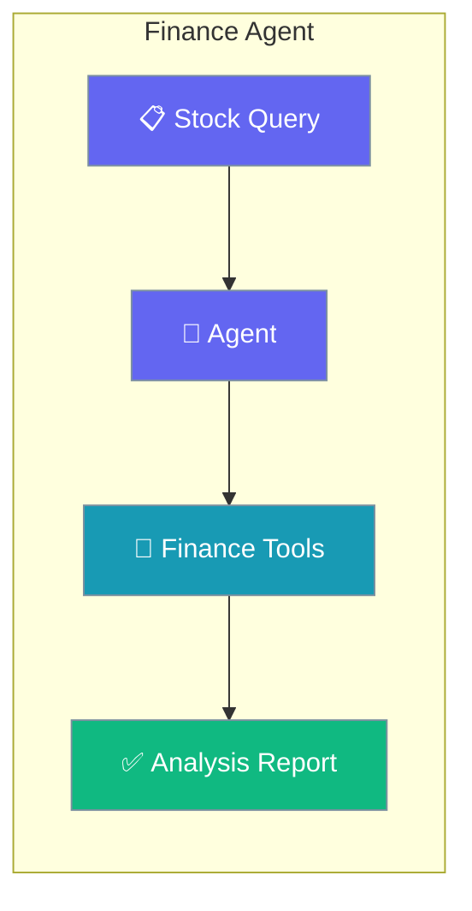
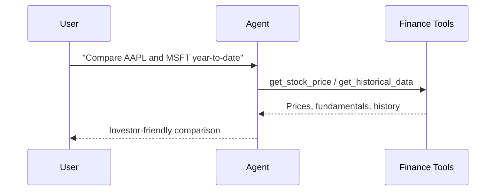

Get real-time stock prices, company fundamentals, and historical trends with a single Agent — no financial-data API glue code required.

```python
from praisonaiagents import Agent
from praisonaiagents import get_stock_price, get_stock_info, get_historical_data

agent = Agent(
    name="FinanceAnalyst",
    instructions="Analyse stocks and return an investor-friendly summary.",
    tools=[get_stock_price, get_stock_info, get_historical_data],
)

agent.start("Compare AAPL and MSFT year-to-date.")
```



## Quick Start

<Steps>
<Step title="Simple Usage">

Give an Agent the finance tools and ask a question.

```python
from praisonaiagents import Agent
from praisonaiagents import get_stock_price, get_stock_info, get_historical_data

agent = Agent(
    name="FinanceAnalyst",
    instructions="You are a financial analyst. Analyze stocks and provide insights.",
    tools=[get_stock_price, get_stock_info, get_historical_data],
)

agent.start("Analyze Apple (AAPL) - current price and 6-month trend")
```

</Step>

<Step title="With Configuration">

Add memory to track a portfolio across sessions.

```python
from praisonaiagents import Agent
from praisonaiagents import get_stock_price, get_stock_info, get_historical_data

agent = Agent(
    name="FinanceAnalyst",
    instructions="Track a portfolio and compare positions over time.",
    tools=[get_stock_price, get_stock_info, get_historical_data],
    memory=True,
)

agent.start("Compare AAPL and GOOGL, then remember my preference for tech stocks.")
```

</Step>
</Steps>

---

## How It Works

A user asks a financial question, the Agent calls the finance tools to pull live data, then returns an investor-friendly summary.



---

## Configuration Options

The finance tools take no configuration — pass them to any `Agent`. For the underlying tool signatures see the tools reference.

<CardGroup cols={2}>
  <Card title="yfinance Tools" icon="wrench" href="/tools/yfinance_tools">
    Stock price, company info, and historical data tool signatures.
  </Card>
  <Card title="Agent Reference" icon="user" href="/features/agents">
    Full Agent parameters and options.
  </Card>
</CardGroup>

---

## Simple

**Agents: 1** — Single agent with finance tools for comprehensive stock analysis.

### Workflow

1. Receive stock query
2. Fetch real-time price data
3. Retrieve company information
4. Analyze historical trends

### Setup

```bash
pip install praisonaiagents praisonai yfinance
export OPENAI_API_KEY="${OPENAI_API_KEY:?Set OPENAI_API_KEY in your shell}"
```

### Run — Python

```python
from praisonaiagents import Agent
from praisonaiagents import get_stock_price, get_stock_info, get_historical_data

agent = Agent(
    name="FinanceAnalyst",
    instructions="You are a financial analyst. Analyze stocks and provide insights.",
    tools=[get_stock_price, get_stock_info, get_historical_data]
)

result = agent.start("Analyze Apple (AAPL) stock - current price and 6-month trend")
print(result)
```

### Run — CLI

```bash
praisonai "Analyze Tesla stock performance" --tools yfinance
```

### Run — agents.yaml

```yaml
framework: praisonai
topic: Stock Analysis
roles:
  finance_analyst:
    role: Financial Analyst
    goal: Analyze stocks and provide investment insights
    backstory: You are an expert financial analyst
    tools:
      - get_stock_price
      - get_stock_info
      - get_historical_data
    tasks:
      analyze_stock:
        description: Analyze Apple (AAPL) stock - current price and 6-month trend
        expected_output: A comprehensive stock analysis
```

```bash
praisonai agents.yaml
```

### Serve API

```python
from praisonaiagents import Agent
from praisonaiagents import get_stock_price, get_stock_info, get_historical_data

agent = Agent(
    name="FinanceAnalyst",
    instructions="You are a financial analyst.",
    tools=[get_stock_price, get_stock_info, get_historical_data]
)

agent.launch(port=8080)
```

```bash
curl -X POST http://localhost:8080/chat \
  -H "Content-Type: application/json" \
  -d '{"message": "Compare AAPL and GOOGL stocks"}'
```

---

## Advanced Workflow (All Features)

**Agents: 1** — Single agent with memory, persistence, structured output, and session resumability.

### Workflow

1. Initialize session for portfolio tracking
2. Configure SQLite persistence for analysis history
3. Execute multi-tool analysis with structured output
4. Store results in memory for trend comparison
5. Resume session for ongoing portfolio monitoring

### Setup

```bash
pip install praisonaiagents praisonai yfinance pydantic
export OPENAI_API_KEY="${OPENAI_API_KEY:?Set OPENAI_API_KEY in your shell}"
```

### Run — Python

```python
from praisonaiagents import Agent, Task, AgentTeam, Session
from praisonaiagents import get_stock_price, get_stock_info, get_historical_data
from pydantic import BaseModel

# Structured output schema
class StockAnalysis(BaseModel):
    symbol: str
    current_price: float
    recommendation: str
    key_metrics: list[str]
    risk_factors: list[str]

# Create session for portfolio tracking
session = Session(session_id="portfolio-001", user_id="user-1")

# Agent with memory and tools
agent = Agent(
    name="FinanceAnalyst",
    instructions="Analyze stocks and return structured investment reports.",
    tools=[get_stock_price, get_stock_info, get_historical_data],
    memory=True
)

# Task with structured output
task = Task(
    description="Analyze Apple (AAPL) stock with buy/sell recommendation",
    expected_output="Structured stock analysis",
    agent=agent,
    output_pydantic=StockAnalysis
)

# Run with SQLite persistence
agents = AgentTeam(
    agents=[agent],
    tasks=[task],
    memory=True
)

result = agents.start()
print(result)

# Resume later for portfolio review
session2 = Session(session_id="portfolio-001", user_id="user-1")
history = session2.search_memory("AAPL")
```

### Run — CLI

```bash
praisonai "Analyze AAPL stock" --tools yfinance --memory --verbose
```

### Run — agents.yaml

```yaml
framework: praisonai
topic: Stock Analysis
memory: true
memory_config:
  provider: sqlite
  db_path: finance.db
roles:
  finance_analyst:
    role: Financial Analyst
    goal: Analyze stocks with structured output
    backstory: You are an expert financial analyst
    tools:
      - get_stock_price
      - get_stock_info
      - get_historical_data
    memory: true
    tasks:
      analyze_stock:
        description: Analyze Apple (AAPL) stock with buy/sell recommendation
        expected_output: Structured stock analysis
        output_json:
          symbol: string
          current_price: number
          recommendation: string
          key_metrics: array
          risk_factors: array
```

```bash
praisonai agents.yaml --verbose
```

### Serve API

```python
from praisonaiagents import Agent
from praisonaiagents import get_stock_price, get_stock_info, get_historical_data

agent = Agent(
    name="FinanceAnalyst",
    instructions="Analyze stocks and return structured reports.",
    tools=[get_stock_price, get_stock_info, get_historical_data],
    memory=True
)

agent.launch(port=8080)
```

```bash
curl -X POST http://localhost:8080/chat \
  -H "Content-Type: application/json" \
  -d '{"message": "Analyze TSLA", "session_id": "portfolio-001"}'
```

---

## Monitor / Verify

```bash
praisonai "test finance" --tools yfinance --verbose
```

## Cleanup

```bash
rm -f finance.db
```

## Features Demonstrated

| Feature | Implementation |
|---------|----------------|
| Workflow | Multi-tool stock analysis |
| DB Persistence | SQLite via `memory_config` |
| Observability | `--verbose` flag |
| Tools | yfinance (price, info, history) |
| Resumability | `Session` with `session_id` |
| Structured Output | Pydantic `StockAnalysis` model |

## Best Practices

<AccordionGroup>
<Accordion title="Attach only the tools you need">
The finance tools call live market APIs, so each extra tool adds latency and cost. Pass `get_stock_price` alone for quote lookups, and add `get_historical_data` only when the question needs trends.
</Accordion>

<Accordion title="Enable memory for portfolio tracking">
Set `memory=True` when the user asks follow-up questions about the same tickers. The agent then compares new quotes against prior turns instead of starting from scratch.
</Accordion>

<Accordion title="Ground recommendations in retrieved data">
Instruct the agent to cite the figures it fetched. This keeps summaries verifiable and prevents the model from inventing prices when a tool call fails.
</Accordion>

<Accordion title="Reach for a specialised agent when you need more">
For document-heavy market research, pair this Agent with the Research Agent; for CSV/Excel portfolios, hand off to the Data Analyst Agent.
</Accordion>
</AccordionGroup>

## Related

<CardGroup cols={2}>
  <Card title="Data Analyst" icon="chart-line" href="/docs/agents/data-analyst">
    Analyze CSV/Excel portfolios and generate insights.
  </Card>
  <Card title="Research Agent" icon="magnifying-glass-chart" href="/docs/agents/research">
    Conduct market research across the web.
  </Card>
</CardGroup>
