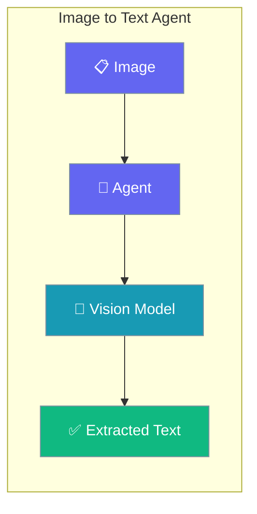
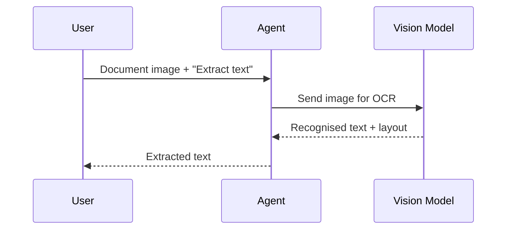

Extract text from scanned documents, screenshots, and photos with a single Agent backed by a vision model.

```python
from praisonaiagents import Agent, Task, AgentTeam

agent = Agent(
    name="OCRAgent",
    instructions="Extract all text from images preserving layout.",
    llm="gpt-4o-mini",
)

task = Task(
    description="Extract all text from this document",
    expected_output="Extracted text",
    agent=agent,
    images=["document.jpg"],
)

AgentTeam(agents=[agent], tasks=[task]).start()
```



OCR and text extraction agent using vision models.

## Quick Start

<Steps>
<Step title="Simple Usage">

Pass a document image and receive its text.

```python
from praisonaiagents import Agent, Task, AgentTeam

agent = Agent(
    name="OCRAgent",
    instructions="Extract all text from images preserving layout.",
    llm="gpt-4o-mini",
)

task = Task(
    description="Extract all text from this document",
    expected_output="Extracted text",
    agent=agent,
    images=["document.jpg"],
)

AgentTeam(agents=[agent], tasks=[task]).start()
```

</Step>

<Step title="With Configuration">

Return structured fields with a Pydantic schema.

```python
from praisonaiagents import Agent, Task, AgentTeam
from pydantic import BaseModel

class ExtractedDocument(BaseModel):
    text: str
    sections: list[str]

agent = Agent(
    name="OCRAgent",
    instructions="Extract text and return structured results.",
    llm="gpt-4o-mini",
)

task = Task(
    description="Extract text from this document",
    expected_output="Structured extraction",
    agent=agent,
    images=["document.jpg"],
    output_pydantic=ExtractedDocument,
)

AgentTeam(agents=[agent], tasks=[task]).start()
```

</Step>
</Steps>

## How It Works



---

## Simple

**Agents: 1** — Single agent with vision capabilities extracts text from images.

### Workflow

1. Receive image with text
2. Process with vision model
3. Extract and return text content

### Setup

```bash
pip install praisonaiagents praisonai
export OPENAI_API_KEY="your-key"
```

### Run — Python

```python
from praisonaiagents import Agent, Task, AgentTeam

agent = Agent(
    name="OCRAgent",
    instructions="Extract all text from images preserving layout.",
    llm="gpt-4o-mini"
)

task = Task(
    description="Extract all text from this document",
    expected_output="Extracted text",
    agent=agent,
    images=["document.jpg"]
)

agents = AgentTeam(agents=[agent], tasks=[task])
result = agents.start()
print(result)
```

### Run — CLI

```bash
praisonai "Extract text from this document" --image document.jpg
```

### Run — agents.yaml

```yaml
framework: praisonai
topic: Text Extraction
roles:
  ocr_agent:
    role: OCR Specialist
    goal: Extract text from images
    backstory: You are an expert in text extraction
    llm: gpt-4o-mini
    tasks:
      extract:
        description: Extract all text from this document
        expected_output: Extracted text
        images:
          - document.jpg
```

```bash
praisonai agents.yaml
```

### Serve API

```python
from praisonaiagents import Agent

agent = Agent(
    name="OCRAgent",
    instructions="You are an OCR expert.",
    llm="gpt-4o-mini"
)

agent.launch(port=8080)
```

```bash
curl -X POST http://localhost:8080/chat \
  -H "Content-Type: application/json" \
  -d '{"message": "Extract text from: https://example.com/doc.jpg"}'
```

---

## Advanced Workflow (All Features)

**Agents: 1** — Single agent with memory, persistence, structured output, and session resumability.

### Workflow

1. Initialize session for document tracking
2. Configure SQLite persistence for extraction history
3. Extract text with structured output
4. Store results in memory for search
5. Resume session for document comparison

### Setup

```bash
pip install praisonaiagents praisonai pydantic
export OPENAI_API_KEY="your-key"
```

### Run — Python

```python
from praisonaiagents import Agent, Task, AgentTeam, Session
from pydantic import BaseModel

class ExtractedDocument(BaseModel):
    filename: str
    text: str
    sections: list[str]
    word_count: int

session = Session(session_id="ocr-001", user_id="user-1")

agent = Agent(
    name="OCRAgent",
    instructions="Extract text and return structured results.",
    llm="gpt-4o-mini",
    memory=True
)

task = Task(
    description="Extract all text from this document",
    expected_output="Structured extraction",
    agent=agent,
    images=["document.jpg"],
    output_pydantic=ExtractedDocument
)

agents = AgentTeam(
    agents=[agent],
    tasks=[task],
    memory=True
)

result = agents.start()
print(result)
```

### Run — CLI

```bash
praisonai "Extract text" --image document.jpg --memory --verbose
```

### Run — agents.yaml

```yaml
framework: praisonai
topic: Text Extraction
memory: true
memory_config:
  provider: sqlite
  db_path: ocr.db
roles:
  ocr_agent:
    role: OCR Specialist
    goal: Extract text with structured output
    backstory: You are an expert in text extraction
    llm: gpt-4o-mini
    memory: true
    tasks:
      extract:
        description: Extract all text from this document
        expected_output: Structured extraction
        images:
          - document.jpg
        output_json:
          filename: string
          text: string
          sections: array
          word_count: number
```

```bash
praisonai agents.yaml --verbose
```

### Serve API

```python
from praisonaiagents import Agent

agent = Agent(
    name="OCRAgent",
    instructions="Extract text and return structured results.",
    llm="gpt-4o-mini",
    memory=True
)

agent.launch(port=8080)
```

```bash
curl -X POST http://localhost:8080/chat \
  -H "Content-Type: application/json" \
  -d '{"message": "Extract text", "session_id": "ocr-001"}'
```

---

## Monitor / Verify

```bash
praisonai "test ocr" --image test.jpg --verbose
```

## Cleanup

```bash
rm -f ocr.db
```

## Features Demonstrated

| Feature | Implementation |
|---------|----------------|
| Workflow | Vision-based text extraction |
| DB Persistence | SQLite via `memory_config` |
| Observability | `--verbose` flag |
| Resumability | `Session` with `session_id` |
| Structured Output | Pydantic `ExtractedDocument` model |

## Best Practices

<AccordionGroup>
<Accordion title="Use high-resolution source images">
OCR accuracy tracks image quality. Feed the clearest scan you have — blurry or low-DPI images produce garbled text no prompt can recover.
</Accordion>

<Accordion title="Ask the model to preserve layout">
Instruct the agent to keep line breaks and column order. Tables and forms lose meaning when flattened into a single paragraph.
</Accordion>

<Accordion title="Return structured fields for downstream parsing">
When feeding results into a form processor, add `output_pydantic` so sections and fields arrive typed instead of as one text blob.
</Accordion>

<Accordion title="Reach for Vision when you need understanding, not just text">
This agent focuses on extraction. For questions about what an image depicts, use the Vision Agent's `analyze` and `describe` methods.
</Accordion>
</AccordionGroup>

## Related

<CardGroup cols={2}>
  <Card icon="image" href="/docs/agents/image">
    Analyze and describe visual content.
  </Card>
  <Card icon="eye" href="/docs/agents/vision">
    Understand, compare, and reason about images.
  </Card>
</CardGroup>
