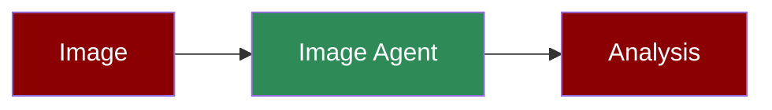

Image analysis agent using vision models for object detection and description.

**Agents: 1** — Single agent with vision capabilities analyzes images.

## Workflow

1. Receive image (URL or local file)
2. Process with vision model
3. Detect objects and features
4. Generate detailed description

## Setup

```bash
pip install praisonaiagents praisonai
export OPENAI_API_KEY="your-key"
```

## Run — Python

```python
from praisonaiagents import Agent, Task, PraisonAIAgents

agent = Agent(
    name="ImageAnalyst",
    instructions="You are an image analysis expert. Describe images in detail.",
    llm="gpt-4o-mini"
)

task = Task(
    description="Describe this image in detail",
    expected_output="Detailed image description",
    agent=agent,
    images=["https://example.com/image.jpg"]
)

agents = PraisonAIAgents(agents=[agent], tasks=[task])
result = agents.start()
print(result)
```

## Run — CLI

```bash
# Analyze an image
praisonai "Describe this image" --image path/to/image.jpg

# With URL
praisonai "What's in this image?" --image "https://example.com/photo.jpg"
```

## Run — agents.yaml

```yaml
framework: praisonai
topic: Image Analysis
roles:
  image_analyst:
    role: Image Analysis Specialist
    goal: Analyze images and describe content
    backstory: You are an expert in computer vision
    llm: gpt-4o-mini
    tasks:
      analyze:
        description: Describe this image in detail
        expected_output: Detailed description of objects and scene
        images:
          - https://example.com/image.jpg
```

```bash
praisonai agents.yaml
```

## Serve API

```python
from praisonaiagents import Agent

agent = Agent(
    name="ImageAnalyst",
    instructions="You are an image analysis expert.",
    llm="gpt-4o-mini"
)

agent.launch(port=8080)
```

```bash
# Test with image URL in message
curl -X POST http://localhost:8080/chat \
  -H "Content-Type: application/json" \
  -d '{"message": "Describe this: https://example.com/image.jpg"}'
```

## Features

| Feature | Supported |
|---------|-----------|
| Workflow | ✅ Single step |
| DB Persistence | ❌ |
| Vector Retrieval | ❌ |
| Observability | ✅ `--verbose` |
| Tools | ❌ (vision built-in) |
| Resumability | ❌ |
| Structured Output | ✅ via `output_json` |

## Next Steps

- [Video Agent](/agents/video) for video analysis
- [Image to Text](/agents/image-to-text) for OCR
- [Multimodal](/features/multimodal) for advanced vision
