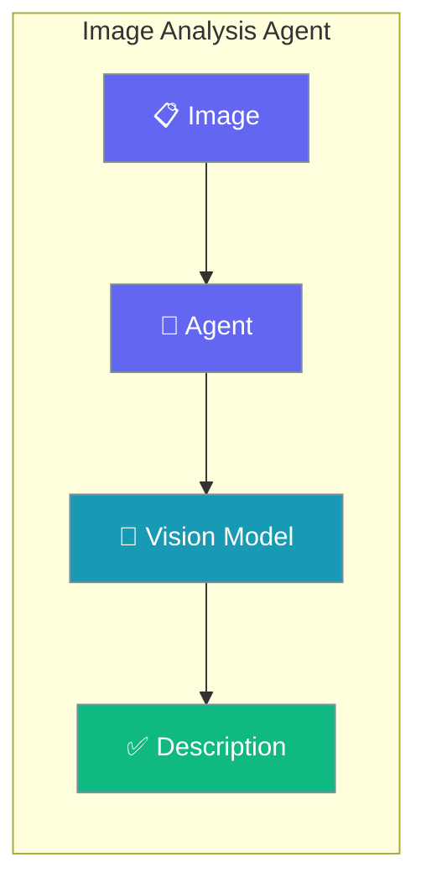
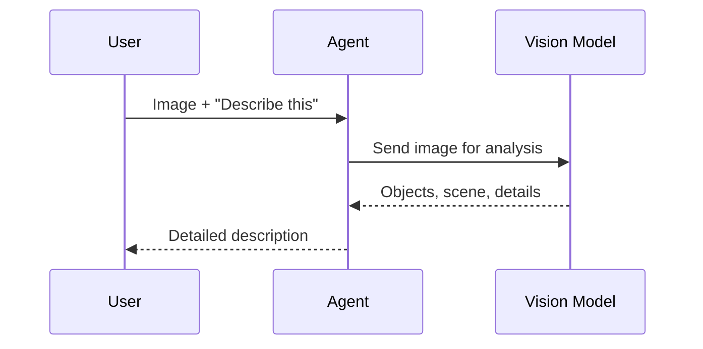

Describe images, detect objects, and read scenes with a single Agent backed by a vision model.

```python
from praisonaiagents import Agent, Task, AgentTeam

agent = Agent(
    name="ImageAnalyst",
    instructions="Describe images in detail.",
    llm="gpt-4o-mini",
)

task = Task(
    description="Describe this image",
    expected_output="Detailed description",
    agent=agent,
    images=["image.jpg"],
)

AgentTeam(agents=[agent], tasks=[task]).start()
```


```mermaid
graph LR
    subgraph "Image Analysis Agent"
        User[📋 Image] --> Agent[🤖 Agent]
        Agent --> Vision[🧠 Vision Model]
        Vision --> Result[✅ Description]
    end

    classDef input fill:#6366F1,stroke:#7C90A0,color:#fff
    classDef process fill:#189AB4,stroke:#7C90A0,color:#fff
    classDef output fill:#10B981,stroke:#7C90A0,color:#fff

    class User,Agent input
    class Vision process
    class Result output
```

Image analysis agent using vision models for object detection and description.

## Quick Start

<Steps>
<Step title="Simple Usage">

Pass an image to a task and let the vision model describe it.

```python
from praisonaiagents import Agent, Task, AgentTeam

agent = Agent(
    name="ImageAnalyst",
    instructions="Describe images in detail.",
    llm="gpt-4o-mini",
)

task = Task(
    description="Describe this image",
    expected_output="Detailed description",
    agent=agent,
    images=["image.jpg"],
)

AgentTeam(agents=[agent], tasks=[task]).start()
```

</Step>

<Step title="With Configuration">

Return structured fields with a Pydantic schema.

```python
from praisonaiagents import Agent, Task, AgentTeam
from pydantic import BaseModel

class ImageAnalysis(BaseModel):
    objects: list[str]
    scene: str
    description: str

agent = Agent(
    name="ImageAnalyst",
    instructions="Analyze images and return structured results.",
    llm="gpt-4o-mini",
)

task = Task(
    description="Analyze this image",
    expected_output="Structured analysis",
    agent=agent,
    images=["image.jpg"],
    output_pydantic=ImageAnalysis,
)

AgentTeam(agents=[agent], tasks=[task]).start()
```

</Step>
</Steps>

## How It Works


```mermaid
sequenceDiagram
    participant User
    participant Agent
    participant Vision as Vision Model

    User->>Agent: Image + "Describe this"
    Agent->>Vision: Send image for analysis
    Vision-->>Agent: Objects, scene, details
    Agent-->>User: Detailed description
```

---

## Simple

**Agents: 1** — Single agent with vision capabilities analyzes images.

### Workflow

1. Receive image (URL or local file)
2. Process with vision model
3. Generate detailed description

### Setup

```bash
pip install praisonaiagents praisonai
export OPENAI_API_KEY="your-key"
```

### Run — Python

```python
from praisonaiagents import Agent, Task, AgentTeam

agent = Agent(
    name="ImageAnalyst",
    instructions="Describe images in detail.",
    llm="gpt-4o-mini"
)

task = Task(
    description="Describe this image",
    expected_output="Detailed description",
    agent=agent,
    images=["image.jpg"]
)

agents = AgentTeam(agents=[agent], tasks=[task])
result = agents.start()
print(result)
```

### Run — CLI

```bash
praisonai "Describe this image" --image path/to/image.jpg
```

### Run — agents.yaml

```yaml
framework: praisonai
topic: Image Analysis
roles:
  image_analyst:
    role: Image Analysis Specialist
    goal: Analyze images and describe content
    backstory: You are an expert in computer vision
    llm: gpt-4o-mini
    tasks:
      analyze:
        description: Describe this image in detail
        expected_output: Detailed description
        images:
          - image.jpg
```

```bash
praisonai agents.yaml
```

### Serve API

```python
from praisonaiagents import Agent

agent = Agent(
    name="ImageAnalyst",
    instructions="You are an image analysis expert.",
    llm="gpt-4o-mini"
)

agent.launch(port=8080)
```

```bash
curl -X POST http://localhost:8080/chat \
  -H "Content-Type: application/json" \
  -d '{"message": "Describe this: https://example.com/image.jpg"}'
```

---

## Advanced Workflow (All Features)

**Agents: 1** — Single agent with memory, persistence, structured output, and session resumability.

### Workflow

1. Initialize session for image analysis tracking
2. Configure SQLite persistence for analysis history
3. Analyze image with structured output
4. Store results in memory for comparison
5. Resume session for follow-up analysis

### Setup

```bash
pip install praisonaiagents praisonai pydantic
export OPENAI_API_KEY="your-key"
```

### Run — Python

```python
from praisonaiagents import Agent, Task, AgentTeam, Session
from pydantic import BaseModel

class ImageAnalysis(BaseModel):
    objects: list[str]
    scene: str
    colors: list[str]
    description: str

session = Session(session_id="image-001", user_id="user-1")

agent = Agent(
    name="ImageAnalyst",
    instructions="Analyze images and return structured results.",
    llm="gpt-4o-mini",
    memory=True
)

task = Task(
    description="Analyze this image in detail",
    expected_output="Structured image analysis",
    agent=agent,
    images=["image.jpg"],
    output_pydantic=ImageAnalysis
)

agents = AgentTeam(
    agents=[agent],
    tasks=[task],
    memory=True
)

result = agents.start()
print(result)
```

### Run — CLI

```bash
praisonai "Analyze this image" --image image.jpg --memory --verbose
```

### Run — agents.yaml

```yaml
framework: praisonai
topic: Image Analysis
memory: true
memory_config:
  provider: sqlite
  db_path: images.db
roles:
  image_analyst:
    role: Image Analysis Specialist
    goal: Analyze images with structured output
    backstory: You are an expert in computer vision
    llm: gpt-4o-mini
    memory: true
    tasks:
      analyze:
        description: Analyze this image in detail
        expected_output: Structured image analysis
        images:
          - image.jpg
        output_json:
          objects: array
          scene: string
          colors: array
          description: string
```

```bash
praisonai agents.yaml --verbose
```

### Serve API

```python
from praisonaiagents import Agent

agent = Agent(
    name="ImageAnalyst",
    instructions="Analyze images and return structured results.",
    llm="gpt-4o-mini",
    memory=True
)

agent.launch(port=8080)
```

```bash
curl -X POST http://localhost:8080/chat \
  -H "Content-Type: application/json" \
  -d '{"message": "Analyze image", "session_id": "image-001"}'
```

---

## Monitor / Verify

```bash
praisonai "test image" --image test.jpg --verbose
```

## Cleanup

```bash
rm -f images.db
```

## Features Demonstrated

| Feature | Implementation |
|---------|----------------|
| Workflow | Vision-based image analysis |
| DB Persistence | SQLite via `memory_config` |
| Observability | `--verbose` flag |
| Resumability | `Session` with `session_id` |
| Structured Output | Pydantic `ImageAnalysis` model |

## Best Practices

<AccordionGroup>
<Accordion title="Pass images through the Task, not the prompt">
Vision models read images from the `images=[...]` field on a `Task`. Embedding file paths in the instruction text does nothing — the model never sees the pixels.
</Accordion>

<Accordion title="Use a vision-capable model">
Set `llm="gpt-4o-mini"` or another multimodal model. Text-only models silently ignore the image and describe nothing.
</Accordion>

<Accordion title="Request structured output for pipelines">
When results feed a database or UI, add `output_pydantic` so objects, scene, and colours arrive as typed fields instead of free text.
</Accordion>

<Accordion title="Reach for a specialised agent when you need OCR or generation">
For text extraction use the Image to Text Agent; to create new images from prompts use the Image generation flow rather than this analysis agent.
</Accordion>
</AccordionGroup>

## Related

<CardGroup cols={2}>
  <Card icon="text" href="/docs/agents/image-to-text">
    Extract text from images with an OCR-focused agent.
  </Card>
  <Card icon="video" href="/docs/agents/video">
    Analyze video content frame by frame.
  </Card>
</CardGroup>
