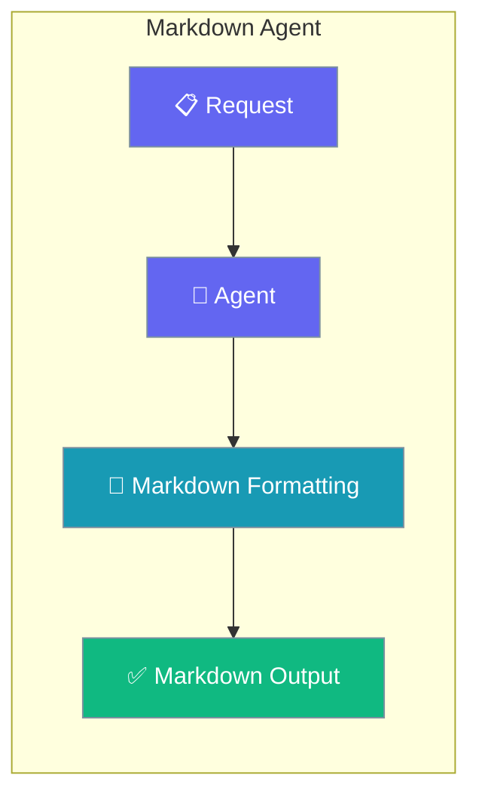
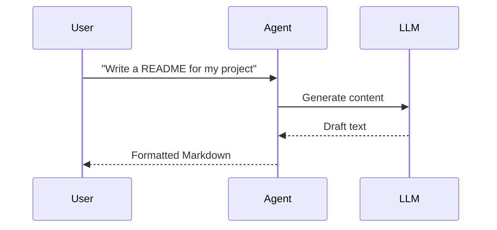

Generate READMEs, changelogs, and docs as clean, properly formatted Markdown with a single Agent.

```python
from praisonaiagents import Agent

agent = Agent(
    name="MarkdownWriter",
    instructions="You are a Markdown agent. Output in proper Markdown format.",
)

agent.start("Write a README for a Python web scraping project")
```



Content generation agent that outputs properly formatted Markdown.

## Quick Start

<Steps>
<Step title="Simple Usage">

Ask for content and get Markdown back.

```python
from praisonaiagents import Agent

agent = Agent(
    name="MarkdownWriter",
    instructions="You are a Markdown agent. Output in proper Markdown format.",
)

agent.start("Write a README for a Python web scraping project")
```

</Step>

<Step title="With Configuration">

Enable memory so the agent revises documents across turns.

```python
from praisonaiagents import Agent

agent = Agent(
    name="MarkdownWriter",
    instructions="Generate and iteratively refine Markdown documents.",
    memory=True,
)

agent.start("Draft a README, then add an Installation section.")
```

</Step>
</Steps>

## How It Works



---

## Simple

**Agents: 1** — Single agent for content generation with Markdown formatting.

### Workflow

1. Receive content request
2. Generate content with LLM
3. Format output as Markdown

### Setup

```bash
pip install praisonaiagents praisonai
export OPENAI_API_KEY="your-key"
```

### Run — Python

```python
from praisonaiagents import Agent

agent = Agent(
    name="MarkdownWriter",
    instructions="You are a Markdown agent. Output in proper Markdown format."
)

result = agent.start("Write a README for a Python web scraping project")
print(result)
```

### Run — CLI

```bash
praisonai "Write a README for a Python project"
```

### Run — agents.yaml

```yaml
framework: praisonai
topic: Documentation Generation
roles:
  markdown_writer:
    role: Markdown Content Specialist
    goal: Generate well-formatted Markdown content
    backstory: You are an expert technical writer
    tasks:
      write_docs:
        description: Write a README for a Python web scraping project
        expected_output: A complete README.md
```

```bash
praisonai agents.yaml
```

### Serve API

```python
from praisonaiagents import Agent

agent = Agent(
    name="MarkdownWriter",
    instructions="You are a Markdown agent."
)

agent.launch(port=8080)
```

```bash
curl -X POST http://localhost:8080/chat \
  -H "Content-Type: application/json" \
  -d '{"message": "Write a changelog for version 2.0"}'
```

---

## Advanced Workflow (All Features)

**Agents: 1** — Single agent with memory, persistence, structured output, and session resumability.

### Workflow

1. Initialize session for document tracking
2. Configure SQLite persistence for content history
3. Generate content with structured output
4. Store in memory for iterative editing
5. Resume session for document updates

### Setup

```bash
pip install praisonaiagents praisonai pydantic
export OPENAI_API_KEY="your-key"
```

### Run — Python

```python
from praisonaiagents import Agent, Task, AgentTeam, Session
from pydantic import BaseModel

# Structured output schema
class Document(BaseModel):
    title: str
    sections: list[str]
    content: str

# Create session for document tracking
session = Session(session_id="docs-001", user_id="user-1")

# Agent with memory
agent = Agent(
    name="MarkdownWriter",
    instructions="Generate structured Markdown documents.",
    memory=True
)

# Task with structured output
task = Task(
    description="Write a README for a Python web scraping project",
    expected_output="Structured document",
    agent=agent,
    output_pydantic=Document
)

# Run with SQLite persistence
agents = AgentTeam(
    agents=[agent],
    tasks=[task],
    memory=True
)

result = agents.start()
print(result)

# Resume later
session2 = Session(session_id="docs-001", user_id="user-1")
history = session2.search_memory("README")
```

### Run — CLI

```bash
praisonai "Write a README" --memory --verbose
```

### Run — agents.yaml

```yaml
framework: praisonai
topic: Documentation Generation
memory: true
memory_config:
  provider: sqlite
  db_path: docs.db
roles:
  markdown_writer:
    role: Markdown Content Specialist
    goal: Generate structured Markdown content
    backstory: You are an expert technical writer
    memory: true
    tasks:
      write_docs:
        description: Write a README for a Python web scraping project
        expected_output: Structured document
        output_json:
          title: string
          sections: array
          content: string
```

```bash
praisonai agents.yaml --verbose
```

### Serve API

```python
from praisonaiagents import Agent

agent = Agent(
    name="MarkdownWriter",
    instructions="Generate structured Markdown documents.",
    memory=True
)

agent.launch(port=8080)
```

```bash
curl -X POST http://localhost:8080/chat \
  -H "Content-Type: application/json" \
  -d '{"message": "Write a changelog", "session_id": "docs-001"}'
```

---

## Monitor / Verify

```bash
praisonai "test markdown" --verbose
```

## Cleanup

```bash
rm -f docs.db
```

## Features Demonstrated

| Feature | Implementation |
|---------|----------------|
| Workflow | Single-step content generation |
| DB Persistence | SQLite via `memory_config` |
| Observability | `--verbose` flag |
| Resumability | `Session` with `session_id` |
| Structured Output | Pydantic `Document` model |

## Best Practices

<AccordionGroup>
<Accordion title="State the target format in the instructions">
Tell the agent whether you want GitHub-flavoured Markdown, a changelog, or a README. A precise instruction produces consistent heading levels and code fences.
</Accordion>

<Accordion title="Use structured output for multi-section docs">
When a document has fixed sections, define a Pydantic schema so title, sections, and body arrive as separate fields you can render however you like.
</Accordion>

<Accordion title="Enable memory for iterative editing">
Set `memory=True` so the agent amends an existing draft on follow-up turns instead of regenerating the whole document.
</Accordion>

<Accordion title="Save output to a file when generating docs at scale">
Attach a file-writing tool or set `output_file` on a Task so generated Markdown lands on disk without manual copy-paste.
</Accordion>
</AccordionGroup>

## Related

<CardGroup cols={2}>
  <Card icon="circle-1" href="/docs/agents/single">
    A minimal single-purpose agent for basic content generation.
  </Card>
  <Card icon="link" href="/features/promptchaining">
    Chain prompts to build multi-step documents.
  </Card>
</CardGroup>
