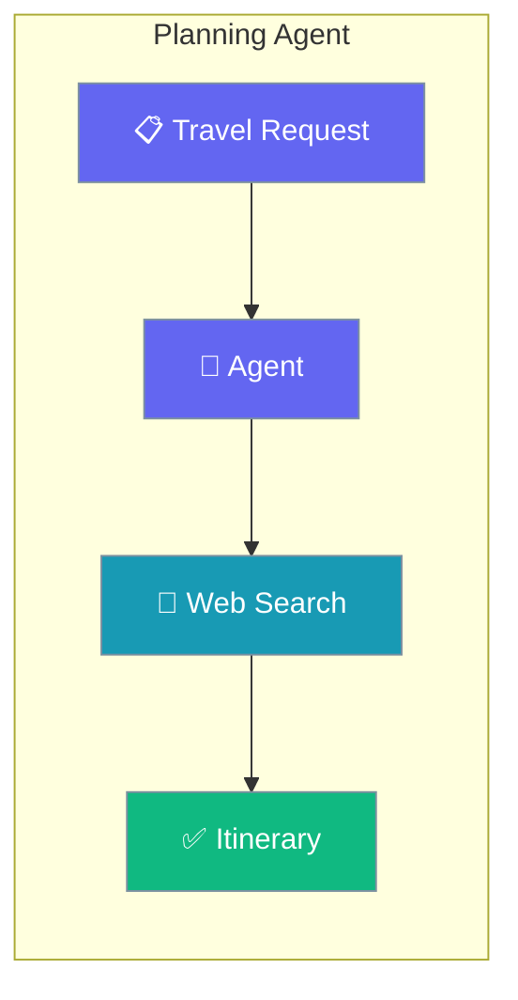
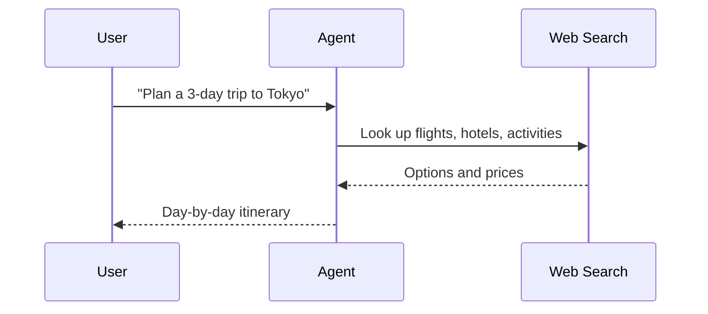

Build detailed travel itineraries — flights, hotels, and day-by-day plans — with a single Agent that searches the web.

```python
from praisonaiagents import Agent
from praisonaiagents import duckduckgo

agent = Agent(
    name="TravelPlanner",
    instructions="You are a travel planning agent. Create detailed itineraries.",
    tools=[duckduckgo],
)

agent.start("Plan a 3-day trip to Tokyo")
```



Travel planning agent with web search for finding flights, hotels, and creating itineraries.

## Quick Start

<Steps>
<Step title="Simple Usage">

Attach a search tool and ask for a plan.

```python
from praisonaiagents import Agent
from praisonaiagents import duckduckgo

agent = Agent(
    name="TravelPlanner",
    instructions="You are a travel planning agent. Create detailed itineraries.",
    tools=[duckduckgo],
)

agent.start("Plan a 3-day trip to Tokyo")
```

</Step>

<Step title="With Configuration">

Enable memory so the agent adjusts an existing itinerary.

```python
from praisonaiagents import Agent
from praisonaiagents import duckduckgo

agent = Agent(
    name="TravelPlanner",
    instructions="Create and refine travel itineraries with a budget.",
    tools=[duckduckgo],
    memory=True,
)

agent.start("Plan a 3-day Tokyo trip, then swap day 2 for a budget option.")
```

</Step>
</Steps>

## How It Works



---

## Simple

**Agents: 1** — Single agent with search tool handles research and planning.

### Workflow

1. Receive travel request
2. Search for flights and hotels
3. Generate detailed itinerary

### Setup

```bash
pip install praisonaiagents praisonai duckduckgo-search
export OPENAI_API_KEY="your-key"
```

### Run — Python

```python
from praisonaiagents import Agent
from praisonaiagents import duckduckgo

agent = Agent(
    name="TravelPlanner",
    instructions="You are a travel planning agent. Create detailed itineraries.",
    tools=[duckduckgo]
)

result = agent.start("Plan a 3-day trip to Tokyo")
print(result)
```

### Run — CLI

```bash
praisonai "Plan a weekend trip to Paris" --web-search
```

### Run — agents.yaml

```yaml
framework: praisonai
topic: Travel Planning
roles:
  travel_planner:
    role: Travel Planning Specialist
    goal: Create comprehensive travel plans
    backstory: You are an expert travel planner
    tools:
      - duckduckgo
    tasks:
      plan_trip:
        description: Plan a 3-day trip to Tokyo
        expected_output: A detailed itinerary
```

```bash
praisonai agents.yaml
```

### Serve API

```python
from praisonaiagents import Agent
from praisonaiagents import duckduckgo

agent = Agent(
    name="TravelPlanner",
    instructions="You are a travel planning agent.",
    tools=[duckduckgo]
)

agent.launch(port=8080)
```

```bash
curl -X POST http://localhost:8080/chat \
  -H "Content-Type: application/json" \
  -d '{"message": "Plan a weekend getaway to Barcelona"}'
```

---

## Advanced Workflow (All Features)

**Agents: 1** — Single agent with memory, persistence, structured output, and session resumability.

### Workflow

1. Initialize session for trip tracking
2. Configure SQLite persistence for travel history
3. Search and plan with structured output
4. Store itinerary in memory for modifications
5. Resume session for trip updates

### Setup

```bash
pip install praisonaiagents praisonai duckduckgo-search pydantic
export OPENAI_API_KEY="your-key"
```

### Run — Python

```python
from praisonaiagents import Agent, Task, AgentTeam, Session
from praisonaiagents import duckduckgo
from pydantic import BaseModel

# Structured output schema
class Itinerary(BaseModel):
    destination: str
    duration: str
    daily_plans: list[str]
    estimated_cost: str
    recommendations: list[str]

# Create session for trip tracking
session = Session(session_id="trip-001", user_id="user-1")

# Agent with memory and tools
agent = Agent(
    name="TravelPlanner",
    instructions="Create structured travel itineraries.",
    tools=[duckduckgo],
    memory=True
)

# Task with structured output
task = Task(
    description="Plan a 3-day trip to Tokyo with budget",
    expected_output="Structured itinerary",
    agent=agent,
    output_pydantic=Itinerary
)

# Run with SQLite persistence
agents = AgentTeam(
    agents=[agent],
    tasks=[task],
    memory=True
)

result = agents.start()
print(result)

# Resume later
session2 = Session(session_id="trip-001", user_id="user-1")
history = session2.search_memory("Tokyo")
```

### Run — CLI

```bash
praisonai "Plan a trip to Tokyo" --web-search --memory --verbose
```

### Run — agents.yaml

```yaml
framework: praisonai
topic: Travel Planning
memory: true
memory_config:
  provider: sqlite
  db_path: travel.db
roles:
  travel_planner:
    role: Travel Planning Specialist
    goal: Create structured travel plans
    backstory: You are an expert travel planner
    tools:
      - duckduckgo
    memory: true
    tasks:
      plan_trip:
        description: Plan a 3-day trip to Tokyo with budget
        expected_output: Structured itinerary
        output_json:
          destination: string
          duration: string
          daily_plans: array
          estimated_cost: string
          recommendations: array
```

```bash
praisonai agents.yaml --verbose
```

### Serve API

```python
from praisonaiagents import Agent
from praisonaiagents import duckduckgo

agent = Agent(
    name="TravelPlanner",
    instructions="Create structured travel itineraries.",
    tools=[duckduckgo],
    memory=True
)

agent.launch(port=8080)
```

```bash
curl -X POST http://localhost:8080/chat \
  -H "Content-Type: application/json" \
  -d '{"message": "Plan a trip to Paris", "session_id": "trip-001"}'
```

---

## Monitor / Verify

```bash
praisonai "test planning" --web-search --verbose
```

## Cleanup

```bash
rm -f travel.db
```

## Features Demonstrated

| Feature | Implementation |
|---------|----------------|
| Workflow | Multi-step travel planning |
| DB Persistence | SQLite via `memory_config` |
| Observability | `--verbose` flag |
| Tools | DuckDuckGo search |
| Resumability | `Session` with `session_id` |
| Structured Output | Pydantic `Itinerary` model |

## Best Practices

<AccordionGroup>
<Accordion title="State constraints up front">
Include dates, budget, and party size in the prompt. The agent searches more effectively when it knows the boundaries instead of guessing.
</Accordion>

<Accordion title="Use structured output for itineraries">
Define a Pydantic schema with `destination`, `daily_plans`, and `estimated_cost` so the plan renders cleanly in a UI or calendar.
</Accordion>

<Accordion title="Enable memory for trip revisions">
Set `memory=True` so the agent tweaks an existing itinerary — swapping a hotel or a day — without rebuilding it from scratch.
</Accordion>

<Accordion title="Combine with Research for deep destination info">
Hand off to the Research Agent when a trip needs visa rules or in-depth local guides beyond quick search snippets.
</Accordion>
</AccordionGroup>

## Related

<CardGroup cols={2}>
  <Card icon="magnifying-glass-chart" href="/docs/agents/research">
    Research destinations in depth before planning.
  </Card>
  <Card icon="shop" href="/docs/agents/shopping">
    Compare prices for flights, hotels, and gear.
  </Card>
</CardGroup>
