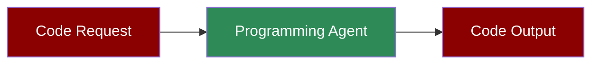

Code development agent with execution, analysis, and shell tools.

**Agents: 1** — Single agent with code tools handles writing, executing, and debugging.

## Workflow

1. Receive code request
2. Generate code
3. Execute and test
4. Analyze and fix errors
5. Return working solution

## Setup

```bash
pip install praisonaiagents praisonai
export OPENAI_API_KEY="your-key"
```

## Run — Python

```python
from praisonaiagents import Agent
from praisonaiagents.tools import execute_code, analyze_code

agent = Agent(
    name="Programmer",
    instructions="You are a programming agent. Write, execute, and debug code.",
    tools=[execute_code, analyze_code],
    self_reflect=True
)

result = agent.start("Write a Python script to calculate fibonacci numbers up to 100")
print(result)
```

## Run — CLI

```bash
# Code generation
praisonai "Write a Python function to sort a list"

# With code execution
praisonai "Write and run a script to fetch weather data" --tools python
```

## Run — agents.yaml

```yaml
framework: praisonai
topic: Code Development
roles:
  programmer:
    role: Software Developer
    goal: Write and execute code
    backstory: You are an expert programmer
    tools:
      - execute_code
      - analyze_code
    tasks:
      write_code:
        description: Write a Python script to calculate fibonacci numbers up to 100
        expected_output: Working Python code with output
```

```bash
praisonai agents.yaml
```

## Serve API

```python
from praisonaiagents import Agent
from praisonaiagents.tools import execute_code, analyze_code

agent = Agent(
    name="Programmer",
    instructions="You are a programming agent.",
    tools=[execute_code, analyze_code]
)

agent.launch(port=8080)
```

```bash
# Test the API
curl -X POST http://localhost:8080/chat \
  -H "Content-Type: application/json" \
  -d '{"message": "Write a function to reverse a string"}'
```

## Features

| Feature | Supported |
|---------|-----------|
| Workflow | ✅ Single step |
| DB Persistence | ❌ |
| Vector Retrieval | ❌ |
| Observability | ✅ `--verbose` |
| Tools | ✅ code tools |
| Resumability | ❌ |
| Structured Output | ✅ via `output_json` |

## Next Steps

- [Code Agent](/features/codeagent) for advanced code features
- [Data Analyst](/agents/data-analyst) for data analysis
- [Self Reflection](/features/selfreflection) for improved accuracy
