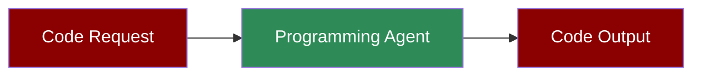

Code development agent with execution, analysis, and shell tools.

---

## Simple

**Agents: 1** — Single agent with code tools handles writing and executing code.

### Workflow

1. Receive code request
2. Generate code
3. Execute and test
4. Return working solution

### Setup

```bash
pip install praisonaiagents praisonai
export OPENAI_API_KEY="your-key"
```

### Run — Python

```python
from praisonaiagents import Agent
from praisonaiagents.tools import execute_code, analyze_code

agent = Agent(
    name="Programmer",
    instructions="You are a programming agent. Write and execute code.",
    tools=[execute_code, analyze_code]
)

result = agent.start("Write a Python script to calculate fibonacci numbers")
print(result)
```

### Run — CLI

```bash
praisonai "Write a Python function to sort a list"
```

### Run — agents.yaml

```yaml
framework: praisonai
topic: Code Development
roles:
  programmer:
    role: Software Developer
    goal: Write and execute code
    backstory: You are an expert programmer
    tools:
      - execute_code
      - analyze_code
    tasks:
      write_code:
        description: Write a Python script to calculate fibonacci numbers
        expected_output: Working Python code
```

```bash
praisonai agents.yaml
```

### Serve API

```python
from praisonaiagents import Agent
from praisonaiagents.tools import execute_code, analyze_code

agent = Agent(
    name="Programmer",
    instructions="You are a programming agent.",
    tools=[execute_code, analyze_code]
)

agent.launch(port=8080)
```

```bash
curl -X POST http://localhost:8080/chat \
  -H "Content-Type: application/json" \
  -d '{"message": "Write a function to reverse a string"}'
```

---

## Advanced Workflow (All Features)

**Agents: 1** — Single agent with memory, persistence, structured output, and session resumability.

### Workflow

1. Initialize session for code project tracking
2. Configure SQLite persistence for code history
3. Generate and execute code with structured output
4. Store code in memory for iterative development
5. Resume session for code modifications

### Setup

```bash
pip install praisonaiagents praisonai pydantic
export OPENAI_API_KEY="your-key"
```

### Run — Python

```python
from praisonaiagents import Agent, Task, PraisonAIAgents, Session
from praisonaiagents.tools import execute_code, analyze_code
from pydantic import BaseModel

# Structured output schema
class CodeResult(BaseModel):
    language: str
    code: str
    output: str
    explanation: str

# Create session for project tracking
session = Session(session_id="code-001", user_id="user-1")

# Agent with memory and tools
agent = Agent(
    name="Programmer",
    instructions="Write, execute, and return structured code results.",
    tools=[execute_code, analyze_code],
    memory=True,
    self_reflect=True
)

# Task with structured output
task = Task(
    description="Write a Python script to calculate fibonacci numbers",
    expected_output="Structured code result",
    agent=agent,
    output_pydantic=CodeResult
)

# Run with SQLite persistence
agents = PraisonAIAgents(
    agents=[agent],
    tasks=[task],
    memory=True,
    memory_config={"provider": "sqlite", "db_path": "code.db"},
    verbose=1
)

result = agents.start()
print(result)

# Resume later
session2 = Session(session_id="code-001", user_id="user-1")
history = session2.search_memory("fibonacci")
```

### Run — CLI

```bash
praisonai "Write fibonacci code" --memory --verbose
```

### Run — agents.yaml

```yaml
framework: praisonai
topic: Code Development
memory: true
memory_config:
  provider: sqlite
  db_path: code.db
roles:
  programmer:
    role: Software Developer
    goal: Write and execute code with structured output
    backstory: You are an expert programmer
    tools:
      - execute_code
      - analyze_code
    memory: true
    tasks:
      write_code:
        description: Write a Python script to calculate fibonacci numbers
        expected_output: Structured code result
        output_json:
          language: string
          code: string
          output: string
          explanation: string
```

```bash
praisonai agents.yaml --verbose
```

### Serve API

```python
from praisonaiagents import Agent
from praisonaiagents.tools import execute_code, analyze_code

agent = Agent(
    name="Programmer",
    instructions="Write and execute code.",
    tools=[execute_code, analyze_code],
    memory=True
)

agent.launch(port=8080)
```

```bash
curl -X POST http://localhost:8080/chat \
  -H "Content-Type: application/json" \
  -d '{"message": "Write sorting code", "session_id": "code-001"}'
```

---

## Monitor / Verify

```bash
praisonai "test code" --verbose
```

## Cleanup

```bash
rm -f code.db
```

## Features Demonstrated

| Feature | Implementation |
|---------|----------------|
| Workflow | Multi-step code development |
| DB Persistence | SQLite via `memory_config` |
| Observability | `--verbose` flag |
| Tools | execute_code, analyze_code |
| Resumability | `Session` with `session_id` |
| Structured Output | Pydantic `CodeResult` model |

## Next Steps

- [Code Agent](/features/codeagent) for advanced code features
- [Data Analyst](/agents/data-analyst) for data analysis
- [Memory](/features/advanced-memory) for persistent context
