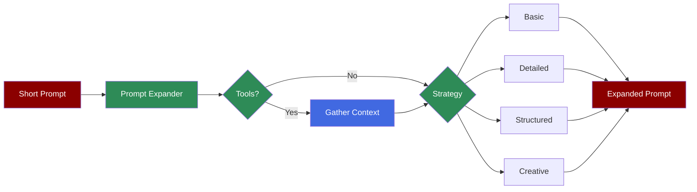

The Prompt Expander Agent transforms short, brief prompts into detailed, comprehensive prompts for better task execution. Unlike the Query Rewriter (which optimizes for search/retrieval), the Prompt Expander focuses on enriching prompts for task execution.

**Agents: 1** — Specialized agent for prompt enhancement.

## Workflow

1. Receive short prompt
2. Optionally gather context via tools
3. Apply expansion strategy
4. Return detailed, actionable prompt

## Setup

```bash
pip install praisonaiagents praisonai
export OPENAI_API_KEY="your-key"
```

## Run — Python

```python
from praisonaiagents import PromptExpanderAgent

agent = PromptExpanderAgent()
result = agent.expand("write a movie script in 3 lines")
print(result.expanded_prompt)
```

## Run — CLI

```bash
# Expand a short prompt
praisonai "write a movie script in 3 lines" --expand-prompt

# With verbose output
praisonai "blog about AI" --expand-prompt -v

# With tools for context gathering
praisonai "latest AI trends" --expand-prompt --expand-tools tools.py
```

## Run — agents.yaml

```yaml
framework: praisonai
topic: Prompt Expansion
roles:
  expander:
    role: Prompt Expander
    goal: Transform short prompts into detailed prompts
    backstory: You are an expert at prompt engineering
    tasks:
      expand:
        description: Expand "write a movie script" into a detailed prompt
        expected_output: Detailed, actionable prompt
```

```bash
praisonai agents.yaml
```

## Serve API

```python
from praisonaiagents import PromptExpanderAgent

agent = PromptExpanderAgent()

# Note: PromptExpanderAgent uses .expand() method
# For API serving, integrate with standard agent
```

## Expansion Strategies

<CardGroup cols={2}>
    <Card title="BASIC" icon="circle">
        Simple expansion with clarity improvements. Fixes ambiguity and adds minimal context.
    </Card>
    <Card title="DETAILED" icon="list">
        Rich expansion with context, constraints, format guidance, and quality expectations.
    </Card>
    <Card title="STRUCTURED" icon="table">
        Expansion with clear sections: Task, Format, Requirements, Style, Constraints.
    </Card>
    <Card title="CREATIVE" icon="palette">
        Expansion with vivid, inspiring language and creative direction.
    </Card>
</CardGroup>

## Basic Usage

```python
from praisonaiagents import PromptExpanderAgent, ExpandStrategy

# Default (AUTO strategy)
agent = PromptExpanderAgent()
result = agent.expand("write a poem")
print(result.expanded_prompt)
```

## Using Specific Strategies

```python
from praisonaiagents import PromptExpanderAgent, ExpandStrategy

agent = PromptExpanderAgent()

# Basic - minimal expansion
result = agent.expand("AI blog", strategy=ExpandStrategy.BASIC)

# Detailed - rich context and requirements
result = agent.expand("AI blog", strategy=ExpandStrategy.DETAILED)

# Structured - clear sections
result = agent.expand("AI blog", strategy=ExpandStrategy.STRUCTURED)

# Creative - vivid language
result = agent.expand("AI blog", strategy=ExpandStrategy.CREATIVE)
```

## Using Tools for Context

```python
from praisonaiagents import PromptExpanderAgent

def search_tool(query: str) -> str:
    """Search for context."""
    # Your search implementation
    return "Latest AI trends: LLMs, multimodal, agents"

agent = PromptExpanderAgent(tools=[search_tool])
result = agent.expand("write about AI trends")
print(result.expanded_prompt)
```

## Configuration Options

```python
agent = PromptExpanderAgent(
    name="PromptExpander",
    model="gpt-4o-mini",
    verbose=True,
    temperature=0.7,      # Higher for creativity
    max_tokens=1000,
    tools=[...]           # Optional tools for context
)
```

## ExpandResult Properties

```python
result = agent.expand("write a poem")

# Access properties
print(result.original_prompt)   # Original input
print(result.expanded_prompt)   # Expanded output
print(result.strategy_used)     # Strategy that was used
print(result.metadata)          # Additional metadata
```

## Convenience Methods

```python
agent = PromptExpanderAgent()

# Direct strategy methods
result = agent.expand_basic("short prompt")
result = agent.expand_detailed("short prompt")
result = agent.expand_structured("short prompt")
result = agent.expand_creative("short prompt")
```

## Key Difference from Query Rewriter

| Feature | Query Rewriter | Prompt Expander |
|---------|---------------|-----------------|
| **Purpose** | Optimize for search/retrieval | Expand for task execution |
| **Use Case** | RAG applications | Task prompts |
| **Output** | Search-optimized queries | Detailed action prompts |
| **CLI Flag** | `--query-rewrite` | `--expand-prompt` |

## Example: Movie Script

**Input:**
```
write a movie script in 3 lines
```

**Expanded (Creative Strategy):**
```
Craft a captivating movie script distilled into just three powerful lines, 
each word infused with vivid imagery and emotional weight. Your lines should 
ignite the spark of adventure and intrigue, capturing a moment that hints at 
a grand journey ahead—one that resonates deeply with the audience's hearts 
and imaginations. Use poignant dialogue, evocative descriptions, and a 
tantalizing glimpse of conflict that will leave viewers breathless.
```

---

## Monitor / Verify

```bash
praisonai "test prompt" --expand-prompt --verbose
```

## Features Demonstrated

| Feature | Implementation |
|---------|----------------|
| Workflow | Single-step prompt expansion |
| Observability | `--verbose` flag |
| Tools | Optional context-gathering tools |
| Structured Output | `ExpandResult` with metadata |

## Next Steps

- [Query Rewriter](/agents/query-rewriter) for search optimization
- [Research Agent](/agents/research) for web research
- [Memory](/features/advanced-memory) for persistent context
