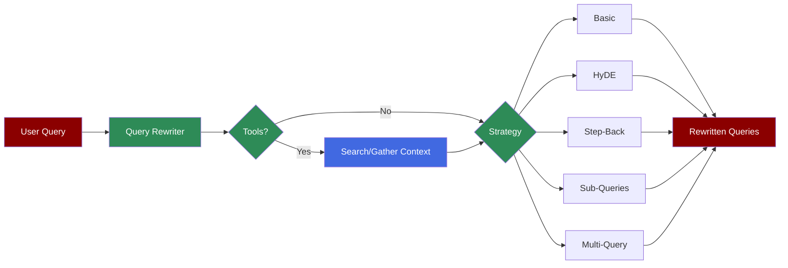

The Query Rewriter Agent transforms user queries to improve retrieval quality in RAG applications by bridging the gap between how users ask questions and how information is stored.

**Agents: 1** — Specialized agent for query optimization.

## Workflow

1. Receive user query
2. Optionally gather context via tools
3. Apply rewriting strategy (BASIC, HyDE, STEP_BACK, SUB_QUERIES, MULTI_QUERY)
4. Return optimized query/queries

## Setup

```bash
pip install praisonaiagents praisonai
export OPENAI_API_KEY="your-key"
```

## Run — Python

```python
from praisonaiagents import QueryRewriterAgent

agent = QueryRewriterAgent(model="gpt-4o-mini")

result = agent.rewrite("AI trends")
print(result.primary_query)
# Output: "What are the current trends in Artificial Intelligence?"
```

## Run — CLI

```bash
# Rewrite query for better results
praisonai "AI trends" --query-rewrite

# With verbose output
praisonai "explain quantum computing" --query-rewrite -v
```

## Run — agents.yaml

```yaml
framework: praisonai
topic: Query Optimization
roles:
  rewriter:
    role: Query Rewriter
    goal: Optimize queries for better retrieval
    backstory: You are an expert at query optimization
    tasks:
      rewrite:
        description: Rewrite "AI trends" for better search results
        expected_output: Optimized search query
```

```bash
praisonai agents.yaml
```

## Serve API

```python
from praisonaiagents import QueryRewriterAgent

agent = QueryRewriterAgent(model="gpt-4o-mini")

# Note: QueryRewriterAgent uses .rewrite() method
# For API serving, integrate with standard agent
```

## Rewriting Strategies

<CardGroup cols={2}>
  <Card title="BASIC" icon="pen">
    Expand abbreviations, fix typos, add context to short queries.
  </Card>
  <Card title="HYDE" icon="file-lines">
    Generate hypothetical document for better semantic matching.
  </Card>
  <Card title="STEP_BACK" icon="arrow-up">
    Generate higher-level concept questions for complex queries.
  </Card>
  <Card title="SUB_QUERIES" icon="list">
    Decompose multi-part questions into focused sub-queries.
  </Card>
  <Card title="MULTI_QUERY" icon="clone">
    Generate multiple paraphrased versions for ensemble retrieval.
  </Card>
  <Card title="CONTEXTUAL" icon="comments">
    Resolve references using conversation history.
  </Card>
</CardGroup>

## Basic Rewriting

Expands abbreviations, fixes typos, and adds context to short keyword queries.

```python
from praisonaiagents import QueryRewriterAgent, RewriteStrategy

agent = QueryRewriterAgent(model="gpt-4o-mini")

# Short keyword query
result = agent.rewrite("AI trends", strategy=RewriteStrategy.BASIC)
print(result.primary_query)
# "What are the current trends in Artificial Intelligence (AI)?"

# With abbreviations
result = agent.rewrite("RAG best practices")
print(result.primary_query)
# "What are the best practices for Retrieval-Augmented Generation (RAG)?"
```

## HyDE (Hypothetical Document Embeddings)

Generates a hypothetical document that would answer the query, improving semantic matching.

```python
from praisonaiagents import QueryRewriterAgent, RewriteStrategy

agent = QueryRewriterAgent(model="gpt-4o-mini")

result = agent.rewrite("What is quantum computing?", strategy=RewriteStrategy.HYDE)

print(result.hypothetical_document)
# A detailed hypothetical answer about quantum computing
# This document is used for embedding-based retrieval
```

## Step-Back Prompting

Generates broader, higher-level questions to retrieve background context.

```python
from praisonaiagents import QueryRewriterAgent, RewriteStrategy

agent = QueryRewriterAgent(model="gpt-4o-mini")

result = agent.rewrite(
    "What is the difference between GPT-4 and Claude 3?",
    strategy=RewriteStrategy.STEP_BACK
)

print(result.primary_query)
# Rewritten specific query

print(result.step_back_question)
# "What are the key characteristics of large language models?"
```

## Sub-Query Decomposition

Breaks complex multi-part questions into focused sub-queries.

```python
from praisonaiagents import QueryRewriterAgent, RewriteStrategy

agent = QueryRewriterAgent(model="gpt-4o-mini")

result = agent.rewrite(
    "How do I set up a RAG pipeline and what embedding models should I use?",
    strategy=RewriteStrategy.SUB_QUERIES
)

for i, query in enumerate(result.sub_queries, 1):
    print(f"{i}. {query}")
# 1. How do I set up a RAG pipeline?
# 2. What are the best embedding models for RAG?
```

## Multi-Query Generation

Generates multiple paraphrased versions for ensemble retrieval.

```python
from praisonaiagents import QueryRewriterAgent, RewriteStrategy

agent = QueryRewriterAgent(model="gpt-4o-mini")

result = agent.rewrite(
    "How to improve LLM response quality?",
    strategy=RewriteStrategy.MULTI_QUERY,
    num_queries=3
)

for query in result.rewritten_queries:
    print(query)
# Multiple paraphrased versions of the query
```

## Contextual Rewriting

Uses conversation history to resolve pronouns and references.

```python
from praisonaiagents import QueryRewriterAgent, RewriteStrategy

agent = QueryRewriterAgent(model="gpt-4o-mini")

chat_history = [
    {"role": "user", "content": "Tell me about Python"},
    {"role": "assistant", "content": "Python is a programming language..."},
    {"role": "user", "content": "What frameworks are popular?"},
    {"role": "assistant", "content": "Django, FastAPI, PyTorch..."}
]

result = agent.rewrite(
    "What about its performance?",
    strategy=RewriteStrategy.CONTEXTUAL,
    chat_history=chat_history
)

print(result.primary_query)
# "How does Python's performance compare to other programming languages?"
```

## Auto Strategy Detection

Automatically selects the best strategy based on query characteristics.

```python
from praisonaiagents import QueryRewriterAgent, RewriteStrategy

agent = QueryRewriterAgent(model="gpt-4o-mini")

# Short query → BASIC
result = agent.rewrite("ML", strategy=RewriteStrategy.AUTO)
print(f"Strategy: {result.strategy_used.value}")  # basic

# Follow-up with history → CONTEXTUAL
result = agent.rewrite(
    "What about the cost?",
    strategy=RewriteStrategy.AUTO,
    chat_history=[...]
)
print(f"Strategy: {result.strategy_used.value}")  # contextual

# Complex query → SUB_QUERIES
result = agent.rewrite(
    "Compare transformers vs RNNs and explain use cases",
    strategy=RewriteStrategy.AUTO
)
print(f"Strategy: {result.strategy_used.value}")  # sub_queries
```

## Custom Abbreviations

Add domain-specific abbreviations for better expansion.

```python
from praisonaiagents import QueryRewriterAgent

agent = QueryRewriterAgent(model="gpt-4o-mini")

# Add custom abbreviations
agent.add_abbreviations({
    "K8s": "Kubernetes",
    "TF": "TensorFlow",
    "PT": "PyTorch"
})

result = agent.rewrite("K8s deployment for TF models")
print(result.primary_query)
# "How to deploy TensorFlow models using Kubernetes?"
```

## Response Structure

```python
result.original_query      # Original user query
result.rewritten_queries   # List of rewritten queries
result.primary_query       # First/main rewritten query
result.strategy_used       # Strategy that was applied
result.hypothetical_document  # HyDE document (if HYDE strategy)
result.step_back_question  # Step-back question (if STEP_BACK)
result.sub_queries         # Sub-queries (if SUB_QUERIES)
result.all_queries         # All queries including original
result.metadata            # Additional metadata
```

## Using Tools for Context

The Query Rewriter Agent can use tools (e.g., search) to gather context before rewriting. The agent decides when to use tools based on the query.

```python
from praisonaiagents import QueryRewriterAgent
from praisonaiagents.tools import internet_search

# Agent with search tool - agent decides when to use it
agent = QueryRewriterAgent(
    model="gpt-4o-mini",
    tools=[internet_search],
    verbose=True
)

# For ambiguous queries, agent may search first
result = agent.rewrite("latest developments in AI")
print(result.primary_query)
# Agent searched for context, then rewrote with current information
```

### Custom Tools

```python
from praisonaiagents import QueryRewriterAgent

def my_search_tool(query: str) -> str:
    """Search for information."""
    # Your search implementation
    return "Search results..."

agent = QueryRewriterAgent(
    model="gpt-4o-mini",
    tools=[my_search_tool]
)

result = agent.rewrite("company XYZ products")
# Agent may use your tool to understand what XYZ is
```

## CLI Usage

Query rewriting is available via CLI and works with any command.

### With Any Prompt

```bash
# Rewrite query for better results
praisonai "AI trends" --query-rewrite

# With verbose output
praisonai "explain quantum computing" --query-rewrite -v

# With search tools (agent decides when to search)
praisonai "latest developments" --query-rewrite --rewrite-tools "internet_search"
```

### With Deep Research

```bash
# Rewrite before research
praisonai research --query-rewrite "AI trends"

# Rewrite with tools, then research
praisonai research --query-rewrite --rewrite-tools "internet_search" "AI trends"

# Full pipeline: rewrite + tools + research + save
praisonai research --query-rewrite --rewrite-tools "internet_search" --save "AI trends"
```

### Custom Tools File

```bash
# Use tools from a Python file
praisonai "my query" --query-rewrite --rewrite-tools /path/to/tools.py
```

## Configuration Options

```python
agent = QueryRewriterAgent(
    name="QueryRewriter",
    model="gpt-4o-mini",
    instructions="Custom instructions",
    verbose=True,
    max_queries=5,          # Max queries for MULTI_QUERY
    temperature=0.3,        # LLM temperature
    max_tokens=500,         # Max response tokens
    tools=[...]             # Optional tools for context gathering
)
```

## Integration with RAG

```python
from praisonaiagents import QueryRewriterAgent, RewriteStrategy

# Initialize rewriter
rewriter = QueryRewriterAgent(model="gpt-4o-mini")

# User query
user_query = "ML best practices"

# Rewrite for better retrieval
result = rewriter.rewrite(user_query, strategy=RewriteStrategy.MULTI_QUERY)

# Use all queries for retrieval
for query in result.all_queries:
    # Retrieve documents using each query
    docs = vector_store.similarity_search(query)
    # Combine results...
```

---

## Monitor / Verify

```bash
praisonai "test query" --query-rewrite --verbose
```

## Features Demonstrated

| Feature | Implementation |
|---------|----------------|
| Workflow | Single-step query optimization |
| Observability | `--verbose` flag |
| Tools | Optional search tools for context |
| Structured Output | `RewriteResult` with metadata |

## Next Steps

- [RAG](/features/rag) for document retrieval
- [Knowledge Base](/concepts/knowledge) for document ingestion
- [Memory](/features/advanced-memory) for persistent context
