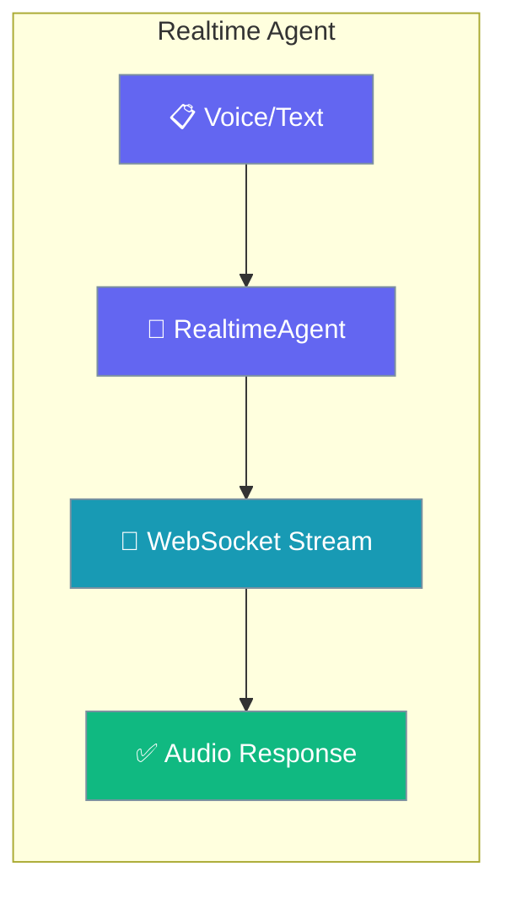
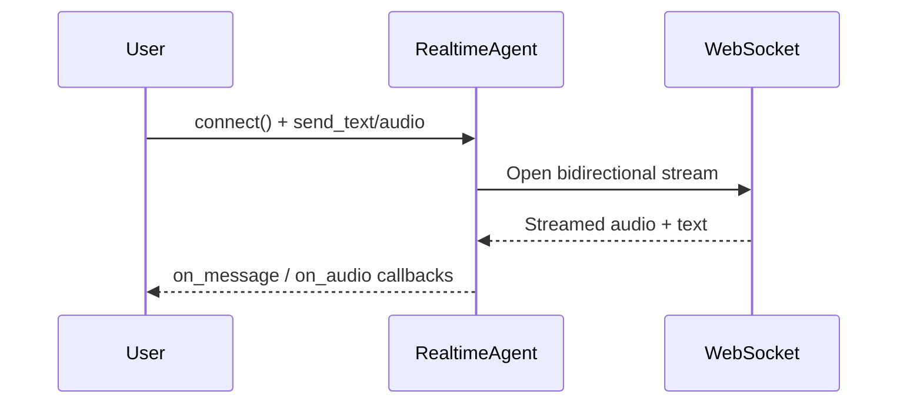

Build voice assistants with the `RealtimeAgent` — bidirectional audio streaming over WebSockets for live, interactive conversations.

```python
from praisonaiagents import RealtimeAgent

agent = RealtimeAgent(name="VoiceAssistant")

await agent.aconnect()
await agent.send_text("Hello, how can I help you?")
```



The `RealtimeAgent` enables real-time voice conversations using WebSocket connections for bidirectional audio streaming. It's designed for interactive voice applications, live transcription, and real-time AI assistants.

## Quick Start

<Steps>
<Step title="Simple Usage">

Connect and start a conversation.

```python
from praisonaiagents import RealtimeAgent

agent = RealtimeAgent(
    name="Assistant",
    instructions="You are a helpful voice assistant",
)

agent.connect()
agent.send_text("Hello!")

def on_message(message):
    print(f"Received: {message}")

agent.on_message(on_message)
```

</Step>

<Step title="With Configuration">

Choose a voice and tune turn detection.

```python
from praisonaiagents import RealtimeAgent, RealtimeConfig

config = RealtimeConfig(
    voice="nova",
    turn_detection=True,
    vad_threshold=0.5,
)

agent = RealtimeAgent(
    name="VoiceBot",
    llm="gpt-4o-realtime-preview",
    realtime=config,
    instructions="Keep responses brief.",
)

agent.connect()
agent.send_text("Tell me a fun fact.")
```

</Step>
</Steps>

## How It Works



## Installation

```bash
pip install praisonaiagents[realtime]
```

<Note>
RealtimeAgent requires the `websockets` package for WebSocket connections.
</Note>

## Basic Usage

### Simple Voice Assistant

```python
from praisonaiagents import RealtimeAgent

# Create agent with default settings
agent = RealtimeAgent(
    name="Assistant",
    instructions="You are a helpful voice assistant"
)

# Connect to realtime API
agent.connect()

# Send text message
agent.send_text("Hello!")

# Handle incoming messages
def on_message(message):
    print(f"Received: {message}")

agent.on_message(on_message)
```

### With Custom Configuration

```python
from praisonaiagents import RealtimeAgent, RealtimeConfig

config = RealtimeConfig(
    voice="alloy",
    sample_rate=24000,
    channels=1,
    turn_detection=True,
    vad_threshold=0.5
)

agent = RealtimeAgent(
    name="CustomVoice",
    llm="gpt-4o-realtime-preview",
    realtime=config,
    verbose=True
)
```

## Configuration

### RealtimeConfig Options

| Parameter | Type | Default | Description |
|-----------|------|---------|-------------|
| `voice` | str | "alloy" | Voice model (alloy, echo, fable, onyx, nova, shimmer) |
| `sample_rate` | int | 24000 | Audio sample rate in Hz |
| `channels` | int | 1 | Number of audio channels |
| `turn_detection` | bool | True | Enable voice activity detection |
| `vad_threshold` | float | 0.5 | Voice activity detection threshold |
| `silence_duration` | float | 0.5 | Silence duration before turn ends (seconds) |

```python
from praisonaiagents import RealtimeConfig

config = RealtimeConfig(
    voice="nova",
    sample_rate=16000,
    turn_detection=True,
    vad_threshold=0.6,
    silence_duration=0.8
)
```

## Methods

### Connection Methods

```python
# Synchronous
agent.connect()
agent.disconnect()

# Asynchronous
await agent.aconnect()
await agent.adisconnect()
```

### Sending Data

```python
# Send text message
agent.send_text("Hello, how are you?")

# Send audio data (bytes)
agent.send_audio(audio_bytes)
```

### Receiving Data

```python
# Register message handler
def handle_message(message):
    print(f"Text: {message}")

agent.on_message(handle_message)

# Register audio handler
def handle_audio(audio_data):
    # Process audio bytes
    pass

agent.on_audio(handle_audio)
```

## Async Usage

```python
import asyncio
from praisonaiagents import RealtimeAgent

async def main():
    agent = RealtimeAgent(name="AsyncVoice")
    
    try:
        await agent.aconnect()
        
        # Send message
        await agent.send_text("Hello!")
        
        # Listen for responses
        async for message in agent.listen():
            print(f"Response: {message}")
            
    finally:
        await agent.adisconnect()

asyncio.run(main())
```

## Voice Options

| Voice | Description |
|-------|-------------|
| `alloy` | Neutral, balanced voice |
| `echo` | Warm, conversational |
| `fable` | Expressive, storytelling |
| `onyx` | Deep, authoritative |
| `nova` | Friendly, upbeat |
| `shimmer` | Clear, professional |

## Example: Interactive Voice Bot

```python
import asyncio
from praisonaiagents import RealtimeAgent, RealtimeConfig

async def voice_bot():
    config = RealtimeConfig(
        voice="nova",
        turn_detection=True,
        vad_threshold=0.5
    )
    
    agent = RealtimeAgent(
        name="VoiceBot",
        llm="gpt-4o-realtime-preview",
        realtime=config,
        instructions="You are a friendly assistant. Keep responses brief."
    )
    
    await agent.aconnect()
    print("Connected! Start speaking...")
    
    # Handle incoming audio
    def on_audio(audio):
        # Play audio through speakers
        play_audio(audio)
    
    agent.on_audio(on_audio)
    
    # Keep running
    try:
        while True:
            await asyncio.sleep(1)
    except KeyboardInterrupt:
        await agent.adisconnect()

asyncio.run(voice_bot())
```

## Error Handling

```python
from praisonaiagents import RealtimeAgent

agent = RealtimeAgent(name="SafeVoice")

try:
    agent.connect()
    agent.send_text("Hello")
except ConnectionError as e:
    print(f"Connection failed: {e}")
except TimeoutError as e:
    print(f"Request timed out: {e}")
finally:
    agent.disconnect()
```

## Best Practices

<AccordionGroup>
<Accordion title="Enable turn detection for natural flow">
Keep `turn_detection=True` so the agent knows when the user has stopped speaking. Without VAD, conversations feel stilted and responses arrive at the wrong moments.
</Accordion>

<Accordion title="Handle disconnects gracefully">
WebSocket connections drop. Wrap `connect()` in reconnection logic and catch `ConnectionError` so a dropped link doesn't end the session.
</Accordion>

<Accordion title="Buffer audio for smooth playback">
Collect audio chunks from `on_audio` before playing them. Playing raw chunks as they arrive produces choppy, garbled speech.
</Accordion>

<Accordion title="Keep system prompts short">
Long instructions slow the first response. A brief prompt keeps latency low, which matters far more in voice than in text.
</Accordion>
</AccordionGroup>

## Related

<CardGroup cols={2}>
  <Card icon="code" href="/docs/agents/code">
    Generate and execute code with the CodeAgent.
  </Card>
  <Card icon="eye" href="/docs/agents/vision">
    Analyze images and visual content.
  </Card>
</CardGroup>
