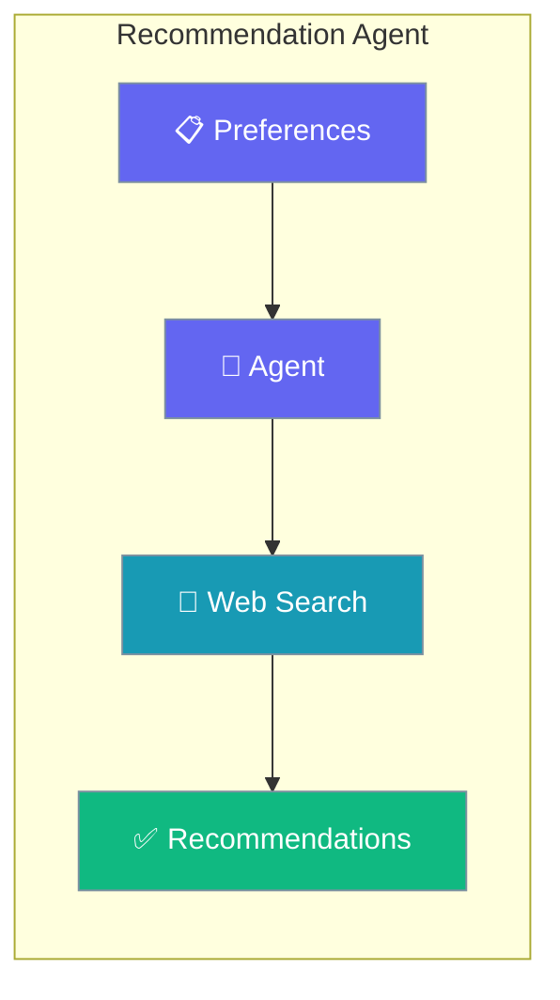
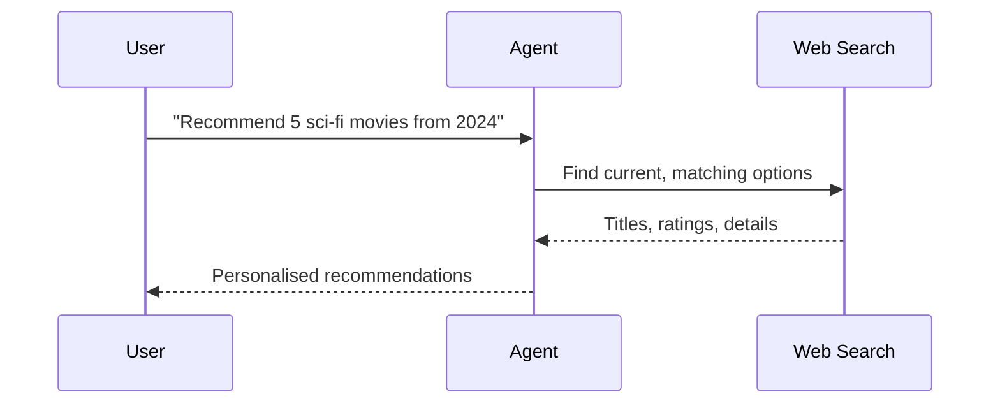

Turn a user's preferences into personalised, up-to-date suggestions with a single Agent that searches the web.

```python
from praisonaiagents import Agent
from praisonaiagents import duckduckgo

agent = Agent(
    name="Recommender",
    instructions="Provide personalized suggestions based on preferences.",
    tools=[duckduckgo],
)

agent.start("Recommend 5 sci-fi movies from 2024")
```



Recommendation agent with web search for personalized suggestions.

## Quick Start

<Steps>
<Step title="Simple Usage">

Attach a search tool and describe what you like.

```python
from praisonaiagents import Agent
from praisonaiagents import duckduckgo

agent = Agent(
    name="Recommender",
    instructions="Provide personalized suggestions based on preferences.",
    tools=[duckduckgo],
)

agent.start("Recommend 5 sci-fi movies from 2024")
```

</Step>

<Step title="With Configuration">

Enable memory so recommendations improve over time.

```python
from praisonaiagents import Agent
from praisonaiagents import duckduckgo

agent = Agent(
    name="Recommender",
    instructions="Learn user taste and refine recommendations each turn.",
    tools=[duckduckgo],
    memory=True,
)

agent.start("Recommend sci-fi movies, then remember I dislike horror.")
```

</Step>
</Steps>

## How It Works



---

## Simple

**Agents: 1** — Single agent analyzes preferences and generates recommendations.

### Workflow

1. Receive user preferences
2. Search for current options
3. Generate personalized recommendations

### Setup

```bash
pip install praisonaiagents praisonai duckduckgo-search
export OPENAI_API_KEY="your-key"
```

### Run — Python

```python
from praisonaiagents import Agent
from praisonaiagents import duckduckgo

agent = Agent(
    name="Recommender",
    instructions="Provide personalized suggestions based on preferences.",
    tools=[duckduckgo]
)

result = agent.start("Recommend 5 sci-fi movies from 2024")
print(result)
```

### Run — CLI

```bash
praisonai "Recommend good books about AI" --web-search
```

### Run — agents.yaml

```yaml
framework: praisonai
topic: Recommendations
roles:
  recommender:
    role: Recommendation Specialist
    goal: Generate personalized recommendations
    backstory: You are an expert at finding great content
    tools:
      - duckduckgo
    tasks:
      recommend:
        description: Recommend 5 sci-fi movies from 2024
        expected_output: A list of recommendations
```

```bash
praisonai agents.yaml
```

### Serve API

```python
from praisonaiagents import Agent
from praisonaiagents import duckduckgo

agent = Agent(
    name="Recommender",
    instructions="You are a recommendation agent.",
    tools=[duckduckgo]
)

agent.launch(port=8080)
```

```bash
curl -X POST http://localhost:8080/chat \
  -H "Content-Type: application/json" \
  -d '{"message": "Recommend podcasts about technology"}'
```

---

## Advanced Workflow (All Features)

**Agents: 1** — Single agent with memory, persistence, structured output, and session resumability.

### Workflow

1. Initialize session for preference tracking
2. Configure SQLite persistence for recommendation history
3. Search and recommend with structured output
4. Store preferences in memory for personalization
5. Resume session for refined recommendations

### Setup

```bash
pip install praisonaiagents praisonai duckduckgo-search pydantic
export OPENAI_API_KEY="your-key"
```

### Run — Python

```python
from praisonaiagents import Agent, Task, AgentTeam, Session
from praisonaiagents import duckduckgo
from pydantic import BaseModel

class Recommendation(BaseModel):
    category: str
    items: list[str]
    descriptions: list[str]
    ratings: list[str]

session = Session(session_id="rec-001", user_id="user-1")

agent = Agent(
    name="Recommender",
    instructions="Generate structured recommendations.",
    tools=[duckduckgo],
    memory=True
)

task = Task(
    description="Recommend 5 sci-fi movies from 2024 with ratings",
    expected_output="Structured recommendations",
    agent=agent,
    output_pydantic=Recommendation
)

agents = AgentTeam(
    agents=[agent],
    tasks=[task],
    memory=True
)

result = agents.start()
print(result)
```

### Run — CLI

```bash
praisonai "Recommend sci-fi movies" --web-search --memory --verbose
```

### Run — agents.yaml

```yaml
framework: praisonai
topic: Recommendations
memory: true
memory_config:
  provider: sqlite
  db_path: recommendations.db
roles:
  recommender:
    role: Recommendation Specialist
    goal: Generate structured recommendations
    backstory: You are an expert at finding great content
    tools:
      - duckduckgo
    memory: true
    tasks:
      recommend:
        description: Recommend 5 sci-fi movies from 2024
        expected_output: Structured recommendations
        output_json:
          category: string
          items: array
          descriptions: array
          ratings: array
```

```bash
praisonai agents.yaml --verbose
```

### Serve API

```python
from praisonaiagents import Agent
from praisonaiagents import duckduckgo

agent = Agent(
    name="Recommender",
    instructions="Generate structured recommendations.",
    tools=[duckduckgo],
    memory=True
)

agent.launch(port=8080)
```

```bash
curl -X POST http://localhost:8080/chat \
  -H "Content-Type: application/json" \
  -d '{"message": "Recommend books", "session_id": "rec-001"}'
```

---

## Monitor / Verify

```bash
praisonai "test recommendations" --web-search --verbose
```

## Cleanup

```bash
rm -f recommendations.db
```

## Features Demonstrated

| Feature | Implementation |
|---------|----------------|
| Workflow | Personalized recommendation generation |
| DB Persistence | SQLite via `memory_config` |
| Observability | `--verbose` flag |
| Tools | DuckDuckGo search |
| Resumability | `Session` with `session_id` |
| Structured Output | Pydantic `Recommendation` model |

## Best Practices

<AccordionGroup>
<Accordion title="Capture preferences explicitly">
Spell out likes, dislikes, and constraints in the prompt. Vague requests yield generic lists; concrete taste signals produce recommendations users act on.
</Accordion>

<Accordion title="Enable memory for personalisation">
Set `memory=True` so the agent remembers taste across sessions and stops re-recommending items the user already rejected.
</Accordion>

<Accordion title="Return structured recommendations">
Use `output_pydantic` with `items`, `descriptions`, and `ratings` fields so a UI can render cards or a table directly.
</Accordion>

<Accordion title="Hand off to Shopping for purchase decisions">
When a recommendation turns into a buy, switch to the Shopping Agent to compare prices across stores.
</Accordion>
</AccordionGroup>

## Related

<CardGroup cols={2}>
  <Card icon="shop" href="/docs/agents/shopping">
    Compare prices once a user picks an item.
  </Card>
  <Card icon="magnifying-glass-chart" href="/docs/agents/research">
    Research options in depth before recommending.
  </Card>
</CardGroup>
