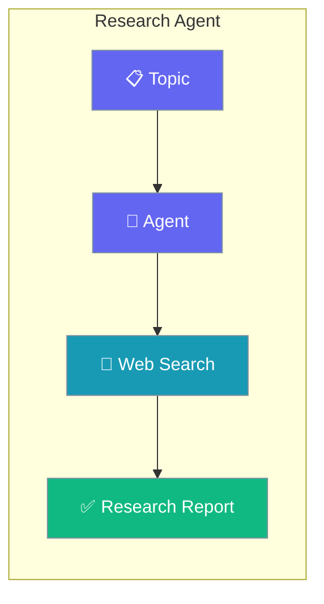
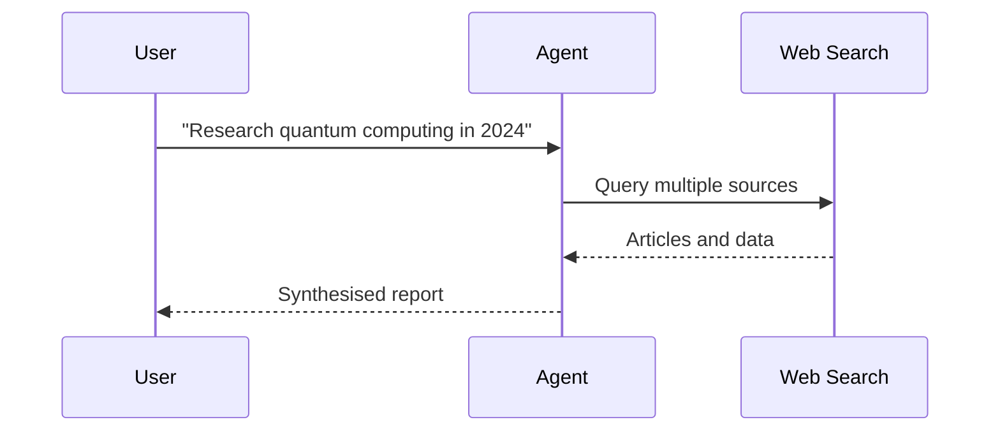

Research any topic end-to-end — search, analyse, and synthesise — with a single Agent using web search tools.

```python
from praisonaiagents import Agent
from praisonaiagents import duckduckgo

agent = Agent(
    name="Researcher",
    instructions="You are a research agent. Search, analyze, and synthesize information.",
    tools=[duckduckgo],
)

agent.start("Research the current state of quantum computing in 2024")
```



Research agent with web search for comprehensive topic analysis and report generation.

<Note>
This page uses a plain `Agent` with a search tool — a flexible custom research recipe. For provider-native Deep Research (OpenAI / Gemini) with the `DeepResearchAgent` class, see the [Deep Research](/docs/agents/deep-research) page.
</Note>

## Quick Start

<Steps>
<Step title="Simple Usage">

Attach a search tool and pose a research question.

```python
from praisonaiagents import Agent
from praisonaiagents import duckduckgo

agent = Agent(
    name="Researcher",
    instructions="You are a research agent. Search, analyze, and synthesize information.",
    tools=[duckduckgo],
)

agent.start("Research the current state of quantum computing in 2024")
```

</Step>

<Step title="With Configuration">

Return a structured report with a Pydantic schema.

```python
from praisonaiagents import Agent, Task, AgentTeam
from praisonaiagents import duckduckgo
from pydantic import BaseModel

class ResearchReport(BaseModel):
    topic: str
    summary: str
    key_findings: list[str]
    sources: list[str]

agent = Agent(
    name="Researcher",
    instructions="Research topics and return structured reports.",
    tools=[duckduckgo],
)

task = Task(
    description="Research quantum computing in 2024",
    expected_output="Structured research report",
    agent=agent,
    output_pydantic=ResearchReport,
)

AgentTeam(agents=[agent], tasks=[task]).start()
```

</Step>
</Steps>

## How It Works



---

## Simple

**Agents: 1** — Single agent handles search, analysis, and synthesis.

### Workflow

1. Receive research topic
2. Search web for relevant sources
3. Analyze and synthesize findings
4. Generate structured report

### Setup

```bash
pip install praisonaiagents praisonai duckduckgo-search
export OPENAI_API_KEY="your-key"
```

### Run — Python

```python
from praisonaiagents import Agent
from praisonaiagents import duckduckgo

agent = Agent(
    name="Researcher",
    instructions="You are a research agent. Search, analyze, and synthesize information.",
    tools=[duckduckgo]
)

result = agent.start("Research the current state of quantum computing in 2024")
print(result)
```

### Run — CLI

```bash
praisonai "Research quantum computing advances" --research --web-search
```

### Model used by the research-assistant intermediary

Deep research runs a primary researcher agent **and** a small "research-assistant" intermediary that gathers initial information using tools. The intermediary honours the same cascade as the rest of the CLI:

```
--model → MODEL_NAME → OPENAI_MODEL_NAME → gpt-4o-mini
```

```bash
# Both agents use Claude
praisonai --research --model claude-3-5-sonnet-latest "Compare vector databases"
```

<Tip>
The intermediary consumes tool-call turns. Running it on your main model can raise cost on long research runs — pin it back to `gpt-4o-mini` by setting `OPENAI_MODEL_NAME=gpt-4o-mini` and leaving `--model` unset.
</Tip>

### Run — agents.yaml

```yaml
framework: praisonai
topic: Research Project
roles:
  researcher:
    role: Research Specialist
    goal: Conduct comprehensive research and analysis
    backstory: You are an expert researcher
    tools:
      - duckduckgo
    tasks:
      research_task:
        description: Research the current state of quantum computing in 2024
        expected_output: A comprehensive research report
```

```bash
praisonai agents.yaml
```

### Serve API

```python
from praisonaiagents import Agent
from praisonaiagents import duckduckgo

agent = Agent(
    name="Researcher",
    instructions="You are a research agent.",
    tools=[duckduckgo]
)

agent.launch(port=8080)
```

```bash
curl -X POST http://localhost:8080/chat \
  -H "Content-Type: application/json" \
  -d '{"message": "Research electric vehicle market trends"}'
```

---

## Advanced Workflow (All Features)

**Agents: 1** — Single agent with memory, persistence, structured output, and session resumability.

### Workflow

1. Initialize session for resumable research context
2. Configure SQLite persistence for research history
3. Execute multi-source search with structured output
4. Store findings in memory for follow-up queries
5. Resume session to continue research

### Setup

```bash
pip install praisonaiagents praisonai duckduckgo-search pydantic
export OPENAI_API_KEY="your-key"
```

### Run — Python

```python
from praisonaiagents import Agent, Task, AgentTeam, Session
from praisonaiagents import duckduckgo
from pydantic import BaseModel

# Structured output schema
class ResearchReport(BaseModel):
    topic: str
    summary: str
    key_findings: list[str]
    sources: list[str]
    recommendations: list[str]

# Create session for resumability
session = Session(session_id="research-001", user_id="user-1")

# Agent with memory and tools
agent = Agent(
    name="Researcher",
    instructions="Research topics thoroughly and return structured reports.",
    tools=[duckduckgo],
    memory=True
)

# Task with structured output
task = Task(
    description="Research the current state of quantum computing in 2024",
    expected_output="Structured research report",
    agent=agent,
    output_pydantic=ResearchReport
)

# Run with SQLite persistence
agents = AgentTeam(
    agents=[agent],
    tasks=[task],
    memory=True
)

result = agents.start()
print(result)

# Resume later
session2 = Session(session_id="research-001", user_id="user-1")
history = session2.search_memory("quantum computing")
```

### Run — CLI

```bash
praisonai "Research quantum computing" --research --web-search --memory --verbose
```

### Run — agents.yaml

```yaml
framework: praisonai
topic: Research Project
memory: true
memory_config:
  provider: sqlite
  db_path: research.db
roles:
  researcher:
    role: Research Specialist
    goal: Conduct comprehensive research
    backstory: You are an expert researcher
    tools:
      - duckduckgo
    memory: true
    tasks:
      research_task:
        description: Research the current state of quantum computing in 2024
        expected_output: Structured research report
        output_json:
          topic: string
          summary: string
          key_findings: array
          sources: array
          recommendations: array
```

```bash
praisonai agents.yaml --verbose
```

### Serve API

```python
from praisonaiagents import Agent
from praisonaiagents import duckduckgo

agent = Agent(
    name="Researcher",
    instructions="Research topics and return structured reports.",
    tools=[duckduckgo],
    memory=True
)

agent.launch(port=8080)
```

```bash
curl -X POST http://localhost:8080/chat \
  -H "Content-Type: application/json" \
  -d '{"message": "Research AI trends", "session_id": "research-001"}'
```

---

## Monitor / Verify

```bash
praisonai "test research" --research --web-search --verbose
```

## Cleanup

```bash
rm -f research.db
```

## Features Demonstrated

| Feature | Implementation |
|---------|----------------|
| Workflow | Multi-step research synthesis |
| DB Persistence | SQLite via `memory_config` |
| Observability | `--verbose` flag |
| Tools | DuckDuckGo search |
| Resumability | `Session` with `session_id` |
| Structured Output | Pydantic `ResearchReport` model |

## Best Practices

<AccordionGroup>
<Accordion title="Ask for cited sources">
Instruct the agent to list the URLs it used. Research without provenance is hard to trust and impossible to verify.
</Accordion>

<Accordion title="Use structured output for reports">
Define a Pydantic schema with `summary`, `key_findings`, and `sources` so the report renders consistently and feeds downstream tools.
</Accordion>

<Accordion title="Pin the intermediary model to control cost">
Deep research runs an assistant that consumes tool-call turns. Set `OPENAI_MODEL_NAME=gpt-4o-mini` for that helper to avoid inflating cost on long runs.
</Accordion>

<Accordion title="Escalate to Deep Research for provider-native depth">
For OpenAI or Gemini deep-research APIs with built-in browsing, use the `DeepResearchAgent` class rather than this search-tool recipe.
</Accordion>
</AccordionGroup>

## Related

<CardGroup cols={2}>
  <Card icon="microscope" href="/docs/agents/deep-research">
    Provider-native deep research with the DeepResearchAgent class.
  </Card>
  <Card icon="chart-line" href="/docs/agents/data-analyst">
    Analyze datasets to support data-driven research.
  </Card>
</CardGroup>
