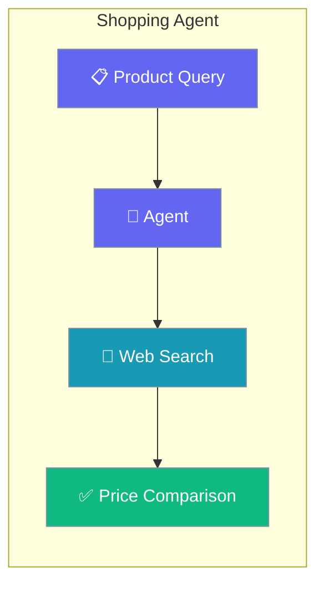
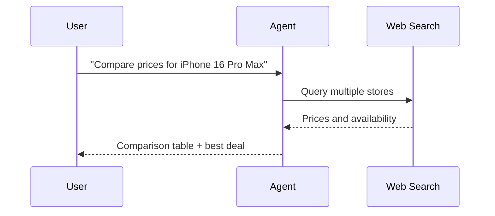

Compare prices across stores and surface the best deal with a single Agent using web search.

```python
from praisonaiagents import Agent
from praisonaiagents import duckduckgo

agent = Agent(
    name="ShoppingAssistant",
    instructions="You are a shopping agent. Compare prices in table format.",
    tools=[duckduckgo],
)

agent.start("Compare prices for iPhone 16 Pro Max")
```



Shopping assistant with web search for price comparison across stores.

## Quick Start

<Steps>
<Step title="Simple Usage">

Attach a search tool and name a product.

```python
from praisonaiagents import Agent
from praisonaiagents import duckduckgo

agent = Agent(
    name="ShoppingAssistant",
    instructions="You are a shopping agent. Compare prices in table format.",
    tools=[duckduckgo],
)

agent.start("Compare prices for iPhone 16 Pro Max")
```

</Step>

<Step title="With Configuration">

Enable memory so the agent tracks prices over time.

```python
from praisonaiagents import Agent
from praisonaiagents import duckduckgo

agent = Agent(
    name="ShoppingAssistant",
    instructions="Compare prices and remember what the user is watching.",
    tools=[duckduckgo],
    memory=True,
)

agent.start("Compare MacBook Pro prices, then watch for a drop.")
```

</Step>
</Steps>

## How It Works



---

## Simple

**Agents: 1** — Single agent with search tool handles product research and comparison.

### Workflow

1. Receive product query
2. Search multiple stores
3. Compare prices and generate report

### Setup

```bash
pip install praisonaiagents praisonai duckduckgo-search
export OPENAI_API_KEY="your-key"
```

### Run — Python

```python
from praisonaiagents import Agent
from praisonaiagents import duckduckgo

agent = Agent(
    name="ShoppingAssistant",
    instructions="You are a shopping agent. Compare prices in table format.",
    tools=[duckduckgo]
)

result = agent.start("Compare prices for iPhone 16 Pro Max")
print(result)
```

### Run — CLI

```bash
praisonai "Compare MacBook Pro prices" --web-search
```

### Run — agents.yaml

```yaml
framework: praisonai
topic: Price Comparison
roles:
  shopping_assistant:
    role: Shopping Specialist
    goal: Find the best prices across stores
    backstory: You are an expert at finding deals
    tools:
      - duckduckgo
    tasks:
      compare_prices:
        description: Compare prices for iPhone 16 Pro Max
        expected_output: A price comparison table
```

```bash
praisonai agents.yaml
```

### Serve API

```python
from praisonaiagents import Agent
from praisonaiagents import duckduckgo

agent = Agent(
    name="ShoppingAssistant",
    instructions="You are a shopping agent.",
    tools=[duckduckgo]
)

agent.launch(port=8080)
```

```bash
curl -X POST http://localhost:8080/chat \
  -H "Content-Type: application/json" \
  -d '{"message": "Find best deals on Sony headphones"}'
```

---

## Advanced Workflow (All Features)

**Agents: 1** — Single agent with memory, persistence, structured output, and session resumability.

### Workflow

1. Initialize session for shopping history
2. Configure SQLite persistence for price tracking
3. Search and compare with structured output
4. Store results in memory for price alerts
5. Resume session for ongoing comparisons

### Setup

```bash
pip install praisonaiagents praisonai duckduckgo-search pydantic
export OPENAI_API_KEY="your-key"
```

### Run — Python

```python
from praisonaiagents import Agent, Task, AgentTeam, Session
from praisonaiagents import duckduckgo
from pydantic import BaseModel

class PriceComparison(BaseModel):
    product: str
    stores: list[str]
    prices: list[str]
    best_deal: str
    recommendation: str

session = Session(session_id="shop-001", user_id="user-1")

agent = Agent(
    name="ShoppingAssistant",
    instructions="Compare prices and return structured results.",
    tools=[duckduckgo],
    memory=True
)

task = Task(
    description="Compare iPhone 16 Pro Max prices across stores",
    expected_output="Structured price comparison",
    agent=agent,
    output_pydantic=PriceComparison
)

agents = AgentTeam(
    agents=[agent],
    tasks=[task],
    memory=True
)

result = agents.start()
print(result)
```

### Run — CLI

```bash
praisonai "Compare iPhone prices" --web-search --memory --verbose
```

### Run — agents.yaml

```yaml
framework: praisonai
topic: Price Comparison
memory: true
memory_config:
  provider: sqlite
  db_path: shopping.db
roles:
  shopping_assistant:
    role: Shopping Specialist
    goal: Find best prices with structured output
    backstory: You are an expert at finding deals
    tools:
      - duckduckgo
    memory: true
    tasks:
      compare_prices:
        description: Compare iPhone 16 Pro Max prices
        expected_output: Structured price comparison
        output_json:
          product: string
          stores: array
          prices: array
          best_deal: string
          recommendation: string
```

```bash
praisonai agents.yaml --verbose
```

### Serve API

```python
from praisonaiagents import Agent
from praisonaiagents import duckduckgo

agent = Agent(
    name="ShoppingAssistant",
    instructions="Compare prices and return structured results.",
    tools=[duckduckgo],
    memory=True
)

agent.launch(port=8080)
```

```bash
curl -X POST http://localhost:8080/chat \
  -H "Content-Type: application/json" \
  -d '{"message": "Compare laptop prices", "session_id": "shop-001"}'
```

---

## Monitor / Verify

```bash
praisonai "test shopping" --web-search --verbose
```

## Cleanup

```bash
rm -f shopping.db
```

## Features Demonstrated

| Feature | Implementation |
|---------|----------------|
| Workflow | Multi-store price comparison |
| DB Persistence | SQLite via `memory_config` |
| Observability | `--verbose` flag |
| Tools | DuckDuckGo search |
| Resumability | `Session` with `session_id` |
| Structured Output | Pydantic `PriceComparison` model |

## Best Practices

<AccordionGroup>
<Accordion title="Ask for a comparison table">
Instruct the agent to return results as a table with store, price, and link. Structured output makes the best deal obvious at a glance.
</Accordion>

<Accordion title="Enable memory for price watching">
Set `memory=True` so the agent remembers watched products and flags changes on the next run instead of starting over.
</Accordion>

<Accordion title="Verify prices are current">
Web results can be stale. Ask the agent to note the source date so users know how fresh each quote is.
</Accordion>

<Accordion title="Pair with Recommendation for discovery">
Use the Recommendation Agent to pick what to buy, then hand the chosen item to this agent for a price comparison.
</Accordion>
</AccordionGroup>

## Related

<CardGroup cols={2}>
  <Card icon="thumbs-up" href="/docs/agents/recommendation">
    Get personalised suggestions before comparing prices.
  </Card>
  <Card icon="magnifying-glass-chart" href="/docs/agents/research">
    Research a product in depth before buying.
  </Card>
</CardGroup>
