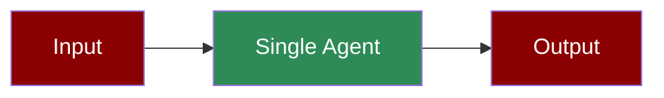

Single-purpose agent for content generation. Minimal setup, no external tools.

**Agents: 1** — Single task requires only one agent.

## Workflow

1. Receive input prompt
2. Process with LLM
3. Return generated content

## Setup

```bash
pip install praisonaiagents praisonai
export OPENAI_API_KEY="your-key"
```

## Run — Python

```python
from praisonaiagents import Agent

agent = Agent(
    name="ContentWriter",
    instructions="You are a content writer. Output in markdown format."
)

result = agent.start("Write a short blog post about AI assistants")
print(result)
```

## Run — CLI

```bash
# Direct prompt
praisonai "Write a short blog post about AI assistants"

# Interactive mode
praisonai --chat-mode
```

## Run — agents.yaml

```yaml
framework: praisonai
topic: Content Generation
roles:
  content_writer:
    role: Content Writer
    goal: Generate engaging content
    backstory: You are an expert content writer
    tasks:
      write_content:
        description: Write a short blog post about AI assistants
        expected_output: A markdown formatted blog post
```

```bash
praisonai agents.yaml
```

## Serve API

```python
from praisonaiagents import Agent

agent = Agent(
    name="ContentWriter",
    instructions="You are a content writer. Output in markdown format."
)

agent.launch(port=8080)
```

```bash
# Test the API
curl -X POST http://localhost:8080/chat \
  -H "Content-Type: application/json" \
  -d '{"message": "Write a haiku about coding"}'
```

## Features

| Feature | Supported |
|---------|-----------|
| Workflow | ✅ Single step |
| DB Persistence | ❌ |
| Vector Retrieval | ❌ |
| Observability | ✅ `--verbose` |
| Tools | ❌ |
| Resumability | ❌ |
| Structured Output | ✅ via `output_json` |

## Next Steps

- [Prompt Chaining](/features/promptchaining) for multi-step workflows
- [Web Search Agent](/agents/websearch) for tool-enabled agents
- [Structured Output](/features/structured) for JSON responses
