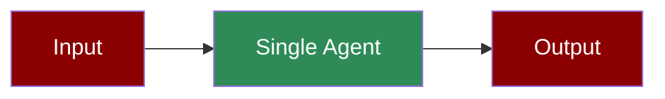

Single-purpose agent for content generation. Minimal setup, no external tools.

---

## Simple

**Agents: 1** — Single task requires only one agent.

### Workflow

1. Receive input prompt
2. Process with LLM
3. Return generated content

### Setup

```bash
pip install praisonaiagents praisonai
export OPENAI_API_KEY="your-key"
```

### Run — Python

```python
from praisonaiagents import Agent

agent = Agent(
    name="ContentWriter",
    instructions="You are a content writer. Output in markdown format."
)

result = agent.start("Write a short blog post about AI assistants")
print(result)
```

### Run — CLI

```bash
praisonai "Write a short blog post about AI assistants"
```

### Run — agents.yaml

```yaml
framework: praisonai
topic: Content Generation
roles:
  content_writer:
    role: Content Writer
    goal: Generate engaging content
    backstory: You are an expert content writer
    tasks:
      write_content:
        description: Write a short blog post about AI assistants
        expected_output: A markdown formatted blog post
```

```bash
praisonai agents.yaml
```

### Serve API

```python
from praisonaiagents import Agent

agent = Agent(
    name="ContentWriter",
    instructions="You are a content writer. Output in markdown format."
)

agent.launch(port=8080)
```

```bash
curl -X POST http://localhost:8080/chat \
  -H "Content-Type: application/json" \
  -d '{"message": "Write a haiku about coding"}'
```

---

## Advanced Workflow (All Features)

**Agents: 1** — Single agent with memory, persistence, structured output, and session resumability.

### Workflow

1. Initialize session with unique ID for resumability
2. Configure SQLite persistence for conversation history
3. Process input with structured Pydantic output
4. Store results in memory for future context
5. Resume session later with same session_id

### Setup

```bash
pip install praisonaiagents praisonai pydantic
export OPENAI_API_KEY="your-key"
```

### Run — Python

```python
from praisonaiagents import Agent, Task, Agents, Session
from pydantic import BaseModel

# Structured output schema
class BlogPost(BaseModel):
    title: str
    content: str
    tags: list[str]

# Create session for resumability
session = Session(session_id="blog-session-001", user_id="user-1")

# Agent with memory enabled
agent = Agent(
    name="ContentWriter",
    instructions="You are a content writer. Output structured JSON.",
    memory=True
)

# Task with structured output
task = Task(
    description="Write a short blog post about AI assistants",
    expected_output="Structured blog post",
    agent=agent,
    output_pydantic=BlogPost
)

# Run with SQLite persistence
agents = Agents(
    agents=[agent],
    tasks=[task],
    memory={"provider": "sqlite", "db_path": "content.db"},
    verbose=1
)

result = agents.start()
print(result)

# Resume later with same session_id
session2 = Session(session_id="blog-session-001", user_id="user-1")
context = session2.get_context()
```

### Run — CLI

```bash
# With memory and verbose
praisonai "Write a blog post about AI" --memory --verbose

# With session persistence
praisonai "Continue the blog post" --memory --session blog-session-001
```

### Run — agents.yaml

```yaml
framework: praisonai
topic: Content Generation
memory: true
memory_config:
  provider: sqlite
  db_path: content.db
roles:
  content_writer:
    role: Content Writer
    goal: Generate engaging content with structured output
    backstory: You are an expert content writer
    memory: true
    tasks:
      write_content:
        description: Write a short blog post about AI assistants
        expected_output: Structured blog post with title, content, and tags
        output_json:
          title: string
          content: string
          tags: array
```

```bash
praisonai agents.yaml --verbose
```

### Serve API

```python
from praisonaiagents import Agent

agent = Agent(
    name="ContentWriter",
    instructions="You are a content writer.",
    memory=True
)

# Launch with persistence
agent.launch(port=8080)
```

```bash
curl -X POST http://localhost:8080/chat \
  -H "Content-Type: application/json" \
  -d '{"message": "Write a blog post", "session_id": "blog-001"}'
```

---

## Monitor / Verify

```bash
# Verbose output
praisonai "test prompt" --verbose

# Check telemetry
praisonai "test prompt" --telemetry
```

## Cleanup

```bash
rm -f content.db
```

## Features Demonstrated

| Feature | Implementation |
|---------|----------------|
| Workflow | Single-step content generation |
| DB Persistence | SQLite via `memory_config` |
| Observability | `--verbose` flag |
| Resumability | `Session` with `session_id` |
| Structured Output | Pydantic `BlogPost` model |

## Next Steps

- [Prompt Chaining](/features/promptchaining) for multi-step workflows
- [Web Search Agent](/agents/websearch) for tool-enabled agents
- [Memory](/features/advanced-memory) for persistent context
