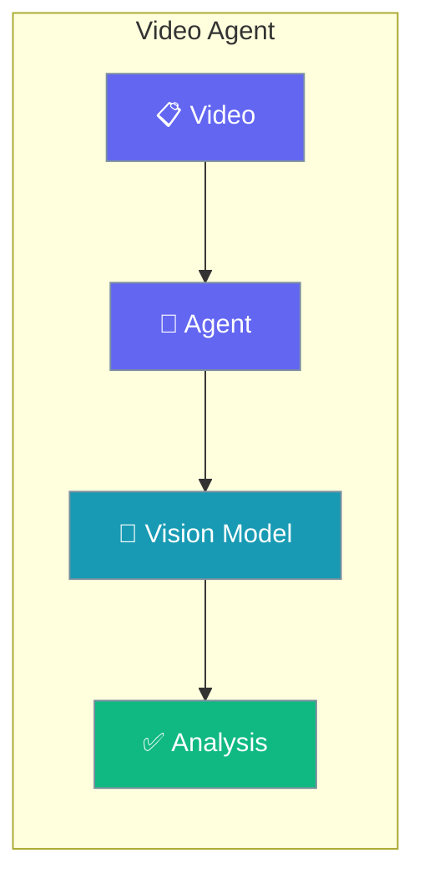
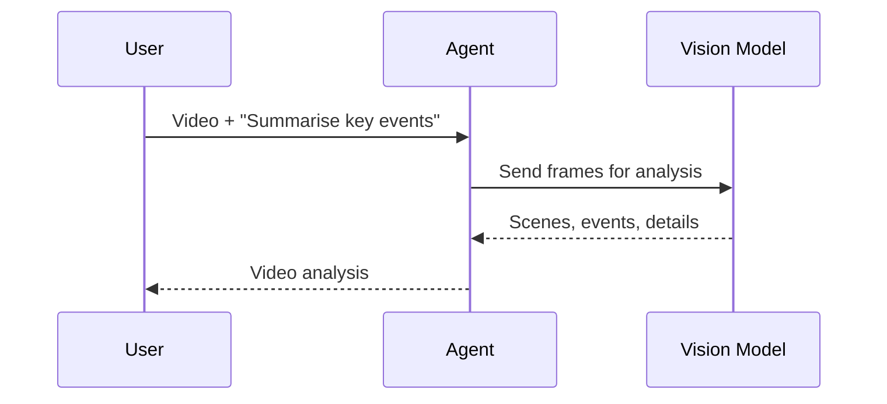

Summarise clips, detect scenes, and understand video content with a single Agent backed by a vision model.

```python
from praisonaiagents import Agent, Task, AgentTeam

agent = Agent(
    name="VideoAnalyst",
    instructions="Describe video content in detail.",
    llm="gpt-4o-mini",
)

task = Task(
    description="Analyze this video and summarize key events",
    expected_output="Video analysis",
    agent=agent,
    images=["video.mp4"],
)

AgentTeam(agents=[agent], tasks=[task]).start()
```



Video analysis agent using vision models for content understanding.

## Quick Start

<Steps>
<Step title="Simple Usage">

Pass a video file to a task for analysis.

```python
from praisonaiagents import Agent, Task, AgentTeam

agent = Agent(
    name="VideoAnalyst",
    instructions="Describe video content in detail.",
    llm="gpt-4o-mini",
)

task = Task(
    description="Analyze this video and summarize key events",
    expected_output="Video analysis",
    agent=agent,
    images=["video.mp4"],
)

AgentTeam(agents=[agent], tasks=[task]).start()
```

</Step>

<Step title="With Configuration">

Return structured fields with a Pydantic schema.

```python
from praisonaiagents import Agent, Task, AgentTeam
from pydantic import BaseModel

class VideoAnalysis(BaseModel):
    scenes: list[str]
    key_events: list[str]
    summary: str

agent = Agent(
    name="VideoAnalyst",
    instructions="Analyze videos and return structured results.",
    llm="gpt-4o-mini",
)

task = Task(
    description="Analyze this video in detail",
    expected_output="Structured video analysis",
    agent=agent,
    images=["video.mp4"],
    output_pydantic=VideoAnalysis,
)

AgentTeam(agents=[agent], tasks=[task]).start()
```

</Step>
</Steps>

## How It Works



---

## Simple

**Agents: 1** — Single agent with vision capabilities analyzes video content.

### Workflow

1. Receive video file
2. Process frames with vision model
3. Generate comprehensive analysis

### Setup

```bash
pip install praisonaiagents praisonai
export OPENAI_API_KEY="your-key"
```

### Run — Python

```python
from praisonaiagents import Agent, Task, AgentTeam

agent = Agent(
    name="VideoAnalyst",
    instructions="Describe video content in detail.",
    llm="gpt-4o-mini"
)

task = Task(
    description="Analyze this video and summarize key events",
    expected_output="Video analysis",
    agent=agent,
    images=["video.mp4"]
)

agents = AgentTeam(agents=[agent], tasks=[task])
result = agents.start()
print(result)
```

### Run — CLI

```bash
praisonai "Summarize this video" --image video.mp4
```

### Run — agents.yaml

```yaml
framework: praisonai
topic: Video Analysis
roles:
  video_analyst:
    role: Video Analysis Specialist
    goal: Analyze videos and describe content
    backstory: You are an expert in video analysis
    llm: gpt-4o-mini
    tasks:
      analyze:
        description: Analyze this video and summarize key events
        expected_output: Video analysis
        images:
          - video.mp4
```

```bash
praisonai agents.yaml
```

### Serve API

```python
from praisonaiagents import Agent

agent = Agent(
    name="VideoAnalyst",
    instructions="You are a video analysis expert.",
    llm="gpt-4o-mini"
)

agent.launch(port=8080)
```

```bash
curl -X POST http://localhost:8080/chat \
  -H "Content-Type: application/json" \
  -d '{"message": "Analyze this video: https://example.com/video.mp4"}'
```

---

## Advanced Workflow (All Features)

**Agents: 1** — Single agent with memory, persistence, structured output, and session resumability.

### Workflow

1. Initialize session for video tracking
2. Configure SQLite persistence for analysis history
3. Analyze video with structured output
4. Store results in memory for comparison
5. Resume session for follow-up analysis

### Setup

```bash
pip install praisonaiagents praisonai pydantic
export OPENAI_API_KEY="your-key"
```

### Run — Python

```python
from praisonaiagents import Agent, Task, AgentTeam, Session
from pydantic import BaseModel

class VideoAnalysis(BaseModel):
    duration: str
    scenes: list[str]
    key_events: list[str]
    summary: str

session = Session(session_id="video-001", user_id="user-1")

agent = Agent(
    name="VideoAnalyst",
    instructions="Analyze videos and return structured results.",
    llm="gpt-4o-mini",
    memory=True
)

task = Task(
    description="Analyze this video in detail",
    expected_output="Structured video analysis",
    agent=agent,
    images=["video.mp4"],
    output_pydantic=VideoAnalysis
)

agents = AgentTeam(
    agents=[agent],
    tasks=[task],
    memory=True
)

result = agents.start()
print(result)
```

### Run — CLI

```bash
praisonai "Analyze this video" --image video.mp4 --memory --verbose
```

### Run — agents.yaml

```yaml
framework: praisonai
topic: Video Analysis
memory: true
memory_config:
  provider: sqlite
  db_path: videos.db
roles:
  video_analyst:
    role: Video Analysis Specialist
    goal: Analyze videos with structured output
    backstory: You are an expert in video analysis
    llm: gpt-4o-mini
    memory: true
    tasks:
      analyze:
        description: Analyze this video in detail
        expected_output: Structured video analysis
        images:
          - video.mp4
        output_json:
          duration: string
          scenes: array
          key_events: array
          summary: string
```

```bash
praisonai agents.yaml --verbose
```

### Serve API

```python
from praisonaiagents import Agent

agent = Agent(
    name="VideoAnalyst",
    instructions="Analyze videos and return structured results.",
    llm="gpt-4o-mini",
    memory=True
)

agent.launch(port=8080)
```

```bash
curl -X POST http://localhost:8080/chat \
  -H "Content-Type: application/json" \
  -d '{"message": "Analyze video", "session_id": "video-001"}'
```

---

## Monitor / Verify

```bash
praisonai "test video" --image test.mp4 --verbose
```

## Cleanup

```bash
rm -f videos.db
```

## Features Demonstrated

| Feature | Implementation |
|---------|----------------|
| Workflow | Vision-based video analysis |
| DB Persistence | SQLite via `memory_config` |
| Observability | `--verbose` flag |
| Resumability | `Session` with `session_id` |
| Structured Output | Pydantic `VideoAnalysis` model |

## Best Practices

<AccordionGroup>
<Accordion title="Pass the video through the Task">
Vision models read media from the `images=[...]` field on a `Task`. A file path in the prompt text is invisible to the model.
</Accordion>

<Accordion title="Use a vision-capable model">
Set `llm="gpt-4o-mini"` or another multimodal model. Text-only models cannot process video frames.
</Accordion>

<Accordion title="Keep clips short for accurate summaries">
Long videos dilute detail. Analyse in segments and combine results when you need frame-level accuracy across a full recording.
</Accordion>

<Accordion title="Return structured scenes for downstream indexing">
Add `output_pydantic` with `scenes` and `key_events` so a search index or timeline UI can consume the output directly.
</Accordion>
</AccordionGroup>

## Related

<CardGroup cols={2}>
  <Card icon="image" href="/docs/agents/image">
    Analyze still images frame by frame.
  </Card>
  <Card icon="text" href="/docs/agents/image-to-text">
    Extract on-screen text with OCR.
  </Card>
</CardGroup>
