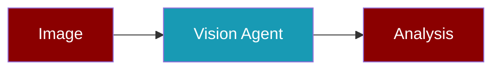

<Info>
VisionAgent provides dedicated methods for image understanding tasks like analysis, description, comparison, and text extraction.
</Info>

---

## Quick Start

<Steps>
  <Step title="Install">
    ```bash
    pip install praisonaiagents litellm
    export OPENAI_API_KEY="your-key"
    ```
  </Step>
  <Step title="Create Agent">
    ```python
    from praisonaiagents import VisionAgent
    
    agent = VisionAgent()
    ```
  </Step>
  <Step title="Analyze Image">
    ```python
    result = agent.analyze("https://example.com/image.jpg")
    print(result)
    ```
  </Step>
</Steps>

---

## Methods

<AccordionGroup>
  <Accordion title="analyze()" icon="magnifying-glass">
    Analyze an image with optional custom prompt.
    
    ```python
    from praisonaiagents import VisionAgent
    
    agent = VisionAgent()
    
    # Basic analysis
    result = agent.analyze("image.jpg")
    
    # With custom prompt
    result = agent.analyze(
        "chart.png",
        prompt="What data does this chart show?"
    )
    ```
    
    <ParamField path="image" type="str" required>
      Image URL or local file path
    </ParamField>
    <ParamField path="prompt" type="str">
      Custom analysis prompt
    </ParamField>
    <ParamField path="detail" type="str" default="auto">
      Detail level: `low`, `high`, or `auto`
    </ParamField>
  </Accordion>
  
  <Accordion title="describe()" icon="file-lines">
    Generate detailed description of an image.
    
    ```python
    description = agent.describe("photo.jpg")
    print(description)
    ```
    
    Returns comprehensive description including:
    - Main subject and composition
    - Colors, lighting, mood
    - Background and setting
    - Text, symbols, notable details
  </Accordion>
  
  <Accordion title="compare()" icon="code-compare">
    Compare multiple images.
    
    ```python
    comparison = agent.compare([
        "before.jpg",
        "after.jpg"
    ], prompt="What changed?")
    ```
    
    <ParamField path="images" type="List[str]" required>
      List of image URLs or paths (minimum 2)
    </ParamField>
  </Accordion>
  
  <Accordion title="extract_text()" icon="text">
    Extract text from images (OCR-like).
    
    ```python
    text = agent.extract_text("document.png", detail="high")
    print(text)
    ```
    
    <Tip>Use `detail="high"` for better text extraction accuracy.</Tip>
  </Accordion>
</AccordionGroup>

---

## Configuration

<Tabs>
  <Tab title="Basic">
    ```python
    from praisonaiagents import VisionAgent
    
    agent = VisionAgent(
        name="MyVision",
        llm="gpt-4o",
        verbose=True
    )
    ```
  </Tab>
  <Tab title="With Config">
    ```python
    from praisonaiagents import VisionAgent, VisionConfig
    
    config = VisionConfig(
        detail="high",
        max_tokens=8192,
        timeout=120
    )
    
    agent = VisionAgent(vision=config)
    ```
  </Tab>
  <Tab title="Dict Config">
    ```python
    agent = VisionAgent(
        vision={
            "detail": "high",
            "max_tokens": 4096
        }
    )
    ```
  </Tab>
</Tabs>

### VisionConfig Parameters

| Parameter | Type | Default | Description |
|-----------|------|---------|-------------|
| `detail` | str | `"auto"` | Detail level: `low`, `high`, `auto` |
| `max_tokens` | int | `4096` | Maximum response tokens |
| `timeout` | int | `60` | Request timeout in seconds |

---

## Supported Models

<CardGroup cols={3}>
  <Card title="OpenAI" icon="robot">
    - `gpt-4o` (default)
    - `gpt-4o-mini`
    - `gpt-4-turbo`
  </Card>
  <Card title="Anthropic" icon="a">
    - `claude-3-5-sonnet-20241022`
    - `claude-3-opus-20240229`
  </Card>
  <Card title="Google" icon="google">
    - `gemini/gemini-1.5-pro`
    - `gemini/gemini-1.5-flash`
  </Card>
</CardGroup>

---

## Examples

### Analyze Chart Data

```python
from praisonaiagents import VisionAgent

agent = VisionAgent(llm="gpt-4o")

result = agent.analyze(
    "https://example.com/sales-chart.png",
    prompt="Extract all data points and trends from this chart"
)
print(result)
```

### Compare Product Images

```python
agent = VisionAgent()

comparison = agent.compare([
    "product_v1.jpg",
    "product_v2.jpg",
    "product_v3.jpg"
], prompt="Describe the design evolution across these versions")
```

### Extract Document Text

```python
agent = VisionAgent()

# High detail for better OCR
text = agent.extract_text(
    "scanned_document.png",
    detail="high"
)
print(text)
```

### Async Usage

```python
import asyncio
from praisonaiagents import VisionAgent

async def main():
    agent = VisionAgent()
    result = await agent.aanalyze("image.jpg")
    print(result)

asyncio.run(main())
```

---

## Comparison with ImageAgent

<Note>
**VisionAgent** is for image **analysis/understanding**.  
**ImageAgent** is for image **generation**.
</Note>

| Feature | VisionAgent | ImageAgent |
|---------|-------------|------------|
| Purpose | Analyze images | Generate images |
| Input | Image URL/path | Text prompt |
| Output | Text description | Image file/URL |
| Models | GPT-4o, Claude, Gemini | DALL-E, Stable Diffusion |

---

## Next Steps

<CardGroup cols={2}>
  <Card title="Image Agent" icon="image" href="/agents/image">
    Generate images with AI
  </Card>
  <Card title="OCR Agent" icon="scanner" href="/agents/image-to-text">
    Specialized OCR extraction
  </Card>
  <Card title="Embedding Agent" icon="vector-square" href="/agents/embedding">
    Generate text embeddings
  </Card>
  <Card title="Video Agent" icon="video" href="/agents/video">
    Analyze video content
  </Card>
</CardGroup>
