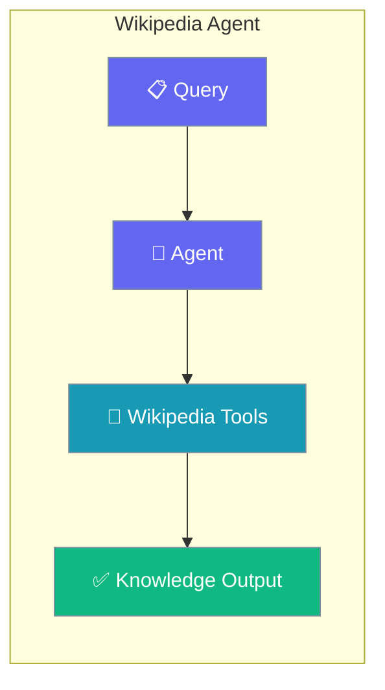
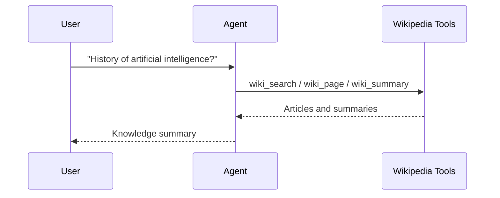

Search Wikipedia, pull articles, and summarise them with a single Agent using dedicated wiki tools.

```python
from praisonaiagents import Agent
from praisonai_tools import wiki_search, wiki_summary, wiki_page

agent = Agent(
    name="WikiResearcher",
    instructions="Search and summarize Wikipedia content.",
    tools=[wiki_search, wiki_summary, wiki_page],
)

agent.start("What is the history of artificial intelligence?")
```



Wikipedia research agent with search, page retrieval, and summarization tools.

## Quick Start

<Steps>
<Step title="Simple Usage">

Attach the wiki tools and ask a knowledge question.

```python
from praisonaiagents import Agent
from praisonai_tools import wiki_search, wiki_summary, wiki_page

agent = Agent(
    name="WikiResearcher",
    instructions="Search and summarize Wikipedia content.",
    tools=[wiki_search, wiki_summary, wiki_page],
)

agent.start("What is the history of artificial intelligence?")
```

</Step>

<Step title="With Configuration">

Return structured knowledge with a Pydantic schema.

```python
from praisonaiagents import Agent, Task, AgentTeam
from praisonai_tools import wiki_search, wiki_summary, wiki_page
from pydantic import BaseModel

class WikiKnowledge(BaseModel):
    topic: str
    summary: str
    key_facts: list[str]
    related_topics: list[str]

agent = Agent(
    name="WikiResearcher",
    instructions="Extract structured knowledge from Wikipedia.",
    tools=[wiki_search, wiki_summary, wiki_page],
)

task = Task(
    description="What is the history of artificial intelligence?",
    expected_output="Structured knowledge summary",
    agent=agent,
    output_pydantic=WikiKnowledge,
)

AgentTeam(agents=[agent], tasks=[task]).start()
```

</Step>
</Steps>

## How It Works



---

## Simple

**Agents: 1** — Single agent with Wikipedia tools handles search and content extraction.

### Workflow

1. Receive knowledge query
2. Search Wikipedia articles
3. Summarize findings

### Setup

```bash
pip install praisonaiagents praisonai wikipedia
export OPENAI_API_KEY="your-key"
```

### Run — Python

```python
from praisonaiagents import Agent
from praisonai_tools import wiki_search, wiki_summary, wiki_page

agent = Agent(
    name="WikiResearcher",
    instructions="Search and summarize Wikipedia content.",
    tools=[wiki_search, wiki_summary, wiki_page]
)

result = agent.start("What is the history of artificial intelligence?")
print(result)
```

### Run — CLI

```bash
praisonai "Explain quantum computing from Wikipedia" --tools wikipedia
```

### Run — agents.yaml

```yaml
framework: praisonai
topic: Wikipedia Research
roles:
  wiki_researcher:
    role: Wikipedia Research Specialist
    goal: Extract and summarize Wikipedia content
    backstory: You are an expert at finding knowledge
    tools:
      - wiki_search
      - wiki_summary
      - wiki_page
    tasks:
      research:
        description: What is the history of artificial intelligence?
        expected_output: A comprehensive summary
```

```bash
praisonai agents.yaml
```

### Serve API

```python
from praisonaiagents import Agent
from praisonai_tools import wiki_search, wiki_summary, wiki_page

agent = Agent(
    name="WikiResearcher",
    instructions="You are a Wikipedia research agent.",
    tools=[wiki_search, wiki_summary, wiki_page]
)

agent.launch(port=8080)
```

```bash
curl -X POST http://localhost:8080/chat \
  -H "Content-Type: application/json" \
  -d '{"message": "Tell me about the Roman Empire"}'
```

---

## Advanced Workflow (All Features)

**Agents: 1** — Single agent with memory, persistence, structured output, and session resumability.

### Workflow

1. Initialize session for knowledge tracking
2. Configure SQLite persistence for research history
3. Search and extract with structured output
4. Store findings in memory for follow-up queries
5. Resume session for continued research

### Setup

```bash
pip install praisonaiagents praisonai wikipedia pydantic
export OPENAI_API_KEY="your-key"
```

### Run — Python

```python
from praisonaiagents import Agent, Task, AgentTeam, Session
from praisonai_tools import wiki_search, wiki_summary, wiki_page
from pydantic import BaseModel

class WikiKnowledge(BaseModel):
    topic: str
    summary: str
    key_facts: list[str]
    related_topics: list[str]

session = Session(session_id="wiki-001", user_id="user-1")

agent = Agent(
    name="WikiResearcher",
    instructions="Extract structured knowledge from Wikipedia.",
    tools=[wiki_search, wiki_summary, wiki_page],
    memory=True
)

task = Task(
    description="What is the history of artificial intelligence?",
    expected_output="Structured knowledge summary",
    agent=agent,
    output_pydantic=WikiKnowledge
)

agents = AgentTeam(
    agents=[agent],
    tasks=[task],
    memory=True
)

result = agents.start()
print(result)
```

### Run — CLI

```bash
praisonai "Explain AI history" --tools wikipedia --memory --verbose
```

### Run — agents.yaml

```yaml
framework: praisonai
topic: Wikipedia Research
memory: true
memory_config:
  provider: sqlite
  db_path: wiki.db
roles:
  wiki_researcher:
    role: Wikipedia Research Specialist
    goal: Extract structured knowledge
    backstory: You are an expert at finding knowledge
    tools:
      - wiki_search
      - wiki_summary
      - wiki_page
    memory: true
    tasks:
      research:
        description: What is the history of artificial intelligence?
        expected_output: Structured knowledge summary
        output_json:
          topic: string
          summary: string
          key_facts: array
          related_topics: array
```

```bash
praisonai agents.yaml --verbose
```

### Serve API

```python
from praisonaiagents import Agent
from praisonai_tools import wiki_search, wiki_summary, wiki_page

agent = Agent(
    name="WikiResearcher",
    instructions="Extract structured knowledge from Wikipedia.",
    tools=[wiki_search, wiki_summary, wiki_page],
    memory=True
)

agent.launch(port=8080)
```

```bash
curl -X POST http://localhost:8080/chat \
  -H "Content-Type: application/json" \
  -d '{"message": "Tell me about Rome", "session_id": "wiki-001"}'
```

---

## Monitor / Verify

```bash
praisonai "test wikipedia" --tools wikipedia --verbose
```

## Cleanup

```bash
rm -f wiki.db
```

## Features Demonstrated

| Feature | Implementation |
|---------|----------------|
| Workflow | Multi-tool Wikipedia research |
| DB Persistence | SQLite via `memory_config` |
| Observability | `--verbose` flag |
| Tools | wiki_search, wiki_summary, wiki_page |
| Resumability | `Session` with `session_id` |
| Structured Output | Pydantic `WikiKnowledge` model |

## Best Practices

<AccordionGroup>
<Accordion title="Attach all three wiki tools">
Pass `wiki_search`, `wiki_summary`, and `wiki_page` together. The agent needs search to find an article, page to read it, and summary to condense it.
</Accordion>

<Accordion title="Prefer Wikipedia for encyclopaedic facts">
Reach for this agent when accuracy on established facts matters. For breaking news or current events, use the Web Search Agent instead.
</Accordion>

<Accordion title="Return structured knowledge for pipelines">
Add `output_pydantic` with `key_facts` and `related_topics` so downstream code gets typed fields instead of a paragraph.
</Accordion>

<Accordion title="Combine with Research for broader coverage">
Wikipedia is one source. Pair with the Research Agent when a question needs perspectives beyond a single encyclopaedia entry.
</Accordion>
</AccordionGroup>

## Related

<CardGroup cols={2}>
  <Card icon="globe" href="/docs/agents/websearch">
    Search the live web for current events.
  </Card>
  <Card icon="magnifying-glass-chart" href="/docs/agents/research">
    Synthesise multiple sources into a report.
  </Card>
</CardGroup>
