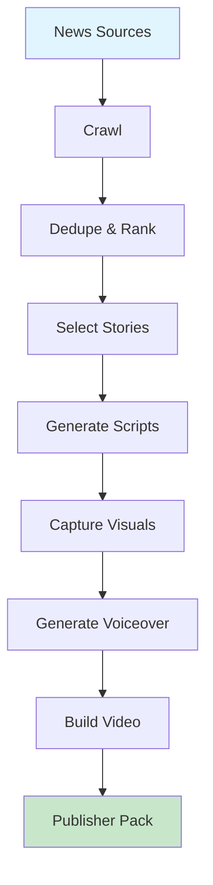

# AI Daily News Show

End-to-end orchestrator for daily AI news show production: crawl → rank → script → capture → voice → video → publish.



## CLI Quickstart

```bash
praisonai recipe run ai-daily-news-show \
  --input '{"date": "2024-12-29", "max_stories": 3}' \
  --json
```

## Use in Your App (SDK)

```python
import sys
sys.path.insert(0, 'agent_recipes/templates/ai-daily-news-show')
from tools import run_pipeline, check_stage_status, resume_pipeline

# Run full pipeline
result = run_pipeline(
    date="2024-12-29",
    sources=["hackernews", "reddit", "arxiv"],
    max_stories=3,
    human_approval=False
)

# Check stage status
status = check_stage_status(
    output_dir="./daily_show_20241229",
    stage="script"
)

# Resume after approval
resumed = resume_pipeline(
    output_dir="./daily_show_20241229",
    approved_items=[0, 1, 2]
)
```

## Input Schema

```json
{
  "type": "object",
  "properties": {
    "date": {"type": "string"},
    "sources": {"type": "array"},
    "max_stories": {"type": "integer", "default": 3},
    "human_approval": {"type": "boolean", "default": false}
  }
}
```

## Output Schema

```json
{
  "status": "complete",
  "output_dir": "./daily_show_20241229",
  "bundle": {...},
  "scripts": [...],
  "voiceovers": [...],
  "pipeline_log": {...}
}
```

## Pipeline Stages

| Stage | Recipe Used | Description |
|-------|-------------|-------------|
| crawl | ai-news-crawler | Gather news from sources |
| dedupe | ai-news-deduper | Remove duplicates |
| rank | ai-signal-ranker | Rank by signals |
| enrich | ai-context-enricher | Add context |
| select | - | Select top stories |
| script | ai-script-writer | Generate scripts |
| capture | ai-screenshot-capture | Capture visuals |
| voiceover | ai-voiceover-generator | Generate audio |
| video | ai-broll-builder | Build B-roll |
| merge | ai-video-merger | Combine audio/video |
| bundle | ai-publisher-pack | Create packages |

## Human Approval

Set `human_approval: true` to pause at the story selection stage for manual review.

## Environment Variables

| Variable | Required | Description |
|----------|----------|-------------|
| OPENAI_API_KEY | Yes | For all AI features |
| TAVILY_API_KEY | Optional | For web search |

## Dependencies

```bash
pip install praisonai praisonai-tools playwright
playwright install chromium
brew install ffmpeg  # macOS
```

## Related Tools

- [AI News Crawler](/docs/ai-tools/creator-suite/ai-news-crawler)
- [AI Script Writer](/docs/ai-tools/creator-suite/ai-script-writer)
- [AI Publisher Pack](/docs/ai-tools/creator-suite/ai-publisher-pack)
