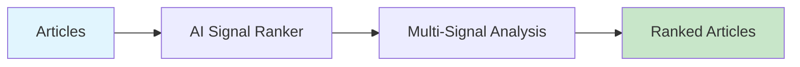

# AI Signal Ranker

Rank news articles using multiple signals: novelty, velocity, relevance, and engagement.



## CLI Quickstart

```bash
praisonai recipe run ai-signal-ranker \
  --input '{"articles": [...], "top_n": 10}' \
  --json
```

## Use in Your App (SDK)

```python
from praisonai.recipes import run_recipe

result = run_recipe(
    "ai-signal-ranker",
    input={
        "articles": articles_list,
        "top_n": 10,
        "weights": {
            "novelty": 0.3,
            "velocity": 0.2,
            "relevance": 0.3,
            "engagement": 0.2
        }
    }
)

# Direct tool usage
import sys
sys.path.insert(0, 'agent_recipes/templates/ai-signal-ranker')
from tools import rank_articles, calculate_novelty_score

ranked = rank_articles(articles, top_n=10)
```

## Input Schema

```json
{
  "type": "object",
  "properties": {
    "articles": {"type": "array"},
    "top_n": {"type": "integer", "default": 10},
    "weights": {
      "type": "object",
      "properties": {
        "novelty": {"type": "number"},
        "velocity": {"type": "number"},
        "relevance": {"type": "number"},
        "engagement": {"type": "number"}
      }
    }
  }
}
```

## Output Schema

```json
{
  "ranked_articles": [
    {
      "title": "...",
      "combined_score": 0.85,
      "scores": {
        "novelty": 0.9,
        "velocity": 0.8,
        "relevance": 0.85,
        "engagement": 0.75
      }
    }
  ]
}
```

## Signal Definitions

| Signal | Description |
|--------|-------------|
| Novelty | How new/unique the topic is |
| Velocity | How fast the story is spreading |
| Relevance | Match to target keywords/topics |
| Engagement | Social engagement metrics |

## Related Tools

- [AI News Crawler](/docs/ai-tools/creator-suite/ai-news-crawler)
- [AI Context Enricher](/docs/ai-tools/creator-suite/ai-context-enricher)
