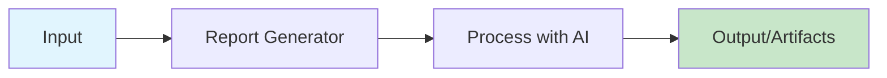
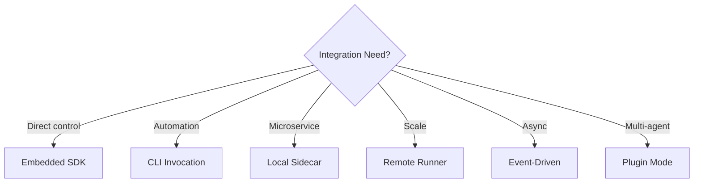

# Report Generator

Generate business reports from data



## CLI Quickstart (Beginner)

```bash
# Install
pip install praisonai praisonai-tools

# Run the tool
praisonai recipe run ai-report-generator \
  --input '{"input": "your-input-here"}' \
  --json

# With output directory
praisonai recipe run ai-report-generator \
  --input-file config.json \
  --out-dir ./output
```

**Output:**
```json
{
  "ok": true,
  "run_id": "run_abc123",
  "recipe": "ai-report-generator",
  "output": {},
  "artifacts": [],
  "warnings": [],
  "error": null
}
```

## Use in Your App (Embedded SDK)

```python
from praisonai.recipes import run_recipe

# Basic usage
result = run_recipe(
    "ai-report-generator",
    input={
        "input": "your-input-here"
    }
)

print(f"Success: {result['ok']}")
print(f"Output: {result['output']}")

# With streaming (if supported)
for event in run_recipe("ai-report-generator", input={}, stream=True):
    print(event)
```

## Use as a Server (HTTP Sidecar)

### Start Server
```bash
praisonai recipe serve --port 8080
```

### Invoke via curl
```bash
curl -X POST http://localhost:8080/v1/recipes/run \
  -H "Content-Type: application/json" \
  -d '{
    "recipe": "ai-report-generator",
    "input": {"input": "your-input-here"}
  }'
```

### With Authentication (Remote Runner)
```bash
export PRAISONAI_ENDPOINTS_URL=https://api.praisonai.com
export PRAISONAI_ENDPOINTS_API_KEY=your-key

curl -X POST $PRAISONAI_ENDPOINTS_URL/v1/recipes/run \
  -H "X-API-Key: $PRAISONAI_ENDPOINTS_API_KEY" \
  -H "Content-Type: application/json" \
  -d '{"recipe": "ai-report-generator", "input": {}}'
```

## Input / Output Schema

### Input Schema
```json
{
  "type": "object",
  "properties": {
    "input": {"type": "string", "description": "Primary input"},
    "options": {"type": "object", "description": "Additional options"}
  },
  "required": ["input"]
}
```

### Output Schema
```json
{
  "ok": true,
  "run_id": "string",
  "recipe": "ai-report-generator",
  "output": {},
  "artifacts": [{"path": "string", "type": "string"}],
  "warnings": [],
  "error": null
}
```

## Integration Models

### Model 1: Embedded SDK
```python
from praisonai.recipes import run_recipe
result = run_recipe("ai-report-generator", input={"input": "data"})
```

### Model 2: CLI Invocation
```bash
praisonai recipe run ai-report-generator --input-file config.json --json
```

### Model 3: Local HTTP Sidecar
```bash
praisonai recipe serve --port 8080
curl -X POST http://localhost:8080/v1/recipes/run -d '...'
```

### Model 4: Remote Managed Runner
```python
import os
os.environ["PRAISONAI_ENDPOINTS_URL"] = "https://api.praisonai.com"
os.environ["PRAISONAI_ENDPOINTS_API_KEY"] = "your-key"
```

### Model 5: Event-Driven
```python
queue.publish("recipes.run", {
    "recipe": "ai-report-generator",
    "input": {},
    "callback_url": "https://your-app.com/webhook"
})
```

### Model 6: Plugin Mode
```python
from praisonaiagents import Agent
agent = Agent(name="Worker", tools=["ai-report-generator"])
```



## Operational Notes

### Dependencies
```bash
pip install praisonai-tools
# Requires: pandas, LLM
```

### Performance Tips
- Use `--stream` for progress on long operations
- Enable caching for repeated inputs
- Use batch mode for multiple items

### Security Notes
- File paths are sandboxed
- Secrets are redacted in logs
- PII handling follows GDPR guidelines

### Troubleshooting

| Issue | Solution |
|-------|----------|
| Missing dependency | Install required extras |
| Timeout | Increase `--timeout-sec` |
| Invalid input | Check schema requirements |

## Related Tools

- [Chart Generator](/docs/ai-tools/data/ai-chart-generator)
- [Sentiment Analyzer](/docs/ai-tools/data/ai-sentiment-analyzer)
- [Data Anonymizer](/docs/ai-tools/data/ai-data-anonymizer)
