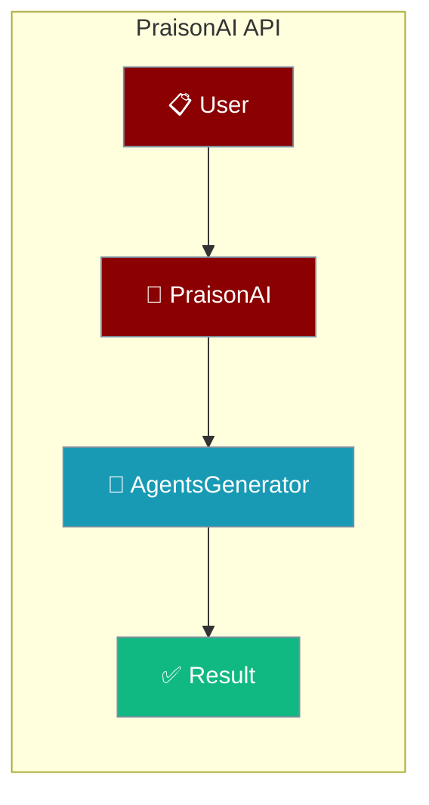
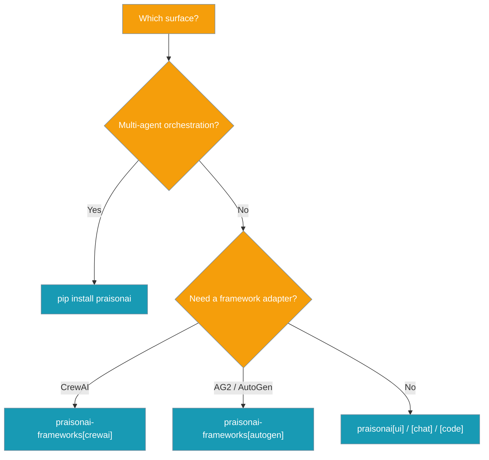
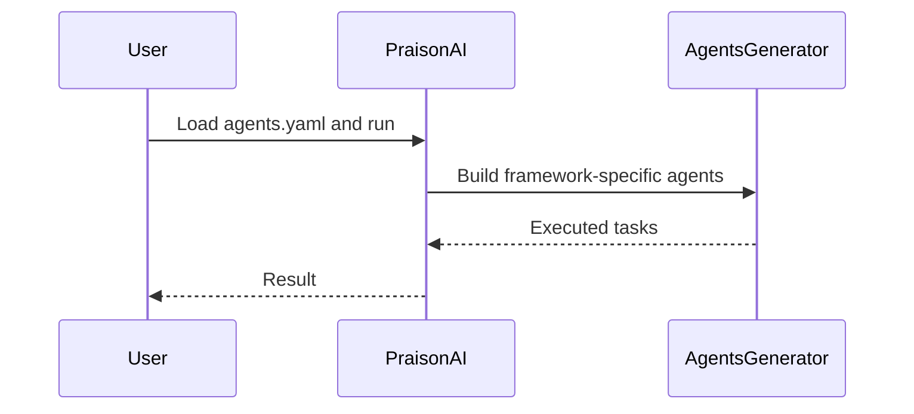

Import the SDK to drive agents from your own Python code, then reach for the `praisonai` wrapper for YAML-driven orchestration.

```python
from praisonaiagents import Agent

agent = Agent(instructions="Be helpful")
agent.start("Summarise the top AI news today")
```



Pick the install extra that matches how you want to run the API.



## Core Modules

### praisonai
The main package containing core functionality.

```python
from praisonai import PraisonAI
```

### praisonai.auto
Automated agent generation functionality.

```python
from praisonai.auto import AutoGenerator
```

### praisonai.agents_generator
Framework-specific agent generation and orchestration:
- CrewAI support (requires `praisonai-frameworks[crewai]`)
- AG2 (Formerly AutoGen) support (requires `praisonai-frameworks[autogen]`)

```python
from praisonai.agents_generator import AgentsGenerator
```

### praisonai.cli
Command-line interface with framework-specific handling.

```python
from praisonai.cli import PraisonAI
```

### praisonai.deploy
Deployment utilities.

```python
# The deploy subsystem is now driven via CLI:
#   praisonai deploy init
#   praisonai deploy run --type docker
#   praisonai deploy run --type cloud --provider gcp|aws|azure
#
# See /docs/deploy/cli/index for full reference.
```

<Note>
As of PraisonAI 4.6.x, `CloudDeployer` (from the `deploy.py` module) was removed. Direct users of `from praisonai.deploy import CloudDeployer` should migrate to `praisonai deploy` CLI commands.
</Note>

## Version

`praisonaiagents` exposes the installed package version as `__version__`:

```python
from praisonaiagents import __version__
print(__version__)   # "X.Y.Z"
```

## Installation Options

```bash
# Basic installation
pip install praisonai

# Framework-specific installations
pip install "praisonai-frameworks[crewai]"    # Install with CrewAI support
pip install "praisonai-frameworks[autogen]"   # Install with AG2 support
pip install "praisonai-frameworks[crewai,autogen]"  # Install both frameworks

# Additional features
pip install "praisonai[ui]"        # Install UI support
pip install "praisonai[chat]"      # Install Chat interface
pip install "praisonai[code]"      # Install Code interface
pip install "praisonai[realtime]"  # Install Realtime voice interaction
pip install "praisonai[call]"      # Install Call feature
```

## Framework-specific Features

### CrewAI
When installing with `pip install "praisonai-frameworks[crewai]"`, you get:
- CrewAI framework support
- PraisonAI tools integration
- Task delegation capabilities
- Sequential and parallel task execution

### AG2 (Formerly AutoGen)
When installing with `pip install "praisonai-frameworks[autogen]"`, you get:
- AG2 framework support
- PraisonAI tools integration
- Multi-agent conversation capabilities
- Code execution environment

## How It Works

Your code calls the SDK or the `praisonai` wrapper, which generates agents and runs them against the chosen framework.



## Best Practices

<AccordionGroup>
<Accordion title="Start with the SDK">
Use `from praisonaiagents import Agent` for embedding agents in Python. Reach for the `praisonai` wrapper only when you need YAML orchestration.
</Accordion>

<Accordion title="Install framework extras explicitly">
Add `praisonai-frameworks[crewai]` or `[autogen]` only when you target those frameworks — the core package stays lighter without them.
</Accordion>

<Accordion title="Read the version at runtime">
Use `from praisonaiagents import __version__` to log the installed version and pin all packages to the same release cycle.
</Accordion>

<Accordion title="Deploy via the CLI">
Use `praisonai deploy run --type docker|cloud` instead of the removed `CloudDeployer` class.
</Accordion>
</AccordionGroup>

## Related

<CardGroup cols={2}>
  <Card title="Installation" icon="download" href="/docs/installation">
    Choose the right package for your setup.
  </Card>
  <Card title="Quick Start" icon="bolt" href="/docs/quickstart">
    Build and run your first agent.
  </Card>
</CardGroup>