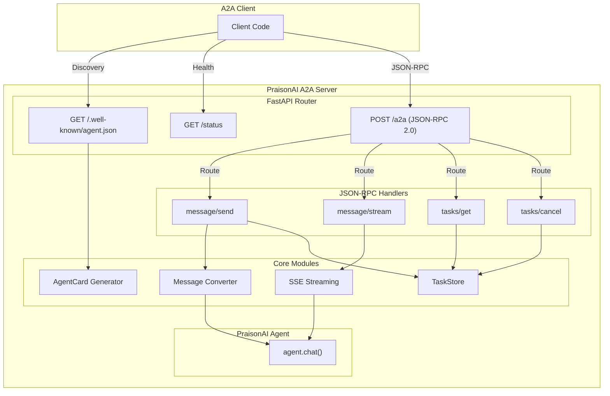
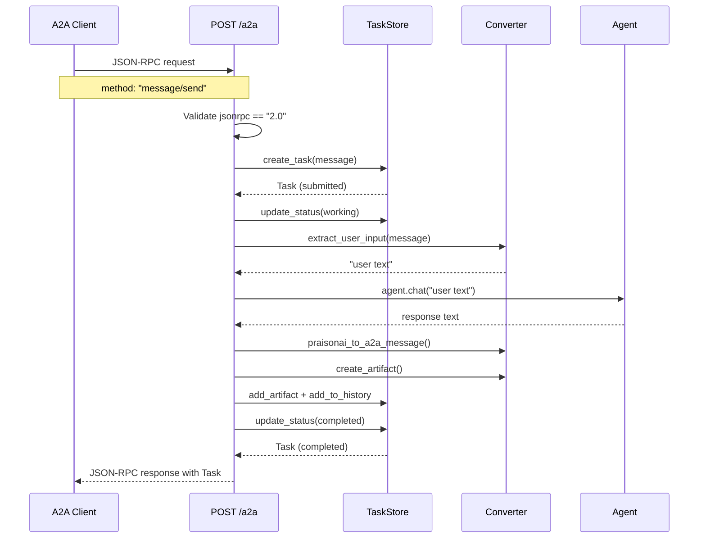
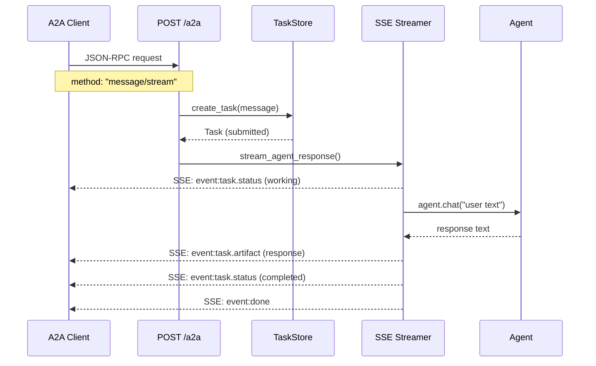
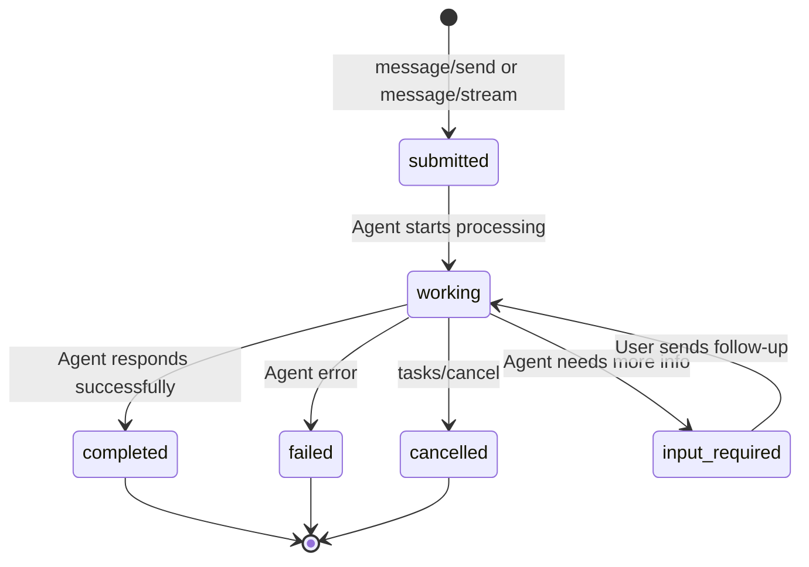
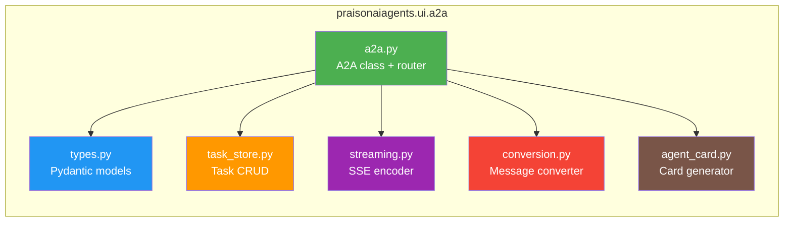

# A2A Protocol Architecture

## Overview

The A2A (Agent-to-Agent) protocol enables PraisonAI agents to communicate with other A2A-compatible systems using JSON-RPC 2.0 over HTTP.

## Architecture Diagram



## Data Flow: message/send



## Data Flow: message/stream



## Task Lifecycle



## Module Structure



## Quick Setup

```python
from praisonaiagents import Agent, A2A
from fastapi import FastAPI
import uvicorn

agent = Agent(
    name="Assistant",
    instructions="You are a helpful assistant",
    tools=[search, calculate]
)

# 2 lines to expose as A2A server
a2a = A2A(agent=agent, url="http://localhost:8000/a2a")

app = FastAPI()
app.include_router(a2a.get_router())
uvicorn.run(app, port=8000)
```

## JSON-RPC Methods

| Method | Description | Required Params |
|--------|-------------|----------------|
| `message/send` | Send message, get response | `params.message` |
| `message/stream` | Stream response as SSE | `params.message` |
| `tasks/get` | Get task by ID | `params.id` |
| `tasks/cancel` | Cancel task by ID | `params.id` |

## Error Codes

| Code | Meaning |
|------|---------|
| `-32700` | Parse error (invalid JSON) |
| `-32600` | Invalid Request (bad jsonrpc) |
| `-32601` | Method not found |
| `-32602` | Invalid params |
| `-32603` | Internal error |
| `-32000` | Task not found |
