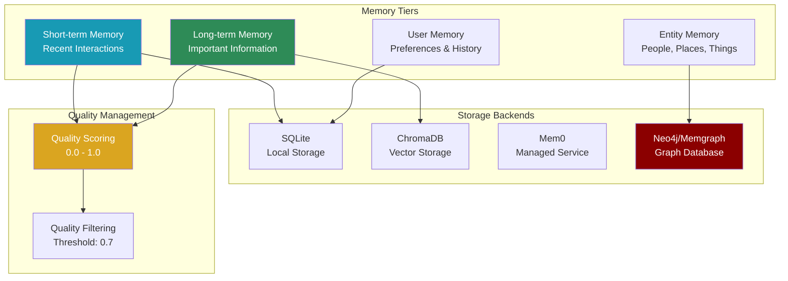

## Overview

The Memory module provides a sophisticated multi-tiered memory system that enables agents to maintain context across conversations, store and retrieve information efficiently, and even utilize graph databases for complex relationship mapping.



## Quick Start

<Steps>
  <Step>
    Install with memory support
    ```bash
    pip install praisonaiagents
    ```
  </Step>
  <Step>
    Basic memory usage
    ```python
    from praisonaiagents import Memory
    
    # Initialize memory system
    memory = Memory()
    
    # Store information
    memory.add(
        text="The user prefers Python over JavaScript",
        memory_type="long"
    )
    
    # Search memories
    results = memory.search("programming preferences")
    
    # Build context for agents
    context = memory.build_context_for_task(
        task_description="Help with a Python project",
        max_items=5
    )
    ```
  </Step>
  <Step>
    Advanced graph memory
    ```python
    from praisonaiagents import Memory
    
    # Initialize with graph support
    memory = Memory(
        graph_enabled=True,
        graph_uri="bolt://localhost:7687",
        graph_user="neo4j",
        graph_password="password"
    )
    
    # Store entity relationships
    memory.add(
        text="John works at TechCorp as a Senior Developer",
        memory_type="entity"
    )
    
    # Query graph relationships
    results = memory.search("Who works at TechCorp?")
    ```
  </Step>
</Steps>

## Configuration

### Basic Configuration

```python
memory = Memory(
    provider="rag",  # Options: "rag", "mem0", "none"
    use_embedding=True,
    api_key=None,  # For mem0 provider
    user_id="default_user",
    debug=False
)
```

### Advanced Configuration

```python
memory = Memory(
    # Storage paths
    rag_db_path="custom/path/chroma_db",
    short_db="custom/path/short_term.db",
    long_db="custom/path/long_term.db",
    entity_db="custom/path/entity.db",
    user_db="custom/path/user.db",
    
    # Graph configuration
    graph_enabled=True,
    graph_uri="bolt://localhost:7687",
    graph_user="neo4j",
    graph_password="password",
    
    # Quality settings
    quality_threshold=0.7,
    
    # Debug mode
    debug=True
)
```

## Memory Types

<Cards>
  <Card title="Short-term Memory" icon="clock">
    **Recent interactions and temporary context**
    - Last 10-20 interactions
    - Conversation flow
    - Temporary task state
    - Auto-expires old entries
  </Card>
  
  <Card title="Long-term Memory" icon="archive">
    **Important persistent information**
    - Key facts and learnings
    - User preferences
    - Historical patterns
    - Quality-filtered storage
  </Card>
  
  <Card title="Entity Memory" icon="diagram-project">
    **Structured entity relationships**
    - People, organizations, places
    - Relationships between entities
    - Graph-based storage
    - Complex queries
  </Card>
  
  <Card title="User Memory" icon="user">
    **User-specific information**
    - Personal preferences
    - Interaction history
    - Custom settings
    - Privacy-focused
  </Card>
</Cards>

## API Reference

### Constructor

```python
Memory(
    provider: str = "rag",
    use_embedding: bool = True,
    api_key: Optional[str] = None,
    user_id: str = "default_user",
    rag_db_path: str = "memory_chroma_db",
    short_db: str = "short_term_memory.db",
    long_db: str = "long_term_memory.db",
    entity_db: str = "entity_memory.db",
    user_db: str = "user_memory.db",
    graph_enabled: bool = False,
    graph_uri: Optional[str] = None,
    graph_user: Optional[str] = None,
    graph_password: Optional[str] = None,
    quality_threshold: float = 0.7,
    debug: bool = False
)
```

### Core Methods

#### add()

Store information in memory with optional quality scoring.

```python
add(
    text: str,
    memory_type: str = "short",
    quality_score: Optional[float] = None,
    metadata: Optional[Dict[str, Any]] = None
) -> None
```

**Parameters:**
- `text` - Content to store
- `memory_type` - Type: "short", "long", "entity", or "user"
- `quality_score` - Quality rating (0.0-1.0, auto-calculated if None)
- `metadata` - Additional metadata

#### search()

Search across all memory types for relevant information.

```python
search(
    query: str,
    memory_type: Optional[str] = None,
    limit: int = 5
) -> List[Dict[str, Any]]
```

**Returns list of:**
```python
{
    'text': str,          # Memory content
    'memory_type': str,   # Type of memory
    'timestamp': str,     # Creation time
    'quality_score': float,  # Quality rating
    'metadata': dict      # Additional data
}
```

#### update()

Update an existing memory entry.

```python
update(
    memory_id: str,
    text: str,
    memory_type: str = "short",
    quality_score: Optional[float] = None
) -> None
```

#### delete()

Delete a specific memory entry.

```python
delete(
    memory_id: str,
    memory_type: str = "short"
) -> None
```

### Context Building

#### build_context_for_task()

Build formatted context for a specific task.

```python
build_context_for_task(
    task_description: str,
    max_items: int = 10
) -> str
```

**Example output:**
```
Based on memory:
- User prefers Python for data science projects
- Previous experience with pandas and numpy
- Interested in machine learning applications
```

#### get_context()

Get all memories formatted as context.

```python
get_context(
    memory_type: Optional[str] = None,
    limit: int = 10
) -> str
```

### Quality Management

#### calculate_quality_score()

Calculate quality score for a memory entry.

```python
calculate_quality_score(
    text: str,
    memory_type: str = "short"
) -> float
```

**Scoring factors:**
- Information density
- Specificity
- Relevance indicators
- Entity mentions
- Temporal relevance

#### get_quality_memories()

Retrieve only high-quality memories.

```python
get_quality_memories(
    memory_type: str = "long",
    min_quality: float = 0.7,
    limit: int = 10
) -> List[Dict[str, Any]]
```

### Utility Methods

#### get_memories()

Retrieve raw memories from storage.

```python
get_memories(
    memory_type: str = "short",
    limit: int = 10
) -> List[Dict[str, Any]]
```

#### clear()

Clear all memories of a specific type.

```python
clear(memory_type: str = "all") -> None
```

Options: "short", "long", "entity", "user", "all"

#### get_stats()

Get memory system statistics.

```python
get_stats() -> Dict[str, Any]
```

**Returns:**
```python
{
    'total_memories': int,
    'by_type': {
        'short': int,
        'long': int,
        'entity': int,
        'user': int
    },
    'quality_distribution': dict,
    'storage_info': dict
}
```

## Usage Examples

### Basic Memory Usage

```python
from praisonaiagents import Agent, Memory

# Create memory system
memory = Memory(user_id="user_123")

# Create agent with memory
agent = Agent(
    name="Assistant",
    role="Personal AI Assistant",
    memory=memory
)

# Conversation that builds memory
agent.chat("I prefer morning meetings")
# Automatically stored in memory

agent.chat("Schedule something for tomorrow")
# Uses memory: "Scheduling morning meeting as you prefer"
```

### Quality-Based Storage

```python
from praisonaiagents import Memory

memory = Memory(quality_threshold=0.8)

# High-quality information
memory.add(
    "User's API key: sk-abc123def456",
    memory_type="long",
    quality_score=0.9
)

# Low-quality information (won't be stored in long-term)
memory.add(
    "User said hello",
    memory_type="long",
    quality_score=0.3
)

# Get only high-quality memories
important = memory.get_quality_memories(min_quality=0.8)
```

### Graph Memory Example

```python
from praisonaiagents import Memory

# Setup graph memory
memory = Memory(
    graph_enabled=True,
    graph_uri="bolt://localhost:7687",
    graph_user="neo4j",
    graph_password="password"
)

# Store entity relationships
memory.add(
    "Alice manages Bob and Charlie at DataCorp",
    memory_type="entity"
)

memory.add(
    "DataCorp acquired SmallStartup in 2024",
    memory_type="entity"
)

# Query relationships
results = memory.search("Who does Alice manage?")
# Returns information about Bob and Charlie

results = memory.search("DataCorp acquisitions")
# Returns information about SmallStartup acquisition
```

### Multi-Agent Memory Sharing

```python
from praisonaiagents import Memory, Agent, PraisonAIAgents

# Shared memory system
shared_memory = Memory(provider="rag")

# Create agents with shared memory
researcher = Agent(
    name="Researcher",
    role="Research Analyst",
    memory=shared_memory
)

writer = Agent(
    name="Writer",
    role="Content Creator",
    memory=shared_memory
)

# Researcher stores findings
researcher.chat("Found that 73% of users prefer dark mode")

# Writer can access the same memory
response = writer.chat("Write about user preferences")
# Uses the 73% statistic from shared memory
```

## Best Practices

<CardGroup cols={2}>
  <Card title="Memory Type Selection" icon="layer-group">
    **Short-term**: Conversation context, temporary state
    **Long-term**: Facts, preferences, important information
    **Entity**: People, places, organizations, relationships
    **User**: Personal data, settings, history
  </Card>
  
  <Card title="Quality Management" icon="chart-line">
    - Set appropriate quality thresholds (0.7-0.8 recommended)
    - Manually score critical information higher
    - Periodically review and clean low-quality memories
    - Use quality scores for retrieval filtering
  </Card>
  
  <Card title="Performance Optimization" icon="rocket">
    - Limit memory searches to necessary types
    - Use appropriate search limits
    - Clear short-term memory periodically
    - Index frequently accessed memories
  </Card>
  
  <Card title="Privacy & Security" icon="shield">
    - Separate user memories by user_id
    - Avoid storing sensitive data in plain text
    - Implement access controls for shared memory
    - Regular cleanup of old user data
  </Card>
</CardGroup>

## Provider Comparison

<Table>
  <TableHeader>
    <TableRow>
      <TableHeaderCell>Feature</TableHeaderCell>
      <TableHeaderCell>RAG (Default)</TableHeaderCell>
      <TableHeaderCell>Mem0</TableHeaderCell>
      <TableHeaderCell>None</TableHeaderCell>
    </TableRow>
  </TableHeader>
  <TableBody>
    <TableRow>
      <TableCell>Local Storage</TableCell>
      <TableCell>✅</TableCell>
      <TableCell>❌</TableCell>
      <TableCell>✅</TableCell>
    </TableRow>
    <TableRow>
      <TableCell>Embeddings</TableCell>
      <TableCell>✅</TableCell>
      <TableCell>✅</TableCell>
      <TableCell>❌</TableCell>
    </TableRow>
    <TableRow>
      <TableCell>Graph Support</TableCell>
      <TableCell>✅</TableCell>
      <TableCell>❌</TableCell>
      <TableCell>❌</TableCell>
    </TableRow>
    <TableRow>
      <TableCell>Quality Scoring</TableCell>
      <TableCell>✅</TableCell>
      <TableCell>⚠️</TableCell>
      <TableCell>✅</TableCell>
    </TableRow>
    <TableRow>
      <TableCell>API Required</TableCell>
      <TableCell>❌</TableCell>
      <TableCell>✅</TableCell>
      <TableCell>❌</TableCell>
    </TableRow>
    <TableRow>
      <TableCell>Scalability</TableCell>
      <TableCell>Medium</TableCell>
      <TableCell>High</TableCell>
      <TableCell>Low</TableCell>
    </TableRow>
  </TableBody>
</Table>

## Troubleshooting

**Common Issues:**

<Accordion>
  <AccordionItem title="Graph connection failed">
    Check Neo4j/Memgraph is running and credentials are correct
  </AccordionItem>
  <AccordionItem title="Memory search slow">
    Reduce search limit or disable embedding search
  </AccordionItem>
  <AccordionItem title="Quality scores too low">
    Adjust threshold or scoring algorithm
  </AccordionItem>
  <AccordionItem title="Storage full">
    Implement cleanup strategy for old memories
  </AccordionItem>
  <AccordionItem title="Mem0 API errors">
    Verify API key and check rate limits
  </AccordionItem>
</Accordion>

## Advanced Configuration

### Custom Quality Scoring

```python
from praisonaiagents import Memory

class CustomMemory(Memory):
    def calculate_quality_score(self, text: str, memory_type: str) -> float:
        # Base score
        score = super().calculate_quality_score(text, memory_type)
        
        # Custom adjustments
        if "important" in text.lower():
            score += 0.2
        if len(text) > 200:  # Favor detailed information
            score += 0.1
        if memory_type == "entity":  # Boost entity memories
            score += 0.15
            
        return min(score, 1.0)

# Use custom memory
memory = CustomMemory(quality_threshold=0.75)
```

### Memory Middleware

```python
from praisonaiagents import Agent, Memory
from datetime import datetime

class AuditedMemory(Memory):
    def add(self, text: str, memory_type: str = "short", **kwargs):
        # Add audit metadata
        kwargs['metadata'] = kwargs.get('metadata', {})
        kwargs['metadata']['added_at'] = datetime.now().isoformat()
        kwargs['metadata']['source'] = 'agent_conversation'
        
        # Log addition
        print(f"[AUDIT] Adding {memory_type} memory: {text[:50]}...")
        
        super().add(text, memory_type, **kwargs)

# Use with agents
memory = AuditedMemory()
agent = Agent(name="Audited", memory=memory)
```

## Summary

The Memory module provides a comprehensive solution for agent memory management:

✅ **Multi-tiered Architecture** - Different memory types for different needs  
✅ **Quality Management** - Automatic scoring and filtering  
✅ **Graph Support** - Complex relationship mapping with Neo4j/Memgraph  
✅ **Flexible Storage** - Multiple backend options  
✅ **Context Building** - Automatic context generation for tasks

Perfect for building agents that:
- Maintain conversation context
- Remember user preferences
- Track entity relationships
- Build knowledge over time