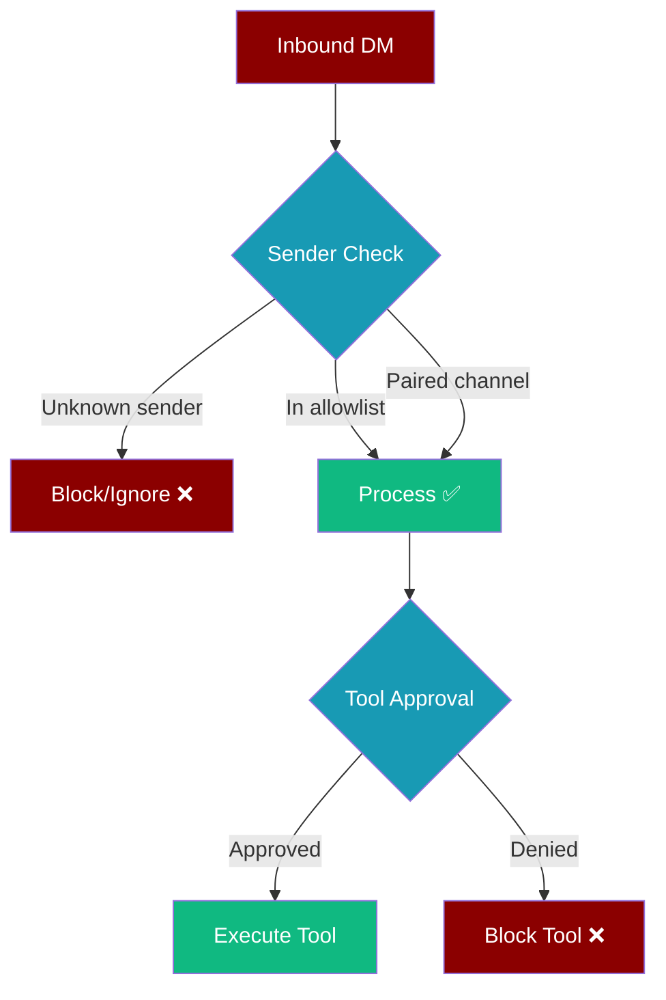

<Note>
**OpenClaw-style security for messaging bots.** This guide covers DM pairing, allowlists, and safe defaults across Telegram, Discord, Slack, WhatsApp, and other channels.
</Note>

## Security Model

PraisonAI treats **inbound DMs as untrusted input by default**. Production deployments should use explicit pairing and allowlists to prevent abuse, spam, and prompt injection from unknown senders.



## Safe Defaults by Channel

### Telegram

**Recommended production config:**

```yaml
# bot.yaml
channels:
  telegram:
    token: ${TELEGRAM_BOT_TOKEN}
    allowlist:
      - "@your_username"
      - "123456789"  # User ID
    group_policy: "mention_only"  # Only respond when mentioned
```

**Security features:**
- ✅ User allowlist by username or ID
- ✅ Group mention-only policy  
- ✅ Built-in command filtering
- ⚠️ DMs from unknown users are processed by default

### Discord

**Recommended production config:**

```yaml
# bot.yaml  
channels:
  discord:
    token: ${DISCORD_BOT_TOKEN}
    allowlist:
      - "your_user_id"
      - "guild:server_id"  # Specific server only
    group_policy: "mention_only"
```

**Security features:**
- ✅ User/guild allowlist support
- ✅ Role-based restrictions
- ✅ Thread-safe message handling
- ⚠️ DMs from unknown users are processed by default

### Slack

**Recommended production config:**

```yaml
# bot.yaml
channels:
  slack:
    token: ${SLACK_BOT_TOKEN}
    app_token: ${SLACK_APP_TOKEN}
    allowlist:
      - "U0123456789"  # User ID
      - "C9876543210"  # Channel ID
    group_policy: "mention_only"
```

**Security features:**
- ✅ User/channel allowlist
- ✅ Enterprise Grid support
- ✅ Socket mode security
- ✅ Built-in DM filtering (mentions required)

### WhatsApp

**Recommended production config:**

```yaml
# bot.yaml
channels:
  whatsapp:
    allowlist:
      - "+1234567890"    # Phone numbers
      - "group123@g.us"  # Group IDs
    blocklist:
      - "+spam_number"
```

**Security features:**
- ✅ **Strong default security** - allowlist required for DMs
- ✅ Phone number + group allowlists
- ✅ Built-in self-chat detection
- ✅ Automatic spam filtering

<Tip>
WhatsApp has the **strongest security defaults** and serves as the reference implementation for other channels.
</Tip>

## Gateway Pairing

For production deployments, use **gateway pairing** to authorize channels dynamically:

### 1. Set Gateway Secret

```bash
export PRAISONAI_GATEWAY_SECRET="your-secure-secret-key"
```

<Warning>
Without `PRAISONAI_GATEWAY_SECRET`, pairing codes will **not persist across restarts**. Set this in production.
</Warning>

### 2. Generate Pairing Code

```python
from praisonai.gateway.pairing import PairingStore

store = PaisingStore()
code = store.generate_code(channel_type="telegram")
print(f"Pairing code: {code}")  # 8-character hex code
```

### 3. Verify in Channel

Send the code to your bot in the target channel:

```
/pair abc12345
```

The bot will verify the HMAC signature and authorize the channel.

### 4. Check Status

```python
# Check if channel is paired
paired = store.is_paired("@username", "telegram")
print(f"Channel paired: {paired}")

# List all paired channels  
for channel in store.list_paired():
    print(f"{channel.channel_type}: {channel.channel_id}")
```

## Doctor Security Check

Use the built-in doctor to audit your bot security configuration:

```bash
praisonai doctor --category bots
```

The security check flags:

- ❌ **Missing allowlists** - channels without allowlist/blocklist
- ⚠️ **Permissive group policies** - `respond_all` in production  
- ⚠️ **Missing gateway secret** - pairing codes won't persist
- ✅ **Secure configuration** - allowlists + mention-only policies

Example output:

```
Bot Security Config: WARN  
Security recommendations: 2 channel(s) could use stricter defaults

Details:
telegram: No allowlist/blocklist configured
discord: group_policy='respond_all' - consider 'mention_only' for security

Remediation: Consider allowlists for DM security and 'mention_only' group policy
```

## Self-Hoster Security Checklist

**Before going public with your bot:**

<AccordionGroup>
  <Accordion title="✅ DM Policy Configured" icon="message">
    - [ ] Allowlist configured for each channel
    - [ ] Unknown sender behavior defined (block/ignore/process)
    - [ ] Group policies set to `mention_only` or `command_only`
    - [ ] Blocklist configured for known spam sources
  </Accordion>

  <Accordion title="✅ Gateway Pairing Active" icon="link">
    - [ ] `PRAISONAI_GATEWAY_SECRET` set
    - [ ] Pairing codes generated and shared securely
    - [ ] All production channels paired and verified
    - [ ] Revocation process documented
  </Accordion>

  <Accordion title="✅ Tool Approval Enabled" icon="shield-check">
    - [ ] Dangerous tools require approval (not auto-approved)
    - [ ] Approval backend configured (Slack/Telegram/HTTP)
    - [ ] Tool risk levels reviewed and appropriate
    - [ ] Approval timeout configured
  </Accordion>

  <Accordion title="✅ Monitoring & Alerts" icon="chart-line">
    - [ ] Bot security doctor check passing
    - [ ] Audit logging enabled (`praisonai.security.enable_audit_log`)
    - [ ] Injection defense active (`praisonai.security.enable_injection_defense`)  
    - [ ] Rate limiting configured for API calls
  </Accordion>

  <Accordion title="✅ Infrastructure Security" icon="server">
    - [ ] Bot tokens stored securely (not in code)
    - [ ] Environment variables encrypted at rest
    - [ ] Network access restricted (firewall rules)
    - [ ] Regular security updates scheduled
  </Accordion>
</AccordionGroup>

## Common Security Patterns

### 1. Staged Rollout

Start with restrictive settings and gradually open access:

```yaml
# Stage 1: Internal testing
channels:
  telegram:
    allowlist: ["@internal_team"]
    group_policy: "command_only"

# Stage 2: Trusted users
channels:
  telegram:
    allowlist: ["@internal_team", "@trusted_users"]  
    group_policy: "mention_only"

# Stage 3: Public (with safety nets)
channels:
  telegram:
    # Remove allowlist for open access
    group_policy: "mention_only"
    rate_limit: 10  # messages per minute
```

### 2. Multi-Channel Allowlist

Maintain consistent allowlists across channels:

```yaml
# Shared allowlist
x-allowlist: &shared-users
  - "admin_user_1"
  - "admin_user_2"
  - "trusted_group_1"

channels:
  telegram:
    allowlist: *shared-users
  discord:
    allowlist: *shared-users  
  slack:
    allowlist: *shared-users
```

### 3. Environment-Based Security

Different security levels per environment:

```yaml
# development.yaml - loose security
channels:
  telegram:
    # No allowlist for dev testing
    group_policy: "respond_all"

# staging.yaml - moderate security
channels:
  telegram:
    allowlist: ["@staging_team"]
    group_policy: "mention_only"
    
# production.yaml - strict security  
channels:
  telegram:
    allowlist: ["@verified_users"]
    group_policy: "command_only"
    approval: true  # All tools need approval
```

## Security Headers & API Protection

When running bot gateways, enable security headers:

```python
from praisonai.gateway import GatewayServer

server = GatewayServer(
    host="0.0.0.0",
    port=8765,
    security_headers=True,  # Add CORS, CSP, etc.
    rate_limit=True,        # Enable rate limiting
    require_https=True,     # Redirect HTTP to HTTPS
)
```

## Advanced: Custom Security Hooks

Implement custom security logic with hooks:

```python
from praisonaiagents.hooks import add_hook, HookResult

@add_hook('before_tool')
def channel_security_check(event_data):
    """Custom security check based on channel type"""
    channel = event_data.context.get('channel_type')
    sender = event_data.context.get('sender_id') 
    tool_name = event_data.tool_name
    
    # Block file operations from Telegram DMs
    if channel == 'telegram' and tool_name in ['write_file', 'delete_file']:
        if not is_verified_user(sender):
            return HookResult.block("File operations not allowed from unverified Telegram users")
    
    # Require approval for shell commands from all channels
    if tool_name == 'execute_command':
        return HookResult.request_approval(f"Shell command from {channel}: {sender}")
    
    return HookResult.allow()

def is_verified_user(user_id: str) -> bool:
    """Check if user is in verified allowlist"""
    verified_users = os.environ.get('VERIFIED_USERS', '').split(',')
    return user_id in verified_users
```

## Troubleshooting

### Pairing Issues

**Problem:** Pairing codes not working
**Solution:**
1. Check `PRAISONAI_GATEWAY_SECRET` is set
2. Verify code hasn't expired (5 min default)  
3. Ensure code typed exactly (case sensitive)

**Problem:** Pairing lost after restart
**Solution:** 
1. Set `PRAISONAI_GATEWAY_SECRET` env var
2. Codes without persistent secret are temporary

### Allowlist Issues

**Problem:** Bot not responding to allowed users
**Solution:**
1. Check exact user ID format (username vs numeric ID)
2. Verify allowlist syntax in YAML
3. Run `praisonai doctor` for validation

**Problem:** Bot responding to blocked users
**Solution:**
1. Check allowlist is configured (not just blocklist)
2. Verify `group_policy` setting
3. Check if user has alternate access path

---

By following these security practices, your PraisonAI bots will operate safely in production while maintaining the flexibility to serve legitimate users. Regular security audits with `praisonai doctor` help ensure your configuration stays secure over time.