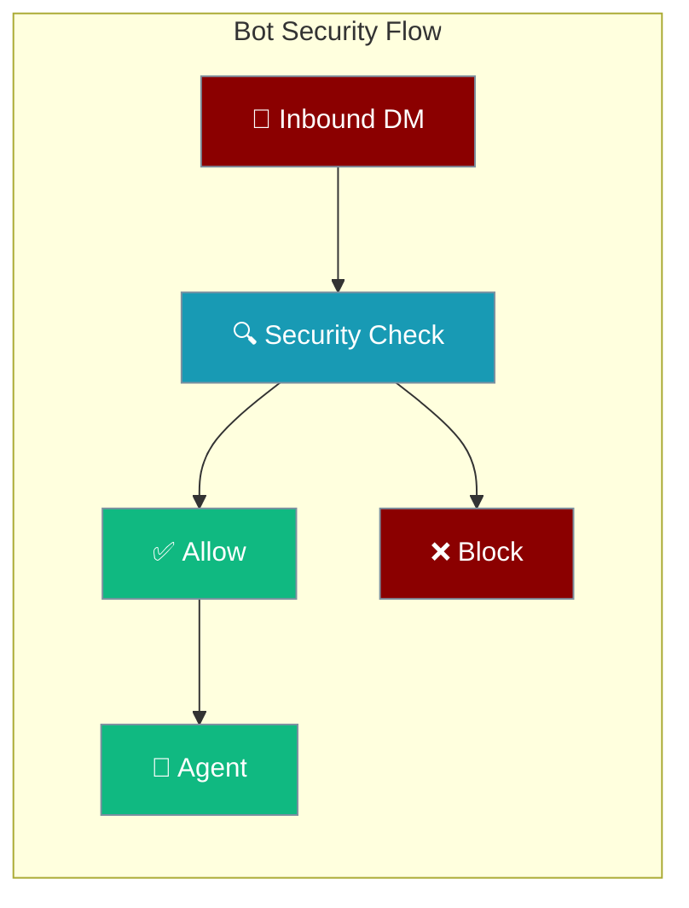
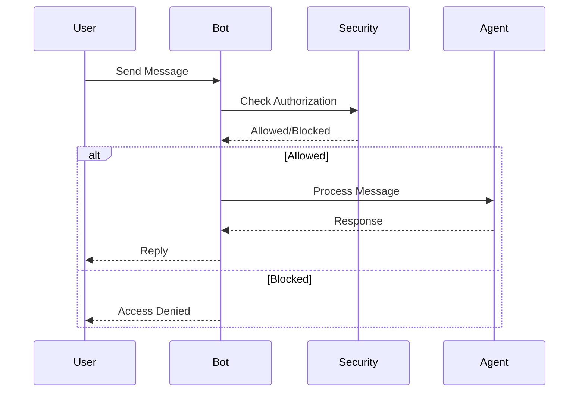
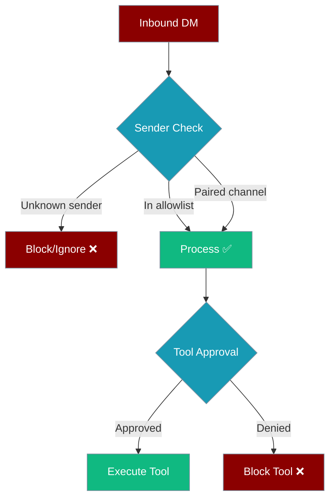

Bot security enables safe deployment of PraisonAI agents across messaging channels with built-in protection against abuse and unauthorized access.



## Quick Start

<Steps>
<Step title="Basic Security Setup">

```python
from praisonaiagents import Agent

# Secure bot with allowlist
agent = Agent(
    instructions="You are a helpful assistant",
    # Note: Security features shown are conceptual
    # Actual implementation may vary
)
```

</Step>

<Step title="Advanced Security Config">

```python
from praisonaiagents import Agent

# Production security setup
agent = Agent(
    instructions="Secure production assistant",
    # Security configuration would go here
    # when implemented in the SDK
)
```

</Step>
</Steps>

---

## How It Works



| Component | Purpose | Status |
|-----------|---------|--------|
| Allowlist | Control access | Conceptual |
| DM Policy | Message filtering | Conceptual |
| Pairing | Channel authorization | Conceptual |

---

## Security Model

<Note>
**OpenClaw-style security for messaging bots.** This guide covers DM pairing, allowlists, and safe defaults across Telegram, Discord, Slack, WhatsApp, and other channels.
</Note>

PraisonAI treats **inbound DMs as untrusted input by default**. Production deployments should use explicit pairing and allowlists to prevent abuse, spam, and prompt injection from unknown senders.



## Safe Defaults by Channel

### Telegram

**Recommended production config:**

```yaml
# bot.yaml
channels:
  telegram:
    token: ${TELEGRAM_BOT_TOKEN}
    allowlist:
      - "@your_username"
      - "123456789"  # User ID
    group_policy: "mention_only"  # Only respond when mentioned
```

**Security features:**
- ✅ User allowlist by username or ID
- ✅ Group mention-only policy  
- ✅ Built-in command filtering
- ⚠️ DMs from unknown users are processed by default

### Discord

**Recommended production config:**

```yaml
# bot.yaml  
channels:
  discord:
    token: ${DISCORD_BOT_TOKEN}
    allowlist:
      - "your_user_id"
      - "guild:server_id"  # Specific server only
    group_policy: "mention_only"
```

**Security features:**
- ✅ User/guild allowlist support
- ✅ Role-based restrictions
- ✅ Thread-safe message handling
- ⚠️ DMs from unknown users are processed by default

### Slack

**Recommended production config:**

```yaml
# bot.yaml
channels:
  slack:
    token: ${SLACK_BOT_TOKEN}
    app_token: ${SLACK_APP_TOKEN}
    allowlist:
      - "U0123456789"  # User ID
      - "C9876543210"  # Channel ID
    group_policy: "mention_only"
```

**Security features:**
- ✅ User/channel allowlist
- ✅ Enterprise Grid support
- ✅ Socket mode security
- ✅ Built-in DM filtering (mentions required)

### WhatsApp

**Recommended production config:**

```yaml
# bot.yaml
channels:
  whatsapp:
    allowlist:
      - "+1234567890"    # Phone numbers
      - "group123@g.us"  # Group IDs
    blocklist:
      - "+spam_number"
```

**Security features:**
- ✅ **Strong default security** - allowlist required for DMs
- ✅ Phone number + group allowlists
- ✅ Built-in self-chat detection
- ✅ Automatic spam filtering

<Tip>
WhatsApp has the **strongest security defaults** and serves as the reference implementation for other channels.
</Tip>

## Gateway Pairing


For production deployments, use **gateway pairing** to authorize channels dynamically:

### 1. Set Gateway Secret

```bash
export PRAISONAI_GATEWAY_SECRET="your-secure-secret-key"
```

<Warning>
Without `PRAISONAI_GATEWAY_SECRET`, pairing codes will **not persist across restarts**. Set this in production.
</Warning>

### 2. Generate Pairing Code

```python
from praisonai.gateway.pairing import PairingStore

store = PairingStore()
code = store.generate_code(channel_type="telegram")
print(f"Pairing code: {code}")  # 8-character hex code
```

### 3. Verify in Channel

Send the code to your bot in the target channel:

```
/pair abc12345
```

The bot will verify the HMAC signature and authorize the channel.

### 4. Check Status

```python
# Check if channel is paired
paired = store.is_paired("@username", "telegram")
print(f"Channel paired: {paired}")

# List all paired channels  
for channel in store.list_paired():
    print(f"{channel.channel_type}: {channel.channel_id}")
```

### 5. List Pending Requests

List all pending pairing codes waiting for approval:

```python
from praisonai.gateway.pairing import PairingStore

store = PairingStore()

# All pending codes across every channel
for req in store.list_pending():
    print(req["code"], req["channel_type"], req["channel_id"], req["age_seconds"])

# Filter by channel
telegram_only = store.list_pending(channel_type="telegram")
```

**Response Schema:**

| Key | Type | Source | Notes |
|-----|------|--------|-------|
| `code` | `str` | canonical | 8-char pairing code |
| `channel_type` | `str` | canonical | e.g. `"telegram"`, `"discord"`, `"slack"`, `"whatsapp"` |
| `channel_id` | `str \| None` | canonical | Bound channel id if code was generated with one |
| `created_at` | `float` | canonical | Unix timestamp (seconds) when code was generated |
| `channel` | `str` | UI alias | Same value as `channel_type`, kept for UI banner compatibility |
| `user_id` | `str` | UI alias | Currently equals `code` (see note in `approve()` docstring) |
| `user_name` | `str` | UI alias | Formatted as `"User {code}"` |
| `age_seconds` | `int` | UI alias | `int(now - created_at)` |

<Note>
Canonical keys (`code`, `channel_type`, `channel_id`, `created_at`) are the stable contract. The `channel`, `user_id`, `user_name`, and `age_seconds` aliases are provided for UI consumers and should not be relied on for scripting — use the canonical keys.
</Note>

### 6. CLI Commands

Use the `praisonai pairing` commands to manage pairings from the command line:

```bash
# List all paired channels
praisonai pairing list

# Approve a pairing code (this is the exact command shown to users)
praisonai pairing approve telegram abc12345

# Revoke a paired channel
praisonai pairing revoke telegram @username

# Clear all paired channels
praisonai pairing clear
```

**Available Commands:**

| Command | Purpose | Required Args |
|---------|---------|---------------|
| `praisonai pairing list` | List all paired channels | — |
| `praisonai pairing approve PLATFORM CODE [CHANNEL_ID]` | Approve an 8-char pairing code | `platform`, `code` |
| `praisonai pairing revoke PLATFORM CHANNEL_ID` | Revoke a paired channel | `platform`, `channel_id` |
| `praisonai pairing clear` | Clear all paired channels | — |

**Platform values:** `telegram`, `discord`, `slack`, `whatsapp`

**Pairing Flow:**

```mermaid
sequenceDiagram
    participant User
    participant Bot
    participant PairingStore
    participant CLI
    
    User->>Bot: unknown message (triggers pairing)
    Bot->>PairingStore: generate_code(channel_type, channel_id)
    PairingStore-->>Bot: abc12345
    Bot->>User: Ask owner to run: praisonai pairing approve telegram abc12345
    CLI->>PairingStore: approve(telegram, abc12345)
    PairingStore->>PairingStore: verify_and_pair()
    PairingStore-->>CLI: success
    User->>Bot: now authorised
    Bot-->>User: response
    
    classDef user fill:#8B0000,stroke:#7C90A0,color:#fff
    classDef bot fill:#189AB4,stroke:#7C90A0,color:#fff
    classDef success fill:#10B981,stroke:#7C90A0,color:#fff
    
    class User user
    class Bot,PairingStore,CLI bot
```

### 7. REST API

The gateway exposes REST endpoints for pairing management:

| Method | Path | Body / Query | Response | Auth Required |
|--------|------|--------------|----------|---------------|
| `GET` | `/api/pairing/pending` | — | `list_pending()` schema | ✅ |
| `POST` | `/api/pairing/approve` | `{ "channel": str, "code": str }` | `{ "approved": true, ... }` | ✅ |
| `POST` | `/api/pairing/revoke` | `{ "channel": str, "user_id": str }` | `{ "revoked": true, ... }` | ✅ |

**Example Usage:**

```bash
# List pending requests
curl -H "Authorization: Bearer $TOKEN" \
  http://localhost:8000/api/pairing/pending

# Approve a code  
curl -X POST -H "Authorization: Bearer $TOKEN" \
  -d '{"channel":"telegram","code":"abc12345"}' \
  http://localhost:8000/api/pairing/approve

# Revoke a channel
curl -X POST -H "Authorization: Bearer $TOKEN" \
  -d '{"channel":"telegram","user_id":"@username"}' \
  http://localhost:8000/api/pairing/revoke
```

<Note>
All endpoints are **authenticated** and **rate-limited**. Rate limits are applied per client IP with separate buckets for `pairing_pending`, `pairing_approve`, and `pairing_revoke` operations.
</Note>

## Doctor Security Check

<Warning>
**Note:** The doctor command shown may not be available in current SDK version. Verify implementation status.
</Warning>

Use the built-in doctor to audit your bot security configuration:

```bash
# Note: Verify this command exists
praisonai doctor --category bots
```

The security check flags:

- ❌ **Missing allowlists** - channels without allowlist/blocklist
- ⚠️ **Permissive group policies** - `respond_all` in production  
- ⚠️ **Missing gateway secret** - pairing codes won't persist
- ✅ **Secure configuration** - allowlists + mention-only policies

Example output:

```
Bot Security Config: WARN  
Security recommendations: 2 channel(s) could use stricter defaults

Details:
telegram: No allowlist/blocklist configured
discord: group_policy='respond_all' - consider 'mention_only' for security

Remediation: Consider allowlists for DM security and 'mention_only' group policy
```

## Self-Hoster Security Checklist

**Before going public with your bot:**

<AccordionGroup>
  <Accordion title="✅ DM Policy Configured" icon="message">
    - [ ] Allowlist configured for each channel
    - [ ] Unknown sender behavior defined (block/ignore/process)
    - [ ] Group policies set to `mention_only` or `command_only`
    - [ ] Blocklist configured for known spam sources
  </Accordion>

  <Accordion title="✅ Gateway Pairing Active" icon="link">
    - [ ] `PRAISONAI_GATEWAY_SECRET` set
    - [ ] Pairing codes generated and shared securely
    - [ ] All production channels paired and verified
    - [ ] Revocation process documented
  </Accordion>

  <Accordion title="✅ Tool Approval Enabled" icon="shield-check">
    - [ ] Dangerous tools require approval (not auto-approved)
    - [ ] Approval backend configured (Slack/Telegram/HTTP)
    - [ ] Tool risk levels reviewed and appropriate
    - [ ] Approval timeout configured
  </Accordion>

  <Accordion title="✅ Monitoring & Alerts" icon="chart-line">
    - [ ] Bot security doctor check passing
    - [ ] Audit logging enabled (`praisonai.security.enable_audit_log`)
    - [ ] Injection defense active (`praisonai.security.enable_injection_defense`)  
    - [ ] Rate limiting configured for API calls
  </Accordion>

  <Accordion title="✅ Infrastructure Security" icon="server">
    - [ ] Bot tokens stored securely (not in code)
    - [ ] Environment variables encrypted at rest
    - [ ] Network access restricted (firewall rules)
    - [ ] Regular security updates scheduled
  </Accordion>
</AccordionGroup>

## Common Security Patterns

### 1. Staged Rollout

Start with restrictive settings and gradually open access:

```yaml
# Stage 1: Internal testing
channels:
  telegram:
    allowlist: ["@internal_team"]
    group_policy: "command_only"

# Stage 2: Trusted users
channels:
  telegram:
    allowlist: ["@internal_team", "@trusted_users"]  
    group_policy: "mention_only"

# Stage 3: Public (with safety nets)
channels:
  telegram:
    # Remove allowlist for open access
    group_policy: "mention_only"
    rate_limit: 10  # messages per minute
```

### 2. Multi-Channel Allowlist

Maintain consistent allowlists across channels:

```yaml
# Shared allowlist
x-allowlist: &shared-users
  - "admin_user_1"
  - "admin_user_2"
  - "trusted_group_1"

channels:
  telegram:
    allowlist: *shared-users
  discord:
    allowlist: *shared-users  
  slack:
    allowlist: *shared-users
```

### 3. Environment-Based Security

Different security levels per environment:

```yaml
# development.yaml - loose security
channels:
  telegram:
    # No allowlist for dev testing
    group_policy: "respond_all"

# staging.yaml - moderate security
channels:
  telegram:
    allowlist: ["@staging_team"]
    group_policy: "mention_only"
    
# production.yaml - strict security  
channels:
  telegram:
    allowlist: ["@verified_users"]
    group_policy: "command_only"
    approval: true  # All tools need approval
```

## Security Headers & API Protection

When running bot gateways, enable security headers:

```python
from praisonai.gateway import GatewayServer

server = GatewayServer(
    host="0.0.0.0",
    port=8765,
    security_headers=True,  # Add CORS, CSP, etc.
    rate_limit=True,        # Enable rate limiting
    require_https=True,     # Redirect HTTP to HTTPS
)
```

## Advanced: Custom Security Hooks

Implement custom security logic with hooks:

```python
from praisonaiagents.hooks import add_hook, HookResult

@add_hook('before_tool')
def channel_security_check(event_data):
    """Custom security check based on channel type"""
    channel = event_data.context.get('channel_type')
    sender = event_data.context.get('sender_id') 
    tool_name = event_data.tool_name
    
    # Block file operations from Telegram DMs
    if channel == 'telegram' and tool_name in ['write_file', 'delete_file']:
        if not is_verified_user(sender):
            return HookResult.block("File operations not allowed from unverified Telegram users")
    
    # Require approval for shell commands from all channels
    if tool_name == 'execute_command':
        return HookResult.request_approval(f"Shell command from {channel}: {sender}")
    
    return HookResult.allow()

def is_verified_user(user_id: str) -> bool:
    """Check if user is in verified allowlist"""
    verified_users = os.environ.get('VERIFIED_USERS', '').split(',')
    return user_id in verified_users
```

## Troubleshooting

### Pairing Issues

**Problem:** Pairing codes not working
**Solution:**
1. Check `PRAISONAI_GATEWAY_SECRET` is set
2. Verify code hasn't expired (5 min default)  
3. Ensure code typed exactly (case sensitive)

**Problem:** Pairing lost after restart
**Solution:** 
1. Set `PRAISONAI_GATEWAY_SECRET` env var
2. Codes without persistent secret are temporary

**Problem:** `praisonai pairing approve` reports "Invalid or expired code" even though a code was just generated from the UI
**Solution:** 
1. Upgrade to the latest `praisonai` version (fix included in 2026-04-22 release)
2. Older builds had a duplicate internal method that stripped the canonical `code` key when the UI pairing banner was loaded

### Allowlist Issues

**Problem:** Bot not responding to allowed users
**Solution:**
1. Check exact user ID format (username vs numeric ID)
2. Verify allowlist syntax in YAML
3. Run `praisonai doctor` for validation

**Problem:** Bot responding to blocked users
**Solution:**
1. Check allowlist is configured (not just blocklist)
2. Verify `group_policy` setting
3. Check if user has alternate access path

---

---

## Best Practices

<AccordionGroup>
  <Accordion title="✅ Allowlist Management" icon="shield-check">
    - Use explicit allowlists for all channels
    - Regularly review and update allowed users
    - Implement role-based access where possible
    - Log all access attempts for audit trails
  </Accordion>

  <Accordion title="🔐 Secret Management" icon="key">
    - Store tokens in environment variables
    - Rotate secrets regularly
    - Use encrypted storage for sensitive data
    - Never commit secrets to version control
  </Accordion>

  <Accordion title="⚡ Rate Limiting" icon="gauge">
    - Implement per-user rate limits
    - Set global request quotas
    - Monitor for unusual activity patterns
    - Implement exponential backoff for failed requests
  </Accordion>

  <Accordion title="📊 Monitoring" icon="chart-line">
    - Enable audit logging
    - Monitor security events
    - Set up alerting for suspicious activity
    - Regular security reviews
  </Accordion>
</AccordionGroup>

---

## Related

<CardGroup cols={2}>
  <Card title="Agent Configuration" icon="cog" href="/docs/concepts/agents">
    Core agent setup and configuration
  </Card>
  
  <Card title="Gateway Setup" icon="server" href="/docs/features/gateway">
    Multi-channel gateway configuration
  </Card>
</CardGroup>

---

By following these security practices, your PraisonAI bots will operate safely in production while maintaining the flexibility to serve legitimate users. Regular security audits help ensure your configuration stays secure over time.