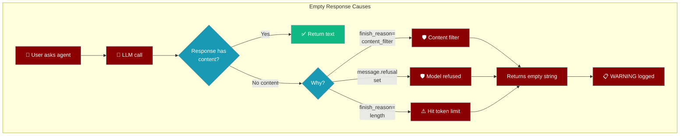

# Error Handling in Multi-Agent Systems

Proper error handling is critical in multi-agent systems where failures can cascade across multiple agents. This guide covers best practices for building resilient multi-agent applications.

## Core Principles

### 1. Fail Fast and Gracefully

```python
from praisonaiagents import Agent, Task, AgentTeam
import logging

logger = logging.getLogger(__name__)

def safe_agent_execution(agent, task):
    """Wrapper for safe agent execution with proper error handling"""
    try:
        result = agent.execute(task)
        return result
    except Exception as e:
        logger.error(f"Agent {agent.name} failed: {str(e)}")
        # Return a safe default or error indicator
        return {"status": "error", "error": str(e), "agent": agent.name}
```

<Note>
PraisonAI now ships a **built-in tool circuit breaker** that wraps every tool call automatically. See [Tool Circuit Breaker](/features/tool-circuit-breaker). The examples below show how to extend or customise that pattern.
</Note>

### 2. Implement Circuit Breakers

Prevent cascading failures by implementing circuit breaker patterns:

```python
class CircuitBreaker:
    def __init__(self, failure_threshold=5, timeout=60):
        self.failure_count = 0
        self.failure_threshold = failure_threshold
        self.timeout = timeout
        self.last_failure_time = None
        self.is_open = False
    
    def call(self, func, *args, **kwargs):
        if self.is_open:
            if time.time() - self.last_failure_time > self.timeout:
                self.is_open = False
                self.failure_count = 0
            else:
                raise Exception("Circuit breaker is open")
        
        try:
            result = func(*args, **kwargs)
            self.failure_count = 0
            return result
        except Exception as e:
            self.failure_count += 1
            self.last_failure_time = time.time()
            
            if self.failure_count >= self.failure_threshold:
                self.is_open = True
                logger.error(f"Circuit breaker opened after {self.failure_count} failures")
            
            raise e
```

## Error Handling Strategies

### 1. Agent-Level Error Handling

Each agent should have its own error handling logic:

```python
class ResilientAgent(Agent):
    def __init__(self, *args, max_retries=3, **kwargs):
        super().__init__(*args, **kwargs)
        self.max_retries = max_retries
    
    def execute_with_retry(self, task):
        for attempt in range(self.max_retries):
            try:
                return self.execute(task)
            except Exception as e:
                if attempt == self.max_retries - 1:
                    logger.error(f"Agent {self.name} failed after {self.max_retries} attempts")
                    raise
                logger.warning(f"Agent {self.name} attempt {attempt + 1} failed: {str(e)}")
                time.sleep(2 ** attempt)  # Exponential backoff
```

### 2. Task-Level Error Handling

Implement error boundaries at the task level:

```python
class SafeTask(Task):
    def __init__(self, *args, fallback_result=None, **kwargs):
        super().__init__(*args, **kwargs)
        self.fallback_result = fallback_result
    
    def execute(self, agent):
        try:
            return super().execute(agent)
        except Exception as e:
            logger.error(f"Task {self.name} failed: {str(e)}")
            if self.fallback_result is not None:
                return self.fallback_result
            raise
```

### 3. System-Level Error Handling

Implement comprehensive error handling at the system level:

```python
class ResilientMultiAgentSystem:
    def __init__(self, agents, error_handler=None):
        self.agents = agents
        self.error_handler = error_handler or self.default_error_handler
        self.error_log = []
    
    def default_error_handler(self, error, context):
        """Default error handler that logs and continues"""
        self.error_log.append({
            "timestamp": time.time(),
            "error": str(error),
            "context": context
        })
        logger.error(f"System error: {error} in context: {context}")
    
    def execute_with_error_handling(self, tasks):
        results = []
        for task in tasks:
            try:
                result = self.execute_task(task)
                results.append(result)
            except Exception as e:
                self.error_handler(e, {"task": task.name})
                # Continue with next task or implement custom logic
        return results
```

## Error Recovery Patterns

### 1. Compensation Pattern

Implement compensating actions when errors occur:

```python
class CompensatingTransaction:
    def __init__(self):
        self.executed_steps = []
    
    def add_step(self, forward_action, compensate_action):
        self.executed_steps.append({
            "forward": forward_action,
            "compensate": compensate_action
        })
    
    def execute(self):
        completed_steps = []
        try:
            for step in self.executed_steps:
                result = step["forward"]()
                completed_steps.append(step)
        except Exception as e:
            # Rollback completed steps
            for step in reversed(completed_steps):
                try:
                    step["compensate"]()
                except Exception as comp_error:
                    logger.error(f"Compensation failed: {comp_error}")
            raise e
```

### 2. Saga Pattern

For long-running multi-agent transactions:

```python
class Saga:
    def __init__(self):
        self.steps = []
    
    def add_step(self, agent, task, compensate_task=None):
        self.steps.append({
            "agent": agent,
            "task": task,
            "compensate": compensate_task
        })
    
    def execute(self):
        completed = []
        try:
            for step in self.steps:
                result = step["agent"].execute(step["task"])
                completed.append((step, result))
        except Exception as e:
            # Execute compensating transactions
            for step, _ in reversed(completed):
                if step["compensate"]:
                    step["agent"].execute(step["compensate"])
            raise e
```

## Monitoring and Alerting

### 1. Error Metrics Collection

```python
class ErrorMetricsCollector:
    def __init__(self):
        self.metrics = {
            "total_errors": 0,
            "errors_by_agent": {},
            "errors_by_type": {},
            "error_rate": []
        }
    
    def record_error(self, agent_name, error_type, timestamp):
        self.metrics["total_errors"] += 1
        
        if agent_name not in self.metrics["errors_by_agent"]:
            self.metrics["errors_by_agent"][agent_name] = 0
        self.metrics["errors_by_agent"][agent_name] += 1
        
        if error_type not in self.metrics["errors_by_type"]:
            self.metrics["errors_by_type"][error_type] = 0
        self.metrics["errors_by_type"][error_type] += 1
        
        self.metrics["error_rate"].append(timestamp)
```

### 2. Health Checks

Implement health checks for your agents:

```python
class HealthCheckMixin:
    def health_check(self):
        """Return health status of the agent"""
        try:
            # Perform basic health checks
            status = {
                "healthy": True,
                "last_check": time.time(),
                "memory_usage": self.get_memory_usage(),
                "pending_tasks": len(self.pending_tasks)
            }
            return status
        except Exception as e:
            return {
                "healthy": False,
                "error": str(e),
                "last_check": time.time()
            }
```

## Best Practices

1. **Use Structured Logging**: Always include context in your error logs
   ```python
   logger.error("Agent execution failed", extra={
       "agent_name": agent.name,
       "task_id": task.id,
       "error_type": type(e).__name__,
       "traceback": traceback.format_exc()
   })
   ```

2. **Implement Timeouts**: Prevent hanging operations
   ```python
   import asyncio
   
   async def execute_with_timeout(agent, task, timeout=30):
       try:
           return await asyncio.wait_for(
               agent.execute_async(task),
               timeout=timeout
           )
       except asyncio.TimeoutError:
           logger.error(f"Agent {agent.name} timed out after {timeout}s")
           raise
   ```

3. **Use Error Boundaries**: Contain errors at appropriate levels
   ```python
   class ErrorBoundary:
       def __init__(self, fallback_handler):
           self.fallback_handler = fallback_handler
       
       def wrap(self, func):
           def wrapper(*args, **kwargs):
               try:
                   return func(*args, **kwargs)
               except Exception as e:
                   return self.fallback_handler(e, args, kwargs)
           return wrapper
   ```

4. **Implement Graceful Degradation**: Provide reduced functionality rather than complete failure
   ```python
   def execute_with_degradation(primary_agent, fallback_agent, task):
       try:
           return primary_agent.execute(task)
       except Exception as e:
           logger.warning(f"Primary agent failed, using fallback: {e}")
           return fallback_agent.execute(task)
   ```

## Handling Empty Agent Responses

An agent can return an empty string when the model produces no content — a content filter, a safety refusal, or a `length` truncation with zero output tokens.



Check for an empty reply and branch accordingly:

```python
from praisonaiagents import Agent

agent = Agent(
    name="Assistant",
    instructions="Answer the user's question.",
    llm="gpt-4o-mini",
)

reply = agent.chat("Tell me about the weather")

if not reply:
    # Model returned no content — content filter, refusal, or length limit.
    # Check your logs for the WARNING that names the exact cause.
    print("The assistant couldn't produce a reply for this prompt.")
else:
    print(reply)
```

The async path behaves the same way — check `achat` results for an empty string:

```python
import asyncio
from praisonaiagents import Agent

agent = Agent(
    name="Assistant",
    instructions="Answer the user's question.",
    llm="gpt-4o-mini",
)

async def main():
    reply = await agent.achat("Tell me about the weather")
    if not reply:
        print("The assistant couldn't produce a reply for this prompt.")
    else:
        print(reply)

asyncio.run(main())
```

<Note>
Empty-response handling is symmetric across sync (`chat`) and async (`achat`) as of PR #4255. The async path previously returned an SDK object repr — for example `ChatCompletion(...)` — for these cases; it now returns an empty string to match the sync path.
</Note>

<Warning>
For an empty-content turn, `chat_history` stores `{"role": "assistant", "content": ""}`. This is safe to filter out or ignore when replaying history to the model.
</Warning>

When the cause is a content filter, a refusal, or a non-standard `finish_reason`, the agent logs a `WARNING`. See [Understanding Agent WARNING Logs](/best-practices/debugging#understanding-agent-warning-logs) for what each reason means and how to respond.

## Common Pitfalls to Avoid

1. **Silent Failures**: Always log errors, even if handled
2. **Retry Storms**: Implement exponential backoff for retries
3. **Error Propagation**: Don't let errors cascade unnecessarily
4. **Resource Leaks**: Ensure cleanup in error paths
5. **Ignoring Partial Failures**: Handle partial success scenarios

## Testing Error Handling

```python
import pytest
from unittest.mock import Mock, patch

def test_agent_error_handling():
    agent = ResilientAgent(name="test_agent", max_retries=3)
    task = Mock()
    task.execute.side_effect = [Exception("First failure"), Exception("Second failure"), "Success"]
    
    result = agent.execute_with_retry(task)
    assert result == "Success"
    assert task.execute.call_count == 3

def test_circuit_breaker():
    breaker = CircuitBreaker(failure_threshold=2, timeout=1)
    failing_func = Mock(side_effect=Exception("Test error"))
    
    # First failure
    with pytest.raises(Exception):
        breaker.call(failing_func)
    
    # Second failure - circuit opens
    with pytest.raises(Exception):
        breaker.call(failing_func)
    
    # Circuit is open
    with pytest.raises(Exception, match="Circuit breaker is open"):
        breaker.call(failing_func)
```

## Conclusion

Effective error handling in multi-agent systems requires a layered approach with proper error boundaries, recovery strategies, and monitoring. By implementing these patterns, you can build resilient systems that handle failures gracefully and maintain operational stability.