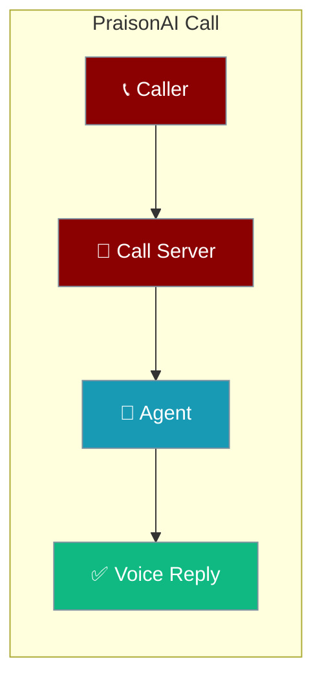
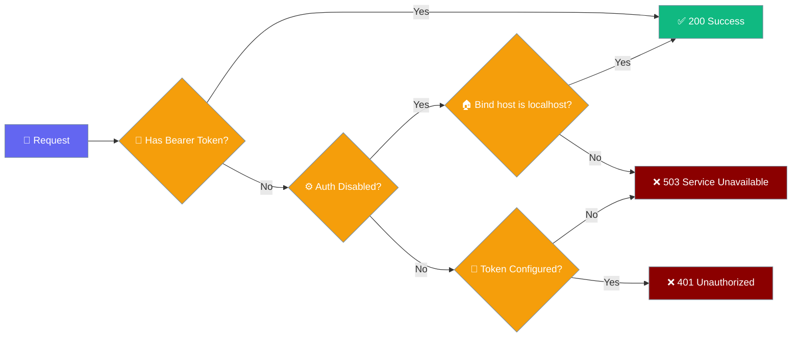
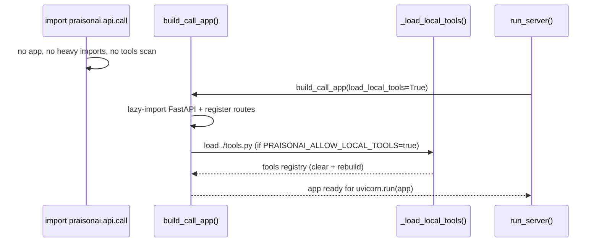
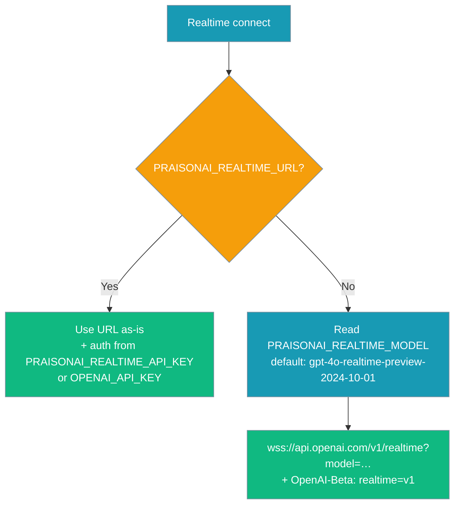
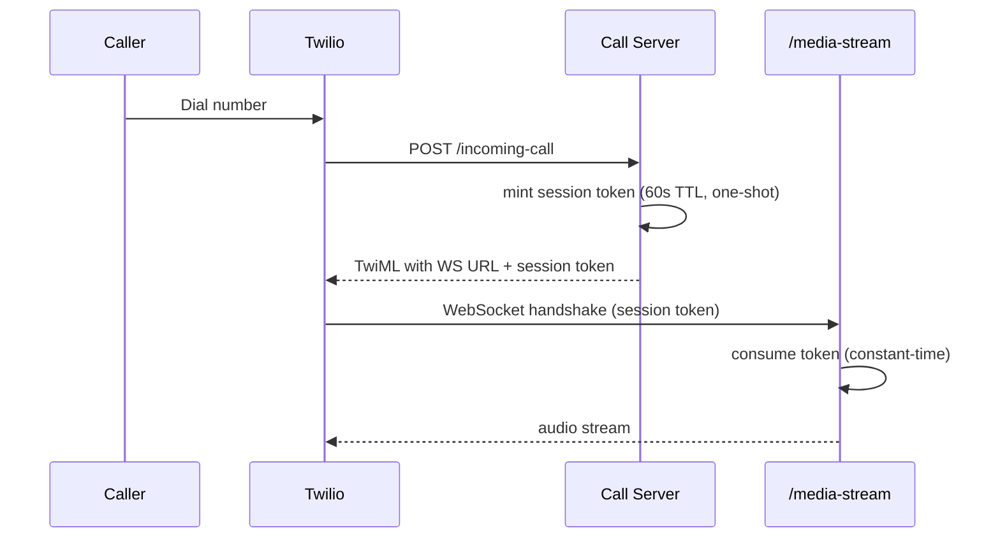
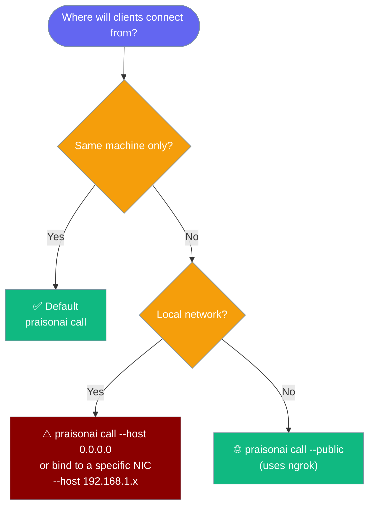
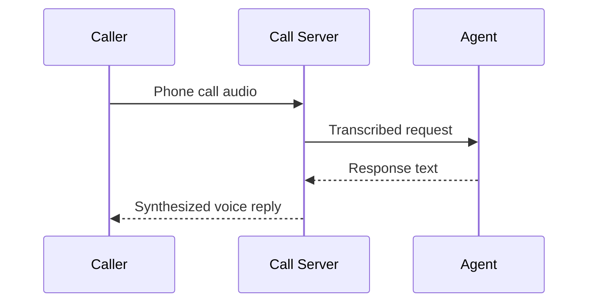

Turn an Agent into a phone assistant — start the call server and connect a phone number to talk to it over the line.

```bash
export OPENAI_API_KEY="${OPENAI_API_KEY:?Set OPENAI_API_KEY in your shell}"
export NGROK_AUTH_TOKEN="${NGROK_AUTH_TOKEN:?Set NGROK_AUTH_TOKEN in your shell}"
praisonai call --public
```


```mermaid
graph LR
    subgraph "PraisonAI Call"
        Caller[📞 Caller] --> Call[🤖 Call Server]
        Call --> Agent[🧠 Agent]
        Agent --> Voice[✅ Voice Reply]
    end

    classDef input fill:#8B0000,stroke:#7C90A0,color:#fff
    classDef process fill:#189AB4,stroke:#7C90A0,color:#fff
    classDef output fill:#10B981,stroke:#7C90A0,color:#fff

    class Caller,Call input
    class Agent process
    class Voice output
```

<iframe width="560" height="315" src="https://www.youtube.com/embed/m1cwrUG2iAk" title="YouTube video player" frameborder="0" allow="accelerometer; autoplay; clipboard-write; encrypted-media; gyroscope; picture-in-picture" allowfullscreen></iframe>

## AI Customer Service

PraisonAI Call is a feature that enables voice-based interaction with AI models through phone calls. This functionality allows users to have natural conversations with AI agents over traditional phone lines.

## Installation

### Step 1

```bash
pip install "praisonai[call]"
export OPENAI_API_KEY="${OPENAI_API_KEY:?Set OPENAI_API_KEY in your shell}"
export NGROK_AUTH_TOKEN="${NGROK_AUTH_TOKEN:?Set NGROK_AUTH_TOKEN in your shell}"
praisonai call --public
```

### Step 2

Buy a number at [PraisonAI Dashboard](https://dashboard.praison.ai/)

### Step 3

Enter the Public URL in the PraisonAI Dashboard phone number field

## Authentication

<Warning>
**Breaking Change**: When upgrading from earlier versions, the call server requires authentication configuration or it will fail with a 503 error.
</Warning>

The PraisonAI Call server now requires authentication configuration for security. You have two options:

### Option 1: Token Authentication (Recommended)

Set a secure token for API authentication:

```bash
export CALL_SERVER_TOKEN="${CALL_SERVER_TOKEN:?Set CALL_SERVER_TOKEN in your shell}"
praisonai call --public
```

API requests must include the token in the Authorization header:

```bash
curl -H "Authorization: Bearer ${CALL_SERVER_TOKEN:?Set CALL_SERVER_TOKEN in your shell}" \
     -H "Content-Type: application/json" \
     -d '{"message": "Hello"}' \
     http://localhost:8090/api/v1/agents/assistant/invoke
```

### Option 2: Disable Authentication (Local Development Only)

For local development on your own machine, you can disable authentication. The CLI sets the bind-host env var for you, so this is enough when launching via `praisonai call`:

```bash
export PRAISONAI_CALL_AUTH=disabled
praisonai call
```

If you launch the server programmatically (custom `uvicorn`, embedding `praisonai.api.agent_invoke` in another app, or any path that does NOT go through `praisonai call` / `praisonai serve`), you must also pin the bind host:

```bash
export PRAISONAI_CALL_AUTH=disabled
export PRAISONAI_CALL_BIND_HOST=127.0.0.1
```

Without `PRAISONAI_CALL_BIND_HOST` set to a localhost value, every request is rejected with:

```
503 Service Unavailable
PRAISONAI_CALL_AUTH=disabled is only permitted for localhost binding;
set PRAISONAI_CALL_BIND_HOST to 127.0.0.1 when binding locally
```

<Warning>
Never use `PRAISONAI_CALL_AUTH=disabled` in production. It is rejected outright unless the server is bound to localhost, and even then it bypasses all caller verification.
</Warning>

### Authentication Flow


```mermaid
graph LR
    A[📝 Request] --> B{🔐 Has Bearer Token?}
    B -->|Yes| C[✅ 200 Success]
    B -->|No| D{⚙️ Auth Disabled?}
    D -->|Yes| H{🏠 Bind host is localhost?}
    H -->|Yes| C
    H -->|No| G[❌ 503 Service Unavailable]
    D -->|No| E{🔧 Token Configured?}
    E -->|Yes| F[❌ 401 Unauthorized]
    E -->|No| G

    classDef request fill:#6366F1,stroke:#7C90A0,color:#fff
    classDef check fill:#F59E0B,stroke:#7C90A0,color:#fff
    classDef success fill:#10B981,stroke:#7C90A0,color:#fff
    classDef error fill:#8B0000,stroke:#7C90A0,color:#fff

    class A request
    class B,D,E,H check
    class C success
    class F,G error
```

When `CALL_SERVER_TOKEN` is not configured and the environment is not development, the server returns:

```
503 Service Unavailable
CALL_SERVER_TOKEN is not configured. Set CALL_SERVER_TOKEN or PRAISONAI_CALL_AUTH=disabled to run without authentication.
```

When `PRAISONAI_CALL_AUTH=disabled` is set but the bind host is not localhost:

```
503 Service Unavailable
PRAISONAI_CALL_AUTH=disabled is only permitted for localhost binding;
set PRAISONAI_CALL_BIND_HOST to 127.0.0.1 when binding locally
```

### Environment Variables

| Env var | Required when | Effect |
|---|---|---|
| `CALL_SERVER_TOKEN` | Production / any non-local exposure | Server requires `Authorization: Bearer <token>` |
| `PRAISONAI_CALL_AUTH=disabled` | Local development only | Bypasses auth — **only honored if `PRAISONAI_CALL_BIND_HOST` is localhost** |
| `PRAISONAI_CALL_BIND_HOST` | Whenever you launch without the `praisonai call`/`praisonai serve` CLI | Declares the real bind host so the auth-disabled guard can verify it |
| `PRAISONAI_CALL_LOAD_DOTENV` | Only to restore legacy import-time `.env` loading | When `"true"` (case-insensitive), importing `praisonai.api.call` loads `.env` at import time. Unset by default — importing the module no longer touches `os.environ`. |
| `PRAISONAI_ALLOW_LOCAL_TOOLS` | Any call-server verb that should honour `./tools.py` | Server entry points call `_load_local_tools()`; unset → the `tools` registry stays empty even if `build_call_app(load_local_tools=True)` is passed. See [Local Tools Loading](/features/local-tools-loading). |

<Note>
Importing `praisonai.api.call` no longer loads `.env` at import time (was a silent side effect). The `praisonai call` CLI still loads it explicitly at run time — user-facing behaviour is unchanged. To restore the legacy import-time behaviour (e.g. in a wrapper module that imports the call server but bypasses `main()`), set `PRAISONAI_CALL_LOAD_DOTENV=true`.
</Note>

### Side-effect-free import + `build_call_app()`

As of [PR #4261](https://github.com/MervinPraison/PraisonAI/pull/4261), `import praisonai.api.call` is **side-effect-free**: no `FastAPI` app is built, no `websockets`/`twilio`/`uvicorn`/`pyngrok`/`rich`/`fastapi` is imported, no `./tools.py` filesystem scan runs, and no user code executes. The heavy deps are lazy-imported inside `build_call_app()`, the route handlers, `run_server()`, and `setup_public_url()`.


```mermaid
sequenceDiagram
    participant Import as import praisonai.api.call
    participant Build as build_call_app()
    participant Tools as _load_local_tools()
    participant Uvicorn as run_server()

    Import->>Import: no app, no heavy imports, no tools scan
    Uvicorn->>Build: build_call_app(load_local_tools=True)
    Build->>Build: lazy-import FastAPI + register routes
    Build->>Tools: load ./tools.py (if PRAISONAI_ALLOW_LOCAL_TOOLS=true)
    Tools-->>Build: tools registry (clear + rebuild)
    Build-->>Uvicorn: app ready for uvicorn.run(app)
```

Build the app yourself when embedding the call server in your own process — a `build_call_app(*, load_local_tools=False)` factory replaces the old top-level `app = FastAPI()`:

```python
# embedding.py
from praisonai.api.call import build_call_app

app = build_call_app(load_local_tools=False)  # or True + PRAISONAI_ALLOW_LOCAL_TOOLS=true
# mount under your own FastAPI, or hand to uvicorn.run(app, ...)
```

The `load_local_tools` flag is only honoured when `PRAISONAI_ALLOW_LOCAL_TOOLS=true` is also set, matching the CLI opt-in. The shared `tools` list is `.clear()`'d before each rebuild, so calling `build_call_app(load_local_tools=True)` twice in one process is idempotent — it does not accumulate duplicate tool definitions.

<Note>
`praisonai.api.call.app` still resolves — a module-level `__getattr__` lazily builds it on first attribute access, so third-party code that imports the name directly keeps working. Touching `.app` **builds a FastAPI app** (and pulls its transitive deps); code that only wants `import_tools_from_file` should not touch `.app`.
</Note>

### Point the realtime endpoint elsewhere (Azure / self-hosted)

By default the call server connects the Twilio media leg to OpenAI Realtime at `wss://api.openai.com/v1/realtime?model=gpt-4o-realtime-preview-2024-10-01` using `OPENAI_API_KEY`. Teams on Azure OpenAI, OpenRouter, or a self-hosted OpenAI-compatible realtime gateway can override the endpoint without editing the module.

| Env var | Purpose |
|---------|---------|
| `PRAISONAI_REALTIME_URL` | Full `wss://…` URL. Takes precedence over the default. |
| `PRAISONAI_REALTIME_MODEL` | Model name for the default OpenAI URL (ignored when `PRAISONAI_REALTIME_URL` is set). |
| `PRAISONAI_REALTIME_API_KEY` | Bearer key to use for the realtime connection. Falls back to `OPENAI_API_KEY` when unset. |

```bash
# Point voice at Azure OpenAI Realtime
export PRAISONAI_REALTIME_URL="wss://<your-resource>.openai.azure.com/openai/realtime?api-version=2024-10-01-preview&deployment=my-realtime-deployment"
export PRAISONAI_REALTIME_API_KEY="${AZURE_OPENAI_KEY:?Set AZURE_OPENAI_KEY in your shell}"
praisonai call --public
```

```bash
# Stay on OpenAI but pick a different realtime model
export PRAISONAI_REALTIME_MODEL="gpt-4o-realtime-preview-2024-12-17"
praisonai call --public
```

When `PRAISONAI_REALTIME_URL` contains `openai.com`, the server keeps sending the `OpenAI-Beta: realtime=v1` header; for any other host, only `Authorization: Bearer …` is sent.


```mermaid
graph TB
    Start[Realtime connect] --> HasUrl{PRAISONAI_REALTIME_URL?}
    HasUrl -->|Yes| UseUrl[Use URL as-is<br/>+ auth from PRAISONAI_REALTIME_API_KEY<br/>or OPENAI_API_KEY]
    HasUrl -->|No| Model[Read PRAISONAI_REALTIME_MODEL<br/>default: gpt-4o-realtime-preview-2024-10-01]
    Model --> OpenAI[wss://api.openai.com/v1/realtime?model=…<br/>+ OpenAI-Beta: realtime=v1]

    classDef step fill:#189AB4,stroke:#7C90A0,color:#fff
    classDef check fill:#F59E0B,stroke:#7C90A0,color:#fff
    classDef ok fill:#10B981,stroke:#7C90A0,color:#fff

    class Start step
    class HasUrl check
    class UseUrl,OpenAI ok
    class Model step
```

### Connection timeouts

The realtime WebSocket runs with bounded connect / heartbeat / close so a dead upstream cannot hold a Twilio media leg (and phone number) indefinitely.

| Setting | Value |
|---------|-------|
| `open_timeout` | 10 s |
| `ping_interval` | 20 s |
| `ping_timeout` | 20 s |
| `close_timeout` | 5 s |
| `max_size` (frame cap) | 1 MiB |

<Note>
Introduced in v4.6.163 (PraisonAI PR #3879). Prior to this release, a stuck realtime connection kept the Twilio call live until the carrier hung up — which continues to be billed. These are hardcoded, not env-tunable; open an issue if you need a knob.
</Note>

### Media-stream session tokens

<Warning>
**Breaking change (this release):** `/media-stream` no longer accepts the shared `CALL_SERVER_TOKEN` in the URL query string. Direct WebSocket clients that previously connected with `?token=$CALL_SERVER_TOKEN` are now rejected with WebSocket close code `4003 Unauthorized`.
</Warning>

The Twilio path is unchanged — `/incoming-call` mints a **one-shot, 60-second, single-use session token** and embeds it as `?session=<token>` in the returned TwiML stream URL. `/media-stream` validates and consumes it once.

<Note>
**Effect for Twilio operators:** nothing to configure — the change is transparent for `praisonai call` / `praisonai call --public`. Custom integrations that hard-coded the token in the media-stream URL must move it to the `x-call-token` header.
</Note>

Direct WebSocket clients (bots, tests, custom stream consumers) must authenticate with the `x-call-token` header:

```bash
websocat "wss://your-host/media-stream" \
  --header "x-call-token: ${CALL_SERVER_TOKEN:?Set CALL_SERVER_TOKEN in your shell}"
```

| Client | Auth path | Notes |
|---|---|---|
| Twilio (`/incoming-call` → `/media-stream`) | `?session=<one-shot token>` minted by `/incoming-call` | Transparent, single-use, 60 s TTL |
| Direct WebSocket | `x-call-token: $CALL_SERVER_TOKEN` header | Constant-time compare |
| Direct WebSocket via `?token=…` | **Rejected (4003 Unauthorized)** | No longer supported |

All token comparisons (HTTP `Authorization`, header `x-call-token`, n8n `verify_token`, media-stream session tokens) are constant-time (`hmac.compare_digest`). Connection-count and per-IP rate-limit counters are guarded by `asyncio.Lock`s, so `MAX_CONCURRENT_CONNECTIONS` and `MAX_REQUESTS_PER_WINDOW` cannot be over-committed by concurrent WebSocket opens.


```mermaid
sequenceDiagram
    participant Caller
    participant Twilio
    participant Call as Call Server
    participant WS as /media-stream

    Caller->>Twilio: Dial number
    Twilio->>Call: POST /incoming-call
    Call->>Call: mint session token (60s TTL, one-shot)
    Call-->>Twilio: TwiML with WS URL + session token
    Twilio->>WS: WebSocket handshake (session token)
    WS->>WS: consume token (constant-time)
    WS-->>Twilio: audio stream
```

## Binding & Network Access

The call server binds to `127.0.0.1` by default, so it is only reachable from the same machine.


```mermaid
graph TB
    Start([Where will clients connect from?]) --> Local{Same machine only?}
    Local -->|Yes| Localhost["✅ Default<br/>praisonai call"]
    Local -->|No| LAN{Local network?}
    LAN -->|Yes| LANbind["⚠️ praisonai call --host 0.0.0.0<br/>or bind to a specific NIC<br/>--host 192.168.1.x"]
    LAN -->|No| Public["🌐 praisonai call --public<br/>(uses ngrok)"]

    classDef input fill:#6366F1,stroke:#7C90A0,color:#fff
    classDef branch fill:#F59E0B,stroke:#7C90A0,color:#fff
    classDef safe fill:#10B981,stroke:#7C90A0,color:#fff
    classDef warn fill:#8B0000,stroke:#7C90A0,color:#fff

    class Start input
    class Local,LAN branch
    class Localhost,Public safe
    class LANbind warn
```

```bash
# Local development (default — same machine only)
praisonai call

# Specific port, still localhost-only
praisonai call --port 8090

# Expose on LAN (warning will be printed)
praisonai call --host 0.0.0.0 --port 8090

# Expose publicly via ngrok
export NGROK_AUTH_TOKEN="${NGROK_AUTH_TOKEN:?Set NGROK_AUTH_TOKEN in your shell}"
praisonai call --public
```

<Warning>
**Breaking change (earlier versions → this release):** Earlier versions of `praisonai call` bound to `0.0.0.0` unconditionally, exposing the server to your entire LAN. Starting in this release, the default is `127.0.0.1`. Production deployments that previously relied on the LAN-exposed default must add `--host 0.0.0.0` (or a specific NIC) and ensure `CALL_SERVER_TOKEN` is set.
</Warning>

## Features

- Make and receive phone calls with AI agents
- Natural language processing for voice interactions
- Support for multiple phone carriers and providers
- Call recording and transcription capabilities
- Integration with other PraisonAI features

## Adding Tools

1. Create a file called `tools.py`
2. Add the following code:
```python
import yfinance as yf

# Get Stock Price definition
get_stock_price_def = {
    "name": "get_stock_price",
    "description": "Get the current stock price for a given ticker symbol",
    "parameters": {
        "type": "object", 
        "properties": {
            "ticker_symbol": {
                "type": "string", 
                "description": "The ticker symbol of the stock (e.g., AAPL, GOOGL)"
            }
        }, 
        "required": ["ticker_symbol"]
    }
}

# Get Stock Price function / Tool
async def get_stock_price_handler(ticker_symbol):
    try:
        stock = yf.Ticker(ticker_symbol)
        hist = stock.history(period="1d")
        if hist.empty:
            return {"error": f"No data found for ticker {ticker_symbol}"}
        current_price = hist['Close'].iloc[-1]  # Using -1 is safer than 0
        return {"price": str(current_price)}
    except Exception as e:
        return {"error": str(e)}


get_stock_price = (get_stock_price_def, get_stock_price_handler)
tools = [
    get_stock_price
]
```

3. ```bash
pip install yfinance
```

4. ```bash
export OPENAI_API_KEY="${OPENAI_API_KEY:?Set OPENAI_API_KEY in your shell}"
export NGROK_AUTH_TOKEN="${NGROK_AUTH_TOKEN:?Set NGROK_AUTH_TOKEN in your shell}"
praisonai call --public
```

## Manage Google Calendar Events

See [Google Calendar Tools](tools/googlecalendar.md)


## Deploy

### Docker Deployment

```dockerfile
# Use an official Python runtime as a parent image
FROM python:3.11-slim

# Set environment variables
ENV PYTHONDONTWRITEBYTECODE 1
ENV PYTHONUNBUFFERED 1

# Set work directory
WORKDIR /app

# Install system dependencies
RUN apt-get update && apt-get install -y --no-install-recommends \
    build-essential \
    && rm -rf /var/lib/apt/lists/*

# Install PraisonAI with the 'call' extra and ensure it's the latest version
RUN pip install --no-cache-dir --upgrade "praisonai[call]"

# Expose the port the app runs on
EXPOSE 8090

# Bind to all container interfaces — the container boundary is the security boundary.
# Pair with CALL_SERVER_TOKEN for any externally-published port.
CMD ["praisonai", "call", "--host", "0.0.0.0"]
```

## How It Works

A caller dials your number, the provider forwards audio to the call server, and the Agent responds with synthesized speech.


```mermaid
sequenceDiagram
    participant Caller
    participant Call as Call Server
    participant Agent

    Caller->>Call: Phone call audio
    Call->>Agent: Transcribed request
    Agent-->>Call: Response text
    Call-->>Caller: Synthesized voice reply
```

## Best Practices

<AccordionGroup>
<Accordion title="Always set CALL_SERVER_TOKEN in production">
The server fails with 503 unless a token is set or auth is explicitly disabled for localhost. Never disable auth on a public bind.
</Accordion>

<Accordion title="Keep the default localhost bind">
`praisonai call` binds to `127.0.0.1` by default. Add `--host 0.0.0.0` only inside a container or when you deliberately expose the LAN.
</Accordion>

<Accordion title="Set secrets via environment variables">
Export `OPENAI_API_KEY`, `NGROK_AUTH_TOKEN`, and `CALL_SERVER_TOKEN` in your shell — never inline the raw values.
</Accordion>

<Accordion title="Use the x-call-token header for direct WebSocket clients">
`/media-stream` no longer accepts `?token=` in the query string. Direct callers must pass `x-call-token: $CALL_SERVER_TOKEN` as a WebSocket handshake header. Twilio flows are unaffected.
</Accordion>

<Accordion title="Add tools for real actions">
Register async tool handlers (like a stock-price lookup) so the phone agent can fetch live data during a call.
</Accordion>
</AccordionGroup>

## Related

<CardGroup cols={2}>
  <Card title="Tools" icon="wrench" href="/tools">
    Give your call agent live data and actions.
  </Card>
  <Card title="Security" icon="shield" href="/security">
    Harden the call server before exposing it.
  </Card>
</CardGroup>