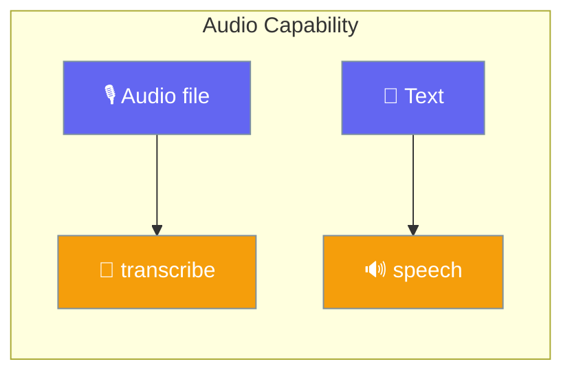
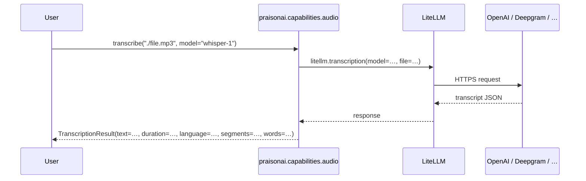

Transcribe audio files to text and generate speech from text using any LiteLLM-supported provider (OpenAI Whisper, Deepgram, ElevenLabs, …).



## Quick Start

<Steps>
<Step title="Give an Agent a transcription tool">
```python
from praisonaiagents import Agent
from praisonai.capabilities import transcribe

agent = Agent(
    name="MeetingSummariser",
    instructions="Transcribe the audio, then produce a bullet-point summary.",
    tools=[transcribe],
)
agent.start("Transcribe ./meeting.mp3 and summarise the decisions.")
```
</Step>

<Step title="Transcribe directly (Whisper default)">
```python
from praisonai.capabilities import transcribe

result = transcribe("./meeting.mp3")
print(result.text)
```
</Step>

<Step title="Generate speech from text">
```python
from praisonai.capabilities import speech

result = speech("Hello, world!", voice="nova")
result.save("hello.mp3")
```
</Step>

<Step title="Use the async variants">
```python
import asyncio
from praisonai.capabilities import atranscribe, aspeech

async def main():
    transcript = await atranscribe("./meeting.mp3")
    audio = await aspeech(transcript.text, voice="nova")
    audio.save("readback.mp3")

asyncio.run(main())
```
</Step>

<Step title="Switch providers without changing code">
```python
result = transcribe("./meeting.mp3", model="deepgram/nova-2", language="en")
print(result.text)
```
</Step>
</Steps>

---

## How It Works

Calls route through LiteLLM to the provider that matches your `model` string.



---

## Configuration Options

### `transcribe(...)` / `atranscribe(...)`

| Option | Type | Default | Description |
|--------|------|---------|-------------|
| `audio` | `str \| bytes \| BinaryIO` | required | File path, bytes, or file-like object |
| `model` | `str` | `"whisper-1"` | Model name (e.g., `whisper-1`, `deepgram/nova-2`) |
| `language` | `Optional[str]` | `None` | ISO language code (e.g., `en`, `es`) |
| `prompt` | `Optional[str]` | `None` | Optional prompt to guide transcription |
| `response_format` | `str` | `"json"` | `json`, `text`, `srt`, `verbose_json`, `vtt` |
| `temperature` | `float` | `0.0` | Sampling temperature (0.0-1.0) |
| `timestamp_granularities` | `Optional[List[str]]` | `None` | List of `word` and/or `segment` |
| `timeout` | `float` | `600.0` | Request timeout in seconds |
| `api_key` | `Optional[str]` | `None` | Optional API key override |
| `api_base` | `Optional[str]` | `None` | Optional API base URL override |
| `metadata` | `Optional[Dict[str, Any]]` | `None` | Optional metadata for tracing (agent_id, session_id, etc.) |

### `speech(...)` / `aspeech(...)`

| Option | Type | Default | Description |
|--------|------|---------|-------------|
| `text` | `str` | required | Text to convert to speech |
| `model` | `str` | `"tts-1"` | Model name (e.g., `tts-1`, `tts-1-hd`, `elevenlabs/...`) |
| `voice` | `str` | `"alloy"` | Voice name (e.g., `alloy`, `echo`, `fable`, `onyx`, `nova`, `shimmer`) |
| `response_format` | `str` | `"mp3"` | `mp3`, `opus`, `aac`, `flac`, `wav`, `pcm` |
| `speed` | `float` | `1.0` | Speed multiplier (0.25-4.0) |
| `timeout` | `float` | `600.0` | Request timeout in seconds |
| `api_key` | `Optional[str]` | `None` | Optional API key override |
| `api_base` | `Optional[str]` | `None` | Optional API base URL override |
| `metadata` | `Optional[Dict[str, Any]]` | `None` | Optional metadata for tracing |

### Result objects

| Class | Field | Type | Default | Notes |
|-------|-------|------|---------|-------|
| `TranscriptionResult` | `text` | `str` | — | The transcribed text |
| | `duration` | `Optional[float]` | `None` | Audio duration in seconds |
| | `language` | `Optional[str]` | `None` | Detected/echoed language |
| | `segments` | `Optional[List[Dict]]` | `None` | Present when `response_format="verbose_json"` |
| | `words` | `Optional[List[Dict]]` | `None` | Present when `timestamp_granularities=["word"]` |
| | `model` | `Optional[str]` | `None` | Model used |
| | `metadata` | `Dict[str, Any]` | `{}` | Metadata echoed back |
| `SpeechResult` | `audio` | `bytes` | — | Raw audio bytes |
| | `content_type` | `str` | `"audio/mpeg"` | Set per `response_format` |
| | `model` | `Optional[str]` | `None` | Model used |
| | `metadata` | `Dict[str, Any]` | `{}` | Tracing metadata |
| | `save(path)` | method | — | Writes bytes to disk, returns path |

---

## Common Patterns

### Transcribe → summarise pipeline

```python
from praisonaiagents import Agent
from praisonai.capabilities import transcribe

transcript = transcribe("./meeting.mp3")

agent = Agent(
    name="Summariser",
    instructions="Summarise the transcript into bullet-point decisions.",
)
agent.start(transcript.text)
```

### Multilingual dubbing

```python
import asyncio
from praisonaiagents import Agent
from praisonai.capabilities import atranscribe, aspeech

async def dub(path):
    transcript = await atranscribe(path, language="es")
    translator = Agent(name="Translator", instructions="Translate Spanish to English.")
    english = translator.start(transcript.text)
    result = await aspeech(english, voice="nova")
    return result.save("dubbed.mp3")

asyncio.run(dub("./clip_es.mp3"))
```

### Word-level timestamps for captions

```python
from praisonai.capabilities import transcribe

result = transcribe(
    "./meeting.mp3",
    response_format="verbose_json",
    timestamp_granularities=["word"],
)
for word in result.words or []:
    print(word)
```

---

## Best Practices

<AccordionGroup>
<Accordion title="Pick the right model per provider">
Use `whisper-1` for OpenAI parity, `deepgram/nova-2` for lower latency, and `tts-1-hd` when audio fidelity matters more than cost.
</Accordion>

<Accordion title="Set language when you know it">
Passing `language="en"` skips detection — faster and more accurate for short clips.
</Accordion>

<Accordion title="Use save() on SpeechResult">
`SpeechResult.save("out.mp3")` writes the bytes and returns the path — no manual file handling needed.
</Accordion>

<Accordion title="Route through metadata for tracing">
Pass `metadata={"agent_id": ..., "session_id": ...}` so LiteLLM callbacks correlate audio calls with an Agent turn.
</Accordion>
</AccordionGroup>

---

## Related

<CardGroup cols={2}>
<Card title="Capabilities Overview" icon="bolt" href="/docs/capabilities/index">
All LiteLLM parity capabilities
</Card>
<Card title="AudioAgent" icon="user" href="/docs/audio/overview">
Higher-level Agent abstraction for audio
</Card>
<Card title="Completions" icon="message" href="/docs/capabilities/completions">
Sibling chat/text completion capability
</Card>
<Card title="Audio CLI" icon="terminal" href="/docs/capabilities/audio-cli">
Command-line and MCP tool equivalents
</Card>
</CardGroup>
