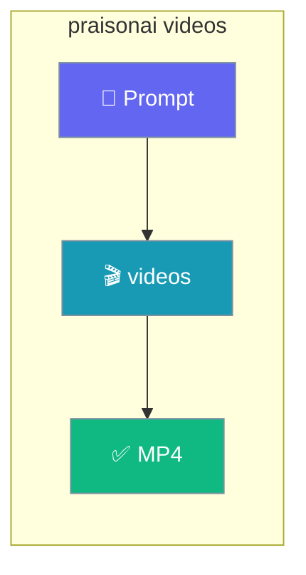

Generate a video from a text prompt on the command line.



## Quick Start

<Steps>
<Step title="Generate a video">
Omit `--model` to use the canonical default `openai/sora-2`.

```bash
praisonai videos "A cat playing with yarn"
```
</Step>

<Step title="Save to a file">
```bash
praisonai videos "A sunset over the ocean" --output sunset.mp4
```
</Step>
</Steps>

---

## Options

| Option | Short | Default | Description |
|--------|-------|---------|-------------|
| `--model` | `-m` | `openai/sora-2` | Provider-prefixed LiteLLM route |
| `--output` | `-o` | `None` | Output file path |

Only `--model` and `--output` are configurable on the CLI today.

---

## Examples

```bash
# Use the default model
praisonai videos "A futuristic cityscape at night"

# Pick a specific model
praisonai videos "A detailed portrait" -m openai/sora-2-pro

# Save the result to disk
praisonai videos "A waterfall in a forest" -o waterfall.mp4
```

---

## Related

<CardGroup cols={2}>
<Card title="Videos" icon="video" href="/capabilities/videos">
The Python `video_generate` API.
</Card>
<Card title="CLI Reference" icon="terminal" href="/cli/cli-reference">
All PraisonAI CLI commands.
</Card>
</CardGroup>
