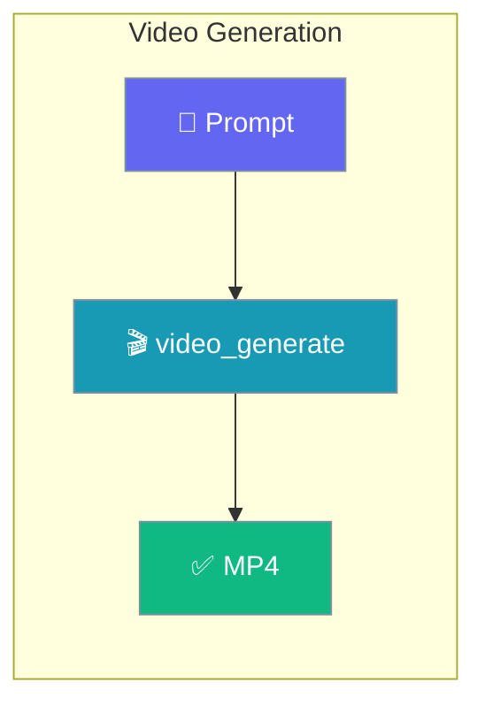

Turn a text prompt into a video with a single function call.



## Quick Start

<Steps>
<Step title="Generate a video">
Omit `model` to use the canonical default `openai/sora-2`.

```python
from praisonai.capabilities import video_generate

result = video_generate("A cat playing with yarn")
print(result.url)
```
</Step>

<Step title="Async generation">
```python
import asyncio
from praisonai.capabilities import avideo_generate

async def main():
    result = await avideo_generate("A sunset over the ocean")
    print(result.url)

asyncio.run(main())
```
</Step>
</Steps>

---

## How It Works

The prompt is sent to a LiteLLM video route, and a `VideoResult` is returned with the video URL or job ID.

| Step | What happens |
|------|--------------|
| Prompt | You describe the video in plain text |
| Route | The `model` string selects the provider (default `openai/sora-2`) |
| Result | A `VideoResult` with `url`, `id`, `status`, and `model` |

---

## Configuration Options

| Option | Type | Default | Description |
|--------|------|---------|-------------|
| `prompt` | `str` | Required | Text description of the video |
| `model` | `str` | `"openai/sora-2"` | Provider-prefixed LiteLLM route |
| `duration` | `int` | `5` | Video length in seconds |
| `aspect_ratio` | `str` | `"16:9"` | Aspect ratio (`"16:9"`, `"9:16"`, `"1:1"`) |
| `timeout` | `float` | `600.0` | Request timeout in seconds |
| `api_key` | `str` | `None` | Optional API key override |
| `api_base` | `str` | `None` | Optional API base URL override |
| `metadata` | `dict` | `None` | Optional metadata for tracing |

The `VideoResult` object exposes `url`, `id`, `status`, `model`, and `metadata`.

---

## Common Patterns

Choose a specific model:

```python
from praisonai.capabilities import video_generate

result = video_generate("A city skyline at night", model="openai/sora-2-pro")
print(result.url)
```

Portrait orientation with a longer duration:

```python
from praisonai.capabilities import video_generate

result = video_generate(
    "A waterfall in a forest",
    duration=10,
    aspect_ratio="9:16",
)
print(result.url)
```

Give large videos more time:

```python
from praisonai.capabilities import video_generate

result = video_generate("A slow timelapse of clouds", timeout=1200.0)
print(result.status)
```

---

## Best Practices

<AccordionGroup>
<Accordion title="Rely on the default model">
Omit `model` to use `openai/sora-2`, the canonical default shared by every video surface (SDK, capability, MCP, CLI). Only set `model` when you need a different provider route.
</Accordion>

<Accordion title="Raise the timeout for long videos">
Longer `duration` values take more time to render. Increase `timeout` (e.g. `1200.0`) to avoid premature timeouts.
</Accordion>

<Accordion title="Use provider-prefixed routes">
Always pass a full LiteLLM route such as `openai/sora-2`. Bare names like `sora` are not valid routes and cause routing errors.
</Accordion>

<Accordion title="Prefer async for batches">
Use `avideo_generate` inside `asyncio` when generating multiple videos so requests do not block each other.
</Accordion>
</AccordionGroup>

---

## Related

<CardGroup cols={2}>
<Card title="Videos CLI" icon="terminal" href="/capabilities/videos-cli">
Generate videos from the command line.
</Card>
<Card title="Video Overview" icon="video" href="/video/overview">
The VideoAgent SDK and providers.
</Card>
</CardGroup>
