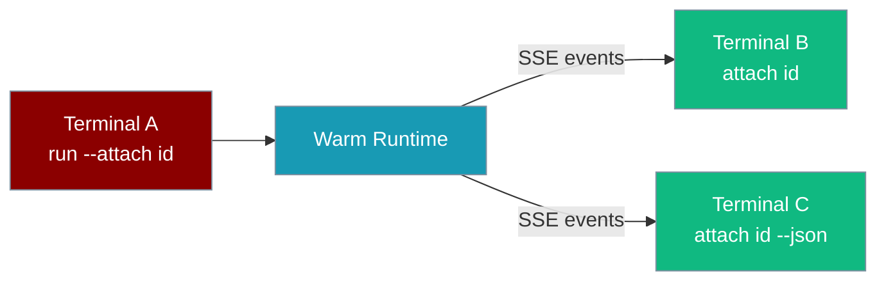
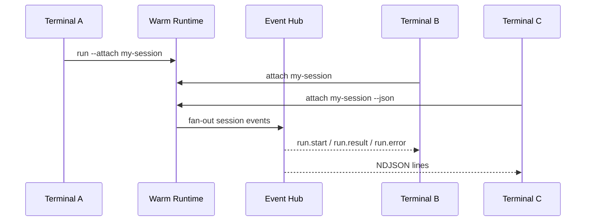

`praisonai attach` subscribes to a live agent session on the warm runtime and streams its events in real time from a second terminal — read-only, with multiple observers supported.



## Quick Start

<Steps>
<Step title="Start the warm runtime">
```bash
praisonai daemon start --background
```
</Step>

<Step title="Run an agent with a session id (terminal A)">
```bash
praisonai run "Research topic X" --attach my-session
```
</Step>

<Step title="Attach from another terminal (terminal B)">
```bash
praisonai attach my-session
```
</Step>
</Steps>

---

## Usage

```bash
praisonai attach <session-id> [--json]
```

| Argument / Option | Type | Default | Description |
|---|---|---|---|
| `session_id` | positional | required | Session id to attach to |
| `--json` | flag | `false` | Emit raw NDJSON events instead of human-readable output |

---

## How It Works



Attaching never starts execution — it only observes. Detaching (Ctrl-C) does not stop the run on terminal A.

<Tip>
Events arrive over Server-Sent Events at `GET /sessions/{session_id}/events` with Bearer auth from the runtime lockfile. Session ids are percent-encoded on the wire. A `: keep-alive` comment is sent every ~15s and ignored.
</Tip>

---

## Event Reference

| Type | Fields | Human render |
|---|---|---|
| `run.start` | `session_id`, `prompt` | `▶ run.start: <prompt>` |
| `run.result` | `session_id`, `ok`, `result` | `✓ run.result` then result text |
| `run.error` | `session_id`, `error` | `✗ run.error: <error>` |

<Tabs>
<Tab title="Human output">
```
Attached to session 'my-session'. Ctrl-C to detach.
▶ run.start: Research topic X
✓ run.result
Here is the summary...
```
</Tab>
<Tab title="--json (NDJSON)">
```bash
praisonai attach my-session --json | jq 'select(.type=="run.result")'
```
```json
{"type": "run.start", "session_id": "my-session", "prompt": "Research topic X"}
{"type": "run.result", "session_id": "my-session", "ok": true, "result": "..."}
```
</Tab>
</Tabs>

---

## Exit Codes

| Code | Meaning |
|---|---|
| `0` | Clean detach (Ctrl-C) |
| `1` | No compatible warm runtime, or stream lost mid-attach |
| `4` | Runtime module not importable |

---

## Common Patterns

**Watch a long-running agent from a second terminal** — start with `--attach`, observe progress without blocking terminal A.

**Pipe JSON into jq** — `praisonai attach my-session --json | jq 'select(.type=="run.result")'`.

**Multiple observers** — several terminals can attach to the same session concurrently; all receive the same events.

---

## Best Practices

<AccordionGroup>
<Accordion title="Start the daemon first">
Run `praisonai daemon start` before `run --attach`. Without a warm runtime, attach exits with code 1.
</Accordion>

<Accordion title="Use direct prompt runs only">
`--attach` on `praisonai run` works for direct prompts only — not YAML files, `--agent`, or `--command`.
</Accordion>

<Accordion title="Detaching is safe">
Ctrl-C in an attach terminal never cancels the underlying agent run.
</Accordion>

<Accordion title="Version mismatch after upgrade">
If CLI and daemon major versions differ, attach refuses to connect. Run `praisonai daemon stop && praisonai daemon start` after upgrading.
</Accordion>
</AccordionGroup>

---

## Related

<CardGroup cols={2}>
<Card title="Run" icon="play" href="/docs/cli/run">
  `--attach` flag for tagging warm-runtime sessions
</Card>
<Card title="Daemon" icon="bolt" href="/docs/cli/daemon">
  Warm runtime lifecycle and version handshake
</Card>
</CardGroup>
