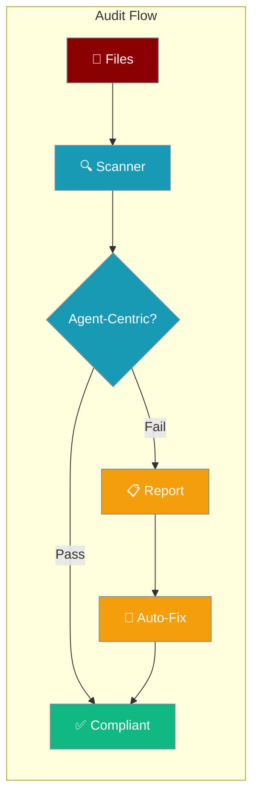

Check that Python examples and documentation follow agent-centric authoring — an `Agent`, `PraisonAIAgents`, or `Workflow` import and instantiation should appear within the first 40 lines, before low-level module imports.



## Quick Start

<Steps>
<Step title="Scan for compliance">
```bash
praisonai audit agent-centric --scan ./examples
```
</Step>

<Step title="Auto-fix non-compliant files">
```bash
praisonai audit agent-centric --fix ./examples --verbose
```
</Step>

<Step title="CI gate (exits non-zero on failure)">
```bash
praisonai audit agent-centric --check ./examples
```
</Step>
</Steps>

## Command Reference

```bash
praisonai audit agent-centric [--scan PATH | --fix PATH | --check PATH] [OPTIONS]
```

| Option | Description |
|--------|-------------|
| `--scan PATH` | Scan path and print compliance report |
| `--fix PATH` | Rewrite non-compliant files, then re-scan |
| `--check PATH` | Scan and exit `1` if any file is non-compliant (CI) |
| `--json` | Output report as JSON |
| `--line-limit N` | Header scan line limit (default: `40`) |
| `--only-examples` | Scan Python examples only |
| `--only-docs` | Scan documentation only |
| `-v`, `--verbose` | List each non-compliant file and reason |

<Note>
Exactly one of `--scan`, `--fix`, or `--check` is required, each with a path.
</Note>

## Examples

### Scan with verbose output

```bash
praisonai audit agent-centric --scan ./examples/python --verbose
```

### Fix non-compliant files

```bash
praisonai audit agent-centric --fix ./examples/python --verbose
```

### CI check

```bash
praisonai audit agent-centric --check ./docs/features --only-docs
```

### JSON output

```bash
praisonai audit agent-centric --scan ./examples --json
```

## Compliance reasons

| Code | Meaning |
|------|---------|
| `A_no_agent_import` | No agent-centric import found in header |
| `B_import_no_instantiation` | Import present but no instantiation |
| `C_low_level_first` | Low-level import appears before agent-centric code |
| `D_too_advanced` | Example is too advanced for quick-start placement |
| `E_wrong_folder` | File in wrong folder for its content type |
| `F_outdated_api` | Uses deprecated API patterns |
| `G_non_runnable` | Example cannot run as written |
| `H_duplicate_quickstart` | Duplicate quick-start block |
| `I_instantiation_too_late` | Agent instantiation beyond `--line-limit` |

## Best Practices

<AccordionGroup>
  <Accordion title="Run audit in CI pipelines">
    Use `--check` in your CI workflow to block merges that introduce non-compliant examples. Exit code `1` signals failure to GitHub Actions or any CI runner.
  </Accordion>
  <Accordion title="Use --fix before committing">
    Run `--fix` locally before pushing to automatically reorder imports and bring agent instantiation into the header window.
  </Accordion>
  <Accordion title="Combine --only-examples and --only-docs">
    Audit examples and documentation separately to target fixes precisely and reduce noise in large repositories.
  </Accordion>
  <Accordion title="Adjust --line-limit for your project">
    The default of `40` lines suits most projects. Increase it if your examples require more setup before the agent instantiation.
  </Accordion>
</AccordionGroup>

## Related

<CardGroup cols={2}>
  <Card title="Doctor CLI" icon="stethoscope" href="/cli/doctor">
    Runtime health checks including MCP connectivity
  </Card>
  <Card title="Validate CLI" icon="check-double" href="/cli/validate">
    Validate YAML configs and agent definitions
  </Card>
</CardGroup>
