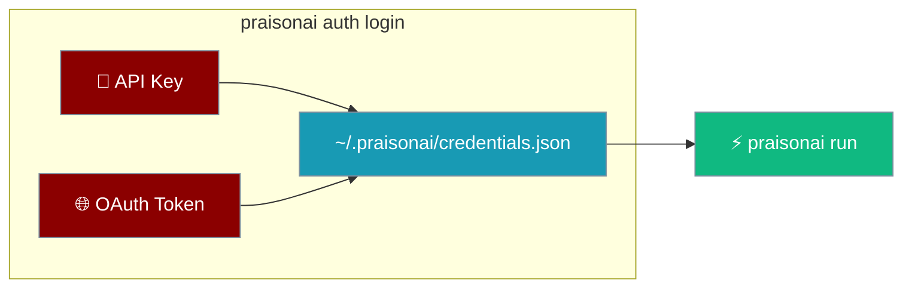
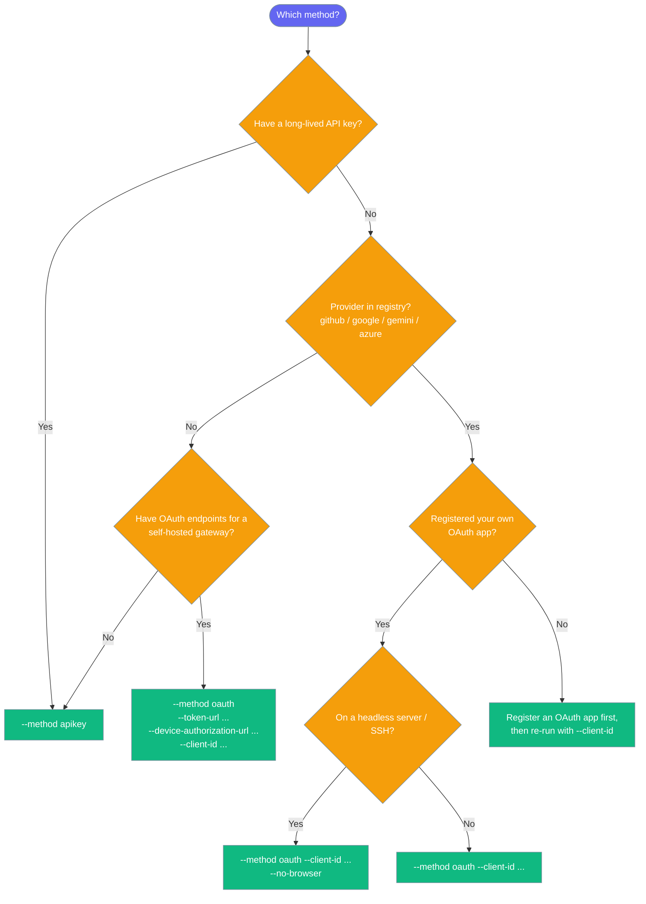
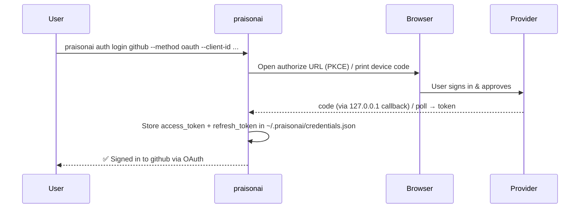

`praisonai auth` stores provider credentials locally so `praisonai run` works without exporting env vars every session. Two methods are supported: a long-lived **API key**, or a short-lived **OAuth token** signed in via your browser.



## Quick Start

<Tabs>
  <Tab title="API Key">
    ```bash
    # Interactive — key is hidden at the prompt
    praisonai auth login openai

    # Then run immediately
    praisonai run "What is 2+2?"
    ```
  </Tab>
  <Tab title="OAuth (Browser)">
    ```bash
    # Device-code flow; sign in; tokens stored + auto-refreshed
    praisonai auth login github --method oauth --client-id <your-github-oauth-app-client-id>

    praisonai run "What is 2+2?"
    ```
    <Note>Built-in OAuth providers (`github`, `google`, `gemini`, `azure`) ship with endpoints but no `client_id`. Supply your OAuth app's id via `--client-id`; the CLI resolves the rest. Providers outside the registry (e.g. `openai`, `anthropic`) fall back to the API-key prompt.</Note>
  </Tab>
  <Tab title="Headless / SSH">
    ```bash
    # Prints a URL + code instead of opening a browser
    praisonai auth login github --method oauth --client-id <your-github-oauth-app-client-id> --no-browser
    # To sign in, visit https://github.com/login/device and enter code: ABCD-EFGH

    praisonai run "What is 2+2?"
    ```
  </Tab>
</Tabs>

## Commands

| Command | Description |
|---|---|
| `auth login <provider>` | Store credentials. `--method auto` (default) picks OAuth if available, else API key |
| `auth list` | Show stored providers with method + expiry |
| `auth status [provider]` | Format check; `--validate` does a live call (uses a freshly-refreshed OAuth token) |
| `auth logout <provider>` | Remove one provider |
| `auth logout --all` | Remove all stored credentials |

### Login flags

| Flag | Default | Purpose |
|---|---|---|
| `--method auto\|apikey\|oauth` | `auto` | Force a flow, or let the CLI pick |
| `--key sk-…` | (prompt) | API-key only; skip prompt |
| `--key-stdin` | off | Read API key from stdin |
| `--no-browser` | off | OAuth only; print URL + code instead of opening a browser |
| `--base-url URL` | (default) | Custom provider endpoint |
| `--model NAME` | (none) | Default model recorded with the credential |
| `--skip-validation` | off | API-key only; skip the live check |
| `--client-id ID` | (from registry) | OAuth client id. Overrides the built-in registry entry. Required for registry providers until a first-party PraisonAI app is provisioned |
| `--token-url URL` | (from registry) | OAuth token endpoint. Set to enable OAuth for a provider outside the registry (e.g. self-hosted gateway) |
| `--device-authorization-url URL` | (from registry) | RFC 8628 device-code endpoint |
| `--authorization-url URL` | (from registry) | RFC 7636 PKCE authorization endpoint |
| `--scope SCOPE` | (from registry) | Scope(s) to request; overrides the registry default |

### Which `--method` should I use?



<Note>`--method auto` on a registry provider without a `--client-id` prints an info line telling you how to switch to OAuth explicitly, then falls back to the API-key prompt.</Note>

## OAuth Login (browser-based)

Two flows are negotiated automatically per provider:
- **Device code** (RFC 8628) — prints a short code + URL, polls until you approve. Default on headless servers.
- **Authorization code + PKCE** (RFC 7636) — opens your default browser and listens on `127.0.0.1` for the redirect. Default on desktops.

<Note>Built-in providers ship with endpoints but no `client_id` (registration-specific). Supply your OAuth app's id via `--client-id`; the CLI resolves the rest.</Note>



The OAuth callback handler and PKCE helpers are shared with the MCP OAuth integration.

### Token storage & refresh

| Item | Value |
|---|---|
| File | `~/.praisonai/credentials.json` (unchanged from API-key flow) |
| Legacy fallback | `~/.praison/credentials.json` is still read if the canonical file doesn't exist yet; migrated onto the canonical file on the next write. No `auth logout`/re-login needed. |
| Permissions | `0o600`, atomic writes |
| Refresh | Transparent on next use, ~60 s before `expires_at` |
| Refresh failure | CLI returns no token rather than a stale one — re-run `auth login` |

### Self-hosted / custom OAuth providers

`praisonai auth login` ships built-in endpoints for `github`, `google`, `gemini`, and `azure`. For a provider outside the registry (e.g. a self-hosted gateway), supply the endpoints directly with CLI flags:

```bash
praisonai auth login my-gateway --method oauth \
  --client-id cli \
  --device-authorization-url https://gateway.example.com/oauth/device \
  --token-url https://gateway.example.com/oauth/token \
  --scope "read write"
```

The CLI infers the `device` flow when a `--device-authorization-url` is present, or falls back to `authcode` (PKCE) when you pass `--authorization-url` instead.

As an escape hatch, you can also register a provider config from Python before invoking the flow:

```python
from praisonai_code.cli.configuration.oauth import OAUTH_PROVIDERS, OAuthProviderConfig

OAUTH_PROVIDERS["my-gateway"] = OAuthProviderConfig(
    flow="device",
    client_id="my-client-id",
    token_url="https://gateway.example.com/oauth/token",
    device_authorization_url="https://gateway.example.com/oauth/device",
    scope="read write",
)
```

### Headless / SSH

```bash
praisonai auth login github --method oauth --client-id <your-github-oauth-app-client-id> --no-browser
# To sign in, visit https://github.com/login/device and enter code: ABCD-EFGH
```

## API Key Login

```bash
praisonai auth login openai
praisonai auth login openai --key sk-...
echo "sk-..." | praisonai auth login openai --key-stdin

# Optional extras
praisonai auth login openai --key sk-... --base-url https://api.openai.com/v1 --model gpt-4o
praisonai auth login openai --skip-validation
```

### List & status

```bash
praisonai auth list
praisonai auth status
praisonai auth status openai --validate
```

### Logout

```bash
praisonai auth logout openai
praisonai auth logout --all
```

## List & Status — new columns

```bash
praisonai auth list
# Provider   Method   Secret          Expires   Base URL      Model
# openai     apikey   sk-1***efgh     (n/a)     (default)     (none)
# github     oauth    at-9***xyz1     59m       (default)     (none)
```

`Expires` shows `(n/a)` for API keys, `59m`, `1h 23m`, `<1m`, or `expired` for OAuth tokens, and `(no expiry)` when the provider didn't include one.

<Note>The `auth list` and `auth status` table columns changed in this release — two new columns (`Method`, `Expires`) were added. Scripts that parse the table output need to be updated. The `--json` output is additive only (no existing keys removed).</Note>

## Credential Fields (`ProviderCredential`)

Each stored provider credential contains the following fields:

| Field | Type | Description |
|-------|------|-------------|
| `api_key` | `str` | Static API key. For OAuth flows, mirrors `access_token` for backward compatibility |
| `access_token` | `str` | OAuth access token (empty for API-key credentials) |
| `refresh_token` | `str` | OAuth refresh token used for silent renewal |
| `expires_at` | `int` | Unix epoch seconds when the access token expires. `0` for API keys (no expiry) |
| `auth_method` | `str` | `"apikey"` or `"oauth"` — indicates which flow was used to store this credential |

`auth list` and `auth status` show `Method` and `Expires` columns reflecting these fields.

---

## Storage & Security

| Item | Value |
|---|---|
| File | `~/.praisonai/credentials.json` |
| Legacy fallback | Read-only fallback: `~/.praison/credentials.json`. Any write transparently migrates its entries onto the canonical file. |
| Permissions | `0o600` (auto-corrected on read if loose) |
| Writes | Atomic via temp file + `os.replace` |
| Display | Keys/tokens redacted as `at-9***xyz1` everywhere except the file |
| OAuth internals | `refresh_token`, `token_url`, `client_id` are scrubbed before crossing into the LLM resolver — never sent to the provider |

<Note>
**Path change — auto-migrated.** Prior releases stored credentials at `~/.praison/credentials.json`. The canonical path is now `~/.praisonai/credentials.json`; the legacy path is still read if the canonical file doesn't exist yet, and any subsequent `auth login` or `setup` transparently migrates your old entries onto the canonical file. No re-login is required.
</Note>

## Supported Providers

| Provider | API key prefix | Env var injected at run time | OAuth supported today? |
|---|---|---|---|
| `github` | n/a | (your env var) | ✅ — device flow, requires `--client-id` |
| `google` / `gemini` | `AI` | `GOOGLE_API_KEY` / `GEMINI_API_KEY` | ✅ — device flow, requires `--client-id` |
| `azure` | n/a | (your env var) | ✅ — device flow, requires `--client-id` |
| `openai` | `sk-` | `OPENAI_API_KEY` (+ `OPENAI_BASE_URL` if set) | Not yet — use API key |
| `anthropic` | `sk-ant-` | `ANTHROPIC_API_KEY` | Not yet — use API key |
| `tavily` | `tvly-` | `TAVILY_API_KEY` | Not yet — use API key |
| `groq` | `gsk_` | `GROQ_API_KEY` | Not yet — use API key |
| `cohere` | (none) | `COHERE_API_KEY` | Not yet — use API key |
| Self-hosted / custom | n/a | (your env var) | ✅ — supply endpoints via `--token-url` / `--device-authorization-url` |

Unknown providers accept API keys with length ≥ 10. OAuth is opt-in per provider. Registry providers ship endpoints but no `client_id`; pass yours with `--client-id`.

## Optional dependency

The OAuth flow uses the `requests` library. It is lazy-imported, so users on the API-key path never see it. If a user runs `--method oauth` without it installed:

```
OAuth login requires the optional 'requests' package. Install it with: pip install requests
```

## How Run Uses Credentials

`praisonai run` resolves credentials in this order:

1. Environment variables (`OPENAI_API_KEY`, `ANTHROPIC_API_KEY`, …)
2. Stored credentials — **OAuth tokens refreshed transparently** (~60 s before expiry) before injection
3. LLM endpoint resolution via `resolve_llm_endpoint_with_credentials`

If an expired OAuth token cannot be refreshed (refresh token revoked, network error, etc.), `praisonai run` reports:

```
Error: No valid token for <provider>. Run: praisonai auth login <provider> --method oauth
```

If nothing is found, non-interactive mode exits with:

```
Error: No API key configured. Run: praisonai auth login
```

See [Run](/cli/run#first-run-credential-check) for the interactive wizard path.

## Related

<CardGroup cols={2}>
  <Card title="Run" icon="play" href="/docs/cli/run">
    Preflight credential check before execution
  </Card>
  <Card title="Config" icon="gear" href="/docs/cli/config">
    Default model via `[llm]` in config.toml
  </Card>
  <Card title="Setup" icon="wand-magic-sparkles" href="/docs/cli/setup">
    First-run setup wizard
  </Card>
</CardGroup>
