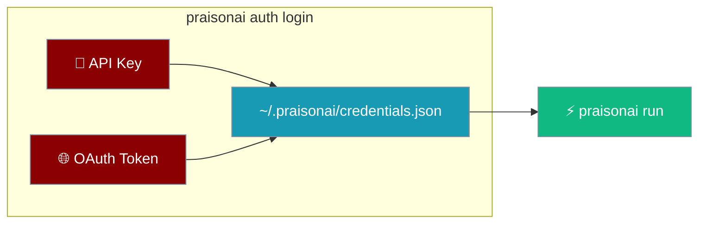
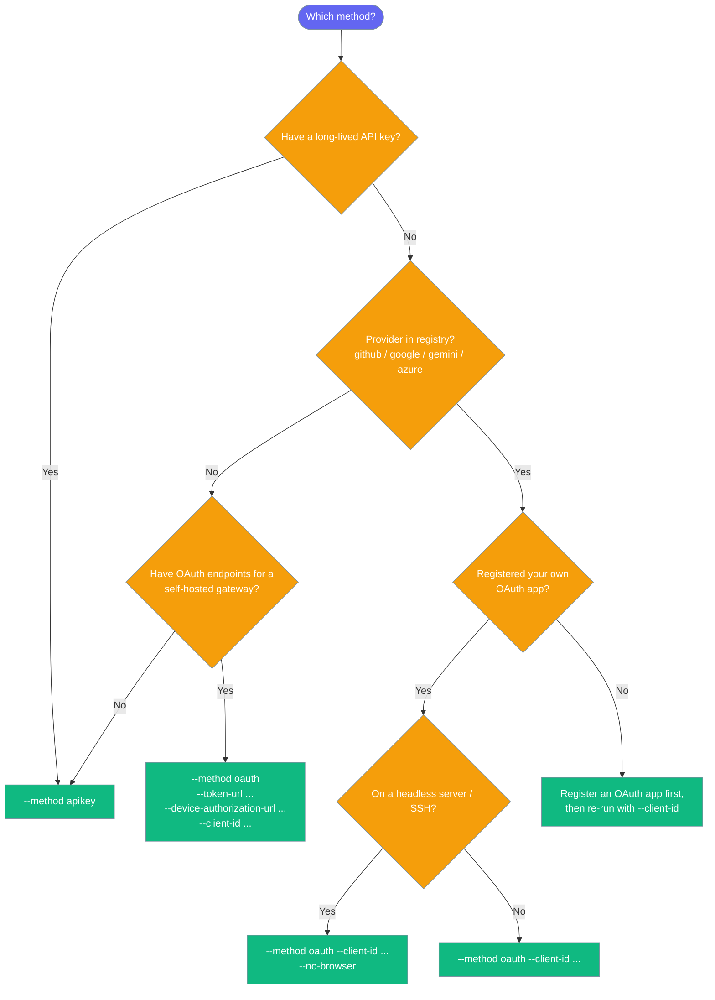
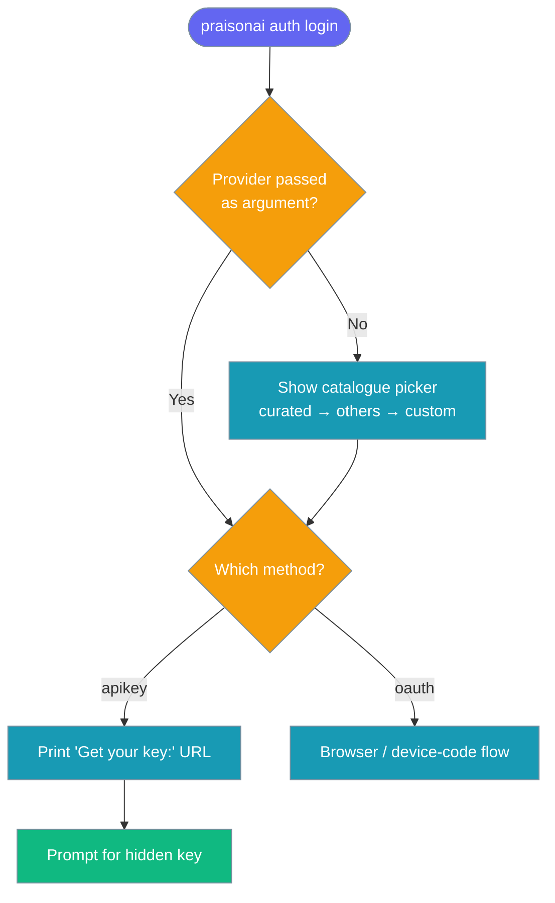
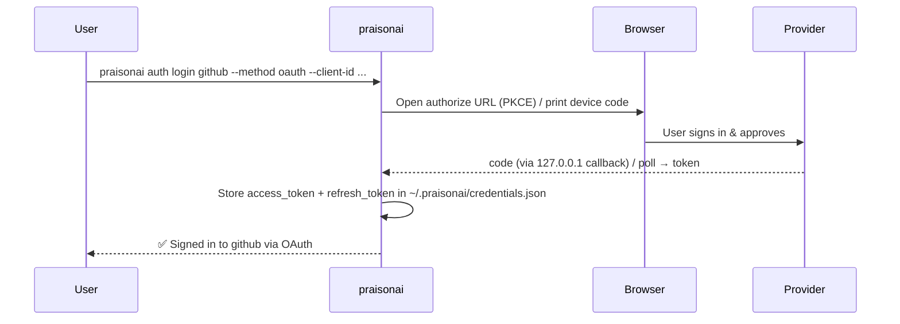
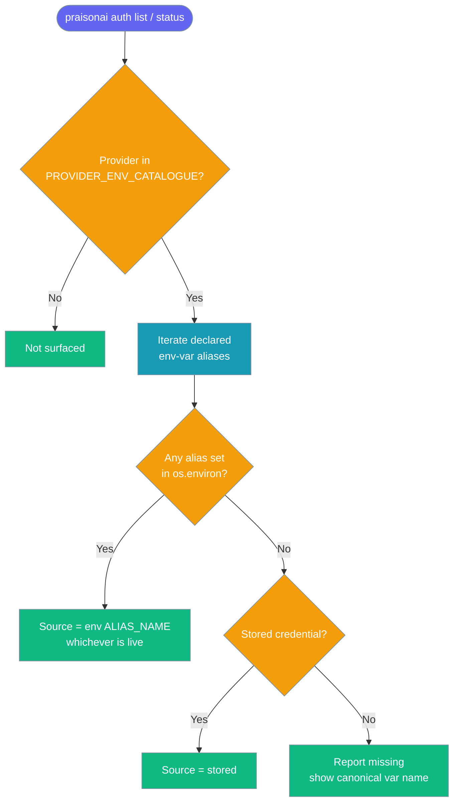
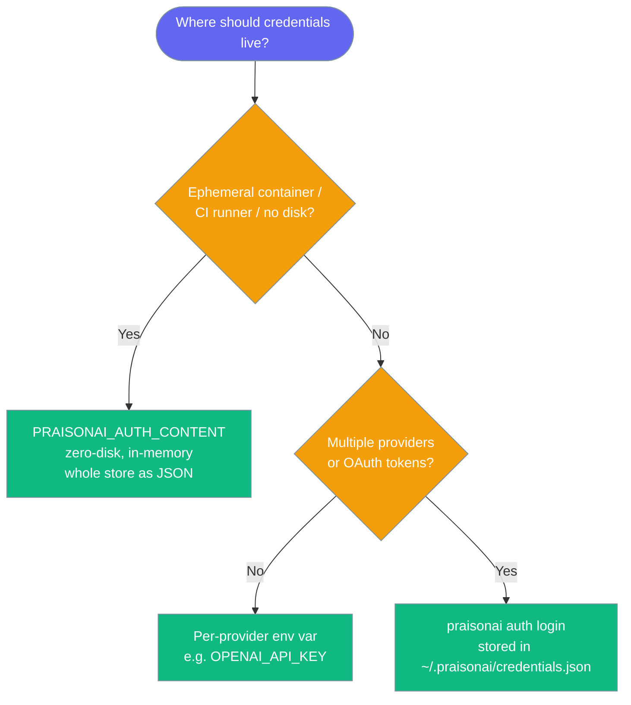

`praisonai auth` stores provider credentials locally so `praisonai run` works without exporting env vars every session. Two methods are supported: a long-lived **API key**, or a short-lived **OAuth token** signed in via your browser.


```mermaid
graph LR
    subgraph "praisonai auth login"
        A[🔑 API Key] --> C[~/.praisonai/credentials.json]
        B[🌐 OAuth Token] --> C
    end
    C --> D[⚡ praisonai run]

    classDef input fill:#8B0000,stroke:#7C90A0,color:#fff
    classDef store fill:#189AB4,stroke:#7C90A0,color:#fff
    classDef run fill:#10B981,stroke:#7C90A0,color:#fff

    class A,B input
    class C store
    class D run
```

## Quick Start

<Tabs>
  <Tab title="Picker">
    ```bash
    # Omit the provider to pick from the model catalogue (~30+ LLMs)
    praisonai auth login
    # → Choose your LLM provider: openai | anthropic | google | ollama | ... | custom

    praisonai run "What is 2+2?"
    ```
    The picker is built from `ModelCatalogue.list_providers()`: `openai`, `anthropic`, `google`, `ollama` first, every other catalogue provider (Groq, OpenRouter, Mistral, DeepSeek, xAI, …) next, and `custom` last.
  </Tab>
  <Tab title="API Key">
    ```bash
    # Interactive — key is hidden at the prompt
    praisonai auth login openai

    # Then run immediately
    praisonai run "What is 2+2?"
    ```
  </Tab>
  <Tab title="OAuth (Browser)">
    ```bash
    # Device-code flow; sign in; tokens stored + auto-refreshed
    praisonai auth login github --method oauth --client-id <your-github-oauth-app-client-id>

    praisonai run "What is 2+2?"
    ```
    <Note>Built-in OAuth providers (`github`, `google`, `gemini`, `azure`) ship with endpoints but no `client_id`. Supply your OAuth app's id via `--client-id`; the CLI resolves the rest. Providers outside the registry (e.g. `openai`, `anthropic`) fall back to the API-key prompt.</Note>
  </Tab>
  <Tab title="Headless / SSH">
    ```bash
    # Prints a URL + code instead of opening a browser
    praisonai auth login github --method oauth --client-id <your-github-oauth-app-client-id> --no-browser
    # To sign in, visit https://github.com/login/device and enter code: ABCD-EFGH

    praisonai run "What is 2+2?"
    ```
  </Tab>
</Tabs>

## Commands

| Command | Description |
|---|---|
| `auth login [<provider>]` | Store credentials. Omit `<provider>` to open the catalogue-driven picker. `--method auto` (default) picks OAuth if available, else API key |
| `auth list` | Show stored **and** active env-var providers with method, source, and expiry |
| `auth status [provider]` | Format check; `--validate` does a live call (uses a freshly-refreshed OAuth token) |
| `auth logout <provider>` | Remove one provider |
| `auth logout --all` | Remove all stored credentials |

<Note>
`auth login` now accepts an **optional** provider. Run `praisonai auth login` with no argument to pick from a catalogue-driven list (any provider `ModelCatalogue` knows about — Groq, OpenRouter, Mistral, DeepSeek, xAI, …); curated providers appear first, `custom` last. Scripts that pass the provider positionally still work unchanged. A one-line "Get your key" hint prints before the masked prompt for well-known providers.
</Note>

### Login flags

| Flag | Default | Purpose |
|---|---|---|
| `--method auto\|apikey\|oauth` | `auto` | Force a flow, or let the CLI pick |
| `--key sk-…` | (prompt) | API-key only; skip prompt |
| `--key-stdin` | off | Read API key from stdin |
| `--no-browser` | off | OAuth only; print URL + code instead of opening a browser |
| `--base-url URL` | (default) | Custom provider endpoint |
| `--model NAME` | (none) | Default model recorded with the credential |
| `--skip-validation` | off | API-key only; skip the live check |
| `--client-id ID` | (from registry) | OAuth client id. Overrides the built-in registry entry. Required for registry providers until a first-party PraisonAI app is provisioned |
| `--token-url URL` | (from registry) | OAuth token endpoint. Set to enable OAuth for a provider outside the registry (e.g. self-hosted gateway) |
| `--device-authorization-url URL` | (from registry) | RFC 8628 device-code endpoint |
| `--authorization-url URL` | (from registry) | RFC 7636 PKCE authorization endpoint |
| `--scope SCOPE` | (from registry) | Scope(s) to request; overrides the registry default |

### Which `--method` should I use?


```mermaid
graph TB
    Start([Which method?]) --> Q1{Have a long-lived API key?}
    Q1 -->|Yes| Apikey[--method apikey]
    Q1 -->|No| Q2{Provider in registry?<br/>github / google / gemini / azure}
    Q2 -->|No| Q3{Have OAuth endpoints for a<br/>self-hosted gateway?}
    Q2 -->|Yes| Q4{Registered your own<br/>OAuth app?}
    Q3 -->|Yes| SelfHost[--method oauth<br/>--token-url ...<br/>--device-authorization-url ...<br/>--client-id ...]
    Q3 -->|No| Apikey
    Q4 -->|Yes| Q5{On a headless server / SSH?}
    Q4 -->|No| RegisterApp[Register an OAuth app first,<br/>then re-run with --client-id]
    Q5 -->|Yes| Headless[--method oauth --client-id ...<br/>--no-browser]
    Q5 -->|No| Desktop[--method oauth --client-id ...]

    classDef decision fill:#F59E0B,stroke:#7C90A0,color:#fff
    classDef result fill:#10B981,stroke:#7C90A0,color:#fff
    classDef start fill:#6366F1,stroke:#7C90A0,color:#fff

    class Start start
    class Q1,Q2,Q3,Q4,Q5 decision
    class Apikey,Headless,Desktop,SelfHost,RegisterApp result
```

<Note>`--method auto` on a registry provider without a `--client-id` prints an info line telling you how to switch to OAuth explicitly, then falls back to the API-key prompt.</Note>

## Provider Picker

Omit the provider argument and `auth login` opens a catalogue-driven picker so you never have to memorise a provider id.

```bash
praisonai auth login
```

```
Choose your LLM provider:
  1) openai
  2) anthropic
  3) google
  4) ollama
  5) groq
  6) openrouter
  7) mistral
  ...
  N) Other/custom
Select provider [1]:
```

The list comes from `ModelCatalogue.list_providers()`: `openai`, `anthropic`, `google`, `ollama` first, every other catalogue provider appended, `custom` last. Picking `custom` prompts for a free-form provider id. The positional `<provider>` argument still works unchanged — keep passing it in scripts and CI.


```mermaid
graph TB
    Start([praisonai auth login]) --> HasProv{Provider passed<br/>as argument?}
    HasProv -->|Yes| Method{Which method?}
    HasProv -->|No| Picker[Show catalogue picker<br/>curated → others → custom]
    Picker --> Method
    Method -->|apikey| Hint[Print 'Get your key:' URL]
    Method -->|oauth| Browser[Browser / device-code flow]
    Hint --> Prompt[Prompt for hidden key]

    classDef start fill:#6366F1,stroke:#7C90A0,color:#fff
    classDef decision fill:#F59E0B,stroke:#7C90A0,color:#fff
    classDef step fill:#189AB4,stroke:#7C90A0,color:#fff
    classDef result fill:#10B981,stroke:#7C90A0,color:#fff

    class Start start
    class HasProv,Method decision
    class Picker,Hint,Browser step
    class Prompt result
```

## OAuth Login (browser-based)

Two flows are negotiated automatically per provider:
- **Device code** (RFC 8628) — prints a short code + URL, polls until you approve. Default on headless servers.
- **Authorization code + PKCE** (RFC 7636) — opens your default browser and listens on `127.0.0.1` for the redirect. Default on desktops.

<Note>Built-in providers ship with endpoints but no `client_id` (registration-specific). Supply your OAuth app's id via `--client-id`; the CLI resolves the rest.</Note>


```mermaid
sequenceDiagram
    participant User
    participant CLI as praisonai
    participant Browser
    participant Provider

    User->>CLI: praisonai auth login github --method oauth --client-id ...
    CLI->>Browser: Open authorize URL (PKCE) / print device code
    Browser->>Provider: User signs in & approves
    Provider-->>CLI: code (via 127.0.0.1 callback) / poll → token
    CLI->>CLI: Store access_token + refresh_token in ~/.praisonai/credentials.json
    CLI-->>User: ✅ Signed in to github via OAuth
```

The OAuth callback handler and PKCE helpers are shared with the MCP OAuth integration.

### Token storage & refresh

| Item | Value |
|---|---|
| File | `~/.praisonai/credentials.json` (unchanged from API-key flow) |
| Legacy fallback | `~/.praison/credentials.json` is still read if the canonical file doesn't exist yet; migrated onto the canonical file on the next write. No `auth logout`/re-login needed. |
| Permissions | `0o600`, atomic writes |
| Refresh | Transparent on next use, ~60 s before `expires_at` |
| Refresh failure | CLI returns no token rather than a stale one — re-run `auth login` |

### Self-hosted / custom OAuth providers

`praisonai auth login` ships built-in endpoints for `github`, `google`, `gemini`, and `azure`. For a provider outside the registry (e.g. a self-hosted gateway), supply the endpoints directly with CLI flags:

```bash
praisonai auth login my-gateway --method oauth \
  --client-id cli \
  --device-authorization-url https://gateway.example.com/oauth/device \
  --token-url https://gateway.example.com/oauth/token \
  --scope "read write"
```

The CLI infers the `device` flow when a `--device-authorization-url` is present, or falls back to `authcode` (PKCE) when you pass `--authorization-url` instead.

As an escape hatch, you can also register a provider config from Python before invoking the flow:

```python
from praisonai_code.cli.configuration.oauth import OAUTH_PROVIDERS, OAuthProviderConfig

OAUTH_PROVIDERS["my-gateway"] = OAuthProviderConfig(
    flow="device",
    client_id="my-client-id",
    token_url="https://gateway.example.com/oauth/token",
    device_authorization_url="https://gateway.example.com/oauth/device",
    scope="read write",
)
```

### Headless / SSH

```bash
praisonai auth login github --method oauth --client-id <your-github-oauth-app-client-id> --no-browser
# To sign in, visit https://github.com/login/device and enter code: ABCD-EFGH
```

## API Key Login

<Note>
`auth login` (and `setup`) print a `Get your key:` link to the provider's key-creation page before the hidden prompt for catalogue providers, so first-run users don't have to guess where to find one:

```
Get your key: https://console.groq.com/keys
Enter API key for groq:
```

The link comes from a static `PROVIDER_KEY_URLS` map (`key_url_for_provider()`). Providers without a mapped URL skip the hint silently.
</Note>

```bash
praisonai auth login openai
praisonai auth login openai --key sk-...
echo "sk-..." | praisonai auth login openai --key-stdin

# Optional extras
praisonai auth login openai --key sk-... --base-url https://api.openai.com/v1 --model gpt-4o
praisonai auth login openai --skip-validation
```

### List & status

```bash
praisonai auth list
praisonai auth status
praisonai auth status openai --validate
```

### Logout

```bash
praisonai auth logout openai
praisonai auth logout --all
```

## List & Status — new columns

```bash
praisonai auth list
# Provider   Method   Source                   Secret          Expires   Base URL      Model
# openai     apikey   env (OPENAI_API_KEY)      sk-1***efgh     (n/a)     (default)     (none)
# anthropic  apikey   stored                   sk-a***wxyz     (n/a)     (default)     (none)
# groq       apikey   env (GROQ_API_KEY)        gsk_***abcd     (n/a)     (default)     (none)
# github     oauth    stored                   at-9***xyz1     59m       (default)     (none)
```

`Source` shows where the live credential comes from: `stored` (from `~/.praisonai/credentials.json`) or `env (VARNAME)` when an active environment variable is present. An env key that shadows a stored one is flagged `env (VARNAME) [live, overrides stored]`.

`Expires` shows `(n/a)` for API keys, `59m`, `1h 23m`, `<1m`, or `expired` for OAuth tokens, and `(no expiry)` when the provider didn't include one.

### Stored vs environment credentials

`auth list` and `auth status` surface **both** stored credentials (from `~/.praisonai/credentials.json`) and **active environment-variable keys** for catalogue-known providers. The `Source` column disambiguates them:

| Source | Meaning |
|---|---|
| `stored` | From `~/.praisonai/credentials.json` (unchanged behaviour) |
| `env (VAR_NAME)` | Live credential coming from an environment variable; the var name is shown for unambiguity |
| `env (in-memory)` | The whole store was loaded from `PRAISONAI_AUTH_CONTENT` — see [Zero-disk mode](#zero-disk-mode-praisonai_auth_content) |

When `PRAISONAI_AUTH_CONTENT` is set, every stored-side entry reports `env (in-memory)` instead of `stored`:

```bash
praisonai auth list
# Provider   Method   Source            Secret          Expires   Base URL   Model
# openai     apikey   env (in-memory)   sk-1***efgh     (n/a)     (default)  (none)
# github     oauth    env (in-memory)   gho_***xyz1     59m       (default)  (none)
```

If both a stored and an env credential exist for one provider, the env value wins at run time (this is unchanged) — the `Source` line appends `[live, overrides stored]` so it's visible:

```bash
praisonai auth list
# Provider   Method   Source                                       Secret          Expires   Base URL   Model
# openai     apikey   env (OPENAI_API_KEY) [live, overrides stored] sk-1***efgh     (n/a)     (default)  (none)
```

Both stored and env secrets are redacted the same way (`sk-1***efgh`).

<Note>The `auth list` and `auth status` table columns changed in this release — `Method`, `Source`, and `Expires` columns were added, and active env-var credentials are now surfaced. Scripts that parse the table output need to be updated. The `--json` output is additive only (new `source` / `env_var` keys added; no existing keys removed).</Note>

### Credential env-var aliases

Some providers declare more than one credential env-var spelling — Together's `TOGETHER_API_KEY` / `TOGETHERAI_API_KEY`, Fireworks' `FIREWORKS_API_KEY` / `FIREWORKS_AI_API_KEY`, Google's `GOOGLE_API_KEY` / `GEMINI_API_KEY`. `auth list` and `auth status` recognise **every** alias — a key set under a secondary spelling is surfaced exactly like one set under the canonical first.

```bash
export TOGETHERAI_API_KEY=sk-1234abcdefgh
praisonai auth list
# Provider   Method   Source                     Secret          Expires   Base URL   Model
# together   apikey   env (TOGETHERAI_API_KEY)   sk-1***efgh     (n/a)     (default)  (none)
```

The `Source` column names whichever alias is live in the environment, so it always tells you exactly which variable the runtime is reading — even when a secondary spelling is the one you set. If no alias is set but the provider is otherwise referenced, the canonical first var name is shown for display only.


```mermaid
graph TB
    Start([praisonai auth list / status]) --> HasCat{Provider in<br/>PROVIDER_ENV_CATALOGUE?}
    HasCat -->|No| Skip[Not surfaced]
    HasCat -->|Yes| Aliases[Iterate declared<br/>env-var aliases]
    Aliases --> AnySet{Any alias set<br/>in os.environ?}
    AnySet -->|Yes| Live[Source = env ALIAS_NAME<br/>whichever is live]
    AnySet -->|No| Stored{Stored credential?}
    Stored -->|Yes| StoredSrc[Source = stored]
    Stored -->|No| Missing[Report missing<br/>show canonical var name]

    classDef start fill:#6366F1,stroke:#7C90A0,color:#fff
    classDef decision fill:#F59E0B,stroke:#7C90A0,color:#fff
    classDef step fill:#189AB4,stroke:#7C90A0,color:#fff
    classDef result fill:#10B981,stroke:#7C90A0,color:#fff

    class Start start
    class HasCat,AnySet,Stored decision
    class Aliases step
    class Live,StoredSrc,Missing,Skip result
```

<Note>
Multi-alias recognition was fixed in [PraisonAI PR #4099](https://github.com/MervinPraison/PraisonAI/pull/4099). Before this fix, `auth list` / `auth status` only knew the canonical first spelling for each provider and would report "not found" for a key the runtime happily accepted under a secondary alias. After the fix, `auth` matches runtime detection exactly.
</Note>

## Credential Fields (`ProviderCredential`)

Each stored provider credential contains the following fields:

| Field | Type | Description |
|-------|------|-------------|
| `api_key` | `str` | Static API key. For OAuth flows, mirrors `access_token` for backward compatibility |
| `access_token` | `str` | OAuth access token (empty for API-key credentials) |
| `refresh_token` | `str` | OAuth refresh token used for silent renewal |
| `expires_at` | `int` | Unix epoch seconds when the access token expires. `0` for API keys (no expiry) |
| `auth_method` | `str` | `"apikey"` or `"oauth"` — indicates which flow was used to store this credential |

`auth list` and `auth status` show `Method` and `Expires` columns reflecting these fields.

---

## Storage & Security

| Item | Value |
|---|---|
| File | `~/.praisonai/credentials.json` |
| Legacy fallback | Read-only fallback: `~/.praison/credentials.json`. Any write transparently migrates its entries onto the canonical file. |
| Permissions | `0o600` (auto-corrected on read if loose) |
| Writes | Atomic via temp file + `os.replace` |
| Display | Keys/tokens redacted as `at-9***xyz1` everywhere except the file |
| OAuth internals | `refresh_token`, `token_url`, `client_id` are scrubbed before crossing into the LLM resolver — never sent to the provider |
| Zero-disk mode | Set `PRAISONAI_AUTH_CONTENT` to a JSON store — nothing is read from or written to `credentials.json` for the process lifetime. See below |

<Note>
**Path change — auto-migrated.** Prior releases stored credentials at `~/.praison/credentials.json`. The canonical path is now `~/.praisonai/credentials.json`; the legacy path is still read if the canonical file doesn't exist yet, and any subsequent `auth login` or `setup` transparently migrates your old entries onto the canonical file. No re-login is required.
</Note>

### Zero-disk mode (`PRAISONAI_AUTH_CONTENT`)

Set `PRAISONAI_AUTH_CONTENT` to a JSON credential store and PraisonAI runs entirely from memory — nothing is ever read from or written to `~/.praisonai/credentials.json`.

Use it for ephemeral containers (Docker/Kubernetes), CI runners, and secret-hygiene-sensitive deployments where OAuth and refresh tokens must not touch disk. A single secret injects the whole store — including OAuth entries — with zero on-disk footprint.


```mermaid
graph TB
    Start([Where should credentials live?]) --> Ephemeral{Ephemeral container /<br/>CI runner / no disk?}
    Ephemeral -->|Yes| InMem[PRAISONAI_AUTH_CONTENT<br/>zero-disk, in-memory<br/>whole store as JSON]
    Ephemeral -->|No| Multi{Multiple providers<br/>or OAuth tokens?}
    Multi -->|No| Simple[Per-provider env var<br/>e.g. OPENAI_API_KEY]
    Multi -->|Yes| Disk[praisonai auth login<br/>stored in ~/.praisonai/credentials.json]

    classDef start fill:#6366F1,stroke:#7C90A0,color:#fff
    classDef decision fill:#F59E0B,stroke:#7C90A0,color:#fff
    classDef result fill:#10B981,stroke:#7C90A0,color:#fff

    class Start start
    class Ephemeral,Multi decision
    class InMem,Simple,Disk result
```

The value is a JSON **object** mapping provider name → credential object. Each credential object mirrors the on-disk `ProviderCredential` fields — `api_key` and `auth_method` for API keys, plus `access_token`, `refresh_token`, and `expires_at` for OAuth:

```json
{
  "openai": {
    "api_key": "sk-...",
    "auth_method": "apikey"
  },
  "github": {
    "api_key": "gho_...",
    "auth_method": "oauth",
    "access_token": "gho_...",
    "refresh_token": "ghr_...",
    "expires_at": 1723545600
  }
}
```

<Tabs>
  <Tab title="Bash / CI">
    ```bash
    # Inject the store from a CI secret; nothing is written to disk
    export PRAISONAI_AUTH_CONTENT='{"openai":{"api_key":"sk-...","auth_method":"apikey"}}'
    praisonai run "What is 2+2?"
    ```
  </Tab>
  <Tab title="Python">
    ```python
    import json, os
    from praisonaiagents import Agent

    os.environ["PRAISONAI_AUTH_CONTENT"] = json.dumps({
        "openai": {"api_key": "sk-...", "auth_method": "apikey"},
    })

    agent = Agent(name="CI Agent", instructions="Answer briefly")
    agent.start("What is 2+2?")
    # No ~/.praisonai/credentials.json is created — everything stays in memory.
    ```
  </Tab>
</Tabs>

Invalid values fail fast rather than silently falling back to disk, protecting the zero-disk contract:

| Value | Behaviour |
|---|---|
| Unset | Falls back to disk (unchanged behaviour) |
| Empty / whitespace only | Raises `ValueError` — misconfiguration, no silent disk fallback |
| Not valid JSON | Raises `ValueError` with the underlying decode error |
| JSON scalar or array (not an object) | Raises `ValueError` — must map provider → credential |
| A provider value that isn't a JSON object | Raises `ValueError` naming the offending provider(s) |
| Valid object with OAuth tokens | Loaded in memory; OAuth refresh works and stays in memory |

<Note>
**Precedence:** the env blob always wins over any on-disk `credentials.json`. Per-provider API-key env vars (`OPENAI_API_KEY`, …) still win for that specific provider at run time — unchanged.
</Note>

<Warning>
Treat `PRAISONAI_AUTH_CONTENT` as a secret. Inject it only from a secrets manager, never commit it, and prefer a CI runtime that scrubs env vars from build logs. OAuth tokens refreshed in this mode stay **in memory only** — nothing is written back to disk.
</Warning>

`auth list` and `auth status` report the `Source` column as `env (in-memory)` in this mode via the `CredentialStore.is_in_memory` property, so zero-disk runs are never silently invisible.

<Note>
**Sibling for config:** `PRAISONAI_CONFIG_CONTENT` and `PRAISONAI_CONFIG` do the same thing for the user-config layer. Setting both alongside `PRAISONAI_AUTH_CONTENT` gives you a fully zero-disk PraisonAI run. See [Security Environment Variables → PRAISONAI_CONFIG_CONTENT](/features/security-environment-variables#praisonai_config_content).
</Note>

## Supported Providers

`praisonai auth list` / `praisonai auth status` recognise every provider in `PROVIDER_ENV_CATALOGUE` — the same catalogue that drives first-run credential detection ([full 14-row table](/cli/setup#credential--default-model-map)) and `praisonai setup`.

| Provider | API key env var(s) | Default model | OAuth supported today? |
|---|---|---|---|
| `openai` | `OPENAI_API_KEY` (+ `OPENAI_BASE_URL` if set) | `gpt-4o-mini` | Not yet — use API key |
| `anthropic` | `ANTHROPIC_API_KEY` | `anthropic/claude-3-5-sonnet-latest` | Not yet — use API key |
| `google` / `gemini` | `GOOGLE_API_KEY` / `GEMINI_API_KEY` | `gemini/gemini-1.5-flash` | ✅ — device flow, requires `--client-id` |
| `groq` | `GROQ_API_KEY` | `groq/llama-3.3-70b-versatile` | Not yet — use API key |
| `cohere` | `COHERE_API_KEY` | `cohere/command-r` | Not yet — use API key |
| `openrouter` | `OPENROUTER_API_KEY` | `openrouter/openai/gpt-4o-mini` | Not yet — use API key |
| `ollama` | `OLLAMA_HOST` | `ollama/llama3.2` | n/a — local |
| `mistral` | `MISTRAL_API_KEY` | `mistral/mistral-large-latest` | Not yet — use API key |
| `deepseek` | `DEEPSEEK_API_KEY` | `deepseek/deepseek-chat` | Not yet — use API key |
| `xai` | `XAI_API_KEY` | `xai/grok-2-latest` | Not yet — use API key |
| `together` | `TOGETHER_API_KEY` **or** `TOGETHERAI_API_KEY` | `together_ai/meta-llama/Llama-3.3-70B-Instruct-Turbo` | Not yet — use API key |
| `perplexity` | `PERPLEXITYAI_API_KEY` | `perplexity/sonar` | Not yet — use API key |
| `fireworks` | `FIREWORKS_API_KEY` **or** `FIREWORKS_AI_API_KEY` | `fireworks_ai/accounts/fireworks/models/llama-v3p3-70b-instruct` | Not yet — use API key |
| `github` | n/a | (your model) | ✅ — device flow, requires `--client-id` |
| `azure` | n/a | (your model) | ✅ — device flow, requires `--client-id` |
| Self-hosted / custom | n/a | (your model) | ✅ — supply endpoints via `--token-url` / `--device-authorization-url` |

Unknown providers accept API keys with length ≥ 10. OAuth is opt-in per provider; registry providers ship endpoints but no `client_id` — pass yours with `--client-id`.

## Optional dependency

The OAuth flow uses the `requests` library. It is lazy-imported, so users on the API-key path never see it. If a user runs `--method oauth` without it installed:

```
OAuth login requires the optional 'requests' package. Install it with: pip install requests
```

## How Run Uses Credentials

`praisonai run` resolves credentials in this order:

1. Environment variables (`OPENAI_API_KEY`, `ANTHROPIC_API_KEY`, …)
2. Stored credentials — **OAuth tokens refreshed transparently** (~60 s before expiry) before injection. When `PRAISONAI_AUTH_CONTENT` is set, this store is the [in-memory env blob](#zero-disk-mode-praisonai_auth_content) instead of `~/.praisonai/credentials.json`, and any OAuth refresh stays in memory only
3. LLM endpoint resolution via `resolve_llm_endpoint_with_credentials`

### Model → provider inference

When `praisonai run` picks a model id from your environment (rather than a `--model` flag or `[llm]` config entry), it prints a one-line transparency notice naming the credential that drove the choice:

```
No model set; using openrouter/openai/gpt-4o-mini because OPENROUTER_API_KEY is present.
```

The notice now fires for **every** catalogued provider, not just the historical eight. Setting `OPENROUTER_API_KEY`, `MISTRAL_API_KEY`, `DEEPSEEK_API_KEY`, `XAI_API_KEY`, `TOGETHER_API_KEY` / `TOGETHERAI_API_KEY`, `FIREWORKS_API_KEY` / `FIREWORKS_AI_API_KEY`, `PERPLEXITYAI_API_KEY`, or `COHERE_API_KEY` all produce the notice with the alias you actually set — so you can see which key the runtime picked up before the first LLM call.

For providers with multiple credential spellings, the notice names whichever alias is live in `os.environ`, matching the `Source` column of `auth list`.

<Note>
Coverage was extended in [PraisonAI PR #4099](https://github.com/MervinPraison/PraisonAI/pull/4099). Before this fix, `_provider_for_model()` silently returned `None` for openrouter/mistral/deepseek/xai/together/fireworks, so no transparency notice printed for those providers even when a key was set. After the fix, every catalogued provider prints the notice.
</Note>

If an expired OAuth token cannot be refreshed (refresh token revoked, network error, etc.), `praisonai run` reports:

```
Error: No valid token for <provider>. Run: praisonai auth login <provider> --method oauth
```

If nothing is found, non-interactive mode exits with:

```
Error: No API key configured. Run: praisonai auth login
```

See [Run](/cli/run#first-run-credential-check) for the interactive wizard path.

## Related

<CardGroup cols={2}>
  <Card title="Run" icon="play" href="/cli/run">
    Preflight credential check before execution
  </Card>
  <Card title="Config" icon="gear" href="/cli/config">
    Default model via `[llm]` in config.toml
  </Card>
  <Card title="Setup" icon="wand-magic-sparkles" href="/cli/setup">
    First-run setup wizard
  </Card>
</CardGroup>
