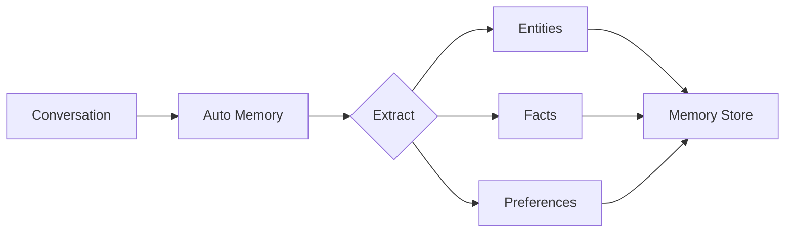

The `--auto-memory` flag enables automatic extraction and storage of important information from conversations.

## Quick Start

```bash
praisonai "My name is John and I prefer Python" --auto-memory
```

## Usage

### Basic Auto Memory

```bash
praisonai "I work at Acme Corp as a software engineer" --auto-memory
```

**Expected Output:**
```
🧠 Auto Memory enabled

╭─ Agent Info ─────────────────────────────────────────────────────────────────╮
│  👤 Agent: DirectAgent                                                       │
│  Role: Assistant                                                             │
│  🧠 Auto Memory: Enabled                                                    │
╰──────────────────────────────────────────────────────────────────────────────╯

╭────────────────────────────────── Response ──────────────────────────────────╮
│ Nice to meet you! It's great to know you're a software engineer at Acme     │
│ Corp. How can I help you today?                                              │
╰──────────────────────────────────────────────────────────────────────────────╯

💾 Memories Extracted:
┌─────────────────────┬────────────────────────────┐
│ Type                │ Content                    │
├─────────────────────┼────────────────────────────┤
│ Entity (Person)     │ User works at Acme Corp    │
│ Entity (Role)       │ Software Engineer          │
│ Long-term           │ User's workplace: Acme Corp│
└─────────────────────┴────────────────────────────┘
```

### With User Isolation

```bash
praisonai "Remember my preferences" --auto-memory --user-id user123
```

**Expected Output:**
```
🧠 Auto Memory enabled (user: user123)

╭────────────────────────────────── Response ──────────────────────────────────╮
│ I'll remember your preferences. What would you like me to remember?          │
╰──────────────────────────────────────────────────────────────────────────────╯

💾 Memory stored for user: user123
```

### Combine with Other Features

```bash
# Auto memory with session
praisonai "Learn about my project" --auto-memory --session my-project

# Auto memory with planning
praisonai "Plan my learning path" --auto-memory --planning

# Auto memory with metrics
praisonai "Remember this" --auto-memory --metrics
```

## How It Works



1. **Conversation Analysis**: The system analyzes the conversation
2. **Information Extraction**: Important information is identified
3. **Categorization**: Information is categorized (entities, facts, preferences)
4. **Storage**: Memories are stored for future retrieval
5. **Retrieval**: Memories are automatically injected into future conversations

## Memory Types Extracted

| Type | Description | Example |
|------|-------------|---------|
| **Entities** | People, places, organizations | "User works at Google" |
| **Facts** | Factual information | "Project deadline is Dec 31" |
| **Preferences** | User preferences | "Prefers Python over JavaScript" |
| **Context** | Contextual information | "Working on ML project" |

## Use Cases

### Personal Assistant

```bash
# First conversation
praisonai "I'm learning Rust and prefer hands-on examples" --auto-memory

# Later conversation (memories recalled)
praisonai "Give me a coding exercise" --auto-memory
```

**Expected Output (second conversation):**
```
🧠 Auto Memory enabled

📚 Recalled Memories:
  • User is learning Rust
  • User prefers hands-on examples

╭────────────────────────────────── Response ──────────────────────────────────╮
│ Since you're learning Rust and prefer hands-on examples, here's a practical │
│ exercise:                                                                    │
│                                                                              │
│ **Exercise: Build a Simple CLI Calculator**                                 │
│                                                                              │
│ ```rust                                                                      │
│ use std::io;                                                                 │
│                                                                              │
│ fn main() {                                                                  │
│     // Your code here                                                        │
│ }                                                                            │
│ ```                                                                          │
╰──────────────────────────────────────────────────────────────────────────────╯
```

### Project Context

```bash
# Share project details
praisonai "I'm building an e-commerce platform using Django and React" --auto-memory

# Ask for help (context remembered)
praisonai "How should I structure my API?" --auto-memory
```

### Team Preferences

```bash
# Different team members
praisonai "I prefer detailed explanations" --auto-memory --user-id alice
praisonai "I prefer concise answers" --auto-memory --user-id bob
```

## Viewing Stored Memories

Use the memory command to view what's been stored:

```bash
# Show memory statistics
praisonai memory show

# Search memories
praisonai memory search "Python"
```

**Expected Output:**
```
              Memory Statistics               
┏━━━━━━━━━━━━━━━━━━┳━━━━━━━━━━━━━━━━━━━━━━━━━┓
┃ Property         ┃ Value                   ┃
┡━━━━━━━━━━━━━━━━━━╇━━━━━━━━━━━━━━━━━━━━━━━━━┩
│ user_id          │ default                 │
│ short_term_count │ 0                       │
│ long_term_count  │ 4                       │
│ entity_count     │ 2                       │
│ episodic_days    │ 0                       │
│ summary_count    │ 0                       │
│ storage_path     │ .praison/memory/default │
└──────────────────┴─────────────────────────┘

Recent Short-term Memories:
  No short-term memories

Long-term Memories:
  1. [0.7] Python for backend
  2. [0.6] User's location: Acme Corp

Entities:
  • John (person)
  • Acme Corp (organization)
```

## Memory Persistence

Memories are stored locally and persist across sessions:

```
.praison/
└── memory/
    ├── default/
    │   ├── short_term.json
    │   ├── long_term.json
    │   └── entities.json
    └── user123/
        ├── short_term.json
        ├── long_term.json
        └── entities.json
```

## Best Practices

<Tip>
Use `--user-id` to keep memories separate for different users or projects.
</Tip>

<Warning>
Auto memory increases token usage as memories are injected into prompts. Monitor with `--metrics`.
</Warning>

<CardGroup cols={2}>
  <Card title="User Isolation">
    Use `--user-id` for multi-user scenarios
  </Card>
  <Card title="Regular Cleanup">
    Periodically clear old memories with `praisonai memory clear`
  </Card>
  <Card title="Combine with Sessions">
    Use with `--session` for project-specific memory
  </Card>
  <Card title="Monitor Usage">
    Use `--metrics` to track memory-related token costs
  </Card>
</CardGroup>

## Privacy Considerations

<Note>
Memories are stored locally on your machine. No data is sent to external servers for memory storage.
</Note>

- Memories are stored in `.praison/memory/`
- Use `praisonai memory clear all` to delete all memories
- Each user ID has isolated memory storage

## Related

- [Memory Concept](/concepts/memory)
- [Memory CLI Commands](/features/advanced-memory)
- [Session CLI](/docs/cli/session)
