The `--auto` flag automatically generates an agents.yaml configuration from a natural language task description, using **intelligent tool discovery** to assign the most appropriate tools based on task analysis.

<Info>
**Auto Mode vs Recipe Create**: Auto mode generates and **immediately executes** agents. Use `praisonai recipe create` if you want to generate a reusable recipe folder without execution.
</Info>

## Quick Start

```bash
praisonai --auto "Create a research team to analyze market trends"
```

## Auto Mode vs Recipe Create


<CardGroup cols={2}>
  <Card title="Auto Mode" icon="bolt">
    - Generates and **executes immediately**
    - Creates `agents.yaml` in current directory
    - Best for **one-off tasks**
    - No optimization loop
  </Card>
  <Card title="Recipe Create" icon="folder">
    - Creates a **reusable recipe folder**
    - Includes `agents.yaml` + `tools.py`
    - **Optimization loop** for quality
    - Best for **reusable workflows**
  </Card>
</CardGroup>

## Usage

```bash
praisonai --auto "<task description>" [options]
```

## Options

| Option | Description |
|--------|-------------|
| `--auto` | Enable auto mode with task description |
| `--merge` | Merge with existing agents.yaml instead of overwriting |
| `--framework` | Framework to use (crewai, autogen, praisonai) |

## Intelligent Tool Discovery

The enhanced auto mode analyzes your task description and automatically assigns appropriate tools from 9 categories:

| Category | Tools | Triggered By |
|----------|-------|--------------|
| **Web Search** | `internet_search`, `tavily_search`, `exa_search` | "search", "find", "look up" |
| **Web Scraping** | `scrape_page`, `crawl`, `extract_text` | "scrape", "crawl", "extract" |
| **File Operations** | `read_file`, `write_file`, `list_files` | "read file", "save", "load" |
| **Code Execution** | `execute_command`, `execute_code` | "execute", "run code", "script" |
| **Data Processing** | `read_csv`, `write_csv`, `read_json` | "csv", "excel", "json", "data" |
| **Research** | `search_arxiv`, `wiki_search` | "research", "paper", "wikipedia" |
| **Finance** | `get_stock_price`, `get_historical_data` | "stock", "price", "financial" |
| **Math** | `evaluate`, `solve_equation` | "calculate", "math", "equation" |
| **Database** | `query`, `find_documents` | "database", "sql", "mongodb" |

## Examples

<Tabs>
  <Tab title="Financial Research">
    ```bash
    praisonai --auto "Research stock prices and create a financial report"
    ```
    **Generated tools**: `get_stock_price`, `get_stock_info`, `get_historical_data`, `write_file`
  </Tab>
  <Tab title="Web Scraping">
    ```bash
    praisonai --auto "Scrape websites for product data and save to CSV"
    ```
    **Generated tools**: `scrape_page`, `crawl`, `extract_text`, `write_csv`, `read_csv`
  </Tab>
  <Tab title="Data Analysis">
    ```bash
    praisonai --auto "Analyze CSV data and generate statistics"
    ```
    **Generated tools**: `read_csv`, `analyze_csv`, `calculate_statistics`, `write_file`
  </Tab>
  <Tab title="With Framework">
    ```bash
    praisonai --auto "Create a data analysis team" --framework praisonai
    ```
  </Tab>
  <Tab title="Merge Existing">
    ```bash
    praisonai --auto "Add a quality reviewer" --merge
    ```
  </Tab>
</Tabs>

## How It Works

```mermaid
flowchart TD
    A["🎯 Task Description"] --> B["📊 Complexity Analysis"]
    B --> C{"Simple?"}
    C -->|Yes| D["1 Agent"]
    C -->|No| E{"Moderate?"}
    E -->|Yes| F["2 Agents"]
    E -->|No| G["3-4 Agents"]
    D --> H["🔧 Tool Assignment"]
    F --> H
    G --> H
    H --> I["📝 Generate YAML"]
    I --> J["▶️ Execute"]
    
    style A fill:#8B0000,color:#fff
    style B fill:#189AB4,color:#fff
    style H fill:#189AB4,color:#fff
    style I fill:#8B0000,color:#fff
    style J fill:#189AB4,color:#fff
```



<Steps>
  <Step title="Task Complexity Analysis">
    Determines if task is simple (1 agent), moderate (2 agents), or complex (3-4 agents)
  </Step>
  <Step title="Keyword Matching">
    Identifies relevant tool categories from task description
  </Step>
  <Step title="Tool Assignment">
    Assigns appropriate tools from matched categories
  </Step>
  <Step title="Agent Generation">
    Creates specialized agents with focused roles
  </Step>
  <Step title="YAML Output">
    Generates `agents.yaml` configuration file
  </Step>
  <Step title="Execution">
    Runs the generated agents to complete the task
  </Step>
</Steps>

## Generated Output

The auto mode creates an `agents.yaml` file with:
- **Intelligent agent count** based on task complexity
- **Specialized roles** with clear responsibilities
- **Appropriate tools** from 50+ available tools
- **Focused tasks** with expected outputs
- **Process configuration** (sequential, parallel, etc.)

## When to Use Each

<AccordionGroup>
  <Accordion title="Use Auto Mode When..." icon="bolt">
    - You need a **quick one-off task**
    - You want **immediate execution**
    - You don't need to save the workflow
    - You're **prototyping** ideas
  </Accordion>
  <Accordion title="Use Recipe Create When..." icon="folder">
    - You want a **reusable workflow**
    - You need **optimization** for quality
    - You want to **share** the recipe
    - You need **custom tools** in `tools.py`
    - You want to **version control** the recipe
  </Accordion>
</AccordionGroup>

<Tip>
For production workflows, use `praisonai recipe create` to get optimized, reusable recipes with proper structure.
</Tip>
