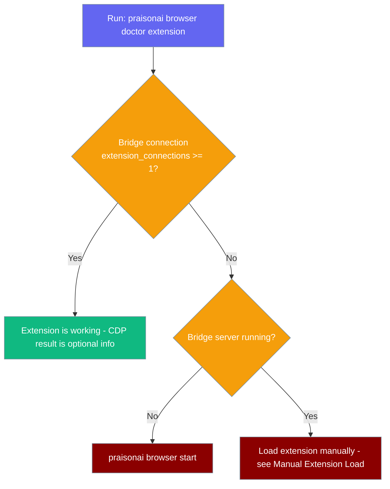
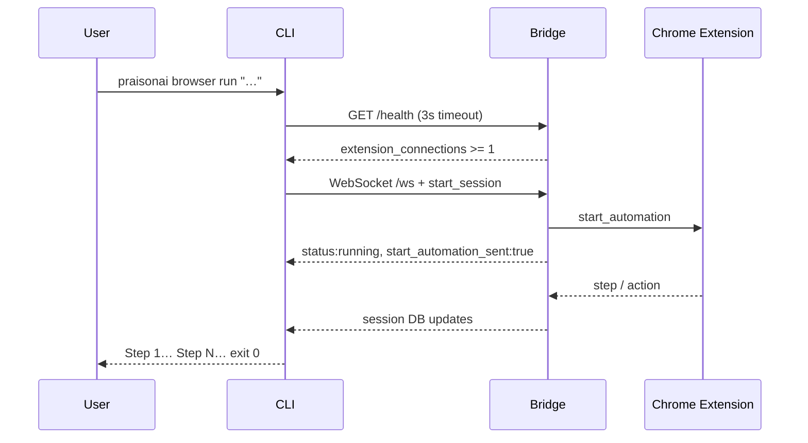

Control browser automation for AI agents directly from the CLI. Launch Chrome, navigate pages, take screenshots, run browser agents, and more.

<Note>
This command group ships in the `praisonai-browser` package. Running it inside `praisonai` triggers auto-install via the `ensure_praisonai_browser()` bootstrap helper. You can also invoke the standalone entry point directly with `praisonai-browser …`.
</Note>

## Standalone Entry Point

The `praisonai-browser` console script mirrors every `praisonai browser` subcommand.

```bash
praisonai-browser --help
praisonai-browser run "Go to google and search praisonai"
```

Inside the full wrapper the same commands work unchanged:

```bash
praisonai browser run "Go to google and search praisonai"
```

## Commands

```bash
praisonai browser <command> [OPTIONS]
# or standalone:
praisonai-browser <command> [OPTIONS]
```

| Command | Description |
|---------|-------------|
| `start` | Start the browser automation server |
| `launch` | Launch Chrome with extension and optionally run a goal |
| `run` | Run browser agent with a goal |
| `navigate` | Navigate a browser tab to a URL |
| `screenshot` | Capture a screenshot of a browser tab |
| `pages` | List all browser pages/tabs |
| `tabs` | List and manage browser tabs |
| `dom` | Get DOM tree from a browser page |
| `content` | Read page content as text |
| `console` | Get console logs from a page |
| `js` | Execute JavaScript in a page |
| `execute` | Execute JavaScript in a browser tab |
| `sessions` | List browser automation sessions |
| `history` | Show step-by-step history for a session |
| `clear` | Clear session history |
| `doctor` | Browser health diagnostics |
| `chrome` | Chrome browser management |
| `extension` | Chrome extension management |
| `benchmark` | Browser automation benchmarks |

---

## Doctor

Check browser health and configuration:

```bash
praisonai browser doctor
```

### Doctor Extension

Check whether the Chrome extension is working. This command reports **two independent signals** — the bridge connection is ground truth, the CDP check is optional.

```bash
praisonai browser doctor extension
praisonai browser doctor extension --server-port 8765   # custom bridge port
praisonai browser doctor extension --port 9222          # custom CDP debug port
```

| Option | Default | Description |
|--------|---------|-------------|
| `--port`, `-p` | `9222` | Chrome CDP debug port (optional check) |
| `--server-port` | `8765` | Bridge server port (ground-truth `/health` check) |

**Two signals:**

1. **Bridge connection (ground truth)** — queries `http://localhost:<server-port>/health` and reads the `extension_connections` count. `✅ Extension connected to bridge (N connection(s))` means the extension is working, regardless of which Chrome profile it runs in.
2. **CDP :9222 (optional)** — a service-worker check on the debug port. Shown as `ℹ️ Extension not in CDP Chrome on port 9222 (normal for daily 'Work' Chrome).` — this is **info only** and is **not** a failure on its own.

**Exit codes:** `doctor extension` exits **0** when the bridge shows at least one extension connection (regardless of the CDP result), and exits **1** only when the bridge shows zero extension connections.

<Note>
`extension_connections` counts only clients whose WebSocket `Origin` starts with `chrome-extension://`. Servers older than PraisonAI #3115 don't return this field; the CLI falls back to the total `connections` count in that case (slightly noisier, but still works).
</Note>



<Tip>
Run `praisonai browser doctor server` before a session to confirm the bridge is up — this avoids the bridge-unreachable message on `run`.
</Tip>

---

## Launch

Launch Chrome with the PraisonAI extension:

```bash
praisonai browser launch
```

With a goal to execute:
```bash
praisonai browser launch --goal "Search for AI news"
```

### Manual Load Fallback

Auto-load can fail silently on **Chrome 137+ / Windows**, which now blocks automated `--load-extension`. When the extension doesn't connect, `launch` prints a manual "Load unpacked" recovery flow. The instructions differ by flag:

- **Default** — the bridge is running, so it points you to `curl http://127.0.0.1:<server-port>/health` (expect `extension_connections >= 1`).
- **`--no-server`** — no bridge was started, so it tells you to run `praisonai browser start` first, then verify with `praisonai browser doctor extension`.

<Warning>
With `--no-server` there is no bridge listening on port `8765`, so a `/health` check will fail until you start the server. Start it first, then load the extension into your daily "Work" Chrome.
</Warning>

---

## Run

Run a browser agent with a specific goal:

```bash
praisonai browser run "Search for the latest AI news and summarize"
```

`run` fails fast: it checks the bridge, honours typed exit codes, and aborts a stalled session in 30 seconds instead of hanging silently.



### Pre-flight check

`run` hits `GET http://127.0.0.1:8765/health` with a 3-second timeout **before** opening the WebSocket, so a missing bridge or extension fails in seconds instead of hanging on the full `--timeout`. Three failures land here:

| Failure | Message | Exit |
|---------|---------|------|
| Bridge unreachable or malformed body | `Cannot reach PraisonAI Browser bridge` | `2` |
| No extension connected | `Bridge is up but no extension is connected` | `2` |
| Invalid health response | `Bridge returned an unexpected health response` / `Bridge returned an invalid connection count` | `2` |

The "no extension" message lists four recovery steps: open Chrome with the PraisonAI extension and side panel, verify with `curl http://127.0.0.1:8765/health` (expect `extension_connections >= 1`), use the side panel **or** the CLI (not both), and — as a tip — use `--engine cdp` for extension-free automation.

### Exit codes

`run` returns a **stable** exit code you can script against in CI, cron, or make targets.

| Exit code | Meaning | When |
|-----------|---------|------|
| `0` | Success | Session completed, or you hit Ctrl+C |
| `1` | Task failure | Session ended in `failed` or `stopped` state |
| `2` | Infra failure | Bridge unreachable, no extension, server error, or watchdog fired |
| `3` | Timeout | Session exceeded `--timeout` seconds |

These codes apply to both normal and `--debug` runs, so `2` always means "fix the environment" and `1` always means "the prompt or page didn't work out."

### First-step watchdog

When the server can't confirm the task reached an extension, `run` aborts after 30 seconds if no automation step has appeared:

```
No automation steps in 30s
  Check: extension connected? side panel stopped? sessions=0?
```

This maps to exit code `2`. The watchdog applies **only** when delivery is unconfirmed — a confirmed run honours `--timeout` fully, so a slow first step from a cold browser or slow initial model call is legitimate. Steps that arrive right at the deadline are shown before the watchdog fires.

### Verbose delivery indicator

Add `-v` to see whether the task reached an extension once the session starts:

```
start_automation delivered to extension      # confirmed
Warning: start_automation not confirmed      # unconfirmed
```

If the server reports delivery as `False`, `run` fails fast with `Extension automation did not start.` (exit `2`) instead of polling an empty session until timeout.

### Common failures

<AccordionGroup>
  <Accordion title="Bridge down">
    The bridge server is not running. Start it in a separate terminal, then verify:

    ```bash
    praisonai browser start --port 8765
    curl http://localhost:8765/health
    ```

    ```
    Cannot connect to PraisonAI Browser bridge at ws://localhost:8765/ws

    The bridge server is not running. In a separate terminal, start it with:

      praisonai browser start --port 8765

    Then verify it is up:
      curl http://localhost:8765/health

    Note: this is the local bridge server, not your target site (--url).
    ```

    <Note>
    The failing layer is the **local bridge server** on port 8765, not the site named in `--url`. This message replaces the raw `WinError 1225` (Windows), `errno 111` (Linux), and `errno 61` (macOS) connection-refused errors, so those still land here when searched.
    </Note>
  </Accordion>
  <Accordion title="No extension connected">
    The bridge is up but no extension is attached. Open Chrome with the PraisonAI extension and side panel, then confirm the count:

    ```bash
    curl http://127.0.0.1:8765/health    # expect extension_connections >= 1
    ```

    For extension-free automation, use `--engine cdp` instead.
  </Accordion>
  <Accordion title="Side panel busy">
    The side panel agent and the CLI can't drive the same extension at once. `run` surfaces server errors with a friendly message and exits `2`:

    ```
    <server error message>
      Stop the side panel agent and retry.
    ```

    Stop the side panel run, then retry from the CLI. You can confirm the bridge is idle with:

    ```bash
    curl http://127.0.0.1:8765/health   # expect extension_busy: false
    ```
  </Accordion>
</AccordionGroup>

---

### Two ways to start a session

`praisonai browser run` isn't the only entry point — you can also start automation from the **side panel** inside Chrome. Only one at a time can drive the extension.

```mermaid
sequenceDiagram
    participant SidePanel as Chrome Side Panel
    participant Bridge as Bridge Server
    participant Ext as Extension (CDP)

    SidePanel->>Bridge: start_session (own websocket)
    Bridge->>Bridge: extension_busy? → no
    Bridge->>Ext: start_automation (same connection)
    Ext-->>Bridge: observation / action / step
    Bridge-->>SidePanel: session updates

    classDef io fill:#8B0000,stroke:#7C90A0,color:#fff
    classDef bridge fill:#189AB4,stroke:#7C90A0,color:#fff
    classDef success fill:#10B981,stroke:#7C90A0,color:#fff
```

The side panel opens its own extension-origin WebSocket to the bridge and sends `start_session` on it. The bridge treats that connection as the extension itself (rather than self-excluding it as "no extension available"), so a side-panel task no longer fails with `NO_EXTENSION` on a single-extension setup.

While a side-panel session is running, `/health` reports `extension_busy: true` and `active_session_id: <session_id>`. A concurrent `praisonai browser run` in that state is rejected at the pre-flight check with:

```
Extension already running a session. Stop the side panel agent or wait for it to complete before starting another.
  Stop the side panel agent and retry.
```

Exit code `2`. The reverse also holds: starting a side-panel run while `run` is active is rejected the same way.

---

## Navigate

Navigate a browser tab to a URL:

```bash
praisonai browser navigate https://example.com
```

---

## Screenshot

Capture a screenshot of the current page:

```bash
praisonai browser screenshot
```

With options:
```bash
praisonai browser screenshot --output screenshot.png
```

---

## Pages

List all open browser pages/tabs:

```bash
praisonai browser pages
```

---

## DOM

Get the DOM tree from a browser page:

```bash
praisonai browser dom
```

---

## Content

Read page content as text:

```bash
praisonai browser content
```

---

## JS / Execute

Execute JavaScript in a browser page:

```bash
praisonai browser js "document.title"
```

```bash
praisonai browser execute "document.querySelector('h1').innerText"
```

---

## Sessions

List browser automation sessions:

```bash
praisonai browser sessions
```

Sessions end in one of `completed`, `failed`, `stopped`, or `cancelled`. `cancelled` covers mid-run disconnects (extension quit, CLI Ctrl-C, tab closed) — all four now stamp `ended_at` in the SQLite store, so `sessions` and `history` show accurate durations for interrupted runs.

---

## History

Show step-by-step history for a session:

```bash
praisonai browser history <session_id>
```

---

## Examples

### Web Scraping Workflow

```bash
# Launch browser
praisonai browser launch

# Navigate to page
praisonai browser navigate https://news.ycombinator.com

# Get page content
praisonai browser content

# Take screenshot for verification
praisonai browser screenshot --output hn.png
```

### Using Browser Agent

```bash
# Run agent with a goal
praisonai browser run "Go to Hacker News and find the top 3 stories about AI"
```

### Browser Health Check

```bash
# Check if browser is properly configured
praisonai browser doctor
```

---

## Chrome Management

### Start Server

```bash
praisonai browser start
```

### Chrome Subcommands

```bash
praisonai browser chrome <subcommand>
```

### Extension Subcommands

```bash
praisonai browser extension <subcommand>
```

---

## Environment Variables

| Variable | Description |
|----------|-------------|
| `BROWSER_HEADLESS` | Run headless by default (`true`/`false`) |
| `BROWSER_TIMEOUT` | Default timeout in seconds |

---

## Related

<CardGroup cols={2}>
  <Card title="Bot CLI" icon="robot" href="/cli/bot">
    Deploy messaging bots
  </Card>
  <Card title="Sandbox CLI" icon="box" href="/docs/cli/sandbox">
    Sandbox container management
  </Card>
</CardGroup>
