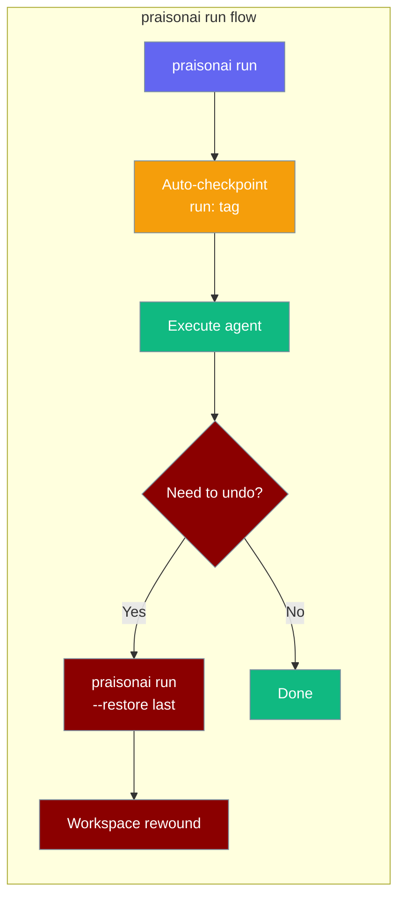

The `checkpoint` command manages file-level checkpoints using shadow git.



## Quick Start

```bash
# Save a checkpoint
praisonai checkpoint save "Before refactoring"
```

## Use with `praisonai run`

Every `praisonai run` automatically checkpoints the workspace before execution — tagged `run:` in the message. This gives you a free undo point for every run.

### Auto-checkpoint (default ON)

```bash
# Runs your agent AND saves a "run: ..." checkpoint first
praisonai run "Refactor all Python files"
```

To skip the checkpoint for one run:

```bash
praisonai run --no-checkpoint "Quick one-liner"
```

### Rewind and exit

Restore the workspace to a previous checkpoint without running an agent:

```bash
# Restore to a specific checkpoint
praisonai run --restore abc12345

# Restore to the most recent checkpoint
praisonai run --restore last
praisonai run --restore latest
```

`last` and `latest` are special aliases — they always resolve to the newest checkpoint.

### Disable auto-checkpoint project-wide

Add this to your project config file:

```yaml
# .praisonai/config.yaml
checkpoints:
  auto: false
```

## Usage

### Save Checkpoint

```bash
praisonai checkpoint save "Checkpoint message"
```

**Expected Output:**
```
✅ Checkpoint saved: abc12345
   Message: Before refactoring
   Files changed: 3
```

### List Checkpoints

```bash
praisonai checkpoint list
```

**Expected Output:**
```
╭─ Checkpoints ────────────────────────────────────────────────────────────────╮
│  1. [abc12345] Before refactoring (2024-12-24 07:30:00)                     │
│  2. [def67890] Initial state (2024-12-24 07:25:00)                          │
╰──────────────────────────────────────────────────────────────────────────────╯
```

### Show Diff

```bash
praisonai checkpoint diff
praisonai checkpoint diff abc12345
praisonai checkpoint diff abc12345 def67890
```

### Restore Checkpoint

```bash
# Restore to a specific checkpoint
praisonai checkpoint restore abc12345

# Restore to the newest checkpoint (aliases)
praisonai checkpoint restore last
praisonai checkpoint restore latest
```

### Delete Checkpoints

```bash
praisonai checkpoint delete
```

## Python API

```python
import asyncio
from praisonaiagents.checkpoints import CheckpointService

async def main():
    service = CheckpointService(workspace_dir="/path/to/project")
    await service.initialize()
    
    # Save checkpoint
    result = await service.save("Before changes")
    print(f"Saved: {result.checkpoint.short_id}")
    
    # List checkpoints
    checkpoints = await service.list_checkpoints()
    for cp in checkpoints:
        print(f"{cp.short_id}: {cp.message}")
    
    # Restore
    await service.restore(result.checkpoint.id)

asyncio.run(main())
```

## See Also

- [Shadow Git Checkpointing Feature](/docs/features/checkpoints)
