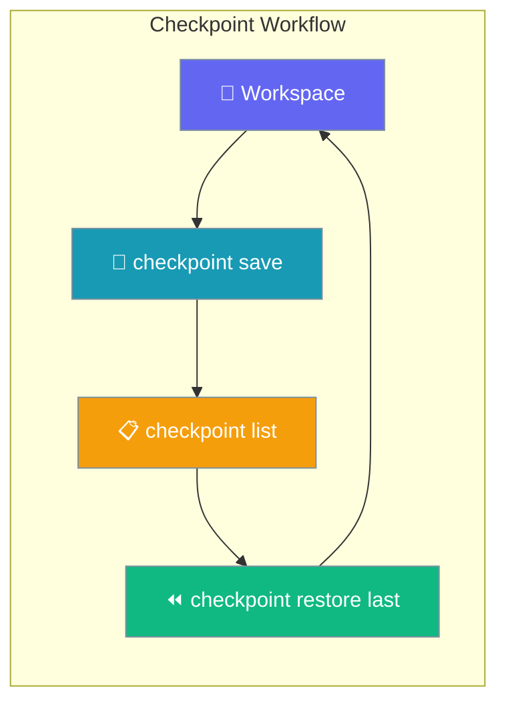

Checkpoints create instant snapshots of your workspace so you can undo any run or refactor with a single command.



## Quick Start

<Steps>

<Step title="Save before a risky change">

```bash
praisonai checkpoint save "before refactor"
```

</Step>

<Step title="Run your agent">

```bash
praisonai run "Refactor the auth module"
```

</Step>

<Step title="Restore if something went wrong">

```bash
praisonai checkpoint restore last
```

</Step>

</Steps>

---

## Commands

### `checkpoint save`

```bash
praisonai checkpoint save "<message>" [OPTIONS]
```

| Option | Description |
|--------|-------------|
| `--allow-empty` | Save even if no files changed |
| `--workspace <dir>` | Use a different workspace directory |

```bash
praisonai checkpoint save "before major refactor"
praisonai checkpoint save "after dependency upgrade" --allow-empty
```

### `checkpoint list`

```bash
praisonai checkpoint list [OPTIONS]
```

| Option | Default | Description |
|--------|---------|-------------|
| `--limit <n>` | `20` | Maximum checkpoints to show |
| `--workspace <dir>` | cwd | Workspace directory |

```
╭─ Checkpoints ──────────────────────────────────────────────────────────────╮
│  1. [abc12345] before major refactor (2026-06-26 10:00:00)                 │
│  2. [def67890] run: auto before run (2026-06-25 14:30:00)                  │
╰────────────────────────────────────────────────────────────────────────────╯
```

### `checkpoint restore`

```bash
praisonai checkpoint restore <id|last|latest> [OPTIONS]
```

Accepts a full id, short id, `last`, or `latest` (aliases). Ambiguous prefixes are rejected.

```bash
praisonai checkpoint restore last
praisonai checkpoint restore abc12345
praisonai checkpoint restore abc1      # unique prefix works too
```

### `checkpoint diff`

```bash
praisonai checkpoint diff [from] [to] [OPTIONS]
```

| Invocation | Shows |
|------------|-------|
| `diff` | Current state vs. most recent checkpoint |
| `diff abc12345` | Current state vs. that checkpoint |
| `diff abc12345 def67890` | Between two checkpoints |
| `diff last` | Current state vs. most recent (alias) |

```bash
praisonai checkpoint diff
praisonai checkpoint diff abc12345
praisonai checkpoint diff abc12345 def67890
```

### `checkpoint delete`

```bash
praisonai checkpoint delete [--yes]
```

Deletes **all** checkpoints for the workspace. Prompts for confirmation unless `--yes` is given.

```bash
praisonai checkpoint delete --yes
```

---

## Auto-checkpointing with `praisonai run`

`praisonai run` automatically saves a checkpoint tagged `run:` before every run so you always have a rollback point.

```bash
# A "run: auto before run" checkpoint is saved automatically
praisonai run "Add OAuth to the auth module"

# If the result looks wrong, rewind in one command
praisonai run --restore last
# or equivalently:
praisonai checkpoint restore last
```

### Opt out

```bash
# Skip the automatic checkpoint for this run
praisonai run --no-checkpoint "Quick one-liner"
```

### Configure via project config

```yaml
# .praisonai/config.yaml
checkpoints:
  auto: false   # disable auto-checkpointing globally
```

---

## Best Practices

<AccordionGroup>

<Accordion title="Always checkpoint before agent runs on production code">
Even with `auto: true`, save an explicit named checkpoint before work that touches many files — the name makes it easy to find later.
</Accordion>

<Accordion title="Use last/latest for quick rollback">
`praisonai checkpoint restore last` is the fastest recovery path after a run goes wrong — no need to look up a commit hash.
</Accordion>

<Accordion title="Diff before restore">
Run `praisonai checkpoint diff` first to confirm you're looking at the right checkpoint before restoring.
</Accordion>

<Accordion title="Clean up old checkpoints periodically">
Run `praisonai checkpoint delete --yes` when a project is stable and you no longer need the history.
</Accordion>

</AccordionGroup>

---

## Related

<CardGroup cols={2}>
  <Card title="Checkpoints Feature" icon="clock-rotate-left" href="/docs/features/checkpoints">
    Python API and programmatic usage
  </Card>
  <Card title="Run CLI" icon="play" href="/docs/cli/run">
    --restore and --no-checkpoint flags
  </Card>
</CardGroup>
