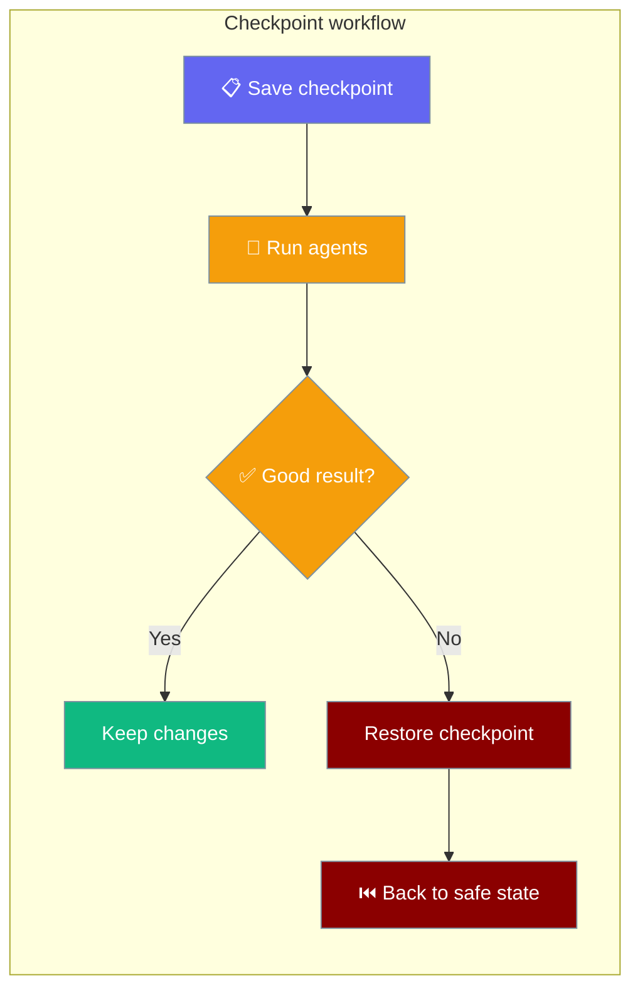

Checkpoint snapshots your workspace so you can undo a bad run in one command.



## Quick Start

<Steps>
<Step title="Save a checkpoint">
```bash
praisonai checkpoint save "before refactor"
```
</Step>

<Step title="If something goes wrong, restore it">
```bash
praisonai checkpoint restore last
```
</Step>

<Step title="See what changed">
```bash
praisonai checkpoint diff
```
</Step>
</Steps>

---

## Commands

### `save`

Snapshot the current workspace.

```bash
praisonai checkpoint save <message> [OPTIONS]
```

| Argument / Flag | Type | Default | Description |
|---|---|---|---|
| `<message>` | string | required | Label for this checkpoint |
| `--allow-empty` | bool | `false` | Save even when no files changed |
| `--workspace, -w` | path | cwd | Directory to snapshot |

```bash
# Save with a message
praisonai checkpoint save "before adding new feature"

# Save even if nothing changed (useful for scripting)
praisonai checkpoint save "baseline" --allow-empty

# Save a specific directory
praisonai checkpoint save "hotfix" --workspace /path/to/project
```

---

### `list`

Show checkpoints for the workspace, newest first.

```bash
praisonai checkpoint list [OPTIONS]
```

| Flag | Type | Default | Description |
|---|---|---|---|
| `--limit, -n` | int | `20` | Maximum number of checkpoints to show |
| `--workspace, -w` | path | cwd | Workspace directory |

```bash
# List the last 20 checkpoints
praisonai checkpoint list

# Show more
praisonai checkpoint list --limit 50

# List checkpoints for a specific project
praisonai checkpoint list -w /path/to/project
```

---

### `restore`

Restore the workspace to a checkpoint. **Destructive — overwrites current files.**

```bash
praisonai checkpoint restore <id|last> [OPTIONS]
```

| Argument / Flag | Type | Description |
|---|---|---|
| `<id\|last>` | string | Checkpoint to restore. See [Ref resolution](#ref-resolution) below |
| `--workspace, -w` | path | Workspace directory (default: cwd) |

```bash
# Restore the most recent checkpoint
praisonai checkpoint restore last

# Restore by short ID
praisonai checkpoint restore abc12345

# Restore by unique ID prefix
praisonai checkpoint restore abc12
```

---

### `diff`

Show what changed between checkpoints or against the working directory.

```bash
praisonai checkpoint diff [from] [to] [OPTIONS]
```

| Argument / Flag | Description |
|---|---|
| `[from]` | Starting ref (default: previous checkpoint). Accepts same refs as `restore` |
| `[to]` | Ending ref (default: working directory). Accepts same refs as `restore` |
| `--workspace, -w` | Workspace directory (default: cwd) |

```bash
# Working dir vs. previous checkpoint
praisonai checkpoint diff

# Working dir vs. a specific checkpoint
praisonai checkpoint diff abc12345

# Between two checkpoints
praisonai checkpoint diff abc12345 def67890

# Using 'last' as ref
praisonai checkpoint diff last
```

---

### `delete`

Delete **all** checkpoints for the workspace. Prompts for confirmation unless `--yes` is passed.

```bash
praisonai checkpoint delete [OPTIONS]
```

| Flag | Type | Default | Description |
|---|---|---|---|
| `--yes, -y` | bool | `false` | Skip confirmation prompt |
| `--workspace, -w` | path | cwd | Workspace directory |

```bash
# Delete all checkpoints (prompts for confirmation)
praisonai checkpoint delete

# Delete without prompting (CI-safe)
praisonai checkpoint delete --yes
```

<Warning>
`delete` removes **all** checkpoints for the workspace — there is no per-checkpoint delete. Use with care.
</Warning>

---

## Ref Resolution

`restore` and `diff` both accept the same checkpoint references:

| Ref | Resolves to |
|---|---|
| `last` or `latest` | The newest checkpoint in the workspace |
| exact full ID | That checkpoint |
| exact short ID | That checkpoint |
| unique prefix | That checkpoint, if only one matches |
| ambiguous prefix | **Rejected** — prints error, exits 1 |

```bash
# These all work (assuming unique matches)
praisonai checkpoint restore last
praisonai checkpoint restore abc12345678
praisonai checkpoint restore abc12345
praisonai checkpoint restore abc1
```

<Note>
Ambiguous prefixes are always rejected. If `abc1` matches two checkpoints you get:
```
Error: Ambiguous checkpoint reference: abc1
```
Use more characters until the prefix is unique.
</Note>

---

## Exit Codes

All subcommands exit `0` on success and `1` on any error (missing checkpoint, ambiguous ref, I/O failure).

---

## Best Practices

<AccordionGroup>

<Accordion title="Save before any risky operation">
Run `praisonai checkpoint save "before X"` before bulk edits, code generation, or anything that touches many files. Then use `praisonai run --restore last` to undo if needed.
</Accordion>

<Accordion title="Use meaningful messages">
`save "before adding payments module"` is more useful than `save "wip"` when you're scanning `checkpoint list` a week later.
</Accordion>

<Accordion title="Let YAML runs auto-checkpoint">
`praisonai run agents.yaml` already auto-checkpoints before it runs (tagged `run:<run_id>`). You only need manual `save` when you want to snapshot mid-session or before a non-agent edit.
</Accordion>

<Accordion title="Use --yes only in CI">
`checkpoint delete --yes` deletes everything with no way to undo. Reserve it for CI cleanup scripts.
</Accordion>

</AccordionGroup>

---

## Related

<CardGroup cols={2}>
<Card title="Rewind a Run" icon="clock-rotate-left" href="/docs/features/run-rewind">
User-flow guide: auto-checkpoint, run, restore last.
</Card>
<Card title="Run Command" icon="play" href="/docs/cli/run">
`--restore` and `--no-checkpoint` flags on `praisonai run`.
</Card>
<Card title="Shadow Git Checkpointing" icon="code-branch" href="/docs/features/checkpoints">
SDK-level checkpoint service internals.
</Card>
<Card title="Session" icon="history" href="/docs/cli/session">
Session continuity across runs.
</Card>
</CardGroup>
